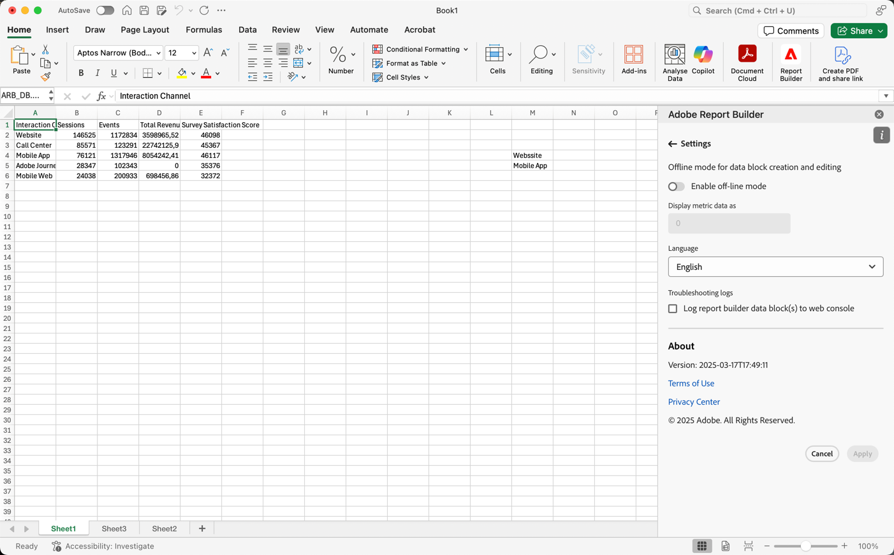

# Report Builder 設定

使用&#x200B;**設定**&#x200B;窗格配置應用程式層級的設定，例如，UI 顯示的語言或是否在離線模式中運作。這些設定會即刻套用，而且所有未來工作階段都適用相同設定，直到變更為止。

若要變更 Report Builder 設定

1. 選取&#x200B;**設定**&#x200B;圖示。

1. 變更[啟用離線模式](#off-line-mode)、[選取語言](#language)或[啟用疑難排解](#troubleshooting)。

1. 選取&#x200B;**[!UICONTROL 「套用」]**。

   顯示[取消並套用]按鈕的{zoomable="yes"}

## 離線模式

當您在離線模式中建立和編輯資料區塊時，不會擷取資料。 相反地，會使用模擬資料，因此您可以快速工作，而不需要等候請求執行。 當您重新上線時，請選取 **[!UICONTROL 重新整理資料區塊]**&#x200B;或 **[!UICONTROL 重新整理所有資料區塊]**，以使用實際資料重新整理資料區塊。

如欲啟用離線模式

1. 選取。

1. 開啟&#x200B;**[!UICONTROL 啟用離線模式]**。

1. 在&#x200B;**[!UICONTROL 將量度資料]**&#x200B;顯示為欄位中輸入正整數。

1. 選取&#x200B;**[!UICONTROL 「套用」]**。

## 語言

您可以選擇Report Builder介面的語言。 所有支援的Customer Journey Analytics語言都可供使用。

若要選取Report Builder介面中使用的語言：

1. 從&#x200B;**[!UICONTROL 語言]**&#x200B;下拉式功能表中選取語言。

1. 選取&#x200B;**套用。**

## 疑難排解

**[!UICONTROL 疑難排解記錄]**&#x200B;設定會將所有使用者端/伺服器資料記錄到本機檔案。 使用此選項來協助解決支援申請單。

若要啟用疑難排解記錄，請檢查&#x200B;**[!UICONTROL 將Report Builder請求記錄到本機檔案]**。
