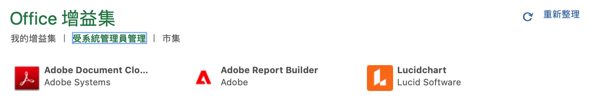
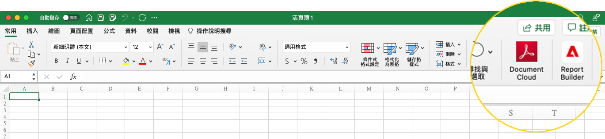
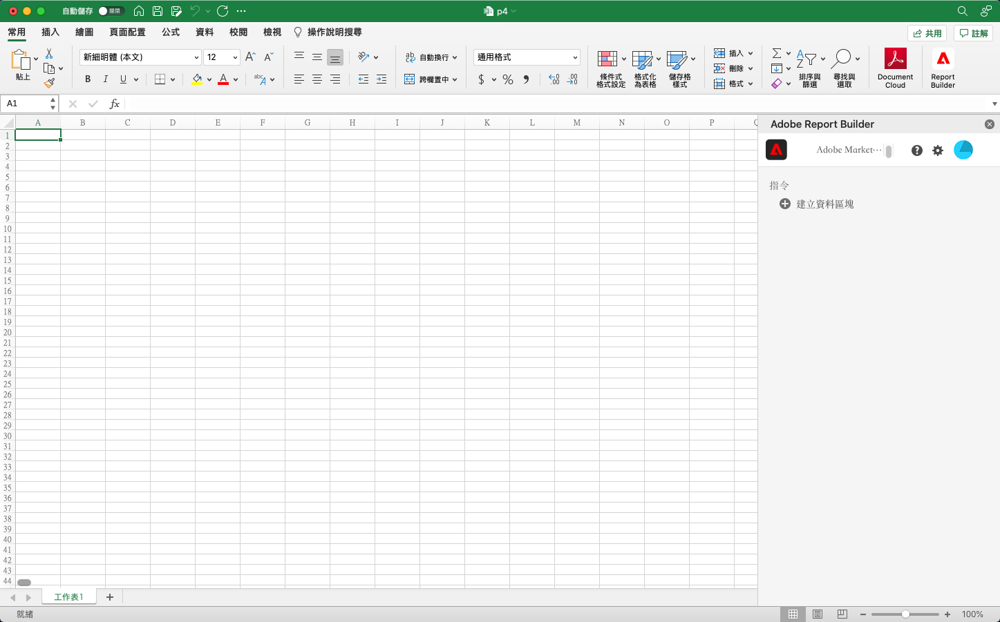
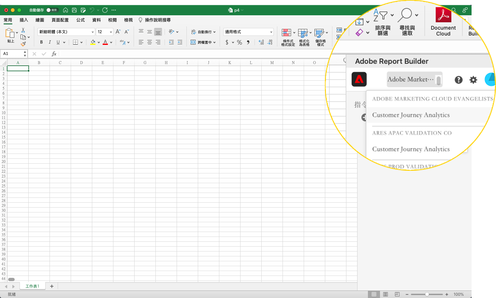
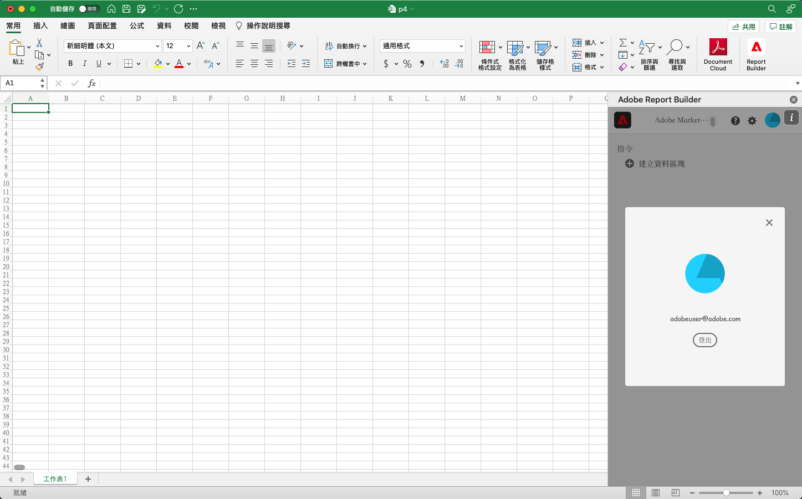

# Report Builder 設定

您可使用 Excel 增益集選單來快速存取 Report Builder。

## 要求

下列作業系統和網頁瀏覽器支援適用於 Customer Journey Analytics 的 Report Builder。

### macOS

- 10.x 或更新版本的 macOS
- 所有的 Excel 版本

### Windows

- 1904 或更新版本的 Windows 10
- 2106 或更新版本的 Excel

   所有 Windows 桌面版 Excel 使用者必須安裝 Microsoft Edge Webview2，才能使用此增益集。若要安裝控制器:

   1. 前往 <https://aka.ms/webview2installer>。
   1. 選取並下載 Evergreen Standalone Installer。
   1. 遵循安裝提示進行。

### 網頁版 Office

- 支援所有的瀏覽器和版本

## Report Builder Excel 增益集

您必須安裝 Report Builder Excel 增益集，才能使用適用於 Customer Journey Analytics 的 Report Builder。安裝 Report Builder Excel 增益集後，您就可以從開啟的 Excel 活頁簿存取 Report Builder。

### 下載並安裝 Report Builder 增益集

若要下載並安裝 Report Builder 增益集

1. 啟動 Excel 並開啟新的活頁簿。

1. 選取「插入」> 取得「增益集」。

1. 在 Office 增益集對話框中，選取「商店」索引標籤。

1. 搜尋「Report Builder」並按一下「新增」。

1. 在「授權條款和隱私權原則」對話框中，按一下「繼續」。

**如果未顯示「商店」索引標籤**

1. 在 Excel 中，選取「檔案」>「帳戶」>「管理設定」。

1. 勾選「啟用選擇性連線體驗」旁的方框。

1. 重新啟動 Excel。

**如果您的組織封鎖對 Microsoft Store 的存取權**

和您的 IT 或安全小組洽詢，要求核准使用 Report Builder 增益集。取得核准後，在 Office 增益集對話框中，選取「由系統管理員管理」索引標籤。

在安裝此 Report Builder 增益集後，「首頁」索引標籤下的 Excel 功能區中會顯示 Report Builder 圖示。

## 登入 Report Builder

為您的作業平台或瀏覽器安裝適用於 Excel 的 Report Builder 增益集後，請遵循這些步驟登入 Report Builder。

1. 開啟 Excel 活頁簿。

1. 按一下 Report Builder 圖示，即可啟動 Report Builder。

1. 在 Adobe Report Builder 工具列上，按一下&#x200B;**登入**。

   

1. 輸入您的 Adobe Experience ID 帳戶資訊。您的帳戶資訊應該和您的 Customer Journey Analytics 認證資料相符。

   

登入後，您的登入圖示和組織將顯示在面板頂端。

## 切換組織

第一次登入時，您會登入指派給您的基本資料的預設組織。

1. 按一下您登入時顯示的組織名稱。

1. 從可用組織清單中選取一個組織。只會列出您有存取權限的組織。

   

## 登出

您可從使用者基本資料登出 Report Builder。

1. 將變更儲存在任何開啟的活頁簿。

1. 按一下個人頭像圖示，以顯示您的使用者基本資料。

   

1. 按一下「**登出**」。
