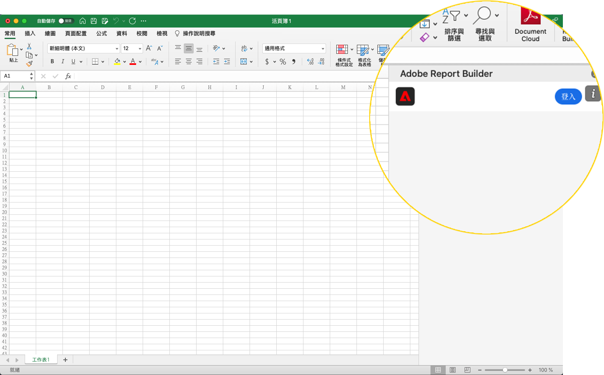

# Report Builder設定

本文概述在Microsoft Excel中使用適用於Customer Journey Analytics的Report Builder的需求。 以及如何安裝及設定增益集。

## 要求

下列作業系統和網頁瀏覽器支援適用於Customer Journey Analytics的Report Builder。

### macOS

- 10.x 或更新版本的 macOS
- 所有的 Excel 版本

### Windows

- 1904 或更新版本的 Windows 10
- 2106 或更新版本的 Excel

  所有 Windows 桌面版 Excel 使用者必須安裝 Microsoft Edge Webview2，才能使用此增益集。若要安裝：

   1. 前往 <https://developer.microsoft.com/en-us/microsoft-edge/webview2/>。
   1. 選取並下載適合您平台的&#x200B;**[!UICONTROL Evergreen獨立安裝程式]**&#x200B;版本。
   1. 執行安裝程式，並依照安裝提示操作。

### 網頁版 Office

- 支援所有瀏覽器和版本。

## Report Builder Excel增益集

安裝Report Builder Excel增益集，以使用適用於Customer Journey Analytics的Report Builder。 安裝Report Builder Excel增益集後，您可以從開啟的Excel活頁簿存取Report Builder。

### 下載並安裝 Report Builder 增益集

若要下載並安裝 Report Builder 增益集

1. 啟動 Excel 並開啟新的活頁簿。

1. 從主功能表選取&#x200B;**[!UICONTROL 插入]** > **[!UICONTROL 增益集]** > **[!UICONTROL 取得增益集]**。

1. 在Office增益集對話方塊中，選取&#x200B;**[!UICONTROL 存放區]**&#x200B;索引標籤。

1. 搜尋`Report Builder`並選取&#x200B;**[!UICONTROL 新增]**。

1. 在[授權條款和隱私權原則]對話方塊中，選取[繼續]。**&#x200B;**

如果未顯示&#x200B;**[!UICONTROL 存放區]**&#x200B;索引標籤：

1. 在Excel中，從主功能表選取&#x200B;**[!UICONTROL 檔案]** > **[!UICONTROL 帳戶]** > **[!UICONTROL 管理設定]**。

1. 勾選&#x200B;**[!UICONTROL 啟用選擇性連線體驗]**&#x200B;旁的方塊。

1. 重新啟動 Excel。

如果您的組織封鎖對Microsoft商店的存取權：

- 請洽詢您的IT或安全團隊，要求核准使用Report Builder增益集。 取得核准後，在Office **[!UICONTROL 增益集]**&#x200B;對話方塊中，選取&#x200B;**[!UICONTROL 受管理管理員]**&#x200B;索引標籤。

  ![Office增益集對話方塊中的[管理員管理]索引標籤。](./assets/image1.png){zoomable="yes"}

安裝Report Builder增益集後， **[!UICONTROL Report Builder]**&#x200B;圖示會顯示在「**[!UICONTROL 首頁]**」索引標籤下的Excel功能區中。

{zoomable="yes"}

## 登入 Report Builder

為您的作業平台或瀏覽器安裝Report Builder for Excel增益集後，請依照下列步驟登入Report Builder。

1. 開啟 Excel 活頁簿。

1. 選取 **[!UICONTROL Report Builder]**&#x200B;以啟動Report Builder。

1. 從Adobe Report Builder工具列中，選取&#x200B;**[!UICONTROL 登入]**。

   {zoomable="yes"}

1. 輸入您的Adobe帳戶資訊。 您的帳戶資訊應該和您的 Customer Journey Analytics 認證資料相符。

   {zoomable="yes"}

登入後，您的登入圖示和組織將顯示在面板頂端。

## 切換組織

第一次登入時，您會登入指派給您的設定檔的預設組織，或您作為登入流程的一部分所選取的組織。

1. 選取您登入時顯示的組織名稱。

1. 從可用組織清單中選取一個組織。只會列出您有存取權限的組織。

   {zoomable="yes"}

## 登出

若要從Report Builder登出：

1. 將變更儲存在任何開啟的活頁簿。

1. 選取顯示圖片圖示，以顯示您的使用者設定檔。

   ![您的使用者設定檔頭像和[登出]按鈕。](./assets/image6.png){zoomable="yes"}

1. 選取&#x200B;**[!UICONTROL 登出]**。
