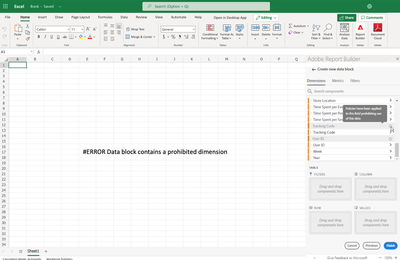

# 受限標籤在Report Builder

通常，Customer Journey Analytics中與資料治理相關的設定是從Adobe Experience Platform繼承的。 CJA與Adobe Experience Platform資料治理的整合允許對敏感CJA資料進行標籤，並實施隱私政策。

可以在CJA資料視圖工作流中顯示在Experience Platform使用的資料集上建立的隱私標籤和策略。 這些標籤會停止或警告從敏感欄位建立度量和/或維的用戶。 有關資料集的資訊，請參見 [資料集概述](https://experienceleague.adobe.com/docs/experience-platform/catalog/datasets/overview.html)

此外，當從CJA（通過報告、導出、API等）導出資料時，會添加警告或標籤以通知用戶報告包含需要以特定方式處理的敏感資訊。

此整合使您能夠更輕鬆地管理法規遵從性。 組織中的資料管理員可以設定策略以限制使用。 因此，您的CJA用戶可以更自信地使用資料，因為它遵守了由資料管理員定義的策略。

有關詳細資訊，請參見 [Customer Journey Analytics和資料治理](https://experienceleague.adobe.com/docs/analytics-platform/using/cja-privacy/privacy-overview.html)

## 查看Report Builder中的受限資料

CJA中出現了兩個Adobe定義的策略，它們影響報告、下載和共用：

* 強制分析策略
* 強制下載策略

受這些策略影響的元件將呈灰色顯示。 將滑鼠懸停在已應用策略的元件上時，將顯示注釋，以指明以下內容： **已對該領域應用了禁止使用此資料的政策。** 有關詳細資訊，請參閱 [標籤和策略](https://experienceleague.adobe.com/docs/analytics-platform/using/cja-dataviews/data-governance.html)。

## 更新包含受限制資料的報告

如果用戶建立了Report Builder報告，其中資料元素稍後受到限制，則在刷新報告時，將顯示一條錯誤消息。

