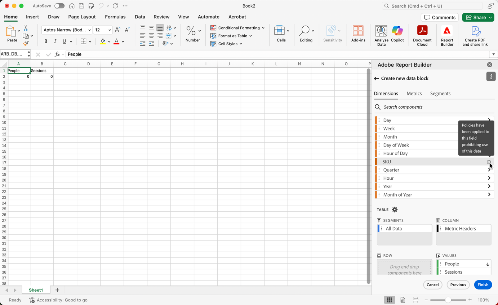

# Report Builder 中受限制的標籤

通常Customer Journey Analytics中的資料控管相關設定是從Experience Platform繼承的。 Customer Journey Analytics與Experience Platform資料控管之間的整合可讓您標示敏感的Customer Journey Analytics資料強制執行隱私權原則。

在Experience Platform使用的資料集上建立的隱私權標籤和原則，可以在Customer Journey Analytics資料檢視工作流程中顯示。 這些標籤會阻止或警告從敏感欄位建立量度和維度的使用者。 如需資料集的資訊，請參閱 [資料集概觀](https://experienceleague.adobe.com/en/docs/experience-platform/catalog/datasets/overview)。

此外，從 Customer Journey Analytics (透過報告、匯出、API 等) 匯出資料時，便會新增其他警告或標籤，以通知使用者報告包含需要以特定方式處理敏感性資訊。

此整合可讓您管理合規性。 在您組織中的資料監管員可以設定限制使用的原則。 因此，您的 Customer Journey Analytics 使用者可以更秘密地使用資料，了解資料符合資料監管員定義的原則。

如需更多資訊，請參閱 [Customer Journey Analytics 和資料控管](https://experienceleague.adobe.com/en/docs/analytics-platform/using/cja-privacy/privacy-overview)

## 檢視受限制的資料

Customer Journey Analytics中出現兩個Adobe定義的原則，這些原則會影響報告、下載和共用：

* 強制執行 Analytics 原則
* 強制執行下載原則

受這些原則約束的元件會呈現灰色，而且確實有圖示。 當您將滑鼠停留在資訊圖示上時，會顯示一個包含以下內容的註解： **[!UICONTROL 原則已套用至此欄位，禁止使用此資料]**。

如需詳細資訊，請參閱[標籤和原則](https://experienceleague.adobe.com/en/docs/analytics-platform/using/cja-dataviews/data-governance)。

{zoomable="yes"}

## 更新包含受限制資料的報表

如果使用者建立的 Report Builder 報告包含後來受到限制的資料元素，則重新整理報告時會顯示錯誤訊息。

{width="100%" zoomable="yes"}
