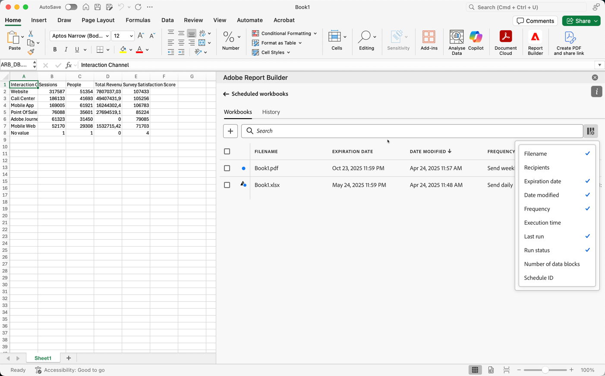

# 排程活頁簿

儲存活頁簿並完成分析後，您可以使用排程功能與團隊中的其他人共用活頁簿。 排程功能可讓您建立排程，自動重新整理活頁簿中的資料。 並在特定日期與時間，以電子郵件的形式將Excel活頁簿檔案傳送給指定對象。 設定排程會自動為收件者提供定期更新。 您也可以使用排程功能來傳送一次活頁簿，而不排程自動更新。

您可以為單一活頁簿建立多個排程。例如，您可建立兩個排程，每天傳送活頁簿給團隊，每週傳送一次給經理。

排程功能也可讓您設定活頁簿的密碼保護，以及編輯先前排程的活頁簿。

>[!BEGINSHADEBOX]

檢視 [排程活頁簿](https://video.tv.adobe.com/v/3413079/?quality=12&learn=on){target="_blank"}以取得示範影片。

>[!ENDSHADEBOX]

## 排程活頁簿

若要排程活頁簿：

1. 在Report Builder中心選取「**[!UICONTROL 排程]**」以建立排程，讓您將活頁簿Excel檔案(.xlsx)自動散發給個人或群組。

   ![選取[排程]按鈕以建立排程。](./assets/schedule.png){zoomable="yes"}

1. 選取&#x200B;**[!UICONTROL 排程活頁簿]**&#x200B;或以建立新的排程活頁簿。

   {zoomable="yes"}

   排程窗格會顯示活頁簿的一些預先定義資訊，例如活頁簿名稱和上次修改活頁簿的日期。

### 檔案

在&#x200B;**[!UICONTROL 檔案]**&#x200B;區段中，您提供檔案型別、名稱和密碼的詳細資訊，以保護檔案。

{zoomable="yes"}

1. 使用選取目前的活頁簿（如果尚未選取）。

1. （選擇性）輸入&#x200B;**[!UICONTROL 檔案名稱]**。

   活頁簿檔案名稱預設為活頁簿的名稱，但您可以視需要變更檔案名稱。

1. 選取&#x200B;**[!UICONTROL 檔案型別]**。

   * **[!UICONTROL Excel]**
   * **[!UICONTROL PDF]**
   * **[!UICONTROL CSV]**

   當您選取&#x200B;**[!UICONTROL CSV]**&#x200B;時，請注意，排程活頁簿會以zip附件的形式傳送。 有些企業電子郵件管理部門可能會封鎖包含壓縮附件的電子郵件。 您會看到相應的警告。

1. (選用) 選取&#x200B;**[!UICONTROL 「將時間戳記附加到檔案名稱」]**。

   您可以在檔案名稱附加時間戳記，以識別活頁簿的更新日期。時間戳記有助於檢視在特定日期傳送的活頁簿版本。 選取後，您可在以下兩者之間選擇：

   * **[!UICONTROL ISO日期格式]**，這會導致`YYYY-MM-DD`附加至檔案名稱。
   * **[!UICONTROL ISO日期格式+時間戳記]**，結果會將`YYYY-MM-DD_HH-MM-SS`附加至檔案名稱。

<!-- Does no longer seem to be an option? 
1. (Optional) Select **.zip compression** to compress the file and set up password protection on the file.

    When you make this selection, you're prompted to enter a password to open the file. This is helpful if you have concerns about data security and you want to password protect the workbook. Protecting the file with a password requires you to select **.zip compression**. The password must be at least 8 characters and contain a number and a special character.

    {zoomable="yes"}{width="55%"}
-->

1. 在&#x200B;**[!UICONTROL 密碼保護活頁簿]**&#x200B;中輸入密碼。 有效的密碼至少需要8個字元、一個數字和一個特殊字元。 選取以顯示密碼，選取隱藏密碼（預設）。

### 電子郵件

在&#x200B;**[!UICONTROL 電子郵件]**&#x200B;區段中，您提供電子郵件的收件者、主旨和說明。

{zoomable="yes"}

1. 輸入&#x200B;**收件者**。您可以輸入組織中可辨識的人員名稱。 或者，您可以輸入組織外人員的電子郵件地址。

1. 輸入電子郵件的&#x200B;**主旨**&#x200B;以及收件者的說明。主旨預設為活頁簿檔案名稱，但您可以視需要修改主旨。您可以在說明區段中新增詳細資料。

1. 您可以選擇在&#x200B;**[!UICONTROL 描述]**&#x200B;文字區域中輸入描述。

### 排程

在&#x200B;**[!UICONTROL 排程]**&#x200B;區段中，您可以定義排程，以將活頁簿的電子郵件傳送給收件者。

{zoomable="yes"}

1. 選取&#x200B;**[!UICONTROL 顯示排程選項]**&#x200B;以定義排程。

1. 輸入從&#x200B;]**開始的**[!UICONTROL &#x200B;開始日期。 或者，選取以從行事曆中挑選開始日期。

1. 在&#x200B;**[!UICONTROL 結束日期]**&#x200B;中輸入結束日期。 或者，選取以從行事曆中挑選結束日期。

1. 選取&#x200B;**[!UICONTROL 頻率]**。 視選取的頻率而定，您會有其他選項。 請參閱下表。

   | 頻率 | 選項 |
   |---|---|
   | **[!UICONTROL 每小時傳送]** | 輸入&#x200B;**[!UICONTROL 每小時傳送一次的值]**。 |
   | **[!UICONTROL 每日傳送]** | 選取&#x200B;**[!UICONTROL 每日頻率]**： **[!UICONTROL 每天傳送]**、**[!UICONTROL 每個工作日傳送]**&#x200B;或&#x200B;**[!UICONTROL 自訂頻率]**。 如果您選取&#x200B;**[!UICONTROL 自訂頻率]**，請輸入&#x200B;**[!UICONTROL 每隔]**&#x200B;天傳送的值。 |
   | **[!UICONTROL 每週傳送]** | 輸入&#x200B;**[!UICONTROL 每週]**&#x200B;傳送的值。 並選取一週的&#x200B;**[!UICONTROL 天]**。 |
   | **[!UICONTROL 按一週的某天每月傳送]** | 選取&#x200B;**[!UICONTROL 星期]**&#x200B;和&#x200B;**[!UICONTROL 星期]**。 |
   | **[!UICONTROL 每月依月份日期傳送]** | 從&#x200B;**[!UICONTROL 於本月]**&#x200B;的當天傳送中選取一個值。 |
   | **[!UICONTROL 每年依月份日期]**&#x200B;傳送 | 選取&#x200B;**[!UICONTROL 一週中的某天]**，選取一個月中的&#x200B;**[!UICONTROL 周]**，然後選取一年中的&#x200B;**[!UICONTROL 每月]**。 |
   | **[!UICONTROL 依特定日期每年傳送]** | 選取&#x200B;**[!UICONTROL 月份]**，並從&#x200B;**[!UICONTROL 於當月的這個日期傳送]**&#x200B;中選取值。 |

### 傳送

若要傳送活頁簿：

* 如果您尚未使用&#x200B;**[!UICONTROL 顯示排程選項]**&#x200B;定義排程，請選取&#x200B;**[!UICONTROL 立即傳送]**，以立即透過電子郵件傳送活頁簿。
* 如果您已使用&#x200B;**[!UICONTROL 顯示排程選項]**&#x200B;定義排程，請選取&#x200B;**[!UICONTROL 依排程傳送]**，以使用您定義的排程透過電子郵件傳送活頁簿。

在這兩種情況下，您都會在Report Builder中心底部看到確認快顯通知。

若要取消傳送活頁簿，請選取&#x200B;**[!UICONTROL 取消]**。

## 檢視及管理排程活頁簿

您可以在&#x200B;**[!UICONTROL 活頁簿]**&#x200B;索引標籤中檢視及管理所有排程活頁簿。

1. 在Report Builder中心選取&#x200B;**[!UICONTROL 排程]**

1. 選取&#x200B;**[!UICONTROL 活頁簿]**&#x200B;索引標籤。 您會看到所有排程活頁簿的清單。

   {zoomable="yes"}

   您可以將滑鼠停留在圖示上，以檢視排程活頁簿的狀態。

   使用來搜尋特定的排程活頁簿。
使用定義要顯示哪些欄。

1. 選取一或多個活頁簿。

   {zoomable="yes"}

   提供下列選項：

   | 選項 | 說明 |
   |---|---|
   |  | 編輯所選活頁簿的排程。 |
   |  | 顯示所選活頁簿的歷史記錄。 |
   |  | 暫停所選活頁簿的排程。 |
   |  | 繼續所選活頁簿的排程。 |
   |  | 將選取的活頁簿下載至新活頁簿中。 |
   |  | 刪除所選活頁簿的排程。 |

## 排程活頁簿的歷史記錄和狀態

您可以在&#x200B;**[!UICONTROL 歷程記錄]**&#x200B;索引標籤中檢視排程活頁簿的歷史記錄和狀態。

1. 在Report Builder中心選取&#x200B;**[!UICONTROL 排程]**。

1. 選取「**[!UICONTROL 歷程記錄]**」標籤。 您會看到所有排程活頁簿的清單。

   {zoomable="yes"}

   使用來搜尋清單中的特定活頁簿。
使用定義要顯示哪些欄。

   **[!UICONTROL 歷程記錄]**&#x200B;索引標籤可讓您檢閱每個排程工作的狀態。 個別的列會記錄每個排程任務的狀態變更。

   * 表示活頁簿已成功傳送。
   * 表示發生錯誤。

或者，您也可以在&#x200B;**[!UICONTROL 活頁簿]**&#x200B;索引標籤中，為一個或多個選取的活頁簿選取。 此動作顯示&#x200B;**[!UICONTROL History]**&#x200B;索引標籤，其中包含依您的選取範圍篩選的清單。 選取以移除篩選器。
