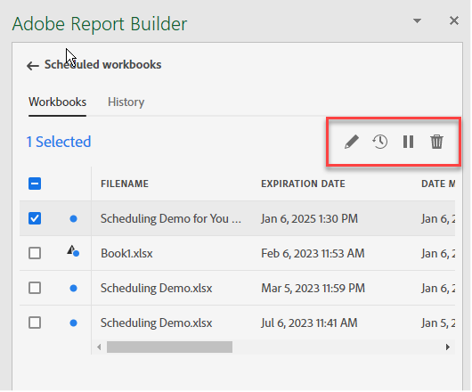
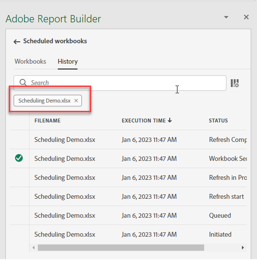

# 排程活頁簿

儲存活頁簿並完成分析後，您可以使用排程功能輕鬆與團隊中的其他人共用活頁簿。 「排程」功能可讓您建立排程，自動重新整理活頁簿中的資料，並透過電子郵件將Excel活頁簿.xlsx檔案作為附件，在特定日期和時間傳送給您指定的對象。 設定排程可讓收件者定期自動更新。 您也可以使用排程功能，只要傳送活頁簿一次，就不需排程自動更新。

您可以為單一活頁簿建立多個排程。 例如，您可以每天將活頁簿傳送給您的團隊，也可以建立兩個不同的排程，每週將活頁簿傳送給您的經理一次。

「排程」功能也可讓您設定活頁簿的密碼保護，以及編輯先前排程的活頁簿。

>[!VIDEO](https://video.tv.adobe.com/v/3413079/?quality=12&learn=on)

## 排程活頁簿

使用Report Builder中心的「排程」任務按鈕，快速建立排程，以便您自動將活頁簿Excel檔案(.xlsx)分發給個人或群組。

1. 按一下Report Builder中心中的「排程」按鈕。

   {width="55%"}

1. 按一下「排程活頁簿」或左上角的加號按鈕，以建立新的排程活頁簿。

   {width="55%"}

   排程窗格會顯示活頁簿的一些預先定義資訊，例如活頁簿名稱和上次修改活頁簿的日期。

   {width="55%"}

1. （可選）輸入檔案名。

   活頁簿檔案名稱預設為活頁簿的名稱，但您可以視需要變更此名稱。 如果您要將相同的活頁簿傳送給多個對象，而您想要為它命名一些對特定對象更好記的名稱，您可以變更名稱。

1. （選用）選取 **將時間戳附加到檔案名**.

   您可以在檔案名稱附加時間戳記，以識別活頁簿的更新日期。 這有助於快速查看在特定日期傳送的活頁簿版本。 此 **檔案名預覽** 顯示分發活頁簿時，活頁簿檔案名稱在電子郵件中的顯示方式。 時間戳格式為YYYY-MM-DD。

1. （選用）選取 **.zip壓縮** 壓縮檔案並設定檔案的密碼保護。

   進行此選擇時，系統會提示您輸入密碼以開啟檔案。 如果您對資料安全性有疑慮，且想以密碼保護活頁簿，這個方法會很實用。 使用密碼保護檔案需要您選擇 **.zip壓縮**. 密碼至少必須有8個字元，並且必須包含數字和特殊字元。

   {width="55%"}

1. 輸入 **收件者**. 您可以輸入組織中可識別的人員名稱，也可以輸入組織內外人員的電子郵件地址。

1. 輸入 **主旨** 電子郵件的資訊，以及收件者的說明。 主體預設為活頁簿檔案名稱，但您可以視需要修改主體。 您可以在說明區段中新增詳細資訊。

   {width="55%"}

1. 設定排程選項，以設定您要將活頁簿以電子郵件傳送給收件者的日期和時間。

   選擇開始和結束日期和時間範圍。 這可以是今天的日期，也可以是未來的日期。

   選擇 **頻率** 從下拉式功能表。 您可以將頻率設定為特定日的每小時、每日、每週、每月或每年。 例如，您可以設定排程，在當月的第一個星期日晚上傳送活頁簿，讓收件者在星期一早上的收件匣中第一件事情會收到電子郵件。

   {width="55%"}

1. 設定排程後，按一下 **依排程傳送**.

   {width="55%"}

   您會在Report Builder中心底部看到確認吐司，而排程的活頁簿會列在「活頁簿」標籤下。

   {width="55%"}

## 僅傳送活頁簿一次

您也可以只傳送活頁簿一次。

1. 取消檢查 **顯示排程選項**

   {width="40%"}

1. 按一下「**立即傳送**」。

## 檢視及編輯排程的活頁簿

您可以在「活頁簿」標籤下的同一位置檢視及管理所有已排程的活頁簿。

1. 在Report Builder中心的「排程」區段中，按一下「活頁簿」標籤。 使用此檢視可查看所有已排程活頁簿的清單。

1. 選取活頁簿。 系統會顯示數種工具，讓您編輯活頁簿、變更排程、暫停並重新啟動排程，或刪除排程。

   {width="55%"}

* （選用）按一下鉛筆圖示以編輯活頁簿排程。

* （可選）按一下時鐘圖示以檢視每個排程任務的歷史記錄。

* （選用）按一下暫停圖示以暫停並重新啟動發佈排程。 如果您需要在傳送活頁簿之前修改活頁簿，這個方法會很實用。 當您要重新啟動發佈時，請再按一下暫停圖示。

* （選用）按一下垃圾桶以刪除排程。

## 查看計畫任務的狀態

歷史記錄視圖允許您查看每個計畫任務的狀態。 另有一列記錄每個排程任務的狀態變更。 在以下範例中， *新的每小時計畫* 於1月5日下午3時04分啟動。 下午3:05前，已成功刷新並已發送到收件人。 下一個活頁簿， *活頁簿錯誤*，在重新整理程式期間發生錯誤。 如果活頁簿無法傳送，歷史記錄索引標籤會顯示錯誤發生的位置，以協助您進行疑難排解。 在此情況下，可能是因為某些資料區塊錯誤（可能是缺少元件）導致活頁簿無法成功重新整理。

綠色勾選表示活頁簿已成功傳送。 紅色三角形中的驚嘆號表示發生錯誤。

通過按一下搜索欄右側的列設定表徵圖，可以選擇要在歷史記錄頁簽中顯示的列。

{width="55%"}

您可以前往活頁簿索引標籤，選取活頁簿，然後按一下「歷史記錄」圖示，以篩選歷史記錄，只查看單一已排程活頁簿的歷史記錄。

您也可以從「活頁簿」索引標籤檢視特定活頁簿的歷史記錄。 在「活頁簿」標籤中，選取活頁簿，然後按一下歷史記錄圖示。

{width="55%"}

活頁簿篩選器便會顯示在歷史記錄頂端。 若要再次檢視所有排程任務的歷史記錄，請按一下篩選器旁的x。

{width="55%"}

