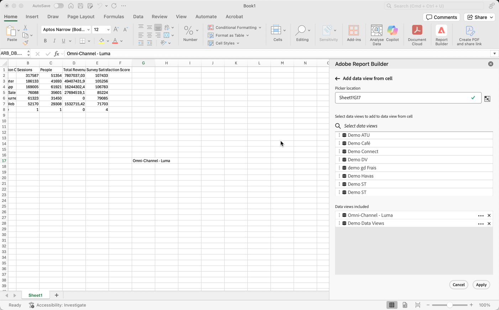
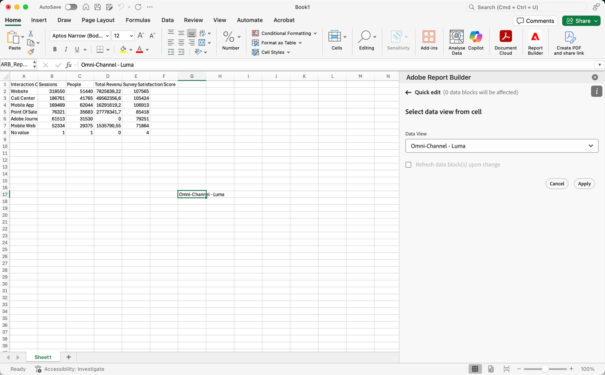

# 選取資料檢視

您可以從下拉式選單中選取資料檢視，或從儲存格中選取資料檢視，並使用新的資料檢視自動更新資料區塊。

## 從儲存格選取資料檢視

從儲存格中選取資料檢視，可讓您使用不同的資料檢視輕鬆重新整理資料區塊。 您可以使用從儲存格中選取的資料檢視重新整理資料區塊，而不是使用個別的資料區塊來建立全新的報表。

從儲存格中選取資料檢視在下列情況下相當實用：

* 結構上相似或相同的多個資料檢視。
* 包含自訂元件和配置圖的複雜資料區塊格式。

若要從儲存格選取資料檢視，請先建置資料區塊，並將多個資料檢視指派至資料區塊以外的儲存格。 然後，使用儲存格&#x200B;**面板的**&#x200B;資料檢視，從不同的資料檢視重新整理您的資料區塊。

1. 建立資料區塊。 如需有關建立資料區塊的資訊，請參閱[建立資料區塊](/help/report-builder/create-a-data-block.md)。

1. 在&#x200B;**[!UICONTROL 資料檢視]**&#x200B;中選取。

1. 在資料區塊外使用選取儲存格。

1. 使用拖放從&#x200B;**[!UICONTROL 選取資料檢視，從儲存格]**&#x200B;新增一或多個資料檢視。 或者，您可以重複選取資料檢視，以將資料檢視新增至&#x200B;**[!UICONTROL 包含的資料檢視]**&#x200B;清單。

   * 您可以使用 **[!UICONTROL _選取資料檢視_]**&#x200B;來搜尋資料檢視。
   * 使用開啟內容功能表，以便您可以在&#x200B;**[!UICONTROL 包含的資料檢視]**&#x200B;清單中上下行動資料檢視。
   * 使用從&#x200B;**[!UICONTROL 資料檢視]**&#x200B;清單中刪除資料檢視。

   {zoomable="yes"}

1. 選取&#x200B;**[!UICONTROL 套用]**，將選取的資料檢視套用至選取的儲存格。

## 變更儲存格的資料檢視

1. 在工作表中選取資料檢視儲存格位置。
1. 在Report Builder中心中，選取&#x200B;**[!UICONTROL 快速編輯]**&#x200B;中的&#x200B;**[!UICONTROL 儲存格]**&#x200B;資料檢視連結。
1. 從&#x200B;**[!UICONTROL 資料檢視]**&#x200B;下拉式功能表中選取資料檢視。

   {zoomable="yes"}
1. 選擇性，選取&#x200B;**[!UICONTROL 變更時重新整理資料區塊]**。

1. 選取&#x200B;**[!UICONTROL 「套用」]**。Report Builder會根據所選的資料檢視重新整理資料區塊。
