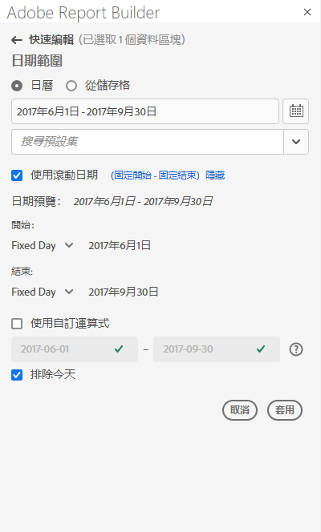
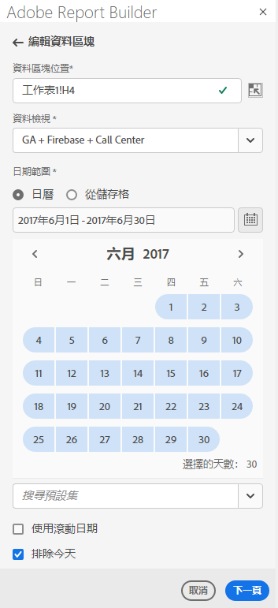
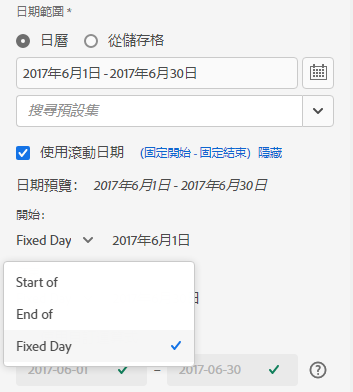
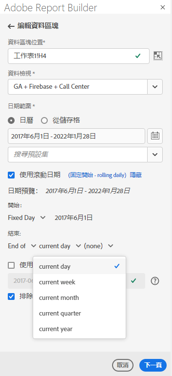
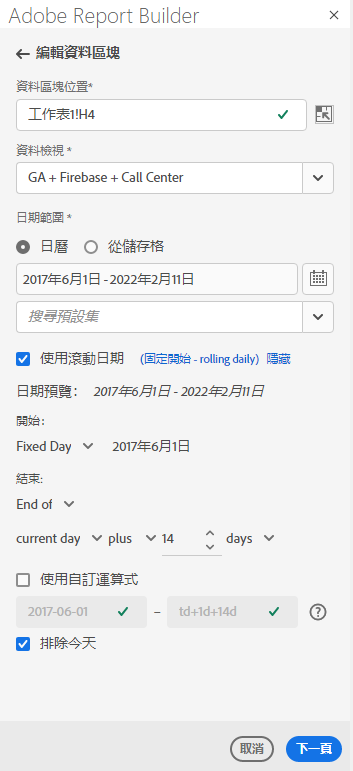
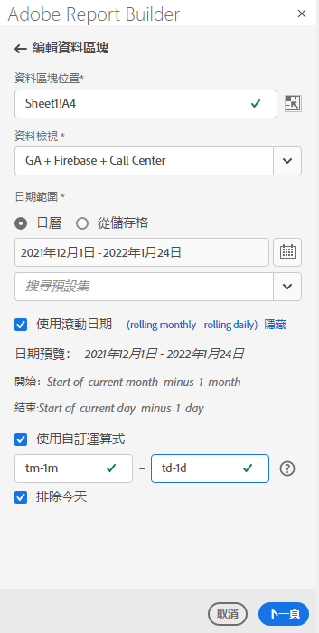
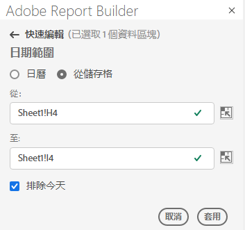

# 選擇日期範圍

要更改現有資料塊的日期範圍，請選擇「編輯資料塊」或使用「快速編輯」面板。

使用下列選項來變更資料區塊的日期範圍。

**行事曆**

「日曆」可讓您使用下列選項建立靜態或滾動日期：

- 日期範圍欄位
- 行事曆
- 預設集下拉式選單
- 滾動日期模式
- 自訂運算式


**從單元格**

「開始日期」儲存格選項可讓您參考在工作表儲存格中輸入的日期。

您可以選擇在任何選取的日期範圍中排除今天。



## 使用日曆

使用&#x200B;**Calendar**&#x200B;時，日期範圍欄位會顯示資料區塊請求的目前日期範圍。 您可以直接在日期範圍欄位中輸入日期，或使用資料範圍選擇選項。

### 日期範圍欄位

要直接在日期範圍欄位中輸入日期，請執行以下操作

1. 按一下日曆圖示旁的日期範圍欄位。

1. 輸入日期範圍的開始和結束日期。

### 行事曆

要使用日曆選擇日期

1. 按一下日曆圖示以顯示每月日曆。

1. 按一下開始日期。

1. 按一下結束日期。

若要反向設定日期範圍，請先按一下結束日期，然後按一下開始日期。



### 預設集下拉式選單

預設集下拉式功能表包含一組標準的預設日期範圍和日期範圍元件，供您儲存的資料檢視或與您共用的資料檢視使用。

### 遞延日期

「遞延日期」選項可讓您使用遞延日期來選取日期範圍。

1. 選擇&#x200B;**使用遞延日期**。

1. 選取開始和結束日期的滾動式運算式。

   

   **開始**  — 允許您選擇日、周、月、季或年的開始。

   **結束**  — 可讓您選取一天、一週、一個月、一季或一年的結束。

   **固定日**  — 可讓您在另一個日期滾動時修正開始或結束日期。

1. 選擇日、周、月、季或年作為滾動期間。

   

1. 從滾動日期中新增或減去日、周、月、季或年。

   

1. 按一下下一步以定義資料範圍。

   使用日期預覽來確認產生的日期範圍為所需範圍。

### 自訂運算式

自訂運算式選項可讓您建立自訂運算式以變更日期範圍，或輸入算術公式。

1. 選擇&#x200B;**使用遞延日期**。

1. 選擇&#x200B;**使用自定義表達式**。

   選取&#x200B;**使用自訂運算式**&#x200B;選項時，會停用標準滾動日期範圍控制項。

   

1. 輸入自訂運算式。

   如需自訂運算式的範例清單，請參閱&#x200B;**日期運算式**。

1. 使用日期預覽來確認產生的日期範圍是需要的範圍。

#### 建立自訂運算式

1. 輸入&#x200B;**日期參考**。

1. 新增&#x200B;**日期運算子**&#x200B;以將日期移至過去或未來。

您可以輸入包含多個運算子的自訂日期運算式，例如```tm-11m-1d```。

#### 日期參考

下表列出日期參考範例。

| 日期參考 | 類型 | 說明 |
|----------------|--------------|----------------------------|
| 1/1/10 | 靜態日期 | 以ISO日期格式輸入 |
| td | 滾動日期 | 當天開始 |
| tw | 滾動日期 | 當周開始 |
| tm | 滾動日期 | 當月開始 |
| tq | 滾動日期 | 當季開始 |
| ty | 滾動日期 | 當年年初 |

#### 日期運算子

下表列出日期運算子範例。

| 日期運算子 | 單位 | 說明 |
|----------------|---------|--------------------|
| +6d | 日 | 將6天添加到日期參考 |
| +1w | 週 | 將整周新增至日期參考 |
| -2米 | 月 | 將日期參考減去2個完整月 |
| -4q | 季 | 將日期參考減去4個季度 |
| -1y | 年 | 將日期參考減去一年 |

#### 日期運算式

下表列出日期運算式範例。

| 日期運算式 | 含義 |
|-----------------|--------------------------------------|
| td-1w | 上週的第一天 |
| tm-1d | 上個月的最後一天 |
| td-52w | 同一天，52週前 |
| tm-11m-1d | 去年同月的最後一天 |
| &quot;2020-09-06&quot; | 2020年9月9日 |

## 儲存格的日期範圍

日期範圍可在工作表儲存格中指定。 使用&#x200B;**儲存格的日期範圍**&#x200B;選項，從選取的儲存格選擇資料區塊的開始日期和結束日期。 選擇&#x200B;**從單元格**&#x200B;選項後，面板將顯示&#x200B;**從**&#x200B;和&#x200B;**至**&#x200B;欄位，您可在其中輸入單元格位置。



## 排除今天

選擇&#x200B;**排除今天**&#x200B;選項，從選取的日期範圍排除今天。 選擇納入今天可能會提取目前不完整的資料。

選取時，**「排除今天」**&#x200B;選項會從所有日期範圍模式（包括日曆、遞延日期或自訂運算式）中排除當天。

## 有效的日期範圍

下列清單說明有效的日期範圍格式。

- 開始日期和結束日期必須為下列格式：YYYY-MM-DD

- 開始日期必須早於或等於結束日期。 兩個日期皆可設為未來。

- 使用遞延日期時，開始日期必須是今天或過去。 如果勾選「**排除今天**」，則必須為過去。

- 您可以建立未來的靜態日期範圍集。 例如，您可能需要為下週的行銷活動啟動設定未來的日期。 此選項會提前建立促銷活動的活頁簿監控。

## 變更日期範圍

通過在「命令」面板中選擇「編輯」資料塊或在「快速編輯」面板中選擇日期範圍連結，可以編輯現有資料塊的日期範圍。

**編輯資料塊**  — 允許編輯單個資料塊的多個資料塊參數，包括日期範圍。

**快速編輯：日期範圍**  — 可讓您編輯一或多個資料區塊的日期範圍。

從「快速編輯」面板編輯日期範圍

1. 在工作表中選取一或多個資料區塊內的儲存格。

1. 按一下「快速編輯」面板中的&#x200B;**日期範圍**&#x200B;連結。

1. 使用任何日期選擇選項選擇日期範圍。

1. 按一下&#x200B;**「套用」**。


Report Builder會將新日期範圍套用至選取項目中的所有資料區塊。
