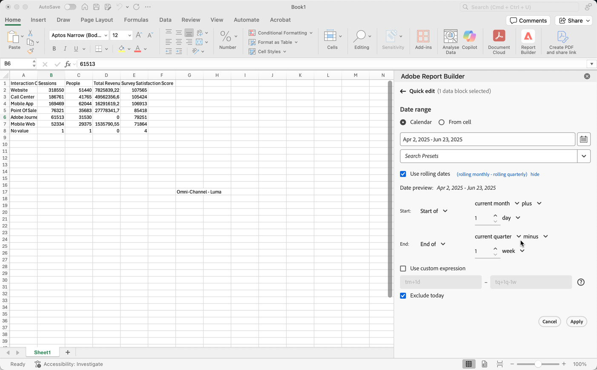

# 選取日期範圍

若要變更現有資料區塊的日期範圍：

- 選取&#x200B;**[!UICONTROL 編輯資料區塊]**，或
- 在&#x200B;**[!UICONTROL 快速編輯]**&#x200B;中選取&#x200B;**[!UICONTROL 日期範圍]**&#x200B;連結。

使用下列選項變更資料區塊的日期範圍。

## 行事曆

**[!UICONTROL 行事曆]**&#x200B;選項可讓您使用下列選項建立靜態或滾動日期：

### 日期範圍

日期範圍欄位會顯示資料區塊請求的目前日期範圍。 您可以直接輸入日期，或使用指定日期範圍。

{zoomable="yes"}

### 預設集

使用預設集下拉式選單來選取預設集。 您也可以輸入文字來搜尋預設集。

{zoomable="yes"}

此預設下拉式選單包括一組標準預設日期範圍和您儲存或與您共用的資料檢視的日期範圍元件。

### 滾動日期

若要定義遞延日期，請執行下列步驟：

{zoomable="yes"}

1. 選取&#x200B;**[!UICONTROL 使用遞延日期]**&#x200B;來定義遞延日期定義的邏輯。 您可以選取方括弧中的文字（例如&#x200B;**[!UICONTROL 固定開始 — 每日滾動]**）來延伸面板，並指定&#x200B;**[!UICONTROL 開始]**&#x200B;和&#x200B;**[!UICONTROL 結束]**&#x200B;的詳細資料。

1. 選取&#x200B;**[!UICONTROL 開始於]**、**[!UICONTROL 結束於]**，或&#x200B;**[!UICONTROL 固定日期]**。

   - 當您已選取&#x200B;**[!UICONTROL 開始於]**&#x200B;或&#x200B;**[!UICONTROL 結束於]**，您可以建置完整的運算式。例如：**[!UICONTROL 結束於]**&#x200B;**[!UICONTROL 今年]**&#x200B;**[!UICONTROL 加上]**`1`**[!UICONTROL 天]**。為運算式的個別部分選擇適當的值。

      - 選取目前的值。例如，**[!UICONTROL 目前的年份]**。
      - 選取選擇性額外計算的值。 例如，**[!UICONTROL 加]**。
      - 當您指定其他計算時，請指定一個值。例如，`1`。
      - 當您已指定其他計算時，請選取用於計算的時段。例如，**[!UICONTROL 天]**。

   - 選取&#x200B;**[!UICONTROL 固定日]**&#x200B;時，請指定固定日，或使用選擇器選取日。

1. 選取&#x200B;**[!UICONTROL 隱藏]**&#x200B;以隱藏遞延日期計算的詳細資料。

### 自訂運算式

自訂運算式選項可讓您透過建立自訂運算式來變更日期範圍，或者您可輸入算術公式。

{zoomable="yes"}

1. 選取&#x200B;**[!UICONTROL 使用滾動日期]**。

1. 選取&#x200B;**[!UICONTROL 使用自訂運算式]**。

   當您選取&#x200B;**[!UICONTROL 使用自訂運算式]**&#x200B;時，會停用標準滾動日期範圍控制項。

1. 輸入[自訂運算式](#create-a-custom-expression)。

1. 使用&#x200B;**[!UICONTROL 日期預覽]**&#x200B;來驗證產生的日期範圍。

#### 建立自訂運算式

1. 輸入[日期參考](#date-references)。

1. 新增選用的[日期運運算元](#date-operators)，將日期移動至過去或未來。

您可以輸入包含多個運運算元的自訂運算式，例如`tm-11m-1d`。

#### 日期參考

下列表格列出了日期參考的範例。

| 日期參考 | 類型 | 說明 |
|----------------|--------------|----------------------------|
| `1/1/10` | 靜態日期 | 以 ISO 日期格式輸入 |
| `td` | 滾動日期 | 當天的開始 |
| `tw` | 滾動日期 | 本週的開始 |
| `tm` | 滾動日期 | 本月的開始 |
| `tq` | 滾動日期 | 本季的開始 |
| `ty` | 滾動日期 | 本年度的開始 |

#### 日期運算子

下列表格列出了日期運算子的範例。

| 日期運運算元 | 單位 | 說明 |
|----------------|---------|--------------------|
| `+6d` | 日 | 新增 6 天至「日期參考」 |
| `+1w` | 週 | 將一整週加入「日期參考」 |
| `-2m` | 月 | 從「日期參考」減去 2 個整月 |
| `-4q` | 季 | 從「日期參考」減去 4 個季數 |
| -`1y` | 年 | 從「日期參考」減去一年 |

#### 日期運算式

下列表格列出了日期運算式範例。

| 日期運算式 | 含義 |
|-----------------|--------------------------------------|
| `td` | 今天 |
| `td-1w` | 上週的第一天 |
| `tm-1d` | 前一個月的最後一天 |
| `td-52w` | 52 週前的同一天 |
| `tm-11m-1d` | 去年同一個月的最後一天 |
| `"2020-09-06"` | 特定日期，2020年9月9日 |

## 儲存格的日期範圍

可在工作表儲存格中指定日期範圍。使用&#x200B;**[!UICONTROL 儲存格的日期範圍]**&#x200B;選項，從選取的儲存格中選擇資料區塊的開始和結束日期。 當您選取&#x200B;**[!UICONTROL 從儲存格]**&#x200B;選項時，面板會顯示&#x200B;**[!UICONTROL 從]**&#x200B;到&#x200B;**[!UICONTROL 到]**&#x200B;欄位，您可以在其中輸入儲存格位置，或使用挑選目前選取的儲存格。

{zoomable="yes"}

## 排除當天

選取&#x200B;**[!UICONTROL 排除當天]**&#x200B;以從選取的日期範圍排除當天。 當天會排除在用於定義日期範圍的所有模式之外：行事曆、滾動日期或自訂運算式。

## 有效的日期範圍

下列清單說明有效的日期範圍格式。

- 開始和結束日期必須為下列格式: YYYY-MM-DD

- 開始日期必須早於或等於結束日期。兩個日期都可以設在未來。

- 若使用滾動日期，開始日期必須為當天或過去。如果選取&#x200B;**[!UICONTROL 排除當天]**，則開始日期必須為過去。

- 您可以建立一個為未來設定的靜態日期範圍。例如，您可能需要為下週推出的行銷活動設定一個未來日期。這個選項可預先為活動建立活頁簿監控。

## 變更日期範圍

您可以編輯現有資料區塊的日期範圍。

1. 在資料區塊中選取儲存格。

- 在&#x200B;**[!UICONTROL 命令]**&#x200B;面板中選取&#x200B;**[!UICONTROL 編輯資料區塊]**，或
- 在&#x200B;**[!UICONTROL 快速編輯]**&#x200B;面板中選取&#x200B;**[!UICONTROL 日期範圍]**&#x200B;連結。

1. 使用任何可用的日期選取範圍選項來修改日期範圍。

1. 選取&#x200B;**[!UICONTROL 「套用」]**。

Report Builder 會將新的日期範圍套用至選取範圍中的所有資料區塊。
