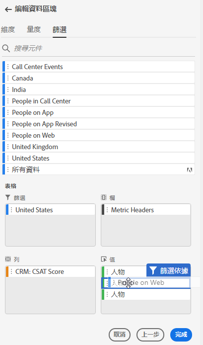
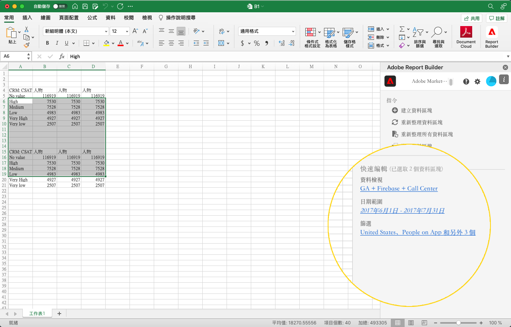
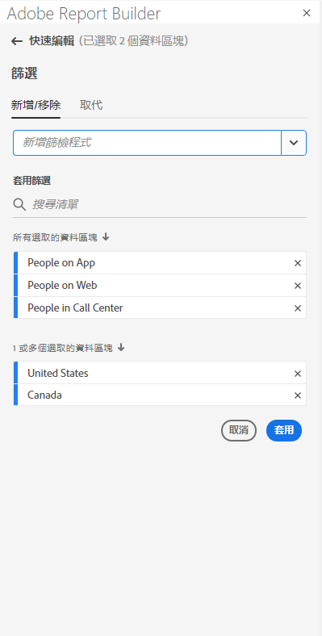
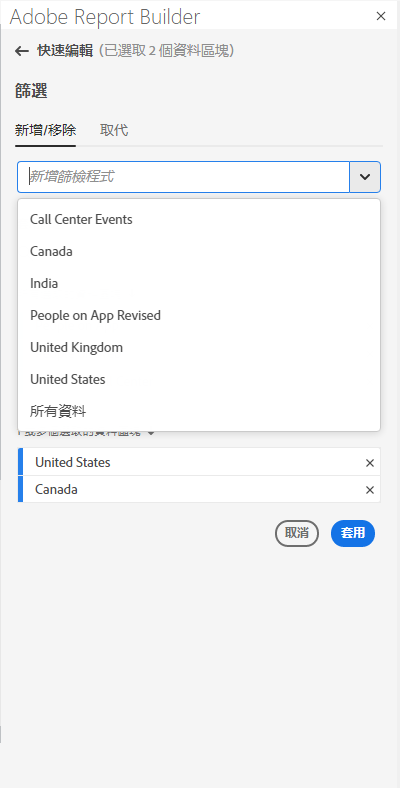
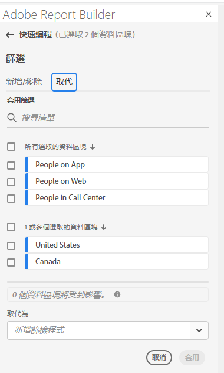
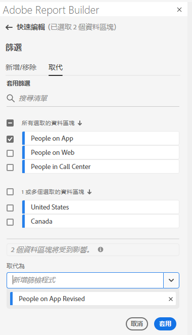

# 使用 Report Builder 中的篩選器

當您建立新的資料區塊或從「命令」面板選取&#x200B;**編輯資料區塊**&#x200B;選項時，可套用篩選器。

## 將篩選器套用至資料區塊

若要將篩選器套用至整個資料區塊，可按兩下篩選器或是從命令清單將篩選器拖放至「表格」的「篩選器」區段中。

## 將篩選器套用至個別量度

若要將篩選器套用至個別量度，請將篩選器拖放至表格中的量度上。您也可以按一下「表格」窗格中量度右邊的 **...** 圖示，然後選取&#x200B;**篩選器量度**。若要檢視已套用的篩選器，可將滑鼠游標停留在「表格」窗格中的量度上或選取量度。已套用篩選器的量度會顯示篩選器圖示。

<!--  -->

## 快速編輯篩選器

您可使用快速編輯面板為現有的資料區塊新增、移除或取代篩選器。

當您選取試算表中的儲存格範圍時，快速編輯面板中的&#x200B;**篩選器**&#x200B;連結會顯示該選取範圍中的資料區塊所使用的篩選器清單摘要。

若要使用「快速編輯」面板編輯篩選器

1. 請從一或多個資料區塊選取儲存格範圍。

   

1. 按一下「篩選器」連結，即可啟動「快速編輯 - 篩選器」面板。

   

### 新增或移除篩選器

您可以使用「新增/移除」選項來新增或移除篩選器。

1. 選取「快速編輯 - 篩選器」面板中的&#x200B;**新增/移除**&#x200B;索引標籤。

   套用至所選取的資料區塊的所有篩選器會列在「快速編輯 - 篩選器」面板中。套用至選取範圍中所有資料區塊的篩選器會列在&#x200B;**套用至所有已選取的資料區塊**&#x200B;標題下。套用至部分而非全部資料區塊的篩選器會列在&#x200B;**套用至 1 或更多已選取的資料區塊**&#x200B;標題下。

   若所選取的資料區塊中出現多個篩選器，您可利用&#x200B;**新增篩選器**&#x200B;搜尋欄位來搜尋特定篩選器。

   

1. 從&#x200B;**新增篩選器**&#x200B;下拉式選單中選取篩選器，即可新增篩選器。

   可搜尋篩選器清單包括可存取一或多個選定資料區塊中存在的資料檢視的所有篩選器，以及組織中可全域使用的所有篩選器。

   新增篩選器功能可將篩選器套用至選取範圍中的所有資料區塊。

1. 若要移除篩選器，可按一下&#x200B;**已套用篩選器**&#x200B;清單中篩選器右邊的刪除圖示「**x**」。

1. 按一下&#x200B;**套用**，即可儲存變更，並返回中心面板。

   Report Builder 會顯示訊息，以確認已套用的篩選器變更。

### 取代篩選器

您可以使用另一個篩選器來取代現有的篩選器，以變更篩選資料的方式。

1. 選取「快速編輯 - 篩選器」面板中的&#x200B;**取代**&#x200B;索引標籤。

   

1. 使用&#x200B;**搜尋清單**&#x200B;搜尋欄位，即可找出特定的篩選器。

1. 選擇一或多個您要取代的篩選器。

1. 在「取代為」欄位中搜尋一或多個篩選器。

   選取篩選器並將其新增至&#x200B;**取代為** ... 清單。

   

1. 按一下&#x200B;**「套用」**。

   Report Builder 會更新篩選器清單，以反映取代結果。
