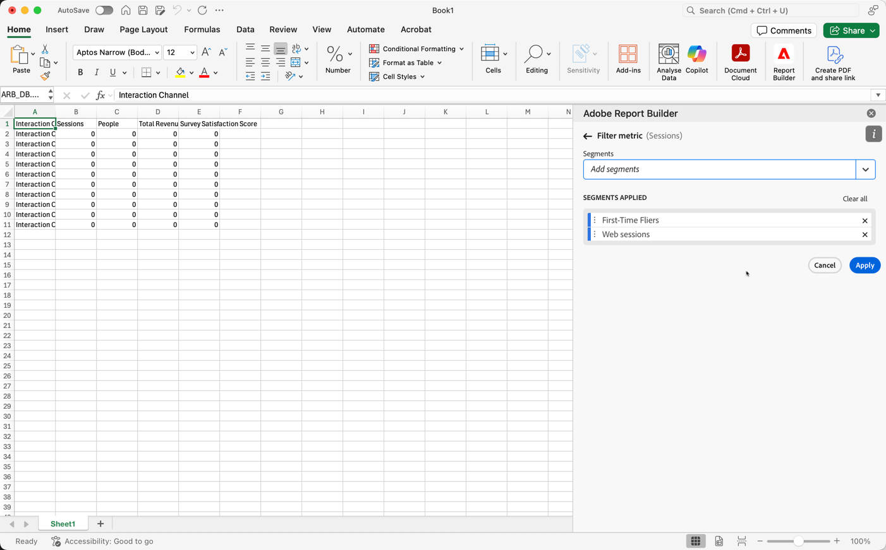

# 使用區段

當您建立新的資料區塊或從&#x200B;**[!UICONTROL 命令]**&#x200B;面板選取&#x200B;**[!UICONTROL 編輯資料區塊]**&#x200B;時，可以套用區段。

## 將區段套用至資料區塊

若要將區段套用至整個資料區塊，請連按兩下區段，或從元件清單中將區段拖放至「表格」的區段區段中。

## 將篩選器套用至個別量度

若要使用區段將篩選器套用至個別量度：

* 從&#x200B;**[!UICONTROL 區段]**&#x200B;將一或多個區段拖放至表格中的量度上。

* 或者：

   1. 選取窗格中特定量度的&#x200B;**[!UICONTROL MoreSmall]**，然後選取&#x200B;**[!UICONTROL 篩選量度]**。

      {zoomable="yes"}

   1. 從&#x200B;**[!UICONTROL 區段]**&#x200B;下拉式功能表中選取一或多個區段。 區段已新增至&#x200B;**[!UICONTROL 套用的區段]**&#x200B;清單。

      
   1. 選取以從&#x200B;**[!UICONTROL 套用的區段]**&#x200B;清單中移除區段。 或選取&#x200B;**[!UICONTROL 全部清除]**&#x200B;以從&#x200B;**[!UICONTROL 套用的區段]**&#x200B;清單中移除所有區段。
   1. 選取&#x200B;**[!UICONTROL 「套用」]**。

若要檢視已套用的篩選器，可將滑鼠游標停留在「表格」窗格中的量度上或選取量度。含有已套用區段的量度會顯示區段圖示。

## 快速編輯區段

您可以使用&#x200B;**[!UICONTROL 快速編輯]**&#x200B;面板來新增、移除或取代現有資料區塊的區段。

當您選取試算表中的儲存格範圍時，**[!UICONTROL 快速編輯]**&#x200B;面板中的&#x200B;**[!UICONTROL 區段]**&#x200B;連結會顯示該選取範圍中的資料區塊所使用區段的摘要清單。

若要使用&#x200B;**[!UICONTROL 快速編輯]**&#x200B;面板編輯區段：

1. 請從一或多個資料區塊選取儲存格範圍。

1. 選取&#x200B;**[!UICONTROL 區段]**&#x200B;連結以啟動&#x200B;**[!UICONTROL 快速編輯]** **[!UICONTROL 區段]**&#x200B;面板。

### 新增或移除區段

您可以使用「新增/移除」選項來新增或移除區段。

1. 選取&#x200B;**[!UICONTROL 快速編輯]** **[!UICONTROL 區段]**&#x200B;面板中的&#x200B;**[!UICONTROL 新增/移除]**&#x200B;索引標籤。

   1. 從&#x200B;**[!UICONTROL 區段]**&#x200B;下拉式功能表中選取一或多個區段。 區段已新增至&#x200B;**[!UICONTROL 套用的區段]**&#x200B;清單。
   1. 選取以從&#x200B;**[!UICONTROL 套用的區段]**&#x200B;清單中移除區段。
   1. 選取&#x200B;**[!UICONTROL 「套用」]**。

Report Builder會顯示訊息，以確認套用的區段變更。

### 取代區段

您可以使用其他區段取代現有區段，以變更資料的分段方式。

1. 在&#x200B;**[!UICONTROL 快速編輯]** **[!UICONTROL 區段]**&#x200B;面板中選取&#x200B;**[!UICONTROL 取代]**&#x200B;索引標籤。

1. 使用&#x200B;**搜尋清單**&#x200B;搜尋欄位來尋找特定區段。

1. 選取一或多個要取代的區段。

1. 從「取代為」下拉式選單搜尋一或多個區段，以將區段新增至「**[!UICONTROL 取代為]**」清單。

1. 選取&#x200B;**[!UICONTROL 「套用」]**。

Report Builder會更新區段清單以反映取代結果。

## 從儲存格定義資料區塊區段

資料區塊可參考儲存格中的區段。 多個資料區塊可參考區段的相同儲存格，讓您一次輕鬆切換多個資料區塊的區段。

若要從儲存格套用區段：

1. [建立新的資料區塊](create-a-data-block.md#create-a-data-block)或編輯現有的資料區塊。
1. 選取&#x200B;**[!UICONTROL 區段]**&#x200B;索引標籤以定義區段。
1. 選取。

   {zoomable="yes"}

1. 選取您要資料區塊參照區段的儲存格。

1. 連按兩下以新增區段至儲存格。 或者，將一或多個區段拖放至&#x200B;**[!UICONTROL 包含區段]**&#x200B;區段。

1. 選取&#x200B;**[!UICONTROL 套用]**&#x200B;以建立參考儲存格。

1. 從&#x200B;**區段**&#x200B;索引標籤，將新建立的參考儲存格區段新增至您的資料區塊。

   {zoomable="yes"}

1. 選取&#x200B;**[!UICONTROL 「完成」]**。

若要將參照儲存格當做區段套用至其他資料區塊，請在&#x200B;**[!UICONTROL 表格]**&#x200B;索引標籤的&#x200B;**[!UICONTROL 區段]**&#x200B;清單中，將儲存格參照當做區段之一。

### 使用參考儲存格來變更資料區塊區段

1. 選取試算表中的參考儲存格。

1. 在&#x200B;**[!UICONTROL 快速編輯]**&#x200B;功能表的&#x200B;**[!UICONTROL 儲存格]**&#x200B;區段底下選取連結。

   顯示Sheet1！J1 （所有資料）的儲存格連結中的{zoomable="yes"}

1. 從下拉式選單中選取您的區段。

1. 選取&#x200B;**[!UICONTROL 「套用」]**。
