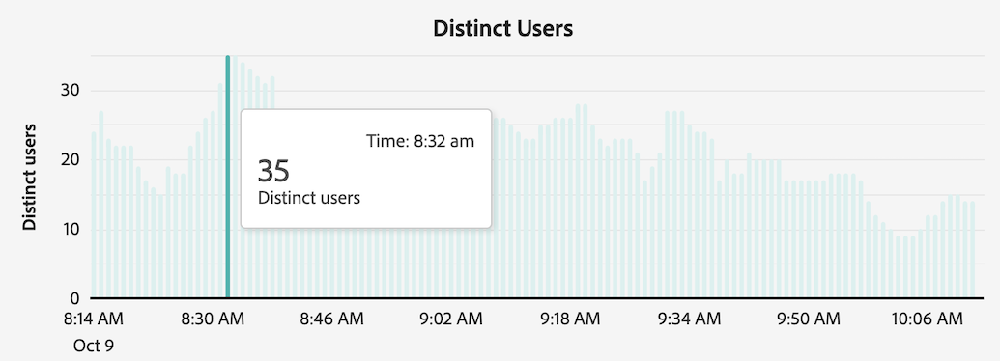

# 檢視報告活動 {#view-reporting-activity}

[!UICONTROL 報告活動管理員]使管理員在尖峰報告期間可快速診斷並修正報告容量問題。

有關報告活動管理員的更多資訊 (包括關鍵優勢和權限需求)，請參閱[報告活動管理員概觀](/help/reporting-activity-manager/reporting-activity-overview.md)。

## 對於所有連線 {#view-all-report-suites}

<!-- markdownlint-disable MD034 -->

>[!CONTEXTUALHELP]
>id="cja_tools_reportingactivitymanager_connections"
>title="連線"
>abstract="此表顯示您有權管理報告活動的連線。表格的每一欄中都提供了有關每個連線的資訊。"

<!-- markdownlint-enable MD034 -->

<!-- markdownlint-disable MD034 -->

>[!CONTEXTUALHELP]
>id="tools_reportingactivitymanager_connections"
>title="連線"
>abstract="此表顯示您有權管理報告活動的連線。表格的每一欄中都提供了有關每個連線的資訊。"

<!-- markdownlint-enable MD034 -->

1. 在 Customer Journey Analytics 中，前往「**[!UICONTROL 工具]** > **[!UICONTROL 報告活動管理員]**」。

   顯示您啟用的基本連線清單。

   

1. 若要查看組織中所有連線的報告請求總數，請展開「[!UICONTROL **顯示更多**]」以查看「[!UICONTROL **每月報告請求**]」圖形。

   您可以查看您所在組織本月和上個月的報告請求數量。

   

1. (選用) 您可以搜尋或篩選連線清單：

   * 使用搜尋欄位以搜尋特定的連線。開始輸入連線名稱或 ID，且當您輸入時，報告套裝清單會隨之更新。

   * 選取「」，展開區段選項清單。您可以根據&#x200B;[!UICONTROL **我的最愛**]&#x200B;或&#x200B;[!UICONTROL **狀態**]&#x200B;進行篩選。

     若要將連線標示為我的最愛，請選取連線名稱左側的星形圖示。

     <!-- (does this option still exist?) 1. (Optional) Select **[!UICONTROL Refresh]** at the top-right to refresh the data. -->

1. 查看每個連線的使用情況資訊。表格中顯示的資料代表頁面上次載入時連線的報告活動。

   可使用下列欄：

   | UI 元素 | 說明 |
   | --- | --- |
   | **[!UICONTROL 連線]** | 受您監控報告活動者的連線。 |
   | **[!UICONTROL 資料視圖]** | 顯示所有使用此連線的資料檢視。資料檢視設定可能會增加報告請求的複雜性。 |
   | **[!UICONTROL 容量使用情況]** | 即時顯示已使用的連線報告容量百分比。 
**請注意** 使用容量達到 100%，不一定表示您應該立即開始取消報告請求。如果平均等待時間合理，則 100% 的使用容量為健康狀態。換言之，如果已佇列的請求數量也在增加中，則 100% 的使用容量可能表示有問題。
 |
   | **[!UICONTROL 已佇列的請求]** | 等待處理的請求數。<!-- ??? --> |
   | **[!UICONTROL 佇列等待時間]** | 請求開始處理之前的平均等待時間。<!-- ???? --> |
   | **[!UICONTROL 狀態]** | 可能的狀態有： <ul><li>[!UICONTROL **使用中**] (藍色)：過去 2 小時內已在連線中執行報告。表格中顯示的資料代表頁面上次載入時連線的報告容量。</li><li>[!UICONTROL **非使用中**] (灰色)：過去 2 小時內未在連線中執行任何報告，因此連線中未顯示任何資料。</li></ul> |

   {style="table-layout:auto"}

## 單一連線

1. 在 Customer Journey Analytics 中，選取「[!UICONTROL **工具**] > [!UICONTROL **報告活動管理員**]」。

1. 選取您要查看詳細資訊的連線已連結標題。

   顯示您選取的連線報告活動資料。

1. (選用) 當連線首次載入至報告活動管理員時，顯示的資料代表目前使用情況的量度。若要在初始載入後查看更新的量度，請選取「[!UICONTROL **重新整理**]」按鈕以手動重新整理此頁面。

   <!-- Need to update this screenshot:  -->

1. 使用適用圖表和表格來了解連線的報告活動。

   * [檢視圖表](#view-graphs)

   * [檢視表格](#view-table)

### 檢視圖表

可使用下列圖表以協助您更了解連線中發生的活動。

如果圖表不可見，請選取「[!UICONTROL **顯示圖表**]」按鈕。

#### 使用情況圖表 {#utilization}

使用情況圖表顯示選取的連線在過去 2 小時內的報告使用情況。

將滑鼠停留在圖表上可以及時檢視該分鐘使用容量百分比最高的時間點。

* **X 軸**：此報告過去 2 小時的使用容量。
* **Y 軸**：此報告使用容量百分比 (以分鐘計)。

  

#### 不同使用者圖表

不同使用者圖表顯示所選連線在過去 2 小時內的報告活動。

將滑鼠停留在圖表上可以及時檢視該分鐘人數最多的時間點。

* **X 軸**：過去 2 小時時間段內的報告活動。
* **Y 軸**：提出報告請求的使用者數量 (以分鐘計)。

  

#### 請求圖表

請求圖表顯示過去 2 小時內選取的連線已處理和已佇列的請求數。

將滑鼠停留在圖表上可以及時檢視該分鐘請求最多的時間點。

* **X 軸**：過去 2 小時時間段內已處理和已佇列的請求數。
* **Y 軸**：已處理請求數 (綠色) 和已佇列請求數 (紫色) (以分鐘計)。

  

#### 佇列圖表

佇列圖表顯示過去 2 小時內選取的連線之報告請求的平均佇列等待時間 (以秒為單位)。

將滑鼠停留在圖表上可以及時檢視該分鐘平均等待時間最多的時間點。

* **X 軸**：過去 2 小時時間段內報告請求的平均佇列等待時間。
* **Y 軸**：平均等待時間 (以秒為單位)。

  

### 檢視表格 {#view-table}

檢視此表格時，請考慮下列事項：

* 您可以透過選擇在資料表格頂端的下列任一索引標籤來檢視資料：[!UICONTROL **請求**]、[!UICONTROL **使用者**]、[!UICONTROL **專案**]，或&#x200B;[!UICONTROL **應用程式**]。

* 您可以搜尋或篩選連線清單：

   * 使用搜尋欄位以搜尋特定的連線。開始輸入連線名稱或 ID，且當您輸入時，報告套裝清單會隨之更新。

   * 請選取「[!UICONTROL **篩選器**]」圖示，以展開篩選器選項清單。您可以根據&#x200B;[!UICONTROL **狀態**]、[!UICONTROL **複雜度**]、[!UICONTROL **應用程式**]、[!UICONTROL **使用者**]，或&#x200B;[!UICONTROL **專案**]&#x200B;進行篩選。

   * 您可以選取「[!UICONTROL **隱藏圖表**]」以僅顯示表格。

#### 根據請求檢視資料

當您選取「[!UICONTROL **請求**]」索引標籤，可使用表格中的下列欄：

| 欄 | 說明 |
| --- | --- |
| [!UICONTROL **請求 ID**] | 可用於疑難排解目的唯一 ID。若要複製 ID，請選取此請求，然後選取「[!UICONTROL **複製請求 ID**]」選項。 |
| [!UICONTROL **執行時間**] | 請求已執行的時長。 |
| [!UICONTROL **開始時間**] | 開始處理請求的時間 (根據管理員的本地時間)。 |
| [!UICONTROL **等待時間**] | 在處理之前請求已等待的時長。當有足夠的容量時，此值通常為「0」。 |
| [!UICONTROL **應用程式**] | [!UICONTROL 報告活動管理器]支援的應用程式有： <ul><li>Analysis Workspace UI</li><li>Workspace 排程專案</li><li>Report Builder</li><li>產生器 UI：細分群體、計算量度、註解、客群等。</li><li>來自 2.0 API 的 API 呼叫</li><li>警報<li>完整表格匯出</li><li>與任何人共用連結</li><li>引導式分析</li><li>查詢 Analytics 報告引擎的任何其他應用程式</li></li></ul>
**注意：** 如果此欄的值為&#x200B;[!UICONTROL **未知**]，這表示請求中繼資料不適用於此使用者。
 |
| [!UICONTROL **使用者**] | 提出請求的使用者。 
**注意：** 如果此欄的值為&#x200B;[!UICONTROL **未知**]，這表示請求中繼資料不適用於此使用者。
 |
| [!UICONTROL **專案**] | 儲存的 Workspace 專案名稱、API 報告 ID 等。(中繼資料可能因各種應用程式而異。)
**注意：** 如果此欄的值為&#x200B;[!UICONTROL **未知**]，這表示專案尚未儲存或請求中繼資料不適用於此使用者。
 |
| [!UICONTROL **狀態**] | 狀態指示器： <ul><li>**執行中**：請求目前正處理中。</li><li>**擱置中**：請求正等待處理中。</li></ul> |
| [!UICONTROL **複雜度**] | 並非所有請求皆需要相同的時間進行處理。請求複雜度可協助提供有關處理請求所需時間的一般概念。 
可能的值包括：
 <ul><li>[!UICONTROL **低**]</li><li>[!UICONTROL **中**]</li><li>[!UICONTROL **高**]</li></ul>此值受在下列欄中的值影響：<ul><li>[!UICONTROL **月邊界**]</li><li>[!UICONTROL **欄**]</li><li>[!UICONTROL **區段**]</li></ul> |
| [!UICONTROL **月邊界**] | 請求中包括的月份數。更多月邊界新增請求的複雜度。 |
| [!UICONTROL **欄**] | 請求中的量度和劃分的數量。更多欄新增請求的複雜度。 |
| [!UICONTROL **區段**] | 套用至請求的區段數。更多區段新增請求的複雜度。 |

{style="table-layout:auto"}

#### 根據使用者檢視資料

當您選取「[!UICONTROL **使用者**]」索引標籤，可使用表格中的下列欄：

| 欄 | 說明 |
| --- | --- |
| [!UICONTROL **使用者**] | 提出請求的使用者。如果此欄的值為&#x200B;[!UICONTROL **無法識別**]，這代表使用者處於您並無管理權限的登入公司。 |
| [!UICONTROL **請求數量**] | 使用者提出的請求數。 |
| [!UICONTROL **專案數量**] | 與使用者相關的專案數量。<!-- ??? --> |
| [!UICONTROL **應用程式**] | [!UICONTROL 報告活動管理器]支援的應用程式有： <ul><li>Analysis Workspace UI</li><li>Workspace 排程專案</li><li>Report Builder</li><li>產生器 UI：細分群體、計算量度、註解、客群等。</li><li>來自 2.0 API 的 API 呼叫</li><li>警報<li>完整表格匯出</li><li>與任何人共用連結</li><li>引導式分析</li><li>查詢 Analytics 報告引擎的任何其他應用程式</li></li></ul> |
| [!UICONTROL **平均複雜度**] | 使用者提出請求的平均複雜度。 
並非所有請求皆需要相同的時間進行處理。請求複雜度可協助提供有關處理請求所需時間的一般概念。

此欄中的值是根據下列欄中的值決定的分數：
<ul><li>[!UICONTROL **平均月邊界**]</li><li>[!UICONTROL **平均欄數**]</li><li>[!UICONTROL **平均區段數**]</li></ul> |
| [!UICONTROL **平均月邊界**] | 請求中包括的平均月份數。更多月邊界新增請求的複雜度。 |
| [!UICONTROL **平均欄數**] | 請求中包括的量度和劃分的平均數量。更多欄新增請求的複雜度。 |
| [!UICONTROL **平均區段數**] | 應用於包括的請求之平均區段數。更多區段新增請求的複雜度。 |

{style="table-layout:auto"}

#### 根據專案檢視資料

當您選取「[!UICONTROL **專案**]」索引標籤，可使用表格中的下列欄：

| 欄 | 說明 |
| --- | --- |
| [!UICONTROL **專案**] | 提出請求的專案。 |
| [!UICONTROL **請求數量**] | 與專案相關的請求數量。 |
| [!UICONTROL **使用者人數**] | 與專案相關的使用者數量。<!-- ??? --> |
| [!UICONTROL **應用程式**] | [!UICONTROL 報告活動管理器]支援的應用程式有： <ul><li>Analysis Workspace UI</li><li>Workspace 排程專案</li><li>Report Builder</li><li>產生器 UI：細分群體、計算量度、註解、客群等。</li><li>來自 2.0 API 的 API 呼叫</li><li>警報<li>完整表格匯出</li><li>與任何人共用連結</li><li>引導式分析</li><li>查詢 Analytics 報告引擎的任何其他應用程式</li></li></ul> |
| [!UICONTROL **平均複雜度**] | 專案中包括的請求之平均複雜度。 
並非所有請求皆需要相同的時間進行處理。請求複雜度可協助提供有關處理請求所需時間的一般概念。

此欄中的值是根據下列欄中的值決定的分數：
<ul><li>[!UICONTROL **平均月邊界**]</li><li>[!UICONTROL **平均欄數**]</li><li>[!UICONTROL **平均區段數**]</li></ul> |
| [!UICONTROL **平均月邊界**] | 請求中包括的平均月份數。更多月邊界新增請求的複雜度。 |
| [!UICONTROL **平均欄數**] | 請求中包括的量度和劃分的平均數量。更多欄新增請求的複雜度。 |
| [!UICONTROL **平均區段數**] | 應用於包括的請求之平均區段數。更多區段新增請求的複雜度。 |

{style="table-layout:auto"}

#### 根據應用程式檢視資料

當您選取「[!UICONTROL **應用程式**]」索引標籤，可使用表格中的下列欄：

| 欄 | 說明 |
| --- | --- |
| [!UICONTROL **應用程式**] | 提出請求的應用程式。 |
| [!UICONTROL **請求數量**] | 與應用程式相關的請求數量。 |
| [!UICONTROL **使用者人數**] | 與應用程式相關的使用者數量。<!--???--> |
| [!UICONTROL **專案數量**] | 與應用程式相關的專案數量。<!--???--> |
| [!UICONTROL **平均複雜度**] | 與應用程式相關之請求的平均複雜度。 
並非所有請求皆需要相同的時間進行處理。請求複雜度可協助提供有關處理請求所需時間的一般概念。

此欄中的值是根據下列欄中的值決定的分數：
此欄中的值是根據下列欄中的值決定的分數：<ul><li>[!UICONTROL **平均月邊界**]</li><li>[!UICONTROL **平均欄數**]</li><li>[!UICONTROL **平均區段數**]</li></ul> |
| [!UICONTROL **平均月邊界**] | 請求中包括的平均月份數。更多月邊界新增請求的複雜度。 |
| [!UICONTROL **平均欄數**] | 請求中包括的量度和劃分的平均數量。更多欄新增請求的複雜度。 |
| [!UICONTROL **平均區段數**] | 應用於包括的請求之平均區段數。更多區段新增請求的複雜度。 |

{style="table-layout:auto"}

<!-- 

## Frequently asked questions {#faq}

| Question | Answer |
| --- | --- |
| | |

{style="table-layout:auto"}

-->
