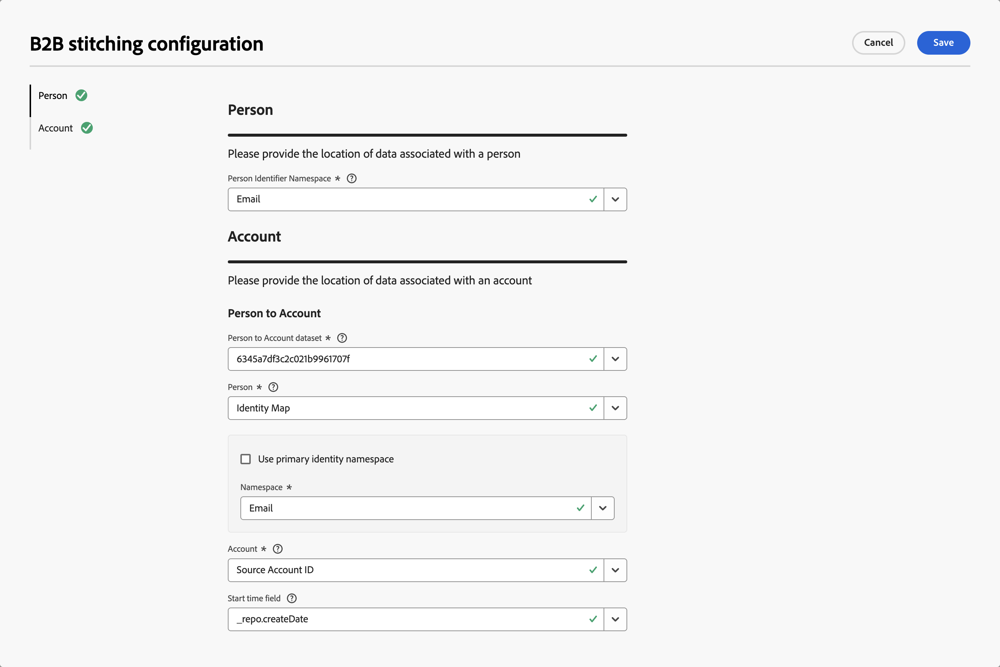

# B2B帳戶拼接

B2B帳戶拼接使用帳戶資訊豐富您的事件資料集，並在Customer Journey Analytics中實現完整客戶歷程的分析。 當事件缺少帳戶ID （Customer Journey Analytics B2B edition需要帳戶識別碼才能進行內嵌）時，帳戶拼接會使用您提供的[人員對帳戶對應資料集](#prerequisites)自動衍生並新增該資訊。

若沒有帳戶拼接，擷取期間會捨棄任何不含帳戶ID的事件。 帳戶拼接可在每個事件中查詢與個人相關聯的帳戶，在事件被內嵌及追溯時新增帳戶ID，藉此消除此障礙。

>[!NOTE]
>
>B2B帳戶拼接需要您有權在您的環境中使用[Customer Journey Analytics B2B edition](/help/getting-started/cja-b2b-edition.md)，然後才能設定功能。

帳戶拼接會對資料集執行以下操作：

* **提升人員身分**：每個事件上的人員ID都會使用身分圖表提升至已設定的身分名稱空間。
* **新增遺失的帳戶資訊**：對於包含人員ID的事件，[人員對帳戶對應](#prerequisites)是用來衍生及新增帳戶資訊。 有關事件本身的任何帳戶資訊都會用作遞補方法。

## 先決條件

啟用B2B帳戶拼接之前，請先在Adobe Experience Platform中準備以下資料集：

| 資料集 | 必要 | 說明 |
|---|---|---|
| **個人對帳戶資料集** | 必填 | 至少包含人員ID （含名稱空間）和帳戶ID的查詢（記錄，非時間序列）資料集。 這些ID用於衍生個人與帳戶的關係對應。 |

>[!IMPORTANT]
>
>**[!UICONTROL 個人對帳戶]**&#x200B;資料集中的人員ID欄位必須在結構描述中標示為身分。

## 啟用帳戶拼接 {#enable-account-stitching}

您可以在連線層級啟用和設定B2B帳戶拼接，然後對該連線中的個別事件資料集啟用帳戶拼接。

### 設定B2B拼接設定 {#configure-b2b-stitching-settings}

>[!CONTEXTUALHELP]
>id="connection_b2b_stitching_open_configuration"
>title="設定B2B帳戶拼接"
>abstract="選取&#x200B;**[!UICONTROL 開啟B2B拼接設定]**&#x200B;以設定B2B帳戶拼接。 如果連線尚未儲存，組態會標示為&#x200B;**[!UICONTROL _未儲存的變更_]**。"

>[!CONTEXTUALHELP]
>id="connection_b2b_stitching_person_identifier_namespace"
>title="個人識別碼名稱空間"
>abstract="選取人員ID名稱空間，例如電子郵件，您希望將任何人員ID提升至該名稱空間。"

>[!CONTEXTUALHELP]
>id="connection_b2b_stitching_person_to_account_dataset"
>title="帳戶資料集的人員"
>abstract="選取將人員ID對應至帳戶ID的查詢資料集。"

>[!CONTEXTUALHELP]
>id="connection_b2b_stitching_person"
>title="人員"
>abstract="在包含人員ID的資料集中選取欄位。 該欄位必須標示為身分，且不能與&#x200B;**[!UICONTROL 帳戶]**&#x200B;欄位或&#x200B;**[!UICONTROL 開始時間]**&#x200B;欄位相同。"

>[!CONTEXTUALHELP]
>id="connection_b2b_stitching_account"
>title="帳戶"
>abstract="在包含帳戶ID的資料集中選取欄位。 該欄位不能與&#x200B;**[!UICONTROL 人員]**&#x200B;欄位或&#x200B;**[!UICONTROL 開始時間]**&#x200B;欄位相同。"

>[!CONTEXTUALHELP]
>id="connection_b2b_stitching_start_time"
>title="開始時間"
>abstract="選取時間戳記欄位，指出個人與帳戶關係何時開始啟用。"
>additional-url=""
>additional-url=""

1. 在Customer Journey Analytics中，導覽至&#x200B;**[!UICONTROL 連線]**&#x200B;並[建立新連線](/help/connections/create-connection.md#create-a-connection)或[編輯現有連線](/help/connections/create-connection.md#edit-a-connection)。

1. 在&#x200B;**[!UICONTROL 連線設定]**&#x200B;中，將&#x200B;**[!UICONTROL 主要識別碼]**&#x200B;設定為 **[!UICONTROL 帳戶]**。

1. 選取&#x200B;**[!UICONTROL 開啟B2B拼接組態]**。

   

   >[!NOTE]
   >
   >先前針對未儲存的連線所設定的B2B拼接組態會以&#x200B;**[!UICONTROL _未儲存的變更_]**&#x200B;表示。 您無法修改先前設定的B2B拼接組態的&#x200B;**[!UICONTROL 選用容器]**。

1. 在&#x200B;**[!UICONTROL B2B拼接組態]**&#x200B;對話方塊中：

   

   1. 設定&#x200B;**[!UICONTROL 人員]**&#x200B;區段：

      * 選取&#x200B;**[!UICONTROL 人員識別碼名稱空間]**，例如&#x200B;**[!UICONTROL 電子郵件]**，您希望將任何人員ID提升至該名稱空間。 此欄位為必填項。

   1. 設定&#x200B;**[!UICONTROL Person to Account]**&#x200B;底下的&#x200B;**[!UICONTROL 帳戶]**&#x200B;區段。

      | 欄位 | 必要 | 說明 |
      |---|:---:|---|
      | **[!UICONTROL 帳戶資料集的人員]** |  | 選取將人員對應至帳戶的查詢（記錄或非時間序列資料集）。 |
      | **[!UICONTROL 人員]** |  | 在包含人員ID的資料集中選取欄位。 該欄位必須標示為身分，且不能與&#x200B;**[!UICONTROL 帳戶]**&#x200B;欄位或&#x200B;**[!UICONTROL 開始時間]**&#x200B;欄位相同。 |
      | **[!UICONTROL 帳戶]** |  | 在包含帳戶ID的資料集中選取欄位。 該欄位不能與&#x200B;**[!UICONTROL 人員]**&#x200B;欄位或&#x200B;**[!UICONTROL 開始時間]**&#x200B;欄位相同。 |
      | **開始時間** | | 選取時間戳記欄位，指出個人與帳戶關係何時開始啟用。 |

      >[!NOTE]
      >
      >如果在載入欄位選項時發生錯誤，下拉選單將顯示為空白，並且每個受影響的欄位下方都會顯示錯誤指示器。 請驗證您的資料集結構，然後再試一次。

   1. 選取&#x200B;**[!UICONTROL 儲存]**&#x200B;以關閉&#x200B;**[!UICONTROL B2B拼接組態]**&#x200B;對話方塊並返回連線設定。

   1. **[!UICONTROL _未儲存的變更_]**&#x200B;指標會出現在&#x200B;**開啟B2B拼接設定**&#x200B;按鈕旁，直到您[儲存](#save)連線為止。

### 在事件資料集上啟用B2B拼接

>[!CONTEXTUALHELP]
>id="connection_b2b_stitching_enable_person_to_account"
>title="啟用個人帳戶拼接"
>abstract="如果啟用，此資料集會使用B2B帳戶拼接。 選取必要的&#x200B;**[!UICONTROL 人員ID]**，以根據人員對帳戶資料集查詢帳戶ID。 如果停用，此資料集&#x200B;*不會*&#x200B;使用B2B帳戶拼接，您必須改為選取必要的&#x200B;**[!UICONTROL 帳戶ID]**。"
>additional-url=""
>additional-url=""

在連線層級設定B2B拼接後，您必須針對要拼接的每個事件資料集個別啟用B2B帳戶拼接。

1. 在「連線設定」中，選取&#x200B;**[!UICONTROL 新增資料集]**&#x200B;或開啟現有事件資料集的設定。 如需詳細資訊，請參閱[新增資料集](/help/connections/create-connection.md#add-datasets)或[編輯資料集](/help/connections/create-connection.md#edit-a-dataset)。

1. 針對您要設定B2B帳戶拼接的特定事件資料集，請切換&#x200B;**[!UICONTROL 啟用人員到帳戶的拼接]**。

>[!BEGINTABS]

>[!TAB 於]

當&#x200B;**[!UICONTROL 啟用人員帳戶拼接]**&#x200B;為&#x200B;**on**&#x200B;時，您已為資料集設定B2B帳戶拼接。

* 人員ID的設定為必填。 該人員ID是用來根據[人員對帳戶資料集](#prerequisites)查詢帳戶ID。
* 帳戶ID的設定為選用。

在的事件資料集上彙整B2B帳戶

>[!TAB 關閉]

當&#x200B;**[!UICONTROL 啟用人員帳戶拼接]**&#x200B;為&#x200B;**關閉**&#x200B;時，您有&#x200B;*未*&#x200B;為資料集設定了B2B帳戶拼接。

* 需要設定帳戶ID。
* 人員ID的設定為選用。

>[!ENDTABS]

### 儲存

在您設定B2B拼接設定並完成新增或編輯資料集後，選取「**[!UICONTROL 儲存]**」以儲存連線。

>[!IMPORTANT]
>
>在儲存連線後，B2B拼接設定將變得不可變動。 若要在儲存後檢視您的設定，請選取&#x200B;**開啟B2B拼接組態**。 所有欄位將以唯讀狀態顯示。 此外，如果在Experience Platform中刪除用於[個人對帳戶對應](#prerequisites)的資料集，將會刪除此連線。

## 資料更新排程

帳戶拼接每天從您的[個人對帳戶資料集](#prerequisites)衍生出身分對應，並使用此資訊來更新啟用拼接的資料集，依下列排程進行：

| 重播 | 頻率 | 資料視窗 |
|---|---|---|
| 短期 | 每週 | 最近 7 天 |
| 長期 | 按月 | 最近 3 個月 |

## 隱私權與資料衛生

帳戶拼接遵循個人身份的標準隱私和衛生請求，與B2C拼接行為一致。 如果之後透過隱私權或衛生請求移除人員ID，則使用身分圖表執行的相關銜接作業會反轉。

透過拼接新增到事件的B2B實體（例如帳戶、帳戶ID和全域帳戶ID）不會作為隱私權或衛生請求的一部分移除。 這些值不包含個人識別資訊，因此不存在移除這些值的法律義務。

>[!MORELIKETHIS]
>
>* [拼接概述](overview.md)
>* [設定B2B的連線](../connections/create-connection.md)
>* [有關銜接的常見問題](faq.md)

