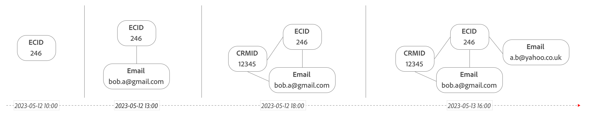

# 依圖表匯整

在圖表式拚接中，您可以指定事件資料集，以及該資料集的永久ID (Cookie)和暫時ID （人員ID）的名稱空間。 圖表式拚接會在新的拚接資料集中為拚接ID建立新欄。 然後使用永久ID來查詢來自Experience Platform Identity Service的身分圖表，使用指定的名稱空間來更新拼接的ID。

>[!NOTE]
>
>您必須確定資料集已為Identity服務[啟用](/help/stitching/faq.md#enable-a-dataset-for-the-identity-service)。
>

## 身分對應

圖表式拚接支援在下列情況下使用[`identityMap`欄位群組](https://experienceleague.adobe.com/zh-hant/docs/experience-platform/xdm/schema/composition#identity)：

- 在`identityMap`名稱空間中使用主要身分來定義persistentID：
   - 如果在不同的名稱空間中找到多個主要身分，則名稱空間中的身分會依字典排序，並會選取第一個身分。
   - 如果在單一名稱空間中找到多個主要身分，則會選取第一個字典上可用的主要身分。

  在以下範例中，名稱空間和身分會產生排序的主要身分清單，最後是選取的身分。

  <table style="table-layout:auto">
     <tr>
       <th>命名空間</th>
       <th>身分清單</th>
     </tr>
     <tr>
       <td>ECID</td>
       <td><pre lang="json"><code>[ &nbsp;&nbsp;{"id": "ecid-3"}, &nbsp;&nbsp;{"id": "ecid-2", "primary": true}, &nbsp;&nbsp;{"id": "ecid-1", "primary": true} &nbsp;]</code></pre></td>
     </tr>
     <tr>
       <td>CCID</td>
       <td><pre lang="json"><code>[ &nbsp;&nbsp;{"id": "ccid-1"}, &nbsp;&nbsp;{"id": "ccid-2", "primary": true} ]</code></pre></td>
     </tr>
   </table>

  <table style="table-layout:auto">
    <tr>
      <th>已排序的身分清單</th>
      <th>選取的身分</th>
    </tr>
    <tr>
      <td><pre lang="json"><code>PrimaryIdentities [ &nbsp;&nbsp;{"id": "ccid-2", "namespace": "CCID"}, &nbsp;&nbsp;{"id": "ecid-1", "namespace": "ECID"}, &nbsp;&nbsp;{"id": "ecid-2", "namespace": "ECID"} ] NonPrimaryIdentities [ &nbsp;&nbsp;{"id": "ccid-1", "namespace": "CCID"}, &nbsp;&nbsp;{"id": "ecid-3", "namespace": "ECID"} ]</code></pre></td>
      <td><pre lang="json"><code>"id": "ccid-2", "namespace": "CCID"</code></pre></td>
    </tr>
  </table>

- 使用`identityMap`名稱空間來定義persistentID：
   - 如果在`identityMap`名稱空間中找到persistentID的多個值，則會使用第一個字典上的可用身分。

  在以下範例中，您已選取ECID作為要使用的名稱空間。 該選取範圍會產生排序的身分清單，最後產生選取的身分。

  <table style="table-layout:auto">
     <tr>
       <th>命名空間</th>
       <th>身分清單</th>
     </tr>
     <tr>
       <td>ECID</td>
       <td><pre lang="json"><code>[ &nbsp;&nbsp;{"id": "ecid-3"}, &nbsp;&nbsp;{"id": "ecid-2", "primary": true}, &nbsp;&nbsp;{"id": "ecid-1", "primary": true} ]</code></pre></td>
     </tr>
     <tr>
       <td>CCID</td>
       <td><pre lang="json"><code>[ &nbsp;&nbsp;{"id": "ccid-1"}, &nbsp;&nbsp;{"id": "ccid-2", "primary": true} ]</code></pre></td>
     </tr>
   </table>

  <table style="table-layout:auto">
    <tr>
      <th>已排序的身分清單</th>
      <th>選取的身分</th>
    </tr>
    <tr>
      <td><pre lang="json"><code>[ &nbsp;&nbsp;"id": "ecid-1", &nbsp;&nbsp;"id": "ecid-2", &nbsp;&nbsp;"id": "ecid-3" ]</code></pre></td>
      <td><pre lang="json"><code>"id": "ecid-1", "namespace": "ECID"</code></pre></td>
    </tr>
  </table>

## 圖表式拚接的運作方式

拼接對指定資料集中的資料進行至少兩次傳遞。

- **即時彙整**：嘗試在每個點選（事件）傳入時將其彙整，使用永久ID透過查詢身分圖表來查詢所選名稱空間的暫時ID。 如果暫時ID可從查詢取得，系統會立即結合此暫時ID。

- **重播拼接**： *根據身分圖表更新的身分重播*&#x200B;資料。 這個階段會連結來自先前未知裝置（永久ID）的點選，因為身分圖表已解析名稱空間的身分。 重播由兩個引數決定： **頻率**&#x200B;和&#x200B;**回顧期間**。 Adobe提供下列這些引數的組合：
   - **每日回顧頻率**：資料每天重播，回顧期間為24小時。 此選項的優點是重播頻率較高，但未驗證的訪客必須在造訪您網站的當天完成驗證。
   - **每週回顧頻率**：資料每週重播一次，回顧期間為每週（請參閱[選項](#options)）。 此選項的優點在於，未驗證的工作階段能有更多時間驗證。不過，系統不會重新處理不到一週的未拼接資料，直到下一次每週重播為止。
   - **每兩週回顧一次每週頻率**：資料每週重播一次，回顧期間為每兩週（請參閱[選項](#options)）。 此選項的優點在於，未驗證的工作階段能有更多時間驗證。不過，兩週內的未拼接資料要等到下一次每週重播時才會重新處理。
   - **每週頻率每月回顧**：資料每週重播一次，回顧期間為每月一次（請參閱[選項](#options)）。 此選項的優點在於，未驗證的工作階段能有更多時間驗證。不過，不到一個月的未拼接資料要等到下一次每週重播才會重新處理。

- **Privacy**：收到隱私權相關要求時，除了從來源資料集中移除要求的身分之外，還必須復原該身分在未經驗證事件之間的任何拼接。 此外，身分必須從身分圖表移除，以防止未來對該特定身分使用圖表式拚接。

  >[!IMPORTANT]
  >
  >作為隱私權請求的一部分，取消拼接過程在2025年初變更。 目前的解除拼接程式使用最新版本的已知身分識別來重設事件。 將事件重新指派給另一個身分可能會產生不良的法律後果。 為了補救這些疑慮，自2025年起，新的解除拼接流程將使用永久性ID更新隱私權請求中的事件。
  > 

超出回顧期間的資料不會重播。 訪客必須在指定的回顧期間內進行驗證，以便一起識別未經驗證的造訪和經過驗證的造訪。 一旦識別出裝置，就會從該時間點開始即時彙整。

請考量下列兩個永久ID `246`和`3579`的身分圖表、這些身分圖表如何隨著時間更新，以及這些更新如何影響圖表式銜接中的步驟。

您可以使用[身分圖表檢視器](https://experienceleague.adobe.com/zh-hant/docs/experience-platform/identity/features/identity-graph-viewer)，檢視特定設定檔在一段時間內的身分圖表。 另請參閱[身分識別服務連結邏輯](https://experienceleague.adobe.com/zh-hant/docs/experience-platform/identity/features/identity-linking-logic)，以更清楚瞭解連結身分識別時所使用的邏輯。

### 步驟1：即時彙整

即時彙整會在收集時嘗試將每個事件與當時來自身分圖表的已知資訊彙整。

+++ 詳細內容

| | 時間 | 永久ID `ECID` | 名稱空間 `Email`  | 彙整ID （即時彙整後） |
|--:|---|---|---|---|
| 1 | 2023-05-12 11:00 | `246` | `246`  *未定義* | `246` |
| 2 | 2023-05-12 14:00 | `246` | `246`  `bob.a@gmail.com` | `bob.a@gmail.com` |
| 3 | 2023-05-12 15:00 | `246` | `246`  `bob.a@gmail.com` | `bob.a@gmail.com` |
| 4 | 2023-05-12 17:00 | `3579` | `3579`  *未定義* | `3579` |
| 5 | 2023-05-12 19:00 | `3579` | `3579`  `ted.w@gmail.com` | `ted.w@gmail.com` |
| 6 | 2023-05-13 15:00 | `246` | `246`  `bob.a@gmail.com` | `bob.a@gmail.com` |
| 7 | 2023-05-13 16:30 | `246` | `246`  `a.b@yahoo.co.uk` `246`  `bob.ab@gmail.com` | `a.b@yahoo.co.uk` |

{style="table-layout:auto"}

您可以檢視如何針對每個事件解析彙整ID。 根據時間、永久ID和查詢指定名稱空間的身分圖表（同時）。
當查詢解析為一個以上的彙整ID時（如事件7），會選取身分圖表傳回的詞典說明第一個ID （在此範例中為`a.b@yahoo.co.uk`）。

+++

### 第 2 步：重播彙整作業

重播彙整會定期地（視選取的回顧期間而定）根據識別圖形的最新版本，在間隔時間重新計算歷史資料。

+++ 詳細內容

當重播拼接發生在2023-05-13 16:30，具有24小時回顧視窗設定時，會重新拼接範例中的某些事件（由指示）。

| | 時間 | 永久ID `ECID` | 名稱空間 `Email`  | 已彙整ID  （即時彙整後） | 已拼接ID  （重播24小時後） |
|---|---|---|---|---|---|
| 2 | 2023-05-12 14:00 | `246` | `246`  `bob.a@gmail.com` | `bob.a@gmail.com` | `bob.a@gmail.com` |
| 3 | 2023-05-12 15:00 | `246` | `246`  `bob.a@gmail.com` | `bob.a@gmail.com` | `bob.a@gmail.com` |
|  4 | 2023-05-12 17:00 | `3579` | `3579`  `ted.w@gmail.com` | `3579` | `ted.w@gmail.com` |
|  5 | 2023-05-12 19:00 | `3579` | `3579`  `ted.w@gmail.com` | `ted.w@gmail.com` | `ted.w@gmail.com` |
|  6 | 2023-05-13 15:00 | `246` | `246`  `a.b@yahoo.co.uk` | `bob.a@gmail.com` | `a.b@yahoo.co.uk` |
|  7 | 2023-05-13 16:30 | `246` | `246`  `a.b@yahoo.co.uk` `246`  `bob.ab@gmail.com` | `a.b@yahoo.co.uk` | `a.b@yahoo.co.uk` |

{style="table-layout:auto"}

當重播彙整發生在2023-05-13 16:30，且回顧視窗設定為7天時，來自範例的所有事件都會重新彙整。

| | 時間 | 永久ID `ECID` | 名稱空間 `Email`  | 已彙整ID  （即時彙整後） | 已拼接ID  （重播7天後） |
|---|---|---|---|---|---|
|  1 | 2023-05-12 11:00 | `246` | `246`  *未定義* | `246` | `a.b@yahoo.co.uk` |
|  2 | 2023-05-12 14:00 | `246` | `246`  `bob.a@gmail.com` | `bob.a@gmail.com` | `a.b@yahoo.co.uk` |
|  3 | 2023-05-12 15:00 | `246` | `246`  `bob.a@gmail.com` | `bob.a@gmail.com` | `a.b@yahoo.co.uk` |
|  4 | 2023-05-12 17:00 | `3579` | `3579`  `ted.w@gmail.com` | `3579` | `ted.w@gmail.com` |
|  5 | 2023-05-12 19:00 | `3579` | `3579`  `ted.w@gmail.com` | `ted.w@gmail.com` | `ted.w@gmail.com` |
|  6 | 2023-05-13 15:00 | `246` | `246`  `a.b@yahoo.co.uk` | `bob.a@gmail.com` | `a.b@yahoo.co.uk` |
|  7 | 2023-05-13 16:30 | `246` | `246`  `a.b@yahoo.co.uk` `246`  `bob.ab@gmail.com` | `a.b@yahoo.co.uk` | `a.b@yahoo.co.uk` |

{style="table-layout:auto"}

+++

### 步驟3：隱私權請求

當您收到隱私權請求時，隱私權請求之使用者主體的所有記錄中都會刪除拼接的ID。

+++ 詳細內容

下表呈現與以上相同的資料，但顯示隱私權請求（例如，在2023-05-13 18:00）對範例事件的影響。

| | 時間 | 永久ID `ECID` | 名稱空間 `Email`  | 彙整ID （隱私權請求後） |
|--:|---|---|---|---|
|  1 | 2023-05-12 11:00 | `246` | `246`  `a.b@yahoo.co.uk` | `246` |
|  2 | 2023-05-12 14:00 | `246` | `246`  `a.b@yahoo.co.uk` | `246` |
|  3 | 2023-05-12 15:00 | `246` | `246`  `a.b@yahoo.co.uk` | `246` |
|  4 | 2023-05-12 17:00 | `3579` | `3579`  `ted.w@gmail.com` | `3579` |
|  5 | 2023-05-12 19:00 | `3579` | `3579`  `ted.w@gmail.com` | `3579` |
|  6 | 2023-05-13 15:00 | `246` | `246`  `a.b@yahoo.co.uk` | `246` |
|  7 | 2023-05-13 16:30 | `246` | `246`  `a.b@yahoo.co.uk` `246`  `bob.ab@gmail.com` | `246` |

{style="table-layout:auto"}

+++

## 先決條件

下列先決條件尤其適用於圖表式銜接：

- Adobe Experience Platform中您要套用拼接的事件資料集，必須有一欄可識別每列的訪客，**永久ID**。 例如，Adobe Analytics AppMeasurement資料庫產生的訪客ID或Experience Platform Identity Service產生的ECID。
- 永久識別碼也必須在結構描述中定義為[身分識別](https://experienceleague.adobe.com/zh-hant/docs/experience-platform/xdm/ui/fields/identity)。
- 來自Experience Platform Identity Service的身分圖表必須有名稱空間（例如`Email`或`Phone`），您可在拼接期間用來解析&#x200B;**暫時ID**。 如需詳細資訊，請參閱[Experience Platform Identity Service](https://experienceleague.adobe.com/zh-hant/docs/experience-platform/identity/home)。

>[!NOTE]
>
>您&#x200B;**不**&#x200B;需要Real-time Customer Data Platform授權才能使用圖表式拚接。 Customer Journey Analytics的&#x200B;**Prime**&#x200B;套件或更新版本包含必要的Experience Platform Identity Service權益。

## 限制

下列限制尤其適用於圖表式拚接：

- 使用指定的名稱空間查詢暫時ID時，不會考慮時間戳記。 因此，永久性ID可能會從時間戳記較早的記錄拼接暫時ID。
- 在共用裝置情況中，其中圖表中的名稱空間包含多個身分，系統會使用第一個字典識別。 如果名稱空間限制和優先順序是在圖表連結規則發行時設定，則會使用最後驗證的使用者身分。 如需詳細資訊，請參閱[共用裝置](/help/use-cases/stitching/shared-devices.md)。
- 在身分圖表中有三個月回填身分的硬性限制。 若您未使用Experience Platform應用程式（如Real-time Customer Data Platform）填入身分圖表，建議您使用回填身分。
- [Identity Service護欄](https://experienceleague.adobe.com/zh-hant/docs/experience-platform/identity/guardrails)已套用。 檢視下列[靜態限制](https://experienceleague.adobe.com/zh-hant/docs/experience-platform/identity/guardrails#static-limits)：
   - 圖表中的最大身分數量： 50。
   - 單一批次擷取的身分連結數上限： 50。
   - 用於圖表擷取的XDM記錄中的最大身分數量： 20。
   - 用於圖表擷取的XDM記錄中的最小身分數量： 2。
