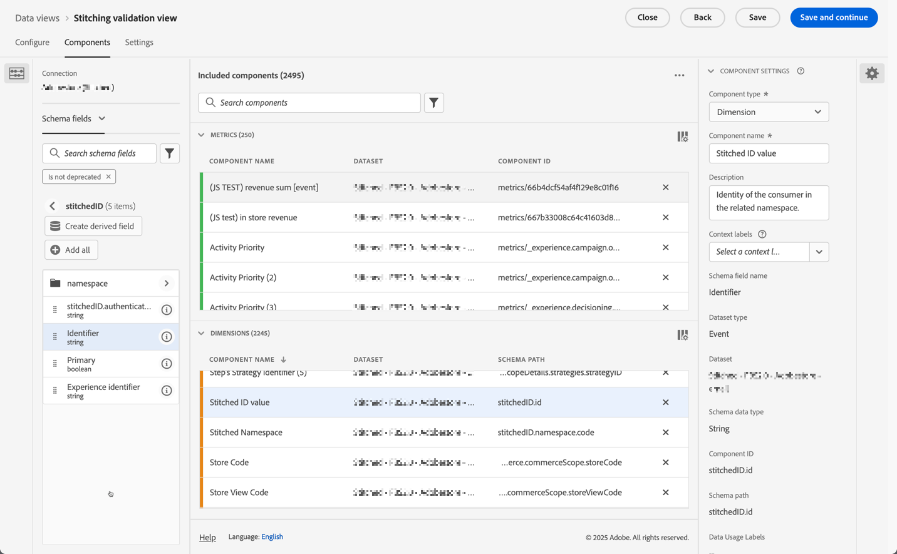
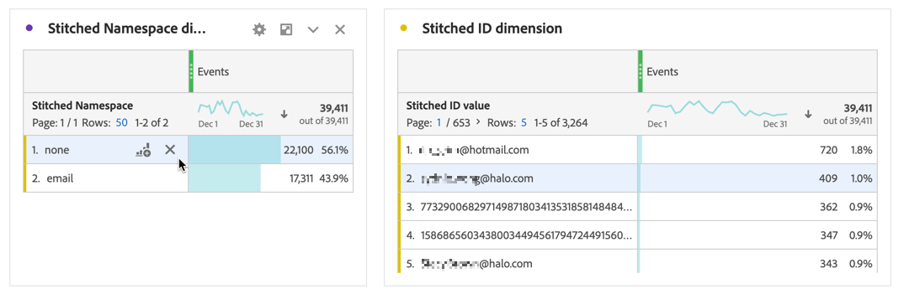
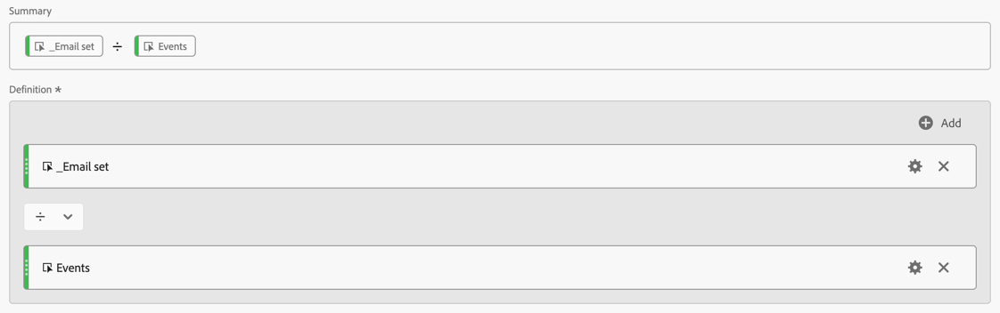
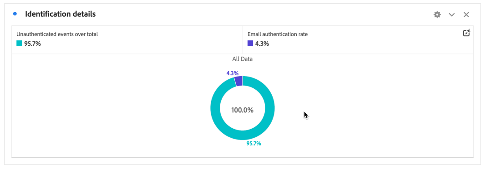

# 驗證拼接

[身分拼接](/help/stitching/overview.md) （或只是拼接）的目標是提升事件資料集適用於跨管道分析的適用性。 當資料集中的所有資料列都包含所需的最高可用身分順序時，就會達到此提升度。 然後，此提升範圍可讓您：

* 建立以人為中心的報表，同時不會忽略匿名人員。
* 將多個裝置連線至單一人員。
* 跨管道連結人員。

本文概述測量一或多個新建立拼接資料集上升幅度的分析方法，並提供拼接帶來這些優點的可信度。

分析方法包含[通常可供管理員存取的資料檢視元件設定](/help/data-views/component-settings/overview.md)。 這些方法也要求在Analysis Workspace專案中工作的分析師建立計算量度和視覺效果。

雖然這些分析方法可同時用於欄位式拚接和圖表式拚接，但資料集中可能未出現某些元素，尤其是圖表式拚接案例。 這些缺少的元素可能會讓直接在Analysis Workspace中計算提升度變得困難。

>[!NOTE]
>
>一或多個資料集的（驗證）彙整作業最終有助於進行更出色的分析和深入分析。 不過，本文不會討論將Experience Platform中的所有資料集對齊相同身分名稱空間的Customer Journey Analytics設定的整體值。 而且所有這些資料集都妥善結合，以便在整個客戶歷程中執行分析。

## 資料檢視先決條件

對於拼接驗證測量計畫，您需要確保在資料檢視中定義拼接資料集中的所有必要維度和量度。 您必須確認`stitchedID.id`和`stitchedId.namespace.code`欄位均已新增為維度。 拼接的資料集是原始資料集的精確副本，拼接過程會將這兩個新欄新增到資料集中：

* 使用`stitchedID.namespace.code`定義&#x200B;**[!UICONTROL 拼接的名稱空間]**&#x200B;維度。 此維度包含資料列已提升許可權的身分名稱空間，例如`Email`、`Phone`。 或彙整程式後援的名稱空間，例如`ECID`。
  

* 使用`stitchedID.id`定義&#x200B;**[!UICONTROL 彙整ID值]**&#x200B;維度。 此維度包含身分的原始值。 例如：雜湊電子郵件、雜湊電話、ECID。 此值搭配&#x200B;**[!UICONTROL 拼接的名稱空間]**使用。
  

此外，您需要根據維度中值的存在，新增兩個拼接量度。

1. 使用包含拼接資料集中人員ID的欄位來設定量度，以定義是否設定了人員ID。 即使您使用圖表式拚接，也新增此人員ID，因為人員ID有助於建立基準。 如果人員ID未包含在資料集中，您的基線為0%。

   在下列範例中，`personalEmail.address`做為身分識別，用來建立&#x200B;**[!UICONTROL _電子郵件集]**量度。
   

1. 使用`stitchedID.namespae.code`欄位來建立&#x200B;**[!UICONTROL 電子郵件拼接名稱空間]**&#x200B;維度。 請確定您指定了[包含排除值元件設定](/help/data-views/component-settings/include-exclude-values.md)，所以您只會考慮您嘗試將資料列提升到的名稱空間值。
   1. 選取&#x200B;**[!UICONTROL 設定包含/排除值]**。
   1. 選取&#x200B;**[!UICONTROL 如果符合所有條件]**&#x200B;作為&#x200B;**[!UICONTROL 符合]**。
   1. 將&#x200B;**[!UICONTROL 等於]** `email`指定為&#x200B;**[!UICONTROL 條件]**，以選取已提升至電子郵件名稱空間的事件。

   

## 拼接維度

將這兩個維度新增至資料檢視後，請在Analysis Workspace中使用[自由表格](/help/analysis-workspace/visualizations/freeform-table/freeform-table.md)來檢查每個維度所擁有的資料。

在**[!UICONTROL 拼接的名稱空間維度**]表格中，您通常會看到每個資料集有兩個資料列。 一列，代表銜接程式何時必須使用備援方法(ECID)。 另一列會顯示與所需身分名稱空間（電子郵件）相關聯的事件。

對於**[!UICONTROL 拼接ID維度**]表格，您會看到來自事件的原始值。 在此表格中，您會看到值會在永久性ID和所需人員ID之間振盪。

## 以裝置為中心或以人為中心的報表

建立連線時，您必須定義用於人員ID的欄位或身分。 例如，在網路資料集上，如果您選擇裝置ID作為人員ID，則會建立以裝置為中心的報表，並失去將此資料與其他離線管道聯結的功能。 如果您選取跨頻道欄位或身分，例如電子郵件，您將會遺失任何未驗證的事件。 若要瞭解此影響，您必須瞭解有多少流量未經驗證，以及有多少流量已驗證。

1. 建立計算量度&#x200B;**[!UICONTROL 個未驗證事件，總共]**。 在規則產生器中定義規則，如下所示：
   

1. 根據您先前定義的&#x200B;**[!UICONTROL _Email set]**&#x200B;量度，建立計算量度&#x200B;**[!UICONTROL 電子郵件驗證率]**。 在規則產生器中定義規則，如下所示：
   

1. 使用&#x200B;**[!UICONTROL 未驗證事件超過總計]**&#x200B;個計算量度，再加上&#x200B;**[!UICONTROL 電子郵件驗證率]**&#x200B;個計算量度，以建立[環形圖](/help/analysis-workspace/visualizations/donut.md)視覺效果。 視覺效果會顯示資料集中未驗證及已驗證的事件數量。

   

## 拼接識別率

您想要在拼接之前和之後測量識別效能。 若要這麼做，請建立三個額外的計算量度：

1. **[!UICONTROL 拼接驗證率]**&#x200B;計算量度，計算在事件總數中，拼接名稱空間設定為所需身分的事件數量。 當您設定資料檢視時，已建立一個&#x200B;**[!UICONTROL 電子郵件拼接名稱空間]**&#x200B;量度，其中包含只有在事件的名稱空間設為電子郵件時才計數的篩選器。 計算量度使用此&#x200B;**[!UICONTROL 電子郵件拼接的名稱空間]**量度來指示資料中擁有所需身分的百分比。
   

1. **[!UICONTROL 百分比增加]**計算量度，可計算目前識別率與拼接識別率之間的原始百分比變化。
   

1. 計算目前識別率與拼接識別率之間提升度的&#x200B;**[!UICONTROL 提升度]**計算量度。
   

## 結論

如果您將所有資料合併為Analysis Workspace自由表格，您就可以開始看到銜接提供的影響和值，包括：

* 目前驗證率：已具有正確人員ID的事件數在事件總數中所佔的基線。
* 拼接驗證率：具有正確人員ID的事件在事件總數中的新事件數。
* 百分比增加：原始百分比從拼接的驗證速率減去基準的目前驗證速率而增加。
* 提升度：相對於基準線目前驗證速率的百分比變化。

本文的重點在於，這種型別的拼接驗證和分析可支援您：

* 透過比較目前與拼接率，提供驗證效率的全面自訂檢視。
* 透過百分比增加和提升量度，啟用改善的明確測量。
* 協助識別實作銜接對使用者驗證的真正影響。
* 建立標準化方式，在不同團隊之間溝通驗證效能。
* 允許針對驗證策略和最佳化進行資料導向式決策。

這些量度可讓利害關係人全面瞭解Customer Journey Analytics拼接如何影響驗證成功率和整體人員識別效能。

