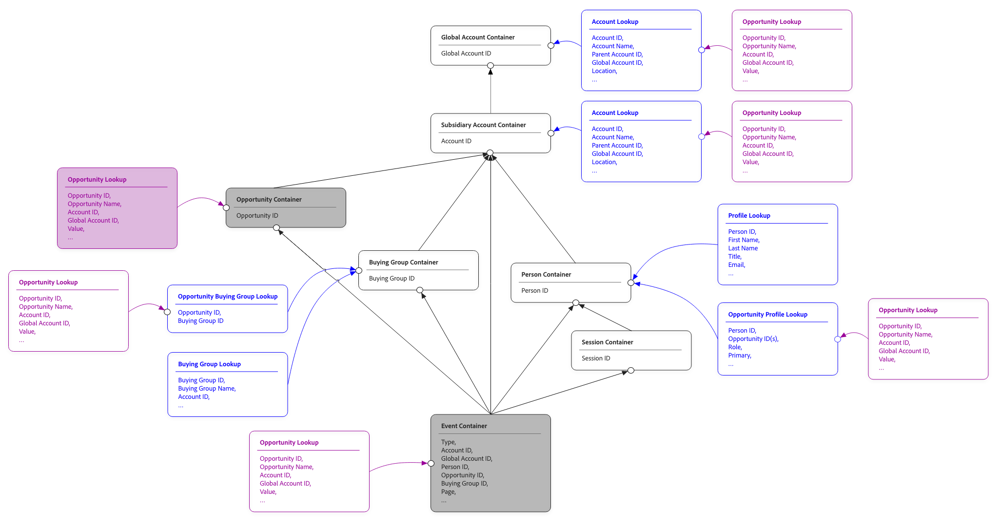
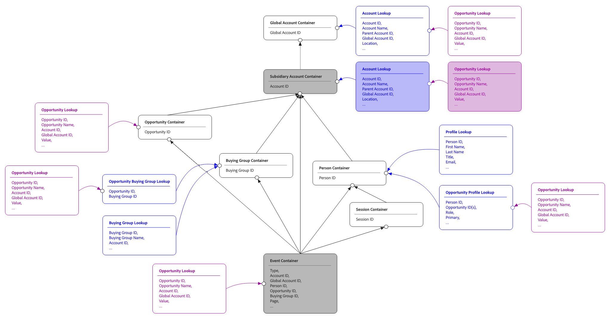

# 共用查詢

在Customer Journey Analytics中，查詢資料集可透過其他內容豐富您的事件資料。 例如，將產品名稱、類別和價格新增至購買事件的產品目錄資料集。 或是將行銷活動詳細資料新增至行銷活動的行銷活動中繼資料資料集。

查閱可讓您使用未儲存在事件本身中的屬性來報告事件資料。
傳統上，查詢資料集會透過單一固定路徑聯結至事件。事件資料集中的關鍵欄位與查詢資料集中的關鍵欄位匹配。當只有一種方式可讓兩個資料集產生關聯時，此查詢即可運作，但在常見的實際情況中，此簡單連結會失效：

* 視事件來源而定，產品SKU或產品ID上的聯結至事件的產品目錄。
* 視管道（網頁事件的電子郵件、店內事件的熟客ID）而定，與不同身分名稱空間上的事件聯結的使用者屬性查閱。
* 直接（依人員）和間接（依帳戶，用於B2B報告用途）聯結至事件的設定檔資料集

共用查詢可讓您在查詢資料集和讓查詢資料變得充裕的事件之間定義多個聯結路徑，藉此解決有限的固定路徑聯結。 每個路徑都說明一種將查閱列與事件列比對的方法。 根據查詢建立的維度或量度，可以選擇要使用的路徑。 相同的查詢資料集現在可以從單一設定支援多個報表情境。

共用查閱也是[總母體報告](./tpr.md)的基礎，此報告使用共用查閱將設定檔資料集連線至事件。

## 概念

以下各節說明主要共用查詢概念。

### 加入路徑

聯結路徑是比對查詢資料集與事件之間列的單一路徑。 每個聯結路徑都具有：

* **路徑名稱**。 您所選擇的可讀取標籤，可在建立維度和量度時，用來識別UI中的路徑。
* 事件端的&#x200B;**索引鍵欄位**。 此欄位用於將事件與查閱資料進行比對。
* 查閱端有&#x200B;**相符的索引鍵欄位**。  此欄位是比對索引鍵的欄位。
* 選用的&#x200B;**名稱空間**。 當索引鍵欄位為身分對應時，需要名稱空間。

單一查詢資料集可以有一或多個聯結路徑。 在該查詢的欄位上建立的維度和量度可指定要使用的路徑。 如果未指定路徑，則會使用資料集的預設路徑。

### 依容器比對

對於設定檔資料集（與總母體報表搭配使用），共用查閱可支援容器比對設定，此設定會根據容器型別自動設定聯結：

* **依人員容器比對**。 查詢會透過人員身分聯結至事件，使用事件資料集的身分對應作為索引鍵。
* **依帳戶容器比對** [!BADGE B2B edition]{type=Informative url="https://experienceleague.adobe.com/zh-hant/docs/analytics-platform/using/cja-overview/cja-b2b/cja-b2b-edition" newtab=true tooltip="Customer Journey Analytics B2B Edition"}。 查詢會透過帳戶身分聯結。
* **依全域帳戶容器比對** （[!BADGE B2B edition]{type=Informative url="https://experienceleague.adobe.com/zh-hant/docs/analytics-platform/using/cja-overview/cja-b2b/cja-b2b-edition" newtab=true tooltip="Customer Journey Analytics B2B Edition"}已啟用全域帳戶）。 透過全域帳戶身分識別聯結查詢。

依容器比對可處理常見案例，無需您手動設定關鍵欄位。 依容器比對的主要優點在於可自動處理重複資料刪除。 容器會儲存不重複身分識別（適用於人員、帳戶或全域帳戶）。

除了母體總計報表之外，您也可以使用「依容器比對」來定義其他查詢資料集的聯結路徑。

### 依欄位比對

或者，您也可以依欄位比對設定檔資料集。 該符合項會根據特定身分，直接查詢事件資料中的每個事件。 使用依欄位比對時，結果可能包含重複的資料，這可能會導致混淆結果，尤其是與量度搭配使用時。 如需更詳細的說明，請參閱[範例](#example)。

### 身分對應作為索引鍵欄位

當聯結兩側的索引鍵欄位是身分對應（包含多個名稱空間身分的欄位）時，需要額外設定：

* **主索引鍵**&#x200B;或&#x200B;**名稱空間**。 您可以使用身分對應的主要索引鍵進行比對，或選取特定的名稱空間。 選取名稱空間是較常見的選擇；主索引鍵並未填入所有設定檔資料來源中。
* **次要名稱空間**。 如果主要名稱空間未填入指定列（與拼接資料集很常見），您可以指定後援名稱空間。 填入時，連線會使用主要名稱空間，否則會退回次要。
* **跨路徑的一致性**。 當連線上的多個共用查詢將相同的身分對應用作索引鍵欄位時，這些查詢中的名稱空間選擇必須一致。

### 查閱路徑

查詢資料集可以本身聯結到另一個查詢資料集。 此查詢會建立兩個層次的查詢鏈：事件→查詢A→查詢B。

每個查詢鏈結層級都可以有自己的聯結路徑。 第二層級查詢中，根據欄位建立的維度或量度，會使用每個步驟所設定的路徑周遊鏈結。 不支援比兩個層級更深的查閱鏈結。

## 何時使用

當下列任一條件為True時，使用共用查詢：

* 您需要以多種方式將相同的查詢資料集聯結至事件。
* 您可以處理不同事件使用不同身分名稱空間的B2C （企業對消費者）身分資料。
* 您可以設定B2B （企業對企業）連線，將事件與人員和帳戶相關聯。
* 您將設定檔資料集新增到連線，以進行總母體報表。

如果您的查詢資料集有單一明顯的聯結索引鍵，而且您只需要以一種方式將查詢資料集中的資料與事件產生關聯，您可以設定單一路徑。 共用查閱也支援這種簡單的情況。

## 範例

以下完整的範例說明一般共用查詢。

想像一下，在事件資料集旁邊，您已將以下設定檔、機會設定檔、帳戶和機會查詢資料集設定為Customer Journey Analytics連線的一部分。

每個資料集的範例資料：

>[!BEGINTABS]

>[!TAB 事件]

| 時間戳記 | 個人 ID | 帳戶 ID | 全域帳戶 ID | 機會 ID | 頁面 |
|---|---|---|---|---|---|
| 2025-01-29 07:01:57 | P-ABC | A-123 | A-123 | O-432 | 首頁 |
| 2025-02-28 05:32:13 | P-ABC | A-123 | A-123 | O-432 | 小工具集 |
| 2025-03-13 08:21:47 | P-ABC | A-123 | A-123 | O-432 | Doohickey |
| 2025-03-17 17:21:45 | P-EFG | A-123 | A-123 | O-543 | 小工具 |
| 2025-04-01 05:32:13 | P-LMN | A-456 | A-789 | O-876 | 首頁 |
| 2025-04-01 05:32:13 | P-LMN | A-456 | A-789 | O-876 | 小工具 |

>[!TAB 輪廓]

| 個人 ID | 名稱 | 帳戶 ID | 全域帳戶 ID |
|---|---|---|---|
| P-ABC | John | A-123 | A-123 |
| P-EFG | Kate | A-123 | A-123 |
| P-HIJ | Dave | A-789 | A-789 |
| P-LMN | Vijay | A-456 | A-789 |

>[!TAB 帳戶]

| 帳戶 ID | 名稱 | 全域帳戶 ID | 國家/地區 | 期限值 |
|---|---|---|---|---:|
| A-123 | Acme | A-123 | 美國 | 1.22億美元 |
| A-456 | 大公司 | A-789 | JP | 2300萬美元 |
| A-789 | 巨人 | A-789 | UK | 4800萬美元 |

>[!TAB 機會設定檔]

| 個人 ID | 機會 ID | 全域帳戶 ID |
|---|---|---|
| P-ABC | O-432 | A-123 |
| P-ABC | O-543 | A-123 |
| P-EFG | O-543 | A-123 |
| P-LMN | O-876 | A-789 |

>[!TAB 商機]

| 機會 ID | 名稱 | 帳戶 ID | 全域帳戶 ID | 狀態 | 值 |
|---|---|---|---|---|---:|
| O-432 | Acme Express | A-123 | A-123 | 開啟 | 200萬美元 |
| O-543 | Acme CC | A-123 | A-123 | 已關閉 | 100萬美元 |
| O-765 | Acme DX | A-123 | A-123 | 開啟 | 800萬美元 |
| O-876 | BigCo CC | A-456 | A-789 | 開啟 | 700萬美元 |
| O-987 | BigCo DX | A-456 | A-789 | 開啟 | 1600萬美元 |
| O-888 | 巨型DX | A-789 | A-789 | 開啟 | 1300萬美元 |

>[!ENDTABS]

建立此連線時，會自動建立[容器](/help/getting-started/cja-b2b-concepts-features.md#containers)，作為Customer Journey Analytics核心功能的一部分。

下圖顯示此連線的實體關係。

{zoomable="yes"}

您可以使用這些容器作為路徑分析的一部分，來報告每個帳戶的機會值。 根據選取的容器，您可以有不同的結果。

| 帳戶名稱 | 機會值  （機會容器） | 機會值  （子目錄帳戶容器） | 機會值 （人員容器） |
|---|---:|---:|---:|
| Acme | 300萬美元 | 1100萬美元 | 400萬美元 |
| 大公司 | 700萬美元 | 2300萬美元 | 700萬美元 |

### 依機會容器比對

為了將商機與客戶比對，請使用商機容器作為從事件到商機查詢資料的路徑，這為Acme帶來300萬美元，為BigCo帶來700萬美元。

{zoomable="yes"}

>[!BEGINTABS]

>[!TAB 事件資料]

| 時間戳記 | 個人 ID | 帳戶 ID | 全域帳戶 ID | 機會ID  | 頁面 |
|---|---|---|---|---|---|
| 2025-01-29 07:01:57 | P-ABC | A-123 | A-123 | **O-432** | 首頁 |
| 2025-02-28 05:32:13 | P-ABC | A-123 | A-123 | **O-432** | 小工具集 |
| 2025-03-13 08:21:47 | P-ABC | A-123 | A-123 | **O-432** | Doohickey |
| 2025-03-17 17:21:45 | P-EFG | A-123 | A-123 | **O-543** | 小工具 |
| 2025-04-01 05:32:13 | P-LMN | A-456 | A-789 | **O-876** | 首頁 |
| 2025-04-01 05:32:13 | P-LMN | A-456 | A-789 | **O-876** | 小工具 |

>[!TAB 商機]

| 機會ID  | 名稱 | 帳戶 ID | 全域帳戶 ID | 狀態 | 值 |
|---|---|---|---|---|---:|
| **O-432** | Acme Express | A-123 | A-123 | 開啟 | **$2M** |
| **O-543** | Acme CC | A-123 | A-123 | 已關閉 | **$1M** |
| O-765 | Acme DX | A-123 | A-123 | 開啟 | 800萬美元 |
| **O-876** | BigCo CC | A-456 | A-789 | 開啟 | **$7M** |
| O-987 | BigCo DX | A-456 | A-789 | 開啟 | 1600萬美元 |
| O-888 | 巨型DX | A-789 | A-789 | 開啟 | 1300萬美元 |

>[!ENDTABS]

### 依子公司帳戶容器比對

為了將商機與帳戶進行比對，請使用子公司帳戶容器作為從事件到商機查詢資料的路徑，這導致Acme損失1100萬美元，BigCo損失2300萬美元。

{zoomable="yes"}

>[!BEGINTABS]

>[!TAB 事件]

| 時間戳記 | 個人 ID | 帳戶ID  | 全域帳戶 ID | 機會 ID | 頁面 |
|---|---|---|---|---|---|
| 2025-01-29 07:01:57 | P-ABC | **A-123** | A-123 | O-432 | 首頁 |
| 2025-02-28 05:32:13 | P-ABC | **A-123** | A-123 | O-432 | 小工具集 |
| 2025-03-13 08:21:47 | P-ABC | **A-123** | A-123 | O-432 | Doohickey |
| 2025-03-17 17:21:45 | P-EFG | **A-123** | A-123 | O-543 | 小工具 |
| 2025-04-01 05:32:13 | P-LMN | **A-456** | A-789 | O-876 | 首頁 |
| 2025-04-01 05:32:13 | P-LMN | **A-456** | A-789 | O-876 | 小工具 |

>[!TAB 商機]

| 機會 ID | 名稱 | 帳戶ID  | 全域帳戶 ID | 狀態 | 值 |
|---|---|---|---|---|---:|
| O-432 | Acme Express | **A-123** | A-123 | 開啟 | **$2M** |
| O-543 | Acme CC | **A-123** | A-123 | 已關閉 | **$1M** |
| O-765 | Acme DX | **A-123** | A-123 | 開啟 | **$8M** |
| O-876 | BigCo CC | **A-456** | A-789 | 開啟 | **$7M** |
| O-987 | BigCo DX | **A-456** | A-789 | 開啟 | **$16M** |
| O-888 | 巨型DX | A-789 | A-789 | 開啟 | 1300萬美元 |

>[!ENDTABS]

### 依人員容器比對

{zoomable="yes"}

為了將商機與帳戶進行比對，請使用人員容器作為前往商機設定檔和查詢資料的路徑，結果為Acme帶來$400萬美元，BigCo獲得$700萬美元。

>[!BEGINTABS]

>[!TAB 事件]

| 時間戳記 | 人員ID  | 帳戶 ID | 全域帳戶 ID | 機會 ID | 頁面 |
|---|---|---|---|---|---|
| 2025-01-29 07:01:57 | **P-ABC** | A-123 | A-123 | O-432 | 首頁 |
| 2025-02-28 05:32:13 | **P-ABC** | A-123 | A-123 | O-432 | 小工具集 |
| 2025-03-13 08:21:47 | **P-ABC** | A-123 | A-123 | O-432 | Doohickey |
| 2025-03-17 17:21:45 | **P-EFG** | A-123 | A-123 | O-543 | 小工具 |
| 2025-04-01 05:32:13 | **P-LMN** | A-456 | A-789 | O-876 | 首頁 |
| 2025-04-01 05:32:13 | **P-LMN** | A-456 | A-789 | O-876 | 小工具 |

>[!TAB 人員/機會]

| 人員ID  | 機會ID  | 全域帳戶 ID |
|---|---|---|
| **P-ABC** | **O-432** | A-123 |
| **P-ABC** | **O-543** | A-123 |
| **P-EFG** | **O-543** | A-123 |
| **P-LMN** | **O-876** | A-789 |

>[!TAB 商機查詢]

| 機會ID  | 名稱 | 帳戶 ID | 全域帳戶 ID | 狀態 | 值 |
|---|---|---|---|---|---:|
| **O-432** | Acme Express | A-123 | A-123 | 開啟 | **$2M** |
| **O-543** (2x) | Acme CC | A-123 | A-123 | 已關閉 | $1M x 2 = **$2M** |
| O-765 | Acme DX | A-123 | A-123 | 開啟 | 800萬美元 |
| **O-876** | BigCo CC | A-456 | A-789 | 開啟 | **$7M** |
| O-987 | BigCo DX | A-456 | A-789 | 開啟 | 1600萬美元 |
| O-888 | 巨型DX | A-789 | A-789 | 開啟 | 1300萬美元 |

>[!ENDTABS]

### 依容器的其他符合專案

此範例中可能有更多聯結路徑。 例如，透過全域帳戶容器或購買群組容器。 每個聯結路徑都會透過容器比對進行查閱。

### 依欄位比對

您也可以選擇依欄位比對，而不使用容器比對。 然後直接比對機會ID。

>[!BEGINTABS]

>[!TAB 事件]

| 時間戳記 | 個人 ID | 帳戶 ID | 全域帳戶 ID | 機會ID  | 頁面 |
|---|---|---|---|---|---|
| 2025-01-29 07:01:57 | P-ABC | **A-123** | A-123 | **O-432** | 首頁 |
| 2025-02-28 05:32:13 | P-ABC | **A-123** | A-123 | **O-432** | 小工具集 |
| 2025-03-13 08:21:47 | P-ABC | **A-123** | A-123 | **O-432** | Doohickey |
| 2025-03-17 17:21:45 | P-EFG | **A-123** | A-123 | **O-543** | 小工具 |
| 2025-04-01 05:32:13 | P-LMN | **A-456** | A-789 | **O-876** | 首頁 |
| 2025-04-01 05:32:13 | P-LMN | **A-456** | A-789 | **O-876** | 小工具 |

>[!TAB 商機]

| 機會ID  | 名稱 | 帳戶 ID | 全域帳戶 ID | 狀態 | 值 |
|---|---|---|---|---|---:|
| **O-432** (3x) | Acme Express | A-123 | A-123 | 開啟 | 200萬美元x 3 = **600萬美元** |
| **O-543** | Acme CC | A-123 | A-123 | 已關閉 | **$1M** |
| O-765 | Acme DX | A-123 | A-123 | 開啟 | 800萬美元 |
| **O-876** (2x) | BigCo CC | A-456 | A-789 | 開啟 | 700萬美元x 2 = **1400萬美元** |
| O-987 | BigCo DX | A-456 | A-789 | 開啟 | 1600萬美元 |
| O-888 | 巨型DX | A-789 | A-789 | 開啟 | 1300萬美元 |

>[!ENDTABS]

### 母體報表總數

{zoomable="yes"}

[總母體報告](tpr.md)使用共用查詢，但未報告事件。 在此範例中，您只能使用帳戶或全域帳戶容器來報告帳戶機會值度量，因為這些容器是唯一可能聯結到機會查詢資料的聯結。

>[!BEGINTABS]

>[!TAB 輪廓]

| 個人 ID | 名稱 | 帳戶ID  | 全域帳戶 ID |
|---|---|---|---|
| P-ABC | John | **A-123** | A-123 |
| P-EFG | Kate | **A-123** | A-123 |
| P-HIJ | Dave | **A-789** | A-789 |
| P-LMN | Vijay | **A-456** | A-789 |

>[!TAB 商機]

| 機會 ID | 名稱 | 帳戶ID  | 全域帳戶 ID | 狀態 | 值 |
|---|---|---|---|---|---:|
| O-432 | Acme Express | **A-123** | A-123 | 開啟 | **$2M** |
| O-543 | Acme CC | **A-123** | A-123 | 已關閉 | **$1M** |
| O-765 | Acme DX | **A-123** | A-123 | 開啟 | **$8M** |
| O-876 | BigCo CC | **A-456** | A-789 | 開啟 | **$7M** |
| O-987 | BigCo DX | **A-456** | A-789 | 開啟 | **$16M** |
| O-888 | 巨型DX | **A-789** | A-789 | 開啟 | **$13M** |

* 帳戶A-123 (Acme)共有3個機會，總計&#x200B;**$11M**。
* 帳戶A-456 (BigCo)共有2個機會，總價&#x200B;**$23M**。
* 帳戶A-789 (Giant)總共&#x200B;**$13M**&#x200B;的1個機會。

>[!ENDTABS]
