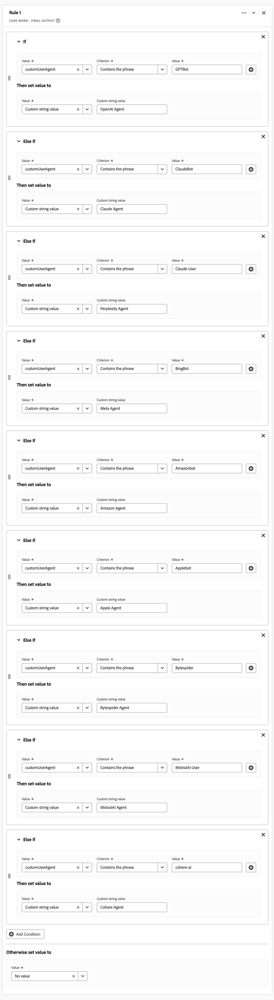
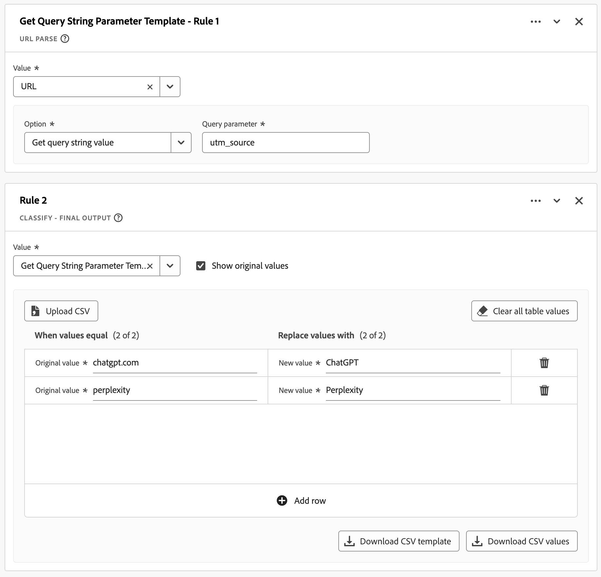

# 報告 LLM 和 AI 產生的流量

本使用案例文章探討如何使用Customer Journey Analytics衍生欄位功能作為報告LLM （大型語言模型）和AI產生流量的基礎。

>[!NOTE]
>
>[偵測方法](#detection-methods)、[偵測簽章](#detection-signatures)及[實作策略](#implementation)的有效性取決於您的特定資料收集方法、Experience Platform資料集涵蓋範圍及Customer Journey Analytics實作。 結果可能會因您的技術環境、資料控管政策和實作方法而異。 使用Experience Edge時，您需要選擇錄製原始使用者代理字串或收集裝置資訊。
>

## 偵測方法

若要偵測LLM和AI產生的流量，請區分：

* **LLM編目程式**：收集資料，以便進行訓練和擷取增強產生(RAG)。
* **AI代理程式**：充當代表人類執行工作的介面。 AI代理程式偏好透過API互動，這略過網頁分析追蹤方法。 儘管如此，您仍可分析很大一部分透過網站的AI產生流量。

用於識別和監控LLM和AI產生流量的三種常見核心偵測方法如下：

* **使用者代理程式識別**：向伺服器提出要求時，會擷取HTTP使用者代理程式標頭，並根據已知的AI編目程式和代理程式模式進行分析。 此伺服器端方法需要存取HTTP標題，且在資料收集層實作時最有效。
* **反向連結分類**： HTTP反向連結標頭包含連結至目前請求的先前網頁的URL。 此標題會顯示使用者從ChatGPT或Perplexity等網路介面點進您的網站時。
* **查詢引數偵測**： AI服務可以將URL引數（尤其是UTM引數）附加至連結。 這些引數會儲存在URL中，並可透過標準分析實施進行偵測，因此這些URL引數即使在使用者端追蹤案例中也有重要指標。

下表說明偵測方法如何用於不同的LLM和AI互動案例。

| 情境 | 使用者代理識別 | 反向連結分類 | 查詢引數偵測 |
|---|---|---|---|
| **訓練模型** | 實作伺服器端記錄時，可以識別代理程式（`GPTBot`、`ClaudeBot`等）。 | 無法分類。 AI編目程式在訓練期間不會產生反向連結。 | 偵測是不可能的。 AI編目程式在訓練期間不會新增引數。 |
| **代理程式瀏覽** | 伺服器端記錄擷取標頭時，可以識別代理程式(`ChatGPT-User`， `claude-web`)。 | 如果代理程式從具有反向連結保留的AI介面導覽，則可以進行分類。 | 如果AI服務新增追蹤引數，則有時可能進行偵測。 |
| **擷取擴充產生(RAG)以回答查詢** | 可用伺服器端記錄識別代理程式(`OAI-SearchBot`， `PerplexityBot`)。 | 通常無法分類，因為RAG作業通常會略過反向連結機制。 | 除非由AI提供者特別實作，否則很少可能進行偵測。 |
| **使用者點進次數** | 無法識別代理。 AI代理程式會顯示為一般使用者代理程式。 | 當使用者從AI介面按一下連結（[chatgpt.com](https://chatgpt.com)、[claude.ai](https://claude.ai)等等）時，可以進行分類。 | 當AI服務將UTM引數新增到傳出連結時，可能會進行偵測。 |
| **流量可見性條件** | 需要伺服器端記錄與Customer Journey Analytics或伺服器端標籤的整合才能識別代理程式。 | 分類取決於AI平台反向連結原則和正確的HTTP標題傳輸。 | 偵測需要透過重新導向和適當的URL引數收集來保留引數。 |

### 挑戰

LLM和AI代理程式會在與數位屬性互動時，展示複雜且不斷進化的行為。 這些技術在不同平台和版本間運作不一致。 這種不一致性給資料專業人員帶來了獨特的挑戰。 行為模式差異極大，且取決於使用的特定AI平台、版本和互動模式。 由於營運上的多樣性，使得在標準分析架構中追蹤及分類LLM和AI產生的流量變得複雜。 這些互動的複雜性質，加上其快速的演變，需要細緻的偵測和分類方法來維持資料的完整性：

* **部分資料集合**：某些較新的AI代理程式執行有限的JavaScript，導致使用者端實作的分析資料不完整。 因此，某些互動會被追蹤，而其他互動則會被遺漏。
* **工作階段資料不一致**： AI代理程式可能會在不同工作階段或頁面型別間執行JavaScript。 這種執行差異會在使用者端實施的Customer Journey Analytics中建立分散的使用者歷程。
* **偵測挑戰**：使用部分追蹤時，偵測會變得不可靠，因為某些接觸點可能會對分析隱藏。

## 偵測簽章

自2025年8月起，每種偵測方法都能識別下列特定訊號。

### 使用者代理識別

<table>
<thead>
<tr>
<th>編目程式</th>
<th>使用者代理字串</th>
<th>用途/行為</th>
</tr>
</thead>
<tbody>
<tr>
<td><strong>GPTBot</strong></td>
<td><code>Mozilla/5.0 AppleWebKit/537.36 (KHTML, like Gecko); compatible; GPTBot/1.1; +<a href="https://openai.com/gptbot" target="_blank" rel="noopener nofollow noreferrer">https://openai.com/gptbot</a></code></td>
<td><a href="https://platform.openai.com/docs/bots/" target="_blank" rel="noopener nofollow noreferrer">OpenAI用於訓練ChatGPT和語言模型的主要網頁編目程式</a></td>
</tr>
<tr>
<td><strong>ChatGPT — 使用者</strong></td>
<td><code>Mozilla/5.0 AppleWebKit/537.36 (KHTML, like Gecko); compatible; ChatGPT-User/1.0; +<a href="https://openai.com/bot" target="_blank" rel="noopener nofollow noreferrer">https://openai.com/bot</a></code></td>
<td><a href="https://platform.openai.com/docs/bots/" target="_blank" rel="noopener nofollow noreferrer">當ChatGPT代表使用者瀏覽網站時使用（舊版）</a></td>
</tr>
<tr>
<td><strong>ChatGPT-User v2</strong></td>
<td><code>Mozilla/5.0 AppleWebKit/537.36 (KHTML, like Gecko); compatible; ChatGPT-User/2.0; +<a href="https://openai.com/bot" target="_blank" rel="noopener nofollow noreferrer">https://openai.com/bot</a></code></td>
<td><a href="https://platform.openai.com/docs/bots/" target="_blank" rel="noopener nofollow noreferrer">ChatGPT的更新版本，適用於隨選擷取和回應式查閱</a></td>
</tr>
<tr>
<td><strong>OAI-SearchBot</strong></td>
<td><code>Mozilla/5.0 AppleWebKit/537.36 (KHTML, like Gecko); compatible; OAI-SearchBot/1.0; +<a href="https://openai.com/searchbot" target="_blank" rel="noopener nofollow noreferrer">https://openai.com/searchbot</a></code></td>
<td><a href="https://platform.openai.com/docs/bots/" target="_blank" rel="noopener nofollow noreferrer">ChatGPT的搜尋中心編目程式，用於探索內容</a></td>
</tr>
<tr>
<td><strong>克勞德機器人</strong></td>
<td><code>Mozilla/5.0 AppleWebKit/537.36 (KHTML, like Gecko); compatible; ClaudeBot/1.0; +claudebot@anthropic.com</code></td>
<td><a href="https://support.claude.com/en/articles/8896518-does-anthropic-crawl-data-from-the-web-and-how-can-site-owners-block-the-crawler" target="_blank" rel="noopener nofollow noreferrer">用於訓練和更新Claude AI助理的Anthropic爬行器</a></td>
</tr>
<tr>
<td><strong>克勞德 — 使用者</strong></td>
<td><code>Mozilla/5.0 AppleWebKit/537.36 (KHTML, like Gecko; compatible; Claude-User/1.0; +Claude-User@anthropic.com)</code></td>
<td><a href="https://support.claude.com/en/articles/8896518-does-anthropic-crawl-data-from-the-web-and-how-can-site-owners-block-the-crawler" target="_blank" rel="noopener nofollow noreferrer">支援Claude AI使用者，當個人向Claude提問時，它可以使用Cl存取網站……</a></td>
</tr>
<tr>
<td><strong>克勞德 — 搜尋機器人</strong></td>
<td><code>Mozilla/5.0 AppleWebKit/537.36 (KHTML, like Gecko; compatible; Claude-SearchBot/1.0; +Claude-SearchBot@anthropic.com)</code></td>
<td><a href="https://support.claude.com/en/articles/8896518-does-anthropic-crawl-data-from-the-web-and-how-can-site-owners-block-the-crawler" target="_blank" rel="noopener nofollow noreferrer">透過分析線上內容來瀏覽網頁以改善Claude AI使用者的搜尋結果品質……</a></td>
</tr>
<tr>
<td><strong>PerplexityBot</strong></td>
<td><code>Mozilla/5.0 AppleWebKit/537.36 (KHTML, like Gecko; compatible; PerplexityBot/1.0; +<a href="https://www.perplexity.ai/perplexitybot" target="_blank" rel="noopener nofollow noreferrer">https://perplexity.ai/perplexitybot</a>)</code></td>
<td><a href="https://docs.perplexity.ai/guides/bots" target="_blank" rel="noopener nofollow noreferrer">Perplexity.ai用於即時網頁資料索引的編目程式</a></td>
</tr>
<tr>
<td><strong>Perplexity-User</strong></td>
<td><code>Mozilla/5.0 AppleWebKit/537.36 (KHTML, like Gecko; compatible; Perplexity-User/1.0; +<a href="https://www.perplexity.ai/useragent" target="_blank" rel="noopener nofollow noreferrer">https://www.perplexity.ai/useragent</a>)</code></td>
<td><a href="https://docs.perplexity.ai/guides/bots" target="_blank" rel="noopener nofollow noreferrer">當使用者按一下「困惑」引文時載入頁面（繞過robots.txt）</a></td>
</tr>
<tr>
<td><strong>Google擴充功能</strong></td>
<td><code>Mozilla/5.0 (compatible; Google-Extended/1.0; +<a href="https://support.google.com/webmasters/answer/182072" target="_blank" rel="noopener nofollow noreferrer">http://www.google.com/bot.html</a>)</code></td>
<td><a href="https://blog.google/technology/ai/an-update-on-web-publisher-controls/" target="_blank" rel="noopener nofollow noreferrer">Google的Gemini人工智慧主題編目程式與標準GoogleBot不同</a></td>
</tr>
<tr>
<td><strong>BingBot</strong></td>
<td><code>Mozilla/5.0 (compatible; BingBot/1.0; +<a href="http://www.bing.com/bot.html" target="_blank" rel="noopener nofollow noreferrer">http://www.bing.com/bot.html</a>)</code></td>
<td>Microsoft的編目程式支援Bing搜尋和Bing聊天(Copilot)</td>
</tr>
<tr>
<td><strong>DuckAssistBot</strong></td>
<td><code>Mozilla/5.0 (compatible; DuckAssistBot/1.0; +<a href="https://duckduckgo.com/bot.html" target="_blank" rel="noopener nofollow noreferrer">http://www.duckduckgo.com/bot.html</a>)</code></td>
<td><a href="https://duckduckgo.com/duckduckgo-help-pages/results/duckassistbot" target="_blank" rel="noopener nofollow noreferrer">清除DuckAssist的內容，DuckDuckGo的私人AI回應功能</a></td>
</tr>
<tr>
<td><strong>YouBot</strong></td>
<td><code>Mozilla/5.0 (compatible; YouBot (+<a href="http://www.you.com" target="_blank" rel="noopener nofollow noreferrer">http://www.you.com</a>))</code></td>
<td>You.com的AI搜尋和瀏覽器助理背後的編目程式</td>
</tr>
<tr>
<td><strong>meta-externalagent</strong></td>
<td><code>Mozilla/5.0 (compatible; meta-externalagent/1.1 (+<a href="https://developers.facebook.com/docs/sharing/webmasters/web-crawlers" target="_blank" rel="noopener nofollow noreferrer">https://developers.facebook.com/docs/sharing/webmasters/crawler</a>))</code></td>
<td><a href="https://developers.facebook.com/docs/sharing/webmasters/web-crawlers#identify-2" target="_blank" rel="noopener nofollow noreferrer">用於收集資料以訓練或微調LLM的Meta機器人</a></td>
</tr>
<tr>
<td><strong>Amazonbot</strong></td>
<td><code>Mozilla/5.0 (Macintosh; Intel Mac OS X 10_10_1) AppleWebKit/600.2.5 (KHTML, like Gecko) Version/8.0.2 Safari/600.2.5 (Amazonbot/0.1; +<a href="https://developer.amazon.com/amazonbot" target="_blank" rel="noopener nofollow noreferrer">https://developer.amazon.com/support/amazonbot</a>)</code></td>
<td><a href="https://developer.amazon.com/amazonbot" target="_blank" rel="noopener nofollow noreferrer">Amazon的搜尋和AI應用程式編目程式</a></td>
</tr>
<tr>
<td><strong>Applebot</strong></td>
<td><code>Mozilla/5.0 (Macintosh; Intel Mac OS X 10_15_5) AppleWebKit/605.1.15 (KHTML, like Gecko) Version/13.1.1 Safari/605.1.15 (Applebot/0.1; +<a href="https://support.apple.com/kb/HT6619" target="_blank" rel="noopener nofollow noreferrer">http://www.apple.com/go/applebot</a>)</code></td>
<td><a href="https://support.apple.com/en-us/119829" target="_blank" rel="noopener nofollow noreferrer">Apple的聚焦、Siri和Safari編目程式</a></td>
</tr>
<tr>
<td><strong>Applebot-Extended</strong></td>
<td><code>Mozilla/5.0 (compatible; Applebot-Extended/1.0; +<a href="https://www.apple.com/bot.html" target="_blank" rel="noopener nofollow noreferrer">http://www.apple.com/bot.html</a>)</code></td>
<td><a href="https://support.apple.com/en-us/119829" target="_blank" rel="noopener nofollow noreferrer">Apple針對未來AI模型（選擇加入）以AI為中心的編目程式</a></td>
</tr>
<tr>
<td><strong>Bytespider</strong></td>
<td><code>Mozilla/5.0 (compatible; Bytespider/1.0; +<a href="https://www.bytedance.com/bot.html" target="_blank" rel="noopener nofollow noreferrer">http://www.bytedance.com/bot.html</a>)</code></td>
<td>ByteDance的AI資料收集器，適用於TikTok和其他服務</td>
</tr>
<tr>
<td><strong>MistralAI — 使用者</strong></td>
<td><code>Mozilla/5.0 (compatible; MistralAI-User/1.0; +<a href="https://mistral.ai/bot" target="_blank" rel="noopener nofollow noreferrer">https://mistral.ai/bot</a>)</code></td>
<td><a href="https://docs.mistral.ai/robots/" target="_blank" rel="noopener nofollow noreferrer">Mistral的「Le Chat」助理即時引文擷取器</a></td>
</tr>
<tr>
<td><strong>cohere-ai</strong></td>
<td><code>Mozilla/5.0 (compatible; cohere-ai/1.0; +<a href="http://www.cohere.ai/bot.html" target="_blank" rel="noopener nofollow noreferrer">http://www.cohere.ai/bot.html</a>)</code></td>
<td>收集Cohere語言模型的文字資料</td>
</tr>
</tbody>
</table>

### 反向連結分類

<table>
<thead>
<tr>
<th><strong>來源</strong></th>
<th><strong>反向連結</strong></th>
<th><strong>流量類型</strong></th>
</tr>
</thead>
<tbody>
<tr>
<td>ChatGPT</td>
<td>chatgpt.com</td>
<td>直接來自ChatGPT介面的流量</td>
</tr>
<tr>
<td>克勞德</td>
<td>Claude.ai</td>
<td>來自Anthropic的Claude介面的流量</td>
</tr>
<tr>
<td>Google Gemini</td>
<td>gemini.google.com</td>
<td>來自Google AI助理的流量</td>
</tr>
<tr>
<td>Microsoft Copilot</td>
<td>copilot.microsoft.com</td>
<td>來自Microsoft AI助理的流量</td>
</tr>
<tr>
<td>Microsoft Copilot</td>
<td>m365.cloud.microsoft</td>
<td>來自Microsoft AI助理(Microsoft 365雲端服務)的流量</td>
</tr>
<tr >
<td>Perplexity AI</td>
<td>perplexity.ai</td>
<td>來自具有引文之AI搜尋的流量</td>
</tr>
<tr>
<td>META AI</td>
<td>meta.ai</td>
<td>來自Meta AI助理的流量</td>
</tr>
</tbody>
</table>

### 查詢引數偵測

<table>
<thead>
<tr>
<th><strong>LLM服務</strong></th>
<th>範例URL</th>
<th><strong>查詢參數</strong></th>
<th><strong>範例值</strong></th>
</tr>
</thead>
<tbody>
<tr>
<td>ChatGPT</td>
<td ><a href="https://www.yoursite.com/product?utm_source=chatgpt.com" target="_blank" rel="noopener nofollow noreferrer">https://www.yoursite.com/product?utm_source=chatgpt.com</a></td>
<td>utm_source</td>
<td>chatgpt.com</td>
</tr>
<tr>
<td>複雜性</td>
<td><a href="https://www.yoursite.com/article?utm_source=perplexity" target="_blank" rel="noopener nofollow noreferrer">https://www.yoursite.com/article?utm_source=perplexity</a></td>
<td>utm_source</td>
<td>複雜性</td>
</tr>
</tbody>
</table>

## 實作

您可以透過[衍生欄位](/help/connections/overview.md)、[區段](/help/data-views/data-views.md)和[工作區專案](/help/analysis-workspace/home.md)的特定設定和組態，在一般的Customer Journey Analytics設定（[連線](#derived-fields)、[資料檢視](#segments)和[工作區專案](#workspace-project)）中報告LLM和AI產生的流量。

### 衍生欄位

若要設定偵測方法和偵測訊號，請使用衍生欄位做為基礎。 例如，定義[使用者代理識別](#user-agent-identification)、[查詢引數偵測](#query-parameter-detection)和[反向連結分類](#referrer-classification)的衍生欄位。

#### LLM/AI使用者代理程式識別

使用[Case When](/help/data-views/derived-fields/derived-fields.md#case-when)衍生欄位函式來定義識別LLM/AI使用者代理程式的衍生欄位。

{zoomable="yes"}

#### LLM/AI查詢引數偵測

使用[URL剖析](/help/data-views/derived-fields/derived-fields.md#url-parse)和[分類](/help/data-views/derived-fields/derived-fields.md#classify)衍生欄位函式來定義可偵測查詢引數的衍生欄位。

{zoomable="yes"}

#### LLM/AI反向連結分類

使用[URL剖析](/help/data-views/derived-fields/derived-fields.md#url-parse)和[分類](/help/data-views/derived-fields/derived-fields.md#classify)衍生欄位函式來定義分類反向連結的衍生欄位。

{zoomable="yes"}

### 區段

設定專用區段，協助您識別與LLM和AI產生流量相關的事件、工作階段或人員。 例如，使用您先前建立的衍生欄位來定義區段，以識別LLM和AI產生的流量。

{zoomable="yes"}

### Workspace專案

使用衍生的欄位和區段來報告和分析LLM和AI產生的流量。 例如，請參閱底下有註解的專案。

{zoomable="yes"}

>[!MORELIKETHIS]
>
>此使用案例文章是以部落格[在Adobe Customer Journey Analytics中追蹤和分析LLM和AI產生的流量](https://experienceleaguecommunities.adobe.com/t5/adobe-analytics-blogs/tracking-and-analyzing-llm-and-ai-generated-traffic-in-adobe/ba-p/771967)為基礎。
>
>
