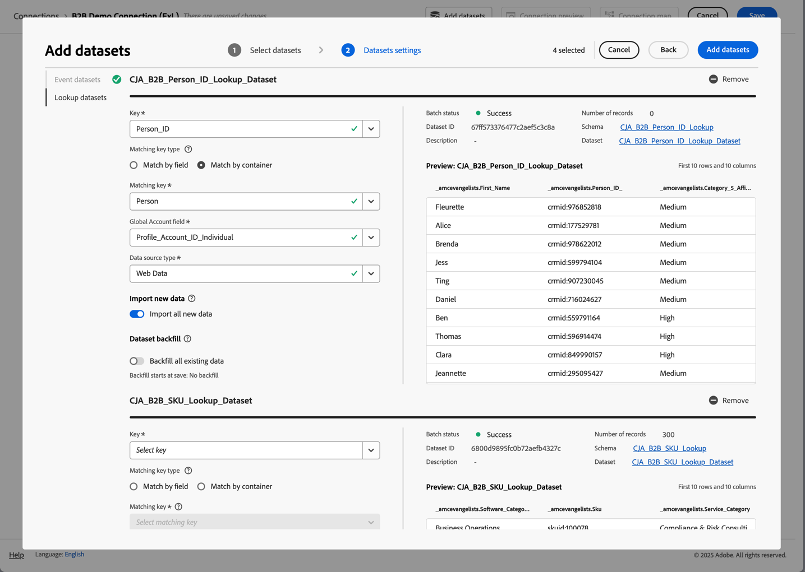

# B2B edition使用案例的設定

本文介紹Customer Journey Analytics B2B edition的典型設定，以支援下列使用案例：

* [將帳戶行銷最佳化](optimize-account-marketing.md)
* [拓展重點客戶](grow-key-accounts.md)
* [建置產品價值](build-product-value.md)

>[!NOTE]
>
>這些使用案例中使用的示範資料和熒幕擷取畫面僅供說明用途，無法反映真實世界的資料。

## 解決方案設計參考資料

設定Customer Journey Analytics B2B edition之前，請確定您已備妥適當的解決方案設計參考，以記錄您收集的每個欄位。

範例解決方案設計參考看起來可能像這樣：

+++ 事件維度

| Dimension名稱 |
|---|
| 帳戶 ID |
| 帳戶名稱 |
| 購買群組 ID |
| 呼叫中心 |
| 客服中心代表ID |
| 呼叫ID |
| 行銷活動追蹤代碼 |
| 內容 ID |
| 內容類型 |
| 資料來源 |
| 裝置類型 |
| 事件詳細資料 |
| 活動名稱 |
| 漏斗 |
| 互動管道 |
| 銷售機會ID |
| 行銷管道 |
| 行銷事件ID |
| 行銷事件型別 |
| 機會 ID |
| 頁面 |
| 頁面詳細資訊 |
| 反向連結網域 |
| 銷售代表ID |
| 銷售階段名稱 |
| 銷售階段編號 |
| 網站區段 |
| SKU |
| 附屬帳戶 ID |
| 調查ID |
| 調查滿意度分數 |
| 調查型別 |
| 使用者 ID |

+++

+++ 事件量度

| 量度名稱 | 事件型別 |
|---|---|
| 帳戶建立：完成 | 計數器 |
| 帳戶建立：開始 | 計數器 |
| 通話成本 | 貨幣 |
| 呼叫長度 | 計數器 |
| 通話滿意度分數 | 數值 |
| 通話問卷已完成 | 計數器 |
| 呼叫 | 計數器 |
| Closed-Lost | 計數器 |
| 非絕對獲勝 | 計數器 |
| 內容檢視 | 計數器 |
| 交易大小貨幣顯示點進次數 | 計數器 |
| 顯示曝光次數 | 計數器 |
| 電子郵件已退回 | 計數器 |
| 電子郵件已點按 | 計數器 |
| 電子郵件已傳遞 | 計數器 |
| 電子郵件已開啟 | 計數器 |
| 已傳送電子郵件 | 計數器 |
| 活動出席 | 計數器 |
| 活動註冊：完成 | 計數器 |
| 事件註冊：步驟1 | 計數器 |
| 事件註冊：步驟2 | 計數器 |
| 事件註冊：步驟3 | 計數器 |
| 全球滿意度分數數值傳入呼叫 | 計數器 |
| 潛在客戶表單：完成 | 計數器 |
| 潛在客戶表單：步驟1 | 計數器 |
| 銷售機會表單：步驟2 | 計數器 |
| 產生的潛在客戶 | 計數器 |
| 潛在客戶資格 | 計數器 |
| 會議 | 計數器 |
| MQL已取消資格 | 計數器 |
| MQL合格 | 計數器 |
| 需求評估 | 計數器 |
| 交涉 | 計數器 |
| 異議處理 | 計數器 |
| 機會 | 計數器 |
| 機會建立 | 計數器 |
| 訂購 | 計數器 |
| 傳出呼叫 | 計數器 |
| 售後追蹤 | 計數器 |
| 提案提交 | 計數器 |
| 收入已結 — 已失 | 貨幣 |
| 收入非贏不賠 | 貨幣 |
| 銷售聯絡電話 | 計數器 |
| 銷售階段已開始 | 計數器 |
| 簡訊點進次數 | 計數器 |
| 簡訊已傳送 | 計數器 |
| 社交點進次數 | 計數器 |
| 社交曝光次數 | 計數器 |
| 解決方案簡報 | 計數器 |
| SQL不合格 | 計數器 |
| SQL合格 | 計數器 |
| 單位（不公開） | 計數器 |
| VoC調查滿意度分數 | 數值 |
| VoC調查已完成 | 計數器 |

+++

+++ 個人記錄

| 資料檢視欄位名稱 | 欄位類型 |
|---|---|
| 年齡 | 量度 |
| 年齡群組 | 維度 |
| 類別1相似性層級 | 維度 |
| 類別1相關性分數 | 量度 |
| 類別2相似性層級 | 維度 |
| 類別2相關性分數 | 量度 |
| 類別3相似性層級 | 維度 |
| 類別3相關性分數 | 量度 |
| 類別4相似性層級 | 維度 |
| 類別4相關性分數 | 量度 |
| 類別5相關性層級 | 維度 |
| 類別5相關性分數 | 量度 |
| 同意Advertising | 維度 |
| 同意所有通訊 | 維度 |
| 同意直接郵件 | 維度 |
| 同意電子郵件 | 維度 |
| 同意的行動電話 | 維度 |
| 同意Personalization | 維度 |
| 同意共用資料 | 維度 |
| 同意簡訊 | 維度 |
| 電子郵件 | 維度 |
| 「名字」 | 維度 |
| 性別 | 維度 |
| 個別城市 | 維度 |
| 個別CLTV層級 | 維度 |
| 個別CLTV分數 | 量度 |
| 個別國家/地區 | 維度 |
| 個人電話 | 維度 |
| 個人郵遞區號 | 維度 |
| 個人購買傾向等級 | 維度 |
| 個人購買傾向分數 | 量度 |
| 個人流失層級的傾向 | 維度 |
| 個人流失分數的傾向 | 量度 |
| 個人升級層級的傾向 | 維度 |
| 個人升級評分的傾向 | 量度 |
| 個別狀態 | 維度 |
| 個別街道地址 | 維度 |
| 職稱 | 維度 |
| 「姓氏」 | 維度 |
| 網路推廣者分數 | 量度 |
| 網路推廣者狀態 | 維度 |
| 角色型別 | 維度 |

+++

+++ 帳戶記錄

| 資料檢視欄位名稱 | 欄位類型 |
|---|---|
| 年收入 | 量度 |
| 公司城市 | 維度 |
| 公司CLTV層級 | 維度 |
| 公司CLTV分數 | 量度 |
| 公司國家/地區 | 維度 |
| 公司名稱 | 維度 |
| 公司電話 | 維度 |
| 公司郵遞區號 | 維度 |
| 公司購買傾向等級 | 維度 |
| 公司購買傾向分數 | 量度 |
| 公司流失層級的傾向 | 維度 |
| 公司流失分數的傾向 | 量度 |
| 公司升級層級的傾向 | 維度 |
| 公司升級評分的傾向 | 量度 |
| 公司規模 | 維度 |
| 公司狀態 | 維度 |
| 公司街道地址 | 維度 |
| 產業 | 維度 |
| 員工人數 | 量度 |
| 合作夥伴對象 — 硬體購物者 | 維度 |
| 合作夥伴對象 — 快速增長 | 維度 |
| 合作夥伴對象 — 所需服務 | 維度 |
| 合作夥伴對象 — 軟體購物者 | 維度 |
| 收入範圍 | 維度 |
| 網站 | 維度 |

+++

+++ SKU記錄

| 資料檢視欄位名稱 | 欄位類型 |
|---|---|
| 硬體產品類別 | 維度 |
| 硬體產品名稱 | 維度 |
| 服務類別 | 維度 |
| 服務名稱 | 維度 |
| 軟體產品類別 | 維度 |
| 軟體產品名稱 | 維度 |

+++

## 結構描述和資料集

支援解決方案設計參考的資料會使用下列結構描述和資料集來建構。

### 事件資料

事件維度和量度可透過以時間序列（事件）為基礎的結構描述以及一或多個包含事件資料的資料集來支援。

<!--For example: the Account ID field is mapped to **[!UICONTROL Account ID]**. See below for a preview of the data typically available in such a dataset.

-->

### 個人資料

透過以記錄（設定檔）為基礎的結構描述和一個或多個包含人員資料的資料集支援人員記錄。 請參閱下方的，以取得這類資料集中通常可用的人員資料範例（根據範例解決方案設計參考）。

### 帳戶資料

帳戶記錄可透過以記錄（查詢）記錄為基礎的結構描述以及一或多個包含帳戶資料的資料集來支援。 請參閱下方的，以取得這類資料集中通常可用的帳戶資料範例（根據範例解決方案設計參考）。

### SKU資料

SKU記錄可透過以記錄（查詢）為基礎的結構描述和一個或多個包含SKU資料的資料集來支援。 請參閱下方的SKU資料範例（根據範例解決方案設計參考），通常可在這類資料集中使用。

## 連線

在Customer Journey Analytics中定義以帳戶為基礎的連線，以從事件、帳戶、人員和SKU資料集中擷取並聯結記錄。

1. [在Customer Journey Analytics中建立新連線](/help/connections/create-connection.md)。
1. 輸入連線的描述性名稱和說明。
1. 選取 **[!UICONTROL 帳戶]**&#x200B;作為&#x200B;**[!UICONTROL 主要ID]**。
1. 選取所有&#x200B;**[!UICONTROL 選用容器]**。
1. 選取您偏好的沙箱，並估計每日事件的平均數量。

   

1. 選取&#x200B;**[!UICONTROL 新增資料集]**&#x200B;並新增包含事件、帳戶、人員和SKU資料的B2B資料集。

   

1. 選取&#x200B;**[!UICONTROL 下一步]**，為每個選取的資料集設定設定。
1. 對於事件資料集，請確定您選取與&#x200B;**[!UICONTROL 帳戶ID]**、**[!UICONTROL 全域帳戶ID]**、**[!UICONTROL 商機ID]**、**[!UICONTROL 購買群組ID]**&#x200B;和&#x200B;**[!UICONTROL 人員ID]**&#x200B;的身分相對應的適當欄位。

   

1. 向下捲動以設定帳戶記錄資料集。 請確定您選取正確的識別碼(**[!UICONTROL Account_ID]**)，以符合&#x200B;**[!UICONTROL 全域帳戶]**&#x200B;容器的帳戶。 選取正確的識別碼(**[!UICONTROL Account_ID]**)做為&#x200B;**[!UICONTROL 全域帳戶欄位]**。

   

1. 向下捲動以設定人員記錄資料集。 請確定您選取正確的金鑰(**[!UICONTROL Person_ID]**)，以符合&#x200B;**[!UICONTROL Person]**&#x200B;容器的人員。 選取適當的身分識別(**[!UICONTROL Profile_Account_ID_Individual]**)以符合&#x200B;**[!UICONTROL 全域帳戶]**&#x200B;欄位。

   

1. 向下捲動以設定SKU記錄資料集。 請確定您選取正確的金鑰(**[!UICONTROL Sku]**)。 選取&#x200B;**[!UICONTROL 依欄位]**&#x200B;比對，因為此資料沒有設定或可用的容器。 選取事件資料集(**[!UICONTROL SKU （事件資料集）]**)中的SKU欄位做為相符索引鍵。

   

1. 選取&#x200B;**[!UICONTROL 新增資料集]**&#x200B;以儲存資料集及其設定的設定。

1. 選取&#x200B;**[!UICONTROL 儲存]**&#x200B;以儲存連線。

## 資料視圖

在Customer Journey Analytics中擷取資料後，您想要建立資料檢視，其中包含您在解決方案設計參考中定義的所有元件。

### 設定

1. [在Customer Journey Analytics中建立新的資料檢視](/help/data-views/data-views.md)。
1. 選取您先前建立的連線(例如： **[!UICONTROL B2B示範連線(ExL)]**)。
1. 提供資料檢視的名稱。 例如： `B2B Demo Data view (ExL)`，並選擇性地輸入說明。
1. 選擇性地重新命名容器。 或是使用預設的容器名稱。

   
1. 選取&#x200B;**[!UICONTROL 「儲存並繼續」]**。

### 元件

依預設，所有[標準元件](/help/data-views/component-reference.md)都已包含在您的資料檢視中。 這些標準元件包括「帳戶」、「購買群組」、「全域帳戶」和「商機」的B2B特定度量。

1. 將您在[解決方案設計參考](#solution-design-reference)中定義的所有事件維度新增至資料檢視中的維度元件。 例如，欄位&#x200B;**[!UICONTROL 事件名稱]**，代表&#x200B;**[!UICONTROL 事件名稱]**&#x200B;維度。 請確定您透過可用的[元件設定](/help/data-views/component-settings/overview.md)來設定維度元件。

   

1. 將您在[解決方案設計參考](#solution-design-reference)中定義的所有事件量度，新增至資料檢視中的量度元件。 例如，欄位&#x200B;**[!UICONTROL SQL Qualified]**，代表&#x200B;**[!UICONTROL SQL Qualified]**&#x200B;量度。 請確定您透過可用的[元件設定](/help/data-views/component-settings/overview.md)來設定維度元件。

   

1. 將您在[解決方案設計參考](#solution-design-reference)中定義的所有帳戶維度新增到資料檢視中的維度元件。 例如，欄位&#x200B;**[!UICONTROL 產業]**，代表&#x200B;**[!UICONTROL 產業]**&#x200B;維度。 請確定您透過可用的[元件設定](/help/data-views/component-settings/overview.md)來設定維度元件。

   

1. 將您在[解決方案設計參考](#solution-design-reference)中定義的所有帳戶量度新增至資料檢視中的量度元件。 例如，欄位&#x200B;**[!UICONTROL Number_of_Employees]**，代表&#x200B;**[!UICONTROL Number_of_Employees]**&#x200B;量度。 請確定您透過可用的[元件設定](/help/data-views/component-settings/overview.md)來設定維度元件。

   

1. 將您在[解決方案設計參考](#solution-design-reference)中定義的所有人員維度新增到資料檢視中的維度元件。 例如，欄位&#x200B;**[!UICONTROL Category_1_Affinity_Level]**，代表&#x200B;**[!UICONTROL Category_1_Affinity_Level]**&#x200B;維度。 請確定您透過可用的[元件設定](/help/data-views/component-settings/overview.md)來設定維度元件。

   

1. 將您在[解決方案設計參考](#solution-design-reference)中定義的所有人員量度，新增至資料檢視中的量度元件。 例如，欄位&#x200B;**[!UICONTROL Category_1_Affinity_Score]**，代表&#x200B;**[!UICONTROL Category_1_Affinity_Score]**&#x200B;量度。 請確定您透過可用的[元件設定](/help/data-views/component-settings/overview.md)來設定維度元件。

   

1. 將您在[解決方案設計參考](#solution-design-reference)中定義的所有SKU維度新增至資料檢視中的維度元件。 例如，欄位&#x200B;**[!UICONTROL 服務類別]**，代表&#x200B;**[!UICONTROL 服務類別]**&#x200B;維度。 請確定您透過可用的[元件設定](/help/data-views/component-settings/overview.md)來設定維度元件。

   

1. 選取&#x200B;**[!UICONTROL 儲存並繼續]**。

### 設定

1. 您可以選擇定義資料檢視的特定[設定](/help/data-views/create-dataview.md#settings-1)：

   * 將區段新增至資料檢視。
   * 使用（計算）量度來定義工作階段設定。

1. 選取&#x200B;**[!UICONTROL 「儲存並繼續」]**。

## 區段

您可以準備一個或多個可在Workspace專案中使用的B2B特定容器型區段。

例如：

* 具有事件登入節段的科目。

  

* 具有「購買群組」與階段5商機區段的美國客戶。

  

## 其他

您可以選擇為使用案例定義其他元件，例如[計算量度](/help/components/calc-metrics/calc-metr-overview.md)、[日期範圍](/help/components/date-ranges/overview.md)或[警報](/help/components/c-intelligent-alerts/intelligent-alerts.md)。
