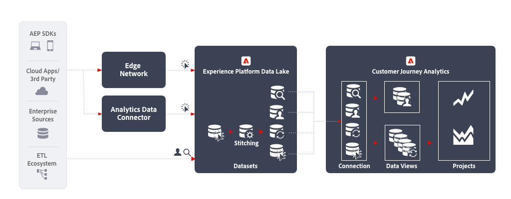

# 跨管道分析 {#cross-channel}

<!-- markdownlint-disable MD034 -->

>[!CONTEXTUALHELP]
>id="cja-upgrade-additional-datasets"
>title="新增其他資料集至您的連線"
>abstract="在 Adobe Experience Platform 中新增資料至資料集後，即可將該資料集新增至 Customer Journey Analytics 的連線。 從其他管道新增資料時，請確保相關資料符合您的組織使用的結構描述。  你所新增的每個資料集均需要大量工作，特別是要確保每個事件都有唯一識別碼，並確保整體資料結構符合組織的自訂結構描述。 建立此工作流程需要組織中多個團隊進行長達數個月的協調。"

<!-- markdownlint-enable MD034 -->

跨頻道分析會透過統一各種網路、行動和離線資產的資料，得到各種跨管道客戶行為的單一整合檢視。 例如，您可以使用此整合檢視來分析跨桌面和行動裝置的客戶互動，以了解客戶行為並提取洞察以最佳化數位客戶體驗。 您還可以分析跨管道的客戶互動，包括數位和離線管道，例如支援互動和店內購買，以更好地了解和最佳化客戶旅程。

## 實施步驟

1. 為要擷取的資料[建立結構描述](https://experienceleague.adobe.com/zh-hant/docs/experience-platform/xdm/tutorials/create-schema-ui.html?lang=zh-Hant)。
1. 為要擷取的資料[建立資料集](https://experienceleague.adobe.com/docs/platform-learn/tutorials/data-ingestion/create-datasets-and-ingest-data.html?lang=zh-Hant)。
1. [將資料攝取至 Experience Platform](https://experienceleague.adobe.com/docs/platform-learn/tutorials/data-ingestion/understanding-data-ingestion.html?lang=zh-Hant)：
   1. 透過 Edge Network 或 Analytics 來源連接器從網站或行動應用程式取得以事件為主的資料 。
   2. 設定檔資料  (例如來自 CRM 系統、呼叫中心應用程式、忠誠度應用程式)。
   3. 查詢資料  (例如來自產品資訊系統的產品名稱、類別)。

1. 所有資料集使用通用的命名空間 ID。 使用[拼接](../../stitching/overview.md)來增加任何以事件為主的資料集  關於在每一資料列提供通用 ID。 請注意，Customer Journey Analytics 目前不使用 Experience Platform 設定檔或身分識別服務進行拼接。
1. 執行任何自訂資料準備，以確保跨時間序列資料集的公用鍵被引入 Customer Journey Analytics。
1. 為查閱資料提供一個可以連結到事件資料中欄位的主要 ID。 計為授權中的列。
1. 將設定檔資料的主要 ID 設定為事件資料的主要 ID。
1. [建立連線](../../connections/overview.md)以將相關資料集從 Experience Platform 攝取到 Customer Journey Analytics。
1. 在連線上[建立資料檢視](/help/data-views/create-dataview.md)以選擇要包含在檢視中的特定維度和量度。 歸因和配置設定也在資料檢視中設定。 這些設定是在報告時計算的。
1. [建立專案](/help/analysis-workspace/home.md)以便在 Analysis Workspace 中設定儀表板和報告。

## 考量事項

建立此工作流程時，請務必考慮以下幾點。

* 跨通道分析資料要求每個記錄具有相同的 ID 命名空間。
* 統一不同資料集的聯合過程需要跨資料集的共同主要人員/實體鍵。
* 目前不支援根據次要鍵的聯合。
* 拼接過程允許根據來自共用永久 ID 的記錄的臨時 ID (例如身份驗證 ID) 資訊重新輸入資料列中的身份。這允許將不同的記錄解析為單個拼接 ID，以便在人員層級而不是裝置或 cookie 層級進行分析。
* 同一 XDM 欄位的物件和屬性合併為 Customer Journey Analytics 中的一個維度。 要將來自不同資料集的多個屬性合併到同一個 Customer Journey Analytics 維度中，資料集應該引用相同的 XDM 欄位或結構描述。

