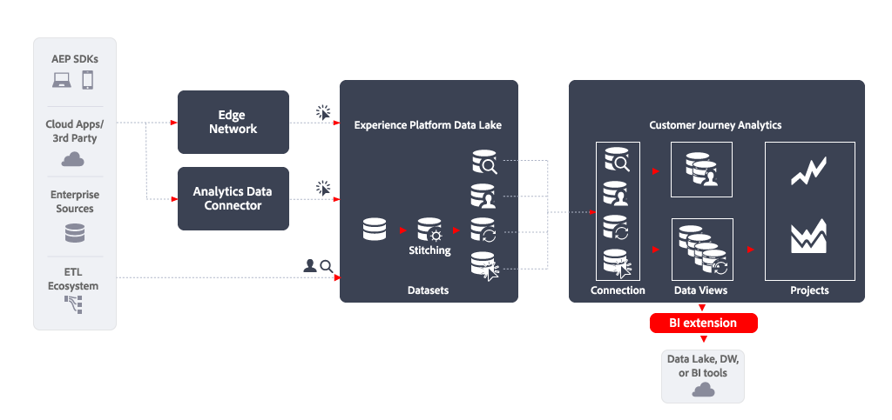

# BI 擴充功能

本文概述如何使用[!DNL Customer Journey Analytics BI extension]實作下列[資料匯出使用案例](overview.md)：

- Data Lake、Data Warehouse或BI工具

## 簡介

使用[!DNL Customer Journey Analytics BI extension]匯出資料可讓您從Customer Journey Analytics資料檢視匯出資料。

## 更多資訊

[!DNL Customer Journey Analytics BI extension] 讓 SQL 可以存取您在 Customer Journey Analytics 中定義的[資料檢視](/help/data-views/data-views.md)。 您的資料工程師和分析師可能更熟悉 Power BI、Tableau 或其他企業情報和視覺化工具 (也稱為 BI 工具)。 他們現在可以根據 Customer Journey Analytics 使用者在建立 Analysis Workspace 專案時所使用的相同資料檢視來建立報告和儀表板。

如需詳細資訊，請參閱有關[BI擴充功能](../../data-views/bi-extension.md)的詳細檔案。
