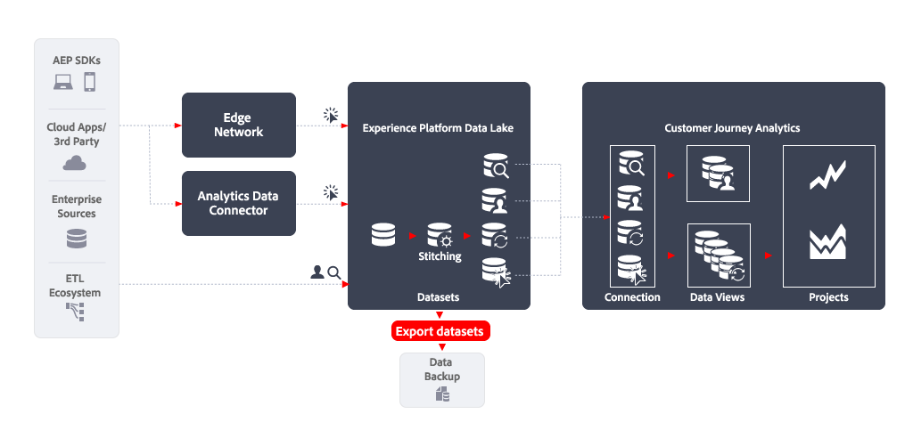

# 匯出資料集

本文概述如何使用[!DNL Customer Journey Analytics Export datasets]實作下列[資料匯出使用案例](overview.md)：

- 資料備份

## 簡介

使用[!DNL Experience Platform Export datasets]匯出資料可讓您將資料從Customer Journey Analytics資料檢視匯出至任何雲端儲存體目的地。

與其他匯出方法不同，匯出資料集沒有固定的列限制。 雲端儲存空間目的地的容量會限制匯出大小，因此當您需要完整的原始資料復本時，這是您偏好的功能。

## 更多資訊

若要從Experience Platform中的資料湖匯出原始資料集，請使用雲端儲存目的地。 在Experience Platform目的地術語中，此匯出稱為「資料集匯出目的地」。 如需概觀，請參閱[將資料集匯出至雲端儲存空間目的地](https://experienceleague.adobe.com/zh-hant/docs/experience-platform/destinations/ui/activate/export-datasets)。

支援以下雲端儲存空間目標：

- [Azure Data Lake Storage Gen2](https://experienceleague.adobe.com/en/docs/experience-platform/destinations/catalog/cloud-storage/adls-gen2)
- [資料登陸區域](https://experienceleague.adobe.com/en/docs/experience-platform/destinations/catalog/cloud-storage/data-landing-zone)
- [Google Cloud Storage](https://experienceleague.adobe.com/en/docs/experience-platform/destinations/catalog/cloud-storage/google-cloud-storage)
- [Amazon S3](https://experienceleague.adobe.com/en/docs/experience-platform/destinations/catalog/cloud-storage/amazon-s3#changelog)
- [Azure Blob](https://experienceleague.adobe.com/en/docs/experience-platform/destinations/catalog/cloud-storage/azure-blob#changelog)
- [SFTP](https://experienceleague.adobe.com/en/docs/experience-platform/destinations/catalog/cloud-storage/sftp#changelog)

### EXPERIENCE PLATFORM UI

您可以透過Experience Platform UI匯出及排程資料集的匯出。 本節將說明相關步驟。

#### 選取目的地

當您決定要匯出資料集的雲端儲存空間目的地時，[請選取目的地](https://experienceleague.adobe.com/en/docs/experience-platform/destinations/ui/activate/export-datasets#select-destination)。 當您尚未設定慣用雲端儲存空間的目的地時，您必須[建立新的目的地連線](https://experienceleague.adobe.com/en/docs/experience-platform/destinations/ui/connect-destination)。

在設定目的地時，您可以定義：

- 檔案型別（JSON或Parquet）、
- 產生的檔案是否應該壓縮，以及
- 是否應該包含資訊清單檔案。

#### 選取資料集

當您選取目的地後，在下一個&#x200B;**[!UICONTROL 選取資料集]**&#x200B;步驟中，您必須從資料集清單中選取您的資料集。 如果您已建立多個排程查詢，且希望資料集傳送至相同的雲端儲存空間目的地，您可以選取對應的資料集。 如需詳細資訊，請參閱[選取您的資料集](https://experienceleague.adobe.com/en/docs/experience-platform/destinations/ui/activate/export-datasets#select-datasets)。

#### 排程資料集匯出

最後，將您的資料集匯出排程為&#x200B;**[!UICONTROL 排程]**&#x200B;步驟的一部分。 在該步驟中，定義排程以及資料集匯出是否為累加式。 如需詳細資訊，請參閱[排程資料集匯出](https://experienceleague.adobe.com/en/docs/experience-platform/destinations/ui/activate/export-datasets#scheduling)。

#### 最後步驟

[檢閱](https://experienceleague.adobe.com/en/docs/experience-platform/destinations/ui/activate/export-datasets#review)您的選取專案，並在正確後，開始將資料集匯出至雲端儲存空間目的地。

首先，您必須[驗證](https://experienceleague.adobe.com/en/docs/experience-platform/destinations/ui/activate/export-datasets#verify)資料匯出成功。 匯出資料集時，Experience Platform會在您目的地的儲存位置中建立一或多個`.json`或`.parquet`檔案。 預期會根據您設定的匯出排程，將新檔案儲存在您的儲存位置。 Experience Platform會在您指定為所選目的地一部分的儲存位置中建立檔案夾結構，並存放匯出的檔案。 每次匯出時都會建立一個新資料夾，其模式如下： `folder-name-you-provided/datasetID/exportTime=YYYYMMDDHHMM`。 預設檔案名稱是隨機產生的，並確保匯出的檔案名稱是唯一的。

### 流程服務API

或者，您可以使用API匯出及排程資料集的匯出。 有關步驟已記錄在[使用流程服務API](https://experienceleague.adobe.com/en/docs/experience-platform/destinations/api/export-datasets)匯出資料集內。

#### 開始使用

若要匯出資料集，請確定您具有[必要的許可權](https://experienceleague.adobe.com/en/docs/experience-platform/destinations/api/export-datasets#permissions)。 同時確認目的地支援匯出資料集。 您可以將資料集傳送至此目的地。 然後，您必須[收集您在API呼叫中使用的必要和選用標頭](https://experienceleague.adobe.com/en/docs/experience-platform/destinations/api/export-datasets#gather-values-headers)的值。 您也需要[識別您要將資料集匯出至的目的地](https://experienceleague.adobe.com/en/docs/experience-platform/destinations/api/export-datasets#gather-connection-spec-flow-spec)的連線規格和流量規格ID。

#### 擷取合格的資料集

您可以[擷取符合匯出條件的資料集清單](https://experienceleague.adobe.com/en/docs/experience-platform/destinations/api/export-datasets#retrieve-list-of-available-datasets)，並使用[`GET /connectionSpecs/{id}/configs`](https://developer.adobe.com/experience-platform-apis/references/destinations#operation/getDatasets) API來驗證您的資料集是否屬於該清單。

#### 建立來源連線

接下來，您必須使用資料集的唯一ID，為要匯出至雲端儲存空間目的地的資料集[建立來源連線](https://experienceleague.adobe.com/en/docs/experience-platform/destinations/api/export-datasets#create-source-connection)。 您使用[`POST /sourceConnections`](https://developer.adobe.com/experience-platform-apis/references/destinations#operation/postSourceConnection) API。

#### 驗證到目的地（建立基礎連線）

若要驗證並安全地儲存雲端儲存空間目的地的認證，請使用[`POST /targetConnection`](https://developer.adobe.com/experience-platform-apis/references/destinations#operation/postTargetConnection) API [建立基礎連線](https://experienceleague.adobe.com/en/docs/experience-platform/destinations/api/export-datasets#create-base-connection)。

#### 提供匯出引數

接下來，您必須使用[`POST /targetConnection`](https://developer.adobe.com/experience-platform-apis/references/destinations#operation/postTargetConnection) API [建立其他目標連線，以儲存資料集的匯出引數](https://experienceleague.adobe.com/en/docs/experience-platform/destinations/api/export-datasets#create-target-connection)。 這些匯出引數包括位置、檔案格式、壓縮等等。

#### 設定資料流

為確保您的資料集已匯出至雲端儲存空間目的地，請[使用[`POST /flows`](https://developer.adobe.com/experience-platform-apis/references/destinations#operation/postFlow) API設定資料流](https://experienceleague.adobe.com/en/docs/experience-platform/destinations/api/export-datasets#create-dataflow)。 在此步驟中，您可以使用`scheduleParams`引數定義匯出排程。

#### 驗證資料流

若要[檢查資料流](https://experienceleague.adobe.com/en/docs/experience-platform/destinations/api/export-datasets#get-dataflow-runs)的成功執行，請使用[`GET /runs`](https://developer.adobe.com/experience-platform-apis/references/destinations#operation/getFlowRuns) API，將資料流ID指定為查詢引數。 此資料流ID是您設定資料流時傳回的識別碼。

[驗證](https://experienceleague.adobe.com/en/docs/experience-platform/destinations/ui/activate/export-datasets#verify)資料匯出成功。 匯出資料集時，Experience Platform會在您目的地的儲存位置中建立一或多個`.json`或`.parquet`檔案。 預期會根據您設定的匯出排程，將新檔案儲存在您的儲存位置。 Experience Platform會在您指定為所選目的地一部分的儲存位置中建立檔案夾結構，並存放匯出的檔案。 每次匯出時都會建立一個新資料夾，其模式如下： `folder-name-you-provided/datasetID/exportTime=YYYYMMDDHHMM`。 預設檔案名稱是隨機產生的，並確保匯出的檔案名稱是唯一的。
