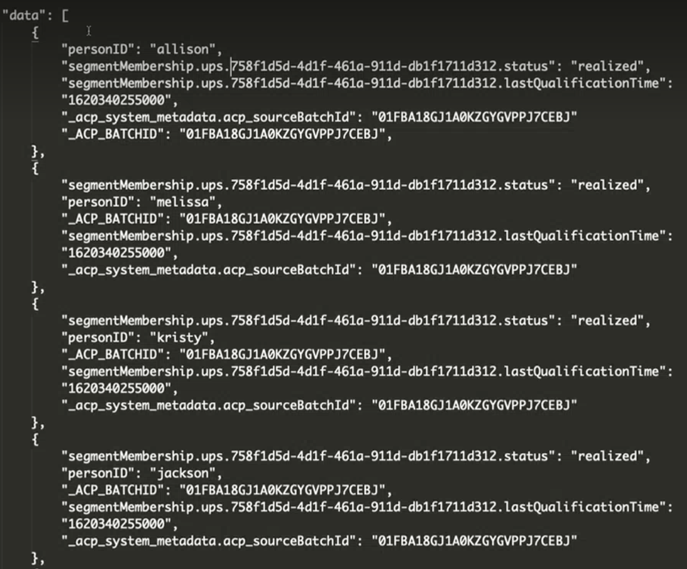

# 將 AEP 對象擷取至 Customer Journey Analytics (CJA)

此使用案例會探索一種將 Adob&#x200B;&#x200B;e Experience Platform (AEP) 對象帶進 CJA 的臨時手動方式。這些對象可能已建立在 AEP 區段產生器、Adobe Audience Manager 或其他工具中，並儲存在即時客戶設定檔 (RTCP) 中。對象由一組設定檔 ID 以及任何適用的屬性/事件/等組成而且我們要將它們帶入 CJA 工作區以進行分析。

## 先決條件

* 存取 Adobe Experience Platform(AEP)，尤其是即時客戶設定檔。
* 存取以建立/管理 AEP 結構描述和資料集。
* 存取 AEP 查詢服務 (以及撰寫 SQL 的能力) 或執行部分輕度轉換的不同工具。
* 存取 Customer Journey Analytics。若要建立/修改 CJA 連線和資料檢視，您需要是 CJA 產品管理員。
* 能夠使用 Adobe APIs (分段，可選用其他)

## 步驟 1：在即時客戶設定檔中選擇對象 {#audience}

Adobe Experience Platform [即時客戶設定檔](https://experienceleague.adobe.com/docs/experience-platform/profile/home.html?lang=tw) (RTCP) 讓您透過合併來自多個管道 (包括線上、離線、CRM 和協力廠商) 的資料，查看每個個別客戶的整體檢視。

您在 RTCP 中可能已經擁有來自不同來源的對象。選擇一個或多個對象以擷取至 CJA。

## 步驟 2：為匯出建立設定檔聯合資料集

為了將對象匯出至可最終新增至 CJA 中連線的資料集，您需要建立其結構描述是設定檔[聯合結構描述](https://experienceleague.adobe.com/docs/experience-platform/profile/union-schemas/union-schema.html?lang=tw#understanding-union-schemas)的資料集。

聯合結構描述由共用相同類別並已為設定檔啟用的多個結構描述組成。聯合結構描述讓您能夠查看共用相同類別的結構描述中包含的所有欄位的合併。即時客戶設定檔使用聯合結構描述，以建立每個個別客戶的整體檢視。

## 步驟 3：透過 API 呼叫將對象匯出至設定檔聯合資料集 {#export}

在您能將對象帶入 CJA 之前，您需要將它匯出至 AEP 資料集。這僅能使用分段 API 完成，而且尤其要使用[匯出作業 API 端點](https://experienceleague.adobe.com/docs/experience-platform/segmentation/api/export-jobs.html?lang=tw)。

您可以使用您選擇的對象 ID 來建立匯出作業，並將結果放入您在步驟 2 中建立的設定檔聯合 AEP 資料集中。儘管您可以為對象匯出各種屬性/事件，但您只需要匯出和您將要利用的 CJA 連線中使用的人員 ID 欄位相符的特定設定檔 ID 欄位 (請參閱下面的步驟 5) 即可。

## 步驟 4：編輯匯出輸出

為了將匯出作業的結果擷取至 CJA，需要將其轉換成單獨的設定檔資料集。 此轉換可透過 [AEP 查詢服務](https://experienceleague.adobe.com/docs/experience-platform/query/home.html?lang=tw)或另一種您選擇的轉換工具來完成。我們只需要設定檔 ID (將和 CJA 中的人員 ID 相符) 和一個或多個對象 ID 即可在 CJA 中製作報表。

然而，標準匯出作業包含更多資料，因此我們需要編輯此輸出以移除無關的資料，並將一些東西四處移動。此外，您需要先建立結構描述/資料集，才能對其新增轉換的資料。

以下是進行任何編輯&#x200B;**之前**，設定檔聯合資料集中的匯出輸出範例。

請注意下列事項：

* 此對象 ID 包含在 `segmentmembership.ups.xxxxxxxx-xxxx-xxxx-xxxx-xxxxxxxxxxxx.status`下。
* 該狀態必須為「已實現」或「已進入」，但未「已退出」。

這是您可送進 CJA 的設定檔資料集格式。

以下是需要出現的資料元素：

* `_aresprodvalidation`字串欄位：參考您的組織 ID。您的將會不一樣。
* `personID`字串欄位：這是設定檔資料集上的標準 XDM 結構描述，以識別人員身分。使用來自匯出的設定檔 ID。
* `audienceMembershipId`字串欄位：來自匯出的對象 ID。注意：可將這個欄位命名為您要的任何名稱 (來自您自己的結構描述)。
* 對對象新增友善的名稱 (`audienceMembershipIdName`)，例如

   

* 新增其他對象中繼資料 (如想要)。

## 步驟 5：將此設定檔資料集新增至 CJA 中的現有連線

您可以[建立新連線](/help/connections/create-connection.md)，但大部分客戶會想要將設定檔資料集新增到現有連線。此對象 ID「擴充」了 CJA 中的現有資料。

## 步驟 6：修改現有 (或建立新的) CJA 資料檢視

將 `audienceMembershipId`、`audienceMembershipIdName` 以及 `personID` 新增至資料檢視。

## 步驟 7：工作區中的報表

您現在可以在工作區中報告 `audienceMembershipId`、`audienceMembershipIdName` 和 `personID`。

## 其他附註

* 您應該定期執行此流程，以便在 CJA 中持續重新整理對象資料。
* 您可以在單一 CJA 連線中匯入多個對象。這對流程新增了更多複雜性，但這是可能的。為了辦到這點，您需要對上述流程進行一些修改：
   1. 對 RTCP 中對象集合中的每個所需對象執行此流程。
   1. CJA 支援設定檔資料集中的陣列/物件陣列。為 audienceMembershipId 或 audienceMembershipIdName 使用[物件陣列](https://experienceleague.adobe.com/docs/analytics-platform/using/cja-usecases/complex-data/object-arrays.html)是最佳選項。
   1. 在您的資料檢視中，利用 `audienceMembershipId`欄位上的子字串轉換建立新的維度，以將逗號分隔的值字串轉換成陣列。注意：目前陣列中的上限為 10 個值。
   1. 您現在可以在 CJA 工作區中報告此新維度 `audienceMembershipIds`。
