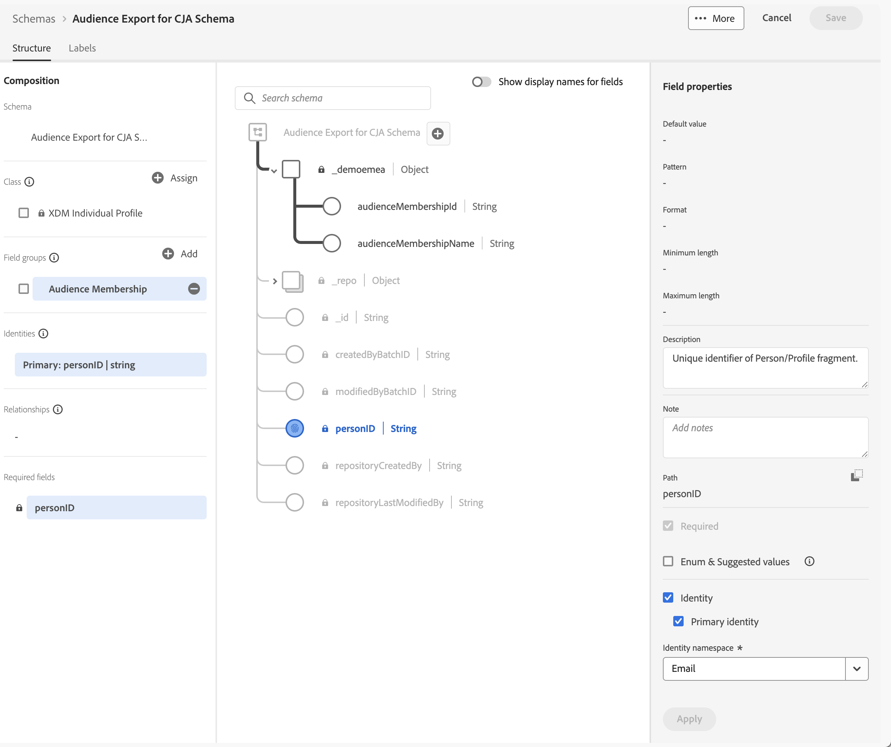

# 收錄並使用 Experience Platform 對象

本使用案例探索將Experience Platform受眾內嵌至Customer Journey Analytics的中期解決方案。 這些受眾可能已建立在Experience Platform區段產生器、Adobe Audience Manager或其他工具中，並儲存在即時客戶個人檔案中。 受眾由一組設定檔ID，以及任何適用的屬性、事件等組成。 您想要將該受眾資料帶入Customer Journey Analytics以進行進一步分析。

## 先決條件

* 存取[Experience Platform](https://experienceleague.adobe.com/zh-hant/docs/experience-platform/access-control/home)，尤其是即時客戶設定檔。
* 存取以建立和管理Experience Platform [結構描述](https://experienceleague.adobe.com/zh-hant/docs/experience-platform/xdm/home)和[資料集](https://experienceleague.adobe.com/en/docs/experience-platform/catalog/datasets/overview)。
* 存取[Experience Platform查詢服務](https://experienceleague.adobe.com/zh-hant/docs/experience-platform/query/home) （以及寫入SQL的能力）。
* 存取可執行部分資料轉換的工具。
* 存取 Customer Journey Analytics。您必須是[Customer Journey Analytics產品管理員](/help/technotes/access-control.md)，才能建立和修改Customer Journey Analytics連線和資料檢視。
* [驗證及存取Experience Platform API （目錄服務API和分段服務API）](https://experienceleague.adobe.com/zh-hant/docs/experience-platform/landing/platform-apis/api-authentication)。 您必須在組織和沙箱的Developer Console中建立專案，並確保您擁有成功提交API呼叫所需的資訊。

## 步驟

臨時解決方案涉及以下步驟：

1. [選取對象(Experience Platform UI)](#select-audiences)。
1. [建立已啟用設定檔的資料集(Experience Platform API)](#create-a-profile-enabled-dataset)。
1. [匯出對象(Experience Platform API)](#export-audiences)。
1. [轉換輸出(Experience Platform UI等)](#transform-the-output)。
1. [建立結構描述和資料集(Experience Platform UI)](#create-a-schema-and-dataset)。
1. [新增或編輯連線(Customer Journey Analytics UI)](#add-or-edit-a-connection)。
1. [設定資料檢視(Customer Journey Analytics UI)](#configure-a-data-view)。
1. [報告與分析(Customer Journey Analytics UI)](#report-and-analyze)。


### 選取對象

解決方案會從識別您要擷取至Customer Journey Analytics中的對象開始。

+++ 識別對象

在 Experience Platform UI 中：

1. 選取&#x200B;**[!UICONTROL 客戶]** >  **[!UICONTROL 對象]**。
1. 選取「**[!UICONTROL 瀏覽]**」並搜尋您要擷取並在Customer Journey Analytics中使用的對象。 記下每個對象的&#x200B;**[!UICONTROL 對象ID]**&#x200B;以供稍後使用。

   

+++

### 建立已啟用設定檔的資料集

您必須根據核心型&#x200B;**[!UICONTROL XDM個別設定檔]**&#x200B;結構描述來建立資料集。 當您在Experience Platform UI中建立資料集時，無法選取該核心型XDM個別設定檔作為結構描述。 請改用[目錄服務API來根據](https://experienceleague.adobe.com/en/docs/experience-platform/catalog/datasets/create#create-a-dataset)結構描述建立資料集`_xdm.context.profile__union`。

+++ 建立資料集請求

#### 請求

```shell
curl -X POST \
  'https://platform.adobe.io/data/foundation/catalog/dataSets?requestDataSource=true' \
  -H 'Authorization: Bearer {ACCESS_TOKEN}' \
  -H 'Content-Type: application/json' \
  -H 'x-api-key: {API_KEY}' \
  -H 'x-gw-ims-org-id: {ORG_ID}' \
  -H 'x-sandbox-name: {SANDBOX_NAME}' \
  -d '{
   "name": "{DATASET_NAME}",
   "schemaRef": {
      "id": "_xdm.context.profile__union",
      "contentType": "application/vnd.adobe.xed+json;version=1"
   },
   "fileDescription": {
      "persistet": true,
      "containerFormat": "parquet",
      "format": "parquet"
   }
}'
```

其中：

* `DATASET_NAME`是資料集的易記名稱。 例如，`Segment Export Job Dataset for CJA`。

#### 回應

```json
["@/dataSets/{DATASET_ID}"]
```

其中：

* `DATASET_ID`是已建立資料集的資料集識別碼。

+++

### 匯出對象

將選取的對象匯出至您剛建立的資料集。 使用[Segmentation Service API建立匯出作業](https://experienceleague.adobe.com/en/docs/experience-platform/segmentation/api/export-jobs#create)，將對象傳送至資料集。

+++ 匯出工作請求

```shell
curl -X POST https://platform.adobe.io/data/core/ups/export/jobs \
 -H 'Authorization: Bearer {ACCESS_TOKEN}' \
 -H 'Content-Type: application/json' \
 -H 'x-gw-ims-org-id: {ORG_ID}' \
 -H 'x-api-key: {API_KEY}' \
 -H 'x-sandbox-name: {SANDBOX_NAME}' \
 -d '{
    "fields": "{COMMA_SEPARATED_LIST_OF_FULLY_QUALIFIED_FIELD_NAMES}",
    "filter": {
        "segments": [
            {
                "segmentId": "{AUDIENCE_ID_1}",
                "segmentNs": "ups",
                "status": [
                    "realized"
                ],
                "segmentId": "{AUDIENCE_ID_2}",
                "segmentNs": "ups",
                "status": [
                    "realized"
                ],
                "segmentId": "{AUDIENCE_ID_3}",
                "segmentNs": "ups",
                "status": [
                    "realized"
                ]             
             }
        ]
    },
    "destination":{
        "datasetId": "{DATASET_ID}",
        "segmentPerBatch": false
    },
    "schema":{
        "name": "_xdm.context.profile"
    }
}'
```

執行

* `COMMA_SEPARATED_LIST_OF_FULLY_QUALIFIED_FIELD_NAMES`可能類似於`_demoemea.identification.core.ecid, _demoemea.identification.core.email, _demoemea.identification.core.phoneNumber, person.gender, person.name.firstName, person.name.lastName`。 確保您至少包含要在Customer Journey Analysis中使用的相關欄位(例如personID （電子郵件）)。
* `AUDIENCE_ID_x`是您要匯出之對象的對象識別碼。
* `DATASET_ID`是您建立的資料集。


### 回應

```json
{
  "..."
  "id": "{EXPORT_JOB_ID}",
  "..."
}
```

執行

* `EXPORT_JOB_ID`是匯出作業的識別碼。


+++

使用[Segmentation Service API來檢查匯出作業](https://experienceleague.adobe.com/en/docs/experience-platform/segmentation/api/export-jobs#get)的狀態。

+++ 擷取特定的匯出作業請求

#### 請求

```shell
curl -X GET https://platform.adobe.io/data/core/ups/export/jobs/{EXPORT_JOB_ID} \
 -H 'Authorization: Bearer {ACCESS_TOKEN}' \
 -H 'x-gw-ims-org-id: {ORG_ID}' \
 -H 'x-api-key: {API_KEY}' \
 -H 'x-sandbox-name: {SANDBOX_NAME}'
```

#### 回應

```json
{
  "..."
  "id": "{EXPORT_JOB_ID}",
  "..."
  "status": "SUCCEEDED",
  "..."
}
```

+++

匯出作業成功後，請確認資料集是否包含成功擷取的批次。

+++ 檢查擷取狀態

在 Experience Platform UI 中：

1. 選取&#x200B;**[!UICONTROL 資料管理]** >  **[!UICONTROL 資料集]**。
1. 選取您建立的資料集，例如： **[!UICONTROL CJA的區段匯出作業資料集]**。

   

1. 驗證擷取的批次。 如果資料集包含失敗的批次，請使用&#x200B;**[!UICONTROL 資料管理]** >  **[!UICONTROL 監視]**&#x200B;檢視原因。 例如，您使用的欄位名稱不存在於結構描述中。
1. 複製資料集的&#x200B;**[!UICONTROL 資料表名稱]**。 例如：**[!UICONTROL segment_export_job_dataset_for_cja]**。  您會在下一個步驟中使用該名稱。

+++


### 轉換輸出

資料集中的資料格式對Customer Journey Analytics而言不正確。 若要轉換資料，請使用Experience Platform查詢服務來擷取資料。

+++ SQL以擷取匯出的受眾資料

使用連線至Experience Platform查詢服務的PSQL使用者端。

在 Experience Platform UI 中：

1. 選取&#x200B;**[!UICONTROL 資料管理]** >  **[!UICONTROL 查詢]**。
1. 選取 **[!UICONTROL 認證]**。

使用認證來設定您的PSQL使用者端以連線至Customer Journey Analytics查詢服務。

#### 查詢

```sql
SELECT ROW_NUMBER() OVER (ORDER BY key)::text as _id, personID, key as audienceMembershipId
FROM (
   SELECT {IDENTITY_TO_USE_AS_PERSON_ID} AS personID, explode(segmentMembership.ups)
   FROM {DATASET_TABLE_NAME}
)
WHERE value.status = 'realized' AND (key = '{AUDIENCE_ID_1}' OR key = 'AUDIENCE_ID_2' OR key = 'AUDIENCE_ID_3')
```

其中：

* `IDENTITY_TO_USE_AS_PERSON_ID`是您定義為匯出作業一部分的欄位之一。 例如：`_demoemea.identification.core.email`。
* `AUDIENCE_ID_x`是您定義為匯出作業一部分的對象。 由於匯出作業中的規格是列層級篩選器，因此您需要再次指定這些對象。 該列層級篩選器會傳回指定區段的設定檔，以及每個設定檔的所有區段會籍。


#### 結果

查詢的結果以JSON格式表示，看起來應該像這樣：

```json
[
   {
      "_id": "1",
      "personID": "{PERSON_ID_x}",
      "audienceMembershipId": "{AUDIENCE_ID_x}"
   },
   {
      "_id": "2",
      "personID": "PERSON_ID_y",
      "audienceMembershipId": "{AUDIENCE_ID_x}"
   }

]
```

其中：

* `PERSON_ID_x`是您要做為人員ID之識別碼的識別碼值。 例如，使用電子郵件時`john.doe@gmail.com`。
* `AUDIENCE_ID_x`是對象識別碼。

+++

您需要轉換此JSON資料以新增環境的租使用者名稱稱，並為受眾提供更好記的名稱。

+++ 轉換JSON

最終JSON看起來應該像這樣：

```json
[
   {
      "_id": "1",
      "personID": "{PERSON_ID_x}",
      "{TENANT_NAME}": {
         "audienceMembershipId": "{AUDIENCE_ID_x}",
         "audienceMembershipName": "{AUDIENCE_FRIENDLY_NAME_x}"
      }
  },
  {
      "_id": "2",
      "personID": "{PERSON_ID_y}",
      "{TENANT_NAME}": {
         "audienceMembershipId": "{AUDIENCE_ID_y}",
         "audienceMembershipName": "{AUDIENCE_FRIENDLY_NAME_y}"
      }
    }
  }

]
```

其中：

* `TENANT_NAME`是租使用者的名稱。 例如：`_demoemea`。
* `PERSON_ID_x`是您要做為人員ID之識別碼的識別碼值。 例如，使用電子郵件時`john.doe@gmail.com`。
* `AUDIENCE_ID_x`是對象識別碼。
* `AUDIENCE_FRIENDLY_NAME_x`是好記的對象名稱，適用於對象id。 例如：`Luma - Blue+ Members`。

使用您最愛的工具，將原始JSON轉換為此格式。

+++


### 建立結構和資料集

若要將轉換後的JSON用作Customer Journey Analytics中的匯出受眾資料，您需要建立專用結構描述。

+++ 建立結構描述

若要建立綱要：

在 Experience Platform UI 中：

1. 選取&#x200B;**[!UICONTROL 資料管理]** >  **[!UICONTROL 結構描述]**。
1. 選取 **[!UICONTROL 建立結構描述]**。 從下拉式功能表中選取&#x200B;**[!UICONTROL 標準]**。
1. 在&#x200B;**[!UICONTROL 建立結構描述]**&#x200B;對話方塊中選取&#x200B;**[!UICONTROL 手動]**，並使用&#x200B;**[!UICONTROL 選取]**&#x200B;繼續。
1. 在&#x200B;**[!UICONTROL 建立結構描述]**&#x200B;精靈的&#x200B;**[!UICONTROL 選取類別]**&#x200B;步驟中：
   1. 選取&#x200B;**[!UICONTROL 個別設定檔]**。
   1. 選取&#x200B;**[!UICONTROL 「下一步」]**。
1. 在&#x200B;**[!UICONTROL 建立結構描述]**&#x200B;精靈的&#x200B;**[!UICONTROL 名稱和檢閱]**&#x200B;步驟中：
   1. 輸入&#x200B;**[!UICONTROL 結構描述顯示名稱]**。 例如：`Audience Export for CJA Schema`。
   1. （選擇性）輸入&#x200B;**[!UICONTROL 描述]**。
   1. 選取&#x200B;**[!UICONTROL 「完成」]**。
1. 設定您的結構描述以包含自訂欄位群組（例如&#x200B;**[!UICONTROL 對象成員資格]**），其中包含兩個名為&#x200B;**[!UICONTROL audienceMembershipId]**&#x200B;和&#x200B;**[!UICONTROL audienceMembershipName]**&#x200B;的欄位。
1. 確定&#x200B;**[!UICONTROL personID]**&#x200B;欄位是&#x200B;**[!UICONTROL 身分]**、**[!UICONTROL 主要身分]**，並且具有&#x200B;**[!UICONTROL 電子郵件]**&#x200B;作為I**[!UICONTROL 身分名稱空間]**。

   匯出的

1. **[!UICONTROL 套用]**&#x200B;所有變更。 選取&#x200B;**[!UICONTROL 儲存]**，即可儲存您的結構。

+++

建立資料集並使用該資料集來擷取轉換後的JSON資料。

+++ 建立資料集並擷取資料

在 Experience Platform UI 中：

1. 選取&#x200B;**[!UICONTROL 資料管理]** >  **[!UICONTROL 資料集]**。
1. 選取 **[!UICONTROL 建立資料集]**。
1. 選取&#x200B;**[!UICONTROL 「從結構建立資料集」]**。
1. 在&#x200B;**[!UICONTROL 從結構描述建立資料集]**&#x200B;精靈的&#x200B;**[!UICONTROL 選取結構描述]**&#x200B;步驟中：
   1. 選取您剛建立的結構描述。 例如：**[!UICONTROL CJA結構描述的對象匯出]**。
   1. 選取&#x200B;**[!UICONTROL 「下一步」]**。
1. 在&#x200B;**[!UICONTROL 從結構描述建立資料集]**&#x200B;精靈的&#x200B;**[!UICONTROL 設定資料集]**&#x200B;步驟中：
   1. 輸入資料集的&#x200B;**[!UICONTROL 名稱]**。
   1. （選擇性）輸入資料集的&#x200B;**[!UICONTROL 描述]**。
   1. 選取&#x200B;**[!UICONTROL 「完成」]**。
1. 在資料集的&#x200B;**[!UICONTROL 資料集]** > **[!UICONTROL _名稱_]**&#x200B;中，拖曳轉換的JSON資料檔案，並將檔案拖放到&#x200B;**[!UICONTROL 拖放檔案]**。 此動作會開始將匯出的JSON資料擷取到資料集中。
1. 驗證擷取的批次。 如果資料集包含失敗的批次，請使用&#x200B;**[!UICONTROL 資料管理]** >  **[!UICONTROL 監視]**&#x200B;檢視原因。 例如，您在JSON中定義了結構描述中不存在的欄位名稱。


+++

### 新增或編輯連線

成功擷取包含Experience Platform對象資料的轉換JSON資料後，您就可以將資料集新增到Customer Journey Analytics中的新連線或現有連線。

+++ 將資料集新增至連線

在Customer Journey Analytics UI中：

1. 選取&#x200B;**[!UICONTROL 資料管理]** > **[!UICONTROL 連線]**。
1. 建立新連線/定義&#x200B;**[!UICONTROL 連線設定]**&#x200B;和&#x200B;**[!UICONTROL 資料設定]**。 或選取現有的連線，並使用 **[!UICONTROL 編輯連線]**&#x200B;來編輯連線。
1. 選取 **[!UICONTROL 新增資料集]**。
1. 選取您建立且內嵌轉換JSON資料的資料集。
1. 設定資料集。 例如：

   

1. **[!UICONTROL 儲存]**&#x200B;連線。

+++

### 設定資料檢視

為您剛建立或編輯的連線設定資料檢視。

+++ 定義對象元件

1. 選取&#x200B;**[!UICONTROL 資料管理]** > **[!UICONTROL 資料檢視]**。
1. 編輯現有的資料檢視或建立新的資料檢視。
1. 在資料檢視的&#x200B;**[!UICONTROL 元件]**&#x200B;標籤中，確定&#x200B;**[!UICONTROL 對象成員資格識別碼]**&#x200B;和&#x200B;**[!UICONTROL 對象成員資格名稱]**&#x200B;已新增為維度元件。

   

1. 選取&#x200B;**[!UICONTROL 儲存並繼續]**&#x200B;以儲存資料檢視。

+++

### 報告和分析

最後，在一個或多個使用資料檢視的面板中，使用Analysis Workspace來報告Experience Platform對象資料，這些面板具有對象成員資格元件，例如`audienceMembershipId`、`audienceMembershipIdName`和`personID`。


<!--

## Step 1: Select audiences in Real-time Customer Profile {#audience}

Experience Platform [Real-time Customer Profile](https://experienceleague.adobe.com/docs/experience-platform/profile/home.html) lets you see a holistic view of each individual customer by combining data from multiple channels, including online, offline, CRM, and third party. 

You likely already have audiences in RTCP that may have come from various sources. Select one or more audiences to ingest into Customer Journey Analytics. For example, WKND Fly Platinum and Gold Fly Club Members.


## Step 2: Create a Profile Union dataset for the export

In order to export the audience to a dataset that you can ingest in Customer Journey Analytics as profiles, create a dataset whose schema is a Profile [Union schema](https://experienceleague.adobe.com/docs/experience-platform/profile/union-schemas/union-schema.html#understanding-union-schemas).

Union schemas are composed of multiple schemas that share the same class and have been enabled for Profile. The union schema enables you to see an amalgamation of all of the fields contained within schemas sharing the same class. Real-time Customer Profile uses the union schema to create a holistic view of each individual customer.

## Step 3: Export an audience to the Profile Union dataset via API call {#export}

Before you can bring an audience into Customer Journey Analytics, you need to export it to an Adobe Experience Platform dataset. This can only be done using the Segmentation API, and specifically the [Export Jobs API Endpoint](https://experienceleague.adobe.com/docs/experience-platform/segmentation/api/export-jobs.html). 

You can create an export job using the audience ID of your choice, and put the results in the Profile Union Adobe Experience Platform dataset you created in Step 2. Although you can export various attributes/events for the audience, you only need to export the specific profile ID field that matches the person ID field used in the Customer Journey Analytics connection you will be leveraging (see below in Step 5).

## Step 4: Edit the export output 

The results of the export job need to be transformed into a separate Profile dataset in order to be ingested into Customer Journey Analytics.  This transformation can be done with [Adobe Experience Platform Query Service](https://experienceleague.adobe.com/docs/experience-platform/query/home.html), or another transformation tool of your choice. We only need the Profile ID (that will match the Person ID in Customer Journey Analytics) and one or more audience ID(s) to do the reporting in Customer Journey Analytics.

The standard export job, however, contains more data and so we need to edit this output to remove extraneous data, as well as move some things around.  Also, you need to create a schema/dataset first before you add the transformed data to it.

Here is an example of the export output in the Profile union dataset, **before** any editing:


Note the following:

* The audience ID is contained under `segmentmembership.ups.xxxxxxxx-xxxx-xxxx-xxxx-xxxxxxxxxxxx.status`.
* The status has to be "realized", or "entered", but not "exited".

This is the format of the Profile dataset that you can send into Customer Journey Analytics.


Here are the data elements that need to be present:

* `_aresprodvalidation` string field: Refers to your Organization ID. Yours will be different.
* `personID` string field: This is the standard XDM schema field on Profile datasets to identity the person. Use the Profile ID from the export.
* `audienceMembershipId` string field: The audience ID from the export.  NOTE: This field can be named whatever you want (from your own schema).
* Add a friendly name for the audience (`audienceMembershipIdName`), such as

   
   
* Add other audience metadata if you desire.

## Step 5: Add this Profile dataset to an existing connection in Customer Journey Analytics

You could [create a new connection](/help/connections/create-connection.md), but most customers will want to add the Profile dataset to an existing connection. The audience IDs "enrich" the existing data in Customer Journey Analytics.

## Step 6: Modify existing (or create new) Customer Journey Analytics data view

Add `audienceMembershipId`, `audienceMembershipIdName` and `personID` to the data view.

## Step 7: Report in Workspace

You can now report on `audienceMembershipId`, `audienceMembershipIdName` and `personID` in Workspace.

-->


## 其他附註

* 您應定期執行此流程，以便在Customer Journey Analytics中持續重新整理對象資料。
* 您可以在單一Customer Journey Analytics連線中匯入多個對象。 這對流程新增了更多複雜性，但這是可能的。為了辦到這點，您需要對上述流程進行一些修改：
   1. 對 RTCP 中客群集合中的每個所需客群執行此流程。
   1. Customer Journey Analytics支援設定檔資料集中的陣列/物件陣列。 針對[或](https://experienceleague.adobe.com/docs/analytics-platform/using/cja-usecases/complex-data/object-arrays.html?lang=zh-Hant)使用`audienceMembershipId`物件陣列`audienceMembershipIdName`是最佳選項。
   1. 在您的資料檢視中，利用 `audienceMembershipId`欄位上的子字串轉換建立新的維度，以將逗號分隔的值字串轉換成陣列。注意：目前陣列中的上限為 10 個值。
   1. 您現在可以在Customer Journey Analytics Workspace中報告此新維度`audienceMembershipIds`。
