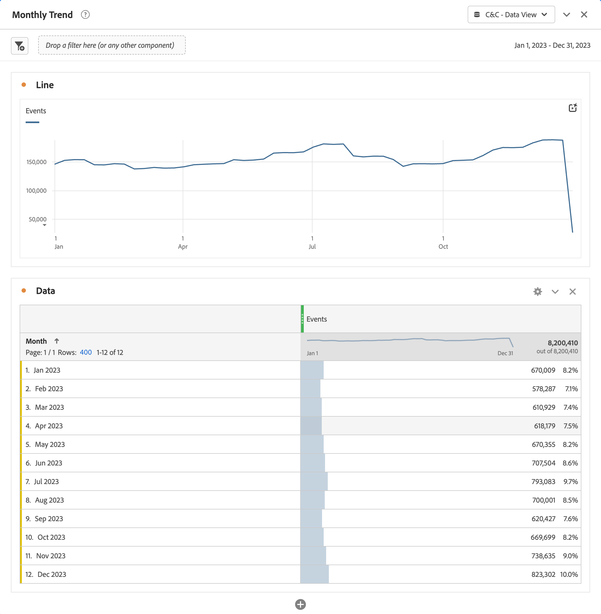
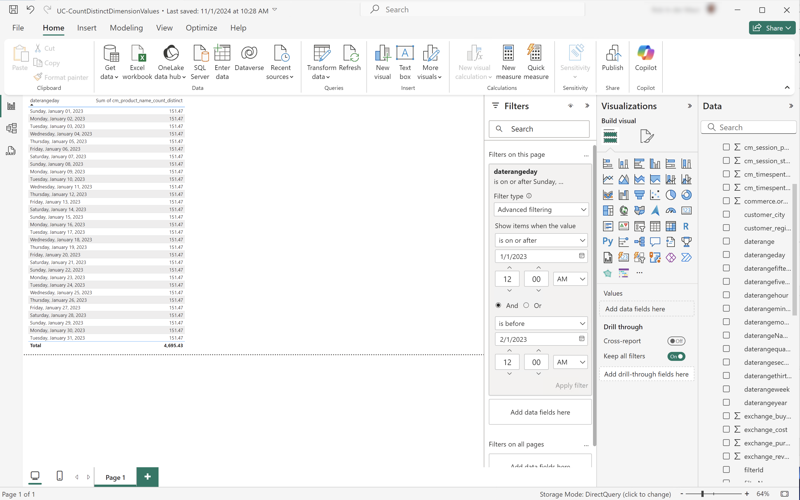
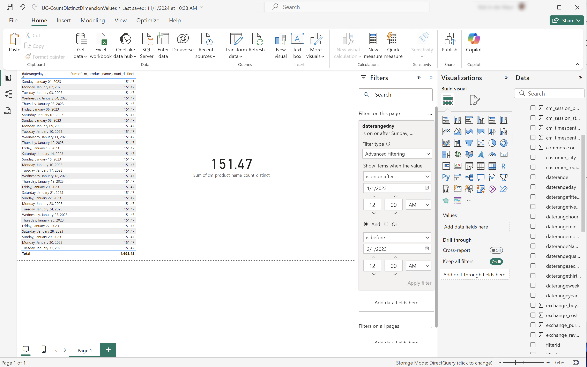

# BI 擴充功能使用案例

本文記錄如何使用Customer Journey AnalyticsBI擴充功能完成許多使用案例。 每個使用案例都會說明Customer Journey Analytics功能，以及支援的每個BI工具的詳細資訊：

* **Power BI案頭**。 使用的版本是2.137.1102.0 64位元（2024年10月）。
* **Tableau案頭**。 使用的版本為2024.1.5 (20241.24.0705.0334) 64位元。

已記錄下列使用案例：

* **連線**
   * [連線並列出資料檢視](#connect-and-validate)

* **報告和分析**
   * [每日趨勢](#daily-trend)
   * [每小時趨勢](#hourly-trend)
   * [每月趨勢](#monthly-trend)
   * [單一維度排名](#single-dimension-ranked)
   * [多個維度排名](#multiple-dimension-ranked)
   * [計算不同的維度值](#count-distinct-dimension-values)
   * [使用日期範圍名稱進行篩選](#use-date-range-names-to-filter)
   * [使用篩選器名稱來篩選](#use-filter-names-to-filter)
   * [使用維度值來篩選](#use-dimension-values-to-filter)
   * [排序](#sort)
   * [限制](#limits)

* **瞭解**

   * [轉換](#transformations)
   * [視覺效果](#visualizations)
   * [注意事項](#caveats)

**connect**&#x200B;使用案例著重於如何使用Customer Journey AnalyticsBI擴充功能連線BI工具。

**報表和分析**&#x200B;使用案例會指示如何在目前支援的BI工具中完成類似的Customer Journey Analytics視覺效果。

**瞭解**&#x200B;使用案例提供以下詳細資訊：

* 當您使用BI工具來報告和分析時所發生的轉換。
* Customer Journey Analytics和BI工具之間的視覺效果異同。
* 您應留意的每個BI工具注意事項。


## 連線並驗證

此使用案例會設定從BI工具到Customer Journey Analytics的連線、列出可用的資料檢視，並選取要使用的資料檢視。

+++ Customer Journey Analytics

這些指示參考到包含以下物件的範例環境：

* 資料檢視： **[!UICONTROL C&amp;C — 資料檢視]**??。
* Dimension： **[!UICONTROL 產品名稱]**??和&#x200B;**[!UICONTROL 產品類別]**??。
* 量度： **[!UICONTROL 購買收入]**??和&#x200B;**[!UICONTROL 購買]**??。
* 篩選器： **[!UICONTROL 釣魚產品]**??。

{zoomable="yes"}

當您進行使用案例時，請將這些範例物件取代為您特定環境的物件。

+++

+++ BI 工具

>[!BEGINTABS]

>[!TAB Power BI案頭]

1. 從Experience Platform查詢服務UI存取所需的認證和引數。

   1. 導覽至您的Experience Platform沙箱。
   1. 從左側邊欄選取 **[!UICONTROL 查詢]**。
   1. 在&#x200B;**[!UICONTROL 查詢]**&#x200B;介面中選取&#x200B;**[!UICONTROL 認證]**&#x200B;標籤。
   1. 從&#x200B;**[!UICONTROL 資料庫]**&#x200B;下拉式功能表中選取`prod:cja`。

      {zoomable="yes"}

1. 啟動Power BI案頭。
   1. 從主介面中，選取&#x200B;**[!UICONTROL 從其他來源取得資料]**。
   1. 在&#x200B;**[!UICONTROL 取得資料]**對話方塊中：
      {zoomable="yes"}
      1. 搜尋並選取&#x200B;**[!UICONTROL PostgreSQL資料庫]**。
      1. 選取&#x200B;**[!UICONTROL 連線]**。
   1. 在&#x200B;**[!UICONTROL PostgreSQL資料庫]**對話方塊中：
      {zoomable="yes"}
      1. 使用從Experience Platform **[!UICONTROL 查詢]** **[!UICONTROL 到期認證]**&#x200B;面板複製並貼上&#x200B;**[!UICONTROL 主機]**&#x200B;和&#x200B;**[!UICONTROL 連線埠]**&#x200B;值，以`:`分隔，作為&#x200B;**[!UICONTROL 伺服器]**&#x200B;的值。 例如：`examplecompany.platform-query.adobe.io:80`。
      1. 使用從Experience Platform **[!UICONTROL 查詢]** **[!UICONTROL 到期認證]**&#x200B;面板複製並貼上&#x200B;**[!UICONTROL 資料庫]**&#x200B;值。 將`?FLATTEN`新增至您貼上的值。 例如，`prod:cja?FLATTEN`。
      1. 選取&#x200B;**[!UICONTROL DirectQuery]**&#x200B;作為&#x200B;**[!UICONTROL 資料連線模式]**。
      1. 選取&#x200B;**[!UICONTROL 確定]**。
   1. 在&#x200B;**[!UICONTROL PostgreSQL資料庫]** - **[!UICONTROL 資料庫]**對話方塊中：
      {zoomable="yes"}
      1. 使用從&#x200B;**[!UICONTROL 使用者名稱]**&#x200B;和&#x200B;**[!UICONTROL 密碼]**&#x200B;欄位的Experience Platform **[!UICONTROL 查詢]** **[!UICONTROL 到期認證]**&#x200B;面板中複製&#x200B;**[!UICONTROL 使用者名稱]**&#x200B;和&#x200B;**[!UICONTROL 密碼]**&#x200B;值。 如果您使用[不會到期的認證](https://experienceleague.adobe.com/en/docs/experience-platform/query/ui/credentials?lang=en#use-credential-to-connect)，請使用不會到期的認證的密碼。
      1. 確定&#x200B;**[!UICONTROL 的下拉式功能表選取要套用這些設定至]**&#x200B;的層級，已設定為您先前定義的&#x200B;**[!UICONTROL 伺服器]**。
      1. 選取&#x200B;**[!UICONTROL 連線]**。
   1. 在&#x200B;**[!UICONTROL 導覽器]**對話方塊中，會擷取資料檢視。 此擷取作業可能需要一些時間。 擷取後，您會在Power BI案頭中看到以下內容。
      {zoomable="yes"}
      1. 從左側面板的清單中選取&#x200B;**[!UICONTROL public.cc_data_view]**。
      1. 您有兩個選項:
         1. 選取&#x200B;**[!UICONTROL 載入]**&#x200B;以繼續並完成設定。
         1. 選取&#x200B;**[!UICONTROL 轉換資料]**。 您會看到一個對話方塊，您可以選擇將轉換套用為組態的一部分。
            {zoomable="yes"}
            * 選取&#x200B;**[!UICONTROL 關閉並套用]**。
   1. 一段時間後，**[!UICONTROL public.cc_data_view]**&#x200B;會顯示在&#x200B;**[!UICONTROL 資料]**&#x200B;窗格中。 選取以顯示維度和量度。
      已載入{zoomable="yes"}


### 是否平面化

Power BI案頭支援下列`FLATTEN`引數案例。 如需詳細資訊，請參閱[平面化巢狀資料](https://experienceleague.adobe.com/en/docs/experience-platform/query/key-concepts/flatten-nested-data)。

| FLATTEN引數 | 範例 | 支援 | 備註 |
|---|---|:---:|---|
| 無 | `prod:cja` |  | |
| `?FLATTEN` | `prod:cja?FLATTEN` |  | **建議使用的選項！** |
| `%3FFLATTEN` | `prod:cja%3FFLATTEN` |  | Power BI案頭顯示錯誤： **[!UICONTROL 無法使用提供的認證進行驗證。 請再試一次。]** |

### 詳細資訊

* [先決條件](/help/data-views/bi-extension.md#prerequisites)
* [認證指南](https://experienceleague.adobe.com/en/docs/experience-platform/query/ui/credentials)
* [將Power BI連線至查詢服務](https://experienceleague.adobe.com/en/docs/experience-platform/query/clients/power-bi)。


>[!TAB Tableau案頭]

1. 從Experience Platform查詢服務UI存取所需的認證和引數。

   1. 導覽至您的Experience Platform沙箱。
   1. 從左側邊欄選取 **[!UICONTROL 查詢]**。
   1. 在&#x200B;**[!UICONTROL 查詢]**&#x200B;介面中選取&#x200B;**[!UICONTROL 認證]**&#x200B;標籤。
   1. 從&#x200B;**[!UICONTROL 資料庫]**&#x200B;下拉式功能表中選取`prod:cja`。

      {zoomable="yes"}

1. 啟動Tableau。
   1. 從&#x200B;**[!UICONTROL 下的左側邊欄選取**[!UICONTROL  PostgreSQL ]**以連線至伺服器]**。 如果無法取得，請選取&#x200B;**[!UICONTROL 更多……]**，然後從&#x200B;**[!UICONTROL 安裝的聯結器]**&#x200B;中選取&#x200B;**[!UICONTROL PostgreSQL]**。
      {zoomable="yes"}
   1. 在&#x200B;**[!UICONTROL PostgreSQL]**&#x200B;對話方塊的&#x200B;**[!UICONTROL 一般]**索引標籤中：
      {zoomable="yes"}
      1. 使用將&#x200B;**[!UICONTROL 主機]**&#x200B;從Experience Platform **[!UICONTROL 查詢]** **[!UICONTROL 到期認證]**&#x200B;面板複製並貼到&#x200B;**[!UICONTROL 伺服器]**。
      1. 使用將&#x200B;**[!UICONTROL 連線埠]**&#x200B;從Experience Platform **[!UICONTROL 查詢]** **[!UICONTROL 到期認證]**&#x200B;面板複製並貼到&#x200B;**[!UICONTROL 連線埠]**。
      1. 使用將&#x200B;**[!UICONTROL 資料庫]**&#x200B;從Experience Platform **[!UICONTROL 查詢]** **[!UICONTROL 到期認證]**&#x200B;面板複製並貼到&#x200B;**[!UICONTROL 資料庫]**。 將`%3FFLATTEN`新增至您貼上的值。 例如：`prod:cja%3FFLATTEN`。
      1. 從&#x200B;**[!UICONTROL 驗證]**&#x200B;下拉式功能表中選取&#x200B;**[!UICONTROL 使用者名稱和密碼]**。
      1. 使用將&#x200B;**[!UICONTROL 使用者名稱]**&#x200B;從Experience Platform **[!UICONTROL 查詢]** **[!UICONTROL 到期認證]**&#x200B;面板複製並貼到&#x200B;**[!UICONTROL 使用者名稱]**。
      1. 使用將&#x200B;**[!UICONTROL 密碼]**&#x200B;從Experience Platform **[!UICONTROL 查詢]** **[!UICONTROL 到期認證]**&#x200B;面板複製並貼到&#x200B;**[!UICONTROL 密碼]**。 如果您使用[不會到期的認證](https://experienceleague.adobe.com/en/docs/experience-platform/query/ui/credentials?lang=en#use-credential-to-connect)，請使用不會到期的認證的密碼。
      1. 請確定已核取&#x200B;**[!UICONTROL 需要SSL]**。
      1. 選取「**[!UICONTROL 登入]**」。

      Tableau Desktop驗證連線時，您看到&#x200B;**[!UICONTROL 處理中要求]**&#x200B;對話方塊。
   1. 在主視窗中，您會在左窗格的&#x200B;**[!UICONTROL 資料Source]**&#x200B;頁面中看到：
      * **[!UICONTROL 連線]**&#x200B;下的連線名稱。
      * **[!UICONTROL 資料庫]**&#x200B;底下的資料庫名稱。
      * **[!UICONTROL 表格]**下的表格清單。
        {zoomable="yes"}
      1. 將&#x200B;**[!UICONTROL cc_data_view]**&#x200B;專案拖放到顯示&#x200B;**[!UICONTROL 將表格]**&#x200B;拖曳到此處的主檢視上。
   1. 主視窗會顯示&#x200B;**[!UICONTROL cc_data_view]**資料檢視的詳細資料。
      {zoomable="yes"}

### 是否平面化

Tableau Desktop支援下列`FLATTEN`引數案例。 如需詳細資訊，請參閱[平面化巢狀資料](https://experienceleague.adobe.com/en/docs/experience-platform/query/key-concepts/flatten-nested-data)。

| FLATTEN引數 | 範例 | 支援 | 備註 |
|---|---|:---:|---|
| 無 | `prod:cja` |  | |
| `?FLATTEN` | `prod:cja?FLATTEN` |  | |
| `%3FFLATTEN` | `prod:cja%3FFLATTEN` |  | **建議使用的選項**。 請注意，`%3FFLATTEN`是`?FLATTEN`的URL編碼版本。 |

### 詳細資訊

* [先決條件](/help/data-views/bi-extension.md#prerequisites)
* [認證指南](https://experienceleague.adobe.com/en/docs/experience-platform/query/ui/credentials)
* [將Tableau案頭連線至查詢服務](https://experienceleague.adobe.com/en/docs/experience-platform/query/clients/tableau)。


>[!TAB 觀察者]

1. 從Experience Platform查詢服務UI存取所需的認證和引數。

   1. 導覽至您的Experience Platform沙箱。
   1. 從左側邊欄選取 **[!UICONTROL 查詢]**。
   1. 在&#x200B;**[!UICONTROL 查詢]**&#x200B;介面中選取&#x200B;**[!UICONTROL 認證]**&#x200B;標籤。
   1. 從&#x200B;**[!UICONTROL 資料庫]**&#x200B;下拉式功能表中選取`prod:cja`。

      {zoomable="yes"}

1. 登入Looker

   1. 從左側邊欄選取&#x200B;**[!UICONTROL 管理員]**。
   1. 選取&#x200B;**[!UICONTROL 連線]**。
   1. 選取&#x200B;**[!UICONTROL 新增連線]**。
   1. 在&#x200B;**[!UICONTROL 將資料庫連線到Looker畫面]**。

      

      1. 輸入連線的&#x200B;**[!UICONTROL 名稱]**，例如`Example Looker Connection`。
      1. 請確定已選取&#x200B;**[!UICONTROL 所有專案]**&#x200B;做為&#x200B;**[!UICONTROL 連線範圍]**。
      1. 選取&#x200B;**[!UICONTROL PostgreSQL 9.5+]**&#x200B;作為方言。
      1. 使用從Experience Platform **[!UICONTROL 查詢]** **[!UICONTROL 到期認證]**&#x200B;面板複製並貼上&#x200B;**[!UICONTROL 主機]**&#x200B;值，作為&#x200B;**[!UICONTROL 主機]**&#x200B;的值。 例如：`examplecompany.platform-query.adobe.io`。
      1. 使用從Experience Platform **[!UICONTROL 查詢]** **[!UICONTROL 到期認證]**&#x200B;面板複製並貼上&#x200B;**[!UICONTROL 連線埠]**&#x200B;值，作為&#x200B;**[!UICONTROL 連線埠]**&#x200B;的值。 例如：`80`。
      1. 使用從Experience Platform **[!UICONTROL 查詢]** **[!UICONTROL 到期認證]**&#x200B;面板複製並貼上&#x200B;**[!UICONTROL 資料庫]**&#x200B;值，作為&#x200B;**[!UICONTROL 資料庫]**&#x200B;的值。 將`?FLATTEN`新增至您貼上的值。 例如，`prod:cja?FLATTEN`。
      1. 使用從Experience Platform **[!UICONTROL 查詢]** **[!UICONTROL 到期認證]**&#x200B;面板複製並貼上&#x200B;**[!UICONTROL 使用者名稱]**&#x200B;值，作為&#x200B;**[!UICONTROL 使用者名稱]**&#x200B;的值。
      1. 使用，從Experience Platform **[!UICONTROL 查詢]** **[!UICONTROL 到期認證]**&#x200B;面板複製並貼上&#x200B;**[!UICONTROL 密碼]**&#x200B;值，作為&#x200B;**[!UICONTROL 密碼]**&#x200B;的值。
      1. 選取&#x200B;**[!UICONTROL 選擇性設定]**&#x200B;的&#x200B;**[!UICONTROL 全部展開]**。
      1. 將每個節點的&#x200B;**[!UICONTROL 最大連線數]**&#x200B;設定為`5`。
      1. 確定&#x200B;**[!UICONTROL SSL]**&#x200B;已啟用。
      1. 選取&#x200B;**[!UICONTROL 測試]**&#x200B;以測試連線。 您應該會看到橫幅出現在畫面頂端，並顯示&#x200B;**[!UICONTROL Success之類的訊息，可以連線JDBC字串： jdbc:postgresql://examplecompany.platform-query-stage.adobe.io:80/prod:cja?FLATTEN?tcpKeepAlive=true&amp;ssl=true&amp;sslfactory=org.postgresql.ssl.NonValidatingFactory&amp;sslmode=prefer]**。
      1. 選取&#x200B;**[!UICONTROL 連線]**&#x200B;以建立和儲存連線。
   1. 您會在&#x200B;**[!UICONTROL 連線]**&#x200B;介面中看到新連線。
   1. 從&#x200B;**[!UICONTROL 管理員←3}選取**&#x200B;管理員&#x200B;**以移至左側邊欄中的主導覽。]**
   1. 選取&#x200B;**[!UICONTROL 開發]**。
   1. 選取&#x200B;**[!UICONTROL 專案]**。
   1. 選取LookML專案中的&#x200B;**[!UICONTROL 新模型]**。
   1. 以確保不會影響其他使用者。 出現提示時，選取「進入開發模式」。
   1. 在建立模型體驗中：
      1. 在&#x200B;**[!UICONTROL ➊中選取資料庫連線]**：
         1. 在&#x200B;**[!UICONTROL 選取資料庫連線]**&#x200B;中選取您的資料庫連線。 例如： **[!UICONTROL example_looker_connection]**。
         1. 在&#x200B;**[!UICONTROL 中命名您的專案為此模型建立新的LookML專案]**。 針對`example: example_looker_project`。
         1. 選取&#x200B;**[!UICONTROL 「下一步」]**。
      1. 在&#x200B;**[!UICONTROL ➋中選取資料表]**：
         1. 選取「**[!UICONTROL 公用]**」，然後選取「確認已選取您的Customer Journey Analytics資料檢視」。 例如：  **[!UICONTROL cc_data_view]**。
         1. 選取&#x200B;**[!UICONTROL 「下一步」]**。
      1. 在&#x200B;**[!UICONTROL ➌中選取主索引鍵]**：
         1. 選取&#x200B;**[!UICONTROL 「下一步」]**。
      1. 在&#x200B;**[!UICONTROL ➍中選取要建立的探索]**：
         1. 請確定您選取檢視。 例如： **[!UICONTROL cc_data_view.view]**。
         1. 選取&#x200B;**[!UICONTROL 「下一步」]**。
      1. 在&#x200B;**[!UICONTROL 中➎輸入模型名稱]**：
         1. 為您的模型命名。 例如： `example_looker_mode`l。
      1. 選取&#x200B;**[!UICONTROL 完成並探索資料]**。

   系統會將您重新導向至Looker的&#x200B;**[!UICONTROL 探索]**&#x200B;介面，準備探索資料。


### 是否平面化

Looker支援`FLATTEN`引數的下列案例。 如需詳細資訊，請參閱[平面化巢狀資料](https://experienceleague.adobe.com/en/docs/experience-platform/query/key-concepts/flatten-nested-data)。

| FLATTEN引數 | 範例 | 支援 | 備註 |
|---|---|:---:|---|
| 無 | `prod:cja` |  | |
| `?FLATTEN` | `prod:cja?FLATTEN` |  | **建議使用的選項！** |
| `%3FFLATTEN` | `prod:cja%3FFLATTEN` |  | Looker顯示錯誤： **[!UICONTROL 無法使用提供的認證進行驗證。 請再試一次。]** |

### 詳細資訊

* [先決條件](/help/data-views/bi-extension.md#prerequisites)
* [認證指南](https://experienceleague.adobe.com/en/docs/experience-platform/query/ui/credentials)

>[!ENDTABS]

+++


## 每日趨勢

在此使用案例中，您想要顯示一個表格和簡單的線條視覺效果，顯示從2023年1月1日到2023年1月31日的每日發生次數（事件）趨勢。

+++ Customer Journey Analytics

使用案例的範例&#x200B;**[!UICONTROL 每日趨勢]**&#x200B;面板：

{zoomable="yes"}

+++

+++ BI 工具

>[!PREREQUISITES]
>
>請確認您已驗證[成功的連線，而且可以列出並使用您要嘗試此使用案例之BI工具的資料檢視](#connect-and-validate)。
>

>[!BEGINTABS]

>[!TAB Power BI案頭]

1. 在&#x200B;**[!UICONTROL 資料]**&#x200B;窗格中：
   1. 選取&#x200B;**[!UICONTROL daterangeday]**。
   1. 選取&#x200B;**[!UICONTROL ∑發生次數]**。

   您會看到一個表格，其中顯示當月的發生次數。 為獲得更好的可見度，請放大視覺效果。

1. 在&#x200B;**[!UICONTROL 篩選器]**&#x200B;窗格中：

   1. 從這個視覺效果&#x200B;]**上的**[!UICONTROL &#x200B;篩選條件中選取&#x200B;**[!UICONTROL daterangeday is (All)]**。
   1. 選取&#x200B;**[!UICONTROL 進階篩選]**&#x200B;作為&#x200B;**[!UICONTROL 篩選型別]**。
   1. 定義篩選器以&#x200B;**[!UICONTROL 當值]** **[!UICONTROL 位於或晚於]** `1/1/2023` **[!UICONTROL 且]** **[!UICONTROL 位於]** `2/1/2023.`時顯示專案。您可以使用行事曆圖示挑選和選取日期。
   1. 選取&#x200B;**[!UICONTROL 套用篩選器]**。

   您會看到已套用&#x200B;**[!UICONTROL daterangeday]**&#x200B;篩選器的資料表已更新。

1. 在&#x200B;**[!UICONTROL 視覺效果]**&#x200B;窗格中，選取&#x200B;**[!UICONTROL 折線圖]**&#x200B;視覺效果。

   使用與表格相同的資料時，折線圖視覺效果會取代表格。 您的Power BI案頭應該如下所示。

   {zoomable="yes"}

1. 線上圖視覺效果上：

   1. 選取。
   1. 從內容功能表中，選取&#x200B;**[!UICONTROL 顯示為表格]**。

   主要檢視已更新，顯示線條視覺效果和表格。 您的Power BI案頭應該如下所示。

   {zoomable="yes"}

>[!TAB Tableau案頭]

1. 選取底部的&#x200B;**[!UICONTROL 工作表1]**&#x200B;索引標籤，以從&#x200B;**[!UICONTROL 資料來源]**&#x200B;檢視進行切換。 在&#x200B;**[!UICONTROL 工作表1]**&#x200B;檢視中：
   1. 從&#x200B;**[!UICONTROL 資料]**&#x200B;窗格的&#x200B;**[!UICONTROL 表格]**&#x200B;清單中拖曳&#x200B;**[!UICONTROL 日期範圍]**&#x200B;專案，並將該專案拖放至&#x200B;**[!UICONTROL 篩選器]**&#x200B;托架。
   1. 在&#x200B;**[!UICONTROL 篩選器欄位\[日期範圍\]]**&#x200B;對話方塊中，選取&#x200B;**[!UICONTROL 日期範圍]**&#x200B;並選取&#x200B;**[!UICONTROL 下一步>]**。
   1. 在&#x200B;**[!UICONTROL 篩選器\[日期範圍]]**&#x200B;對話方塊中，選取&#x200B;**[!UICONTROL 日期範圍]**&#x200B;並指定`01/01/2023` - `01/02/2023`的期間。

      {zoomable="yes"}

   1. 從&#x200B;**[!UICONTROL 資料]**&#x200B;窗格的&#x200B;**[!UICONTROL 表格]**&#x200B;清單中拖放&#x200B;**[!UICONTROL Daterangeday]**，並將專案拖放到&#x200B;**[!UICONTROL 欄]**&#x200B;旁的欄位中。
      * 從&#x200B;**[!UICONTROL Daterangeday]**&#x200B;下拉式功能表中選取&#x200B;**[!UICONTROL Day]**，以便將值更新為&#x200B;**[!UICONTROL DAY(Daterangeday)]**。
   1. 從&#x200B;**[!UICONTROL 資料]**&#x200B;窗格中的&#x200B;**[!UICONTROL 資料表（*量值名稱*）]**&#x200B;清單拖放&#x200B;**[!UICONTROL 發生次數]**，並將專案拖放到&#x200B;**[!UICONTROL 資料列]**&#x200B;旁的欄位中。 值會自動轉換為&#x200B;**[!UICONTROL SUM（發生次數）]**。
   1. 從工具列的&#x200B;**[!UICONTROL 符合]**&#x200B;下拉式功能表，將&#x200B;**[!UICONTROL 標準]**&#x200B;修改為&#x200B;**[!UICONTROL 整個檢視]**。

      您的Tableau桌上型電腦應如下所示。

      {zoomable="yes"}

1. 從&#x200B;**[!UICONTROL 工作表1]**&#x200B;索引標籤內容功能表中選取&#x200B;**[!UICONTROL 複製]**&#x200B;以建立第二個工作表。
1. 從&#x200B;**[!UICONTROL 工作表1]**&#x200B;索引標籤內容功能表中選取&#x200B;**[!UICONTROL 重新命名]**，以將工作表重新命名為`Graph`。
1. 從&#x200B;**[!UICONTROL 工作表1 (2)]**&#x200B;索引標籤內容功能表中選取&#x200B;**[!UICONTROL 重新命名]**，以將工作表重新命名為`Data`。
1. 請確定已選取&#x200B;**[!UICONTROL 資料]**&#x200B;工作表。 在&#x200B;**[!UICONTROL 資料]**&#x200B;檢視中：
   1. 選取右上方的&#x200B;**[!UICONTROL 顯示我]**，並選取&#x200B;**[!UICONTROL 文字表格]** （左上方的視覺效果），將資料檢視的內容修改成表格。
   1. 從工具列選取&#x200B;**[!UICONTROL 交換列與欄]**。
   1. 從工具列的&#x200B;**[!UICONTROL 符合]**&#x200B;下拉式功能表，將&#x200B;**[!UICONTROL 標準]**&#x200B;修改為&#x200B;**[!UICONTROL 整個檢視]**。

      您的Tableau桌上型電腦應如下所示。

      {zoomable="yes"}

1. 選取「**[!UICONTROL 新儀表板]**」索引標籤按鈕（在底部）以建立新的&#x200B;**[!UICONTROL 儀表板1]**&#x200B;檢視。 在&#x200B;**[!UICONTROL 儀表板1]**&#x200B;檢視中：
   1. 將&#x200B;**[!UICONTROL Graph]**&#x200B;工作表從&#x200B;**[!UICONTROL 工作表]**&#x200B;擱板拖放到&#x200B;**[!UICONTROL 儀表板1]**&#x200B;檢視（顯示&#x200B;*將工作表拖放至此*）。
   1. 將&#x200B;**[!UICONTROL 資料]**&#x200B;工作表從&#x200B;**[!UICONTROL 圖形]**&#x200B;工作表下方的&#x200B;**[!UICONTROL 工作表]**&#x200B;托架拖放至&#x200B;**[!UICONTROL 儀表板1]**&#x200B;檢視。
   1. 在檢視中選取&#x200B;**[!UICONTROL 資料]**&#x200B;工作表，並將&#x200B;**[!UICONTROL 整個檢視]**&#x200B;修改為&#x200B;**[!UICONTROL 固定寬度]**。

      您的Tableau桌上型電腦應如下所示。

      {zoomable="yes"}


>[!TAB 觀察者]

1. 在Looker的&#x200B;**[!UICONTROL 瀏覽]**&#x200B;介面中，確定您已進行乾淨的設定。 如果沒有，請選取 **[!UICONTROL 移除欄位和篩選器]**。
1. 選取&#x200B;**[!UICONTROL 篩選器]**&#x200B;底下的&#x200B;**[!UICONTROL +篩選器]**。
1. 在&#x200B;**[!UICONTROL 新增篩選器]**&#x200B;對話方塊中：
   1. 選取&#x200B;**[!UICONTROL ‣ Cc資料檢視]**
   1. 從欄位清單中，選取&#x200B;**[!UICONTROL 日‣期範圍日期]**&#x200B;然後&#x200B;**[!UICONTROL 日期範圍日期]**。
      
1. 指定&#x200B;**[!UICONTROL Cc資料檢視日期範圍日期]**&#x200B;篩選器，因為&#x200B;**[!UICONTROL 在範圍]** **[!UICONTROL 2023/01/01]** **[!UICONTROL 到（之前）]** **[!UICONTROL 2023/02/01]**。
1. 從左側邊欄的&#x200B;**[!UICONTROL Cc資料檢視]**&#x200B;區段，
   1. 從&#x200B;**[!UICONTROL DIMENSION]**&#x200B;的清單中選取&#x200B;**[!UICONTROL 日‣期範圍日期]**，然後選取&#x200B;**[!UICONTROL 日期]**。
   1. 在左側邊欄（底部）中選取&#x200B;**[!UICONTROL MEASURES]**&#x200B;底下的&#x200B;**[!UICONTROL 計數]**。
1. 選取&#x200B;**[!UICONTROL 執行]**。
1. 選取‣**[!UICONTROL 視覺效果]**&#x200B;以顯示線條視覺效果。

您應該會看到視覺效果和類似下列的表格。


>[!ENDTABS]

+++


## 每小時趨勢

在此使用案例中，您想要顯示表格和簡單的線條視覺效果，以顯示2023年1月1日事件（事件）的每小時趨勢。

+++ Customer Journey Analytics

使用案例的範例&#x200B;**[!UICONTROL 每小時趨勢]**&#x200B;面板：

{zoomable="yes"}

+++

+++ BI 工具

>[!PREREQUISITES]
>
>確定您已驗證[連線成功，可以列出資料檢視，並針對您想要嘗試此使用案例的BI工具使用資料檢視](#connect-and-validate)。
>

>[!BEGINTABS]

>[!TAB Power BI案頭]

Power BI **不**&#x200B;瞭解如何處理日期時間欄位，所以不支援&#x200B;**[!UICONTROL daterangehour]**&#x200B;和&#x200B;**[!UICONTROL daterangeminute]**&#x200B;等維度。

>[!TAB Tableau案頭]

1. 選取底部的&#x200B;**[!UICONTROL 工作表1]**&#x200B;索引標籤，以從&#x200B;**[!UICONTROL 資料來源]**&#x200B;切換。 在&#x200B;**[!UICONTROL 工作表1]**&#x200B;檢視中：
   1. 從&#x200B;**[!UICONTROL 資料]**&#x200B;窗格的&#x200B;**[!UICONTROL 表格]**&#x200B;清單中拖曳&#x200B;**[!UICONTROL 日期範圍]**&#x200B;專案，並將該專案拖放至&#x200B;**[!UICONTROL 篩選器]**&#x200B;托架。
   1. 在&#x200B;**[!UICONTROL 篩選器欄位\[日期範圍\]]**&#x200B;對話方塊中，選取&#x200B;**[!UICONTROL 日期範圍]**&#x200B;並選取&#x200B;**[!UICONTROL 下一步>]**。
   1. 在&#x200B;**[!UICONTROL 篩選器\[日期範圍]]**&#x200B;對話方塊中，選取&#x200B;**[!UICONTROL 日期範圍]**&#x200B;並指定`01/01/2023` - `02/01/2023`的期間。

      {zoomable="yes"}

   1. 從&#x200B;**[!UICONTROL 資料]**&#x200B;窗格的&#x200B;**[!UICONTROL 表格]**&#x200B;清單中拖放&#x200B;**[!UICONTROL Daterangehour]**，並將專案拖放到&#x200B;**[!UICONTROL 欄]**&#x200B;旁的欄位中。
      * 從&#x200B;**[!UICONTROL Daterangeday]**&#x200B;下拉式功能表中選取&#x200B;**[!UICONTROL 更多]** > **[!UICONTROL 小時]**，以便將值更新為&#x200B;**[!UICONTROL 小時(Daterangeday)]**。
   1. 從&#x200B;**[!UICONTROL 資料]**&#x200B;窗格中的&#x200B;**[!UICONTROL 資料表（*量值名稱*）]**&#x200B;清單拖放&#x200B;**[!UICONTROL 發生次數]**，並將專案拖放到&#x200B;**[!UICONTROL 資料列]**&#x200B;旁的欄位中。 值會自動轉換為&#x200B;**[!UICONTROL SUM（發生次數）]**。
   1. 從工具列的&#x200B;**[!UICONTROL 符合]**&#x200B;下拉式功能表，將&#x200B;**[!UICONTROL 標準]**&#x200B;修改為&#x200B;**[!UICONTROL 整個檢視]**。

      您的Tableau桌上型電腦應如下所示。

      {zoomable="yes"}

1. 從&#x200B;**[!UICONTROL 工作表1]**&#x200B;索引標籤內容功能表中選取&#x200B;**[!UICONTROL 複製]**&#x200B;以建立第二個工作表。
1. 從&#x200B;**[!UICONTROL 工作表1]**&#x200B;索引標籤內容功能表中選取&#x200B;**[!UICONTROL 重新命名]**，以將工作表重新命名為`Graph`。
1. 從&#x200B;**[!UICONTROL 工作表1 (2)]**&#x200B;索引標籤內容功能表中選取&#x200B;**[!UICONTROL 重新命名]**，以將工作表重新命名為`Data`。
1. 請確定已選取&#x200B;**[!UICONTROL 資料]**&#x200B;工作表。 在&#x200B;**[!UICONTROL 資料]**&#x200B;檢視中：
   1. 選取右上方的&#x200B;**[!UICONTROL 顯示我]**，並選取&#x200B;**[!UICONTROL 文字表格]** （左上方的視覺效果），將資料檢視的內容修改成表格。
   1. 將&#x200B;**[!UICONTROL HOUR(Daterangeday)]**&#x200B;從&#x200B;**[!UICONTROL 欄]**&#x200B;拖曳至&#x200B;**[!UICONTROL 列]**。
   1. 從工具列的&#x200B;**[!UICONTROL 符合]**&#x200B;下拉式功能表，將&#x200B;**[!UICONTROL 標準]**&#x200B;修改為&#x200B;**[!UICONTROL 整個檢視]**。

      您的Tableau桌上型電腦應如下所示。

      {zoomable="yes"}

1. 選取「**[!UICONTROL 新儀表板]**」索引標籤按鈕（在底部）以建立新的&#x200B;**[!UICONTROL 儀表板1]**&#x200B;檢視。 在&#x200B;**[!UICONTROL 儀表板1]**&#x200B;檢視中：
   1. 將&#x200B;**[!UICONTROL Graph]**&#x200B;工作表從&#x200B;**[!UICONTROL 工作表]**&#x200B;擱板拖放到&#x200B;**[!UICONTROL 儀表板1]**&#x200B;檢視（顯示&#x200B;*將工作表拖放至此*）。
   1. 將&#x200B;**[!UICONTROL 資料]**&#x200B;工作表從&#x200B;**[!UICONTROL 圖形]**&#x200B;工作表下方的&#x200B;**[!UICONTROL 工作表]**&#x200B;托架拖放至&#x200B;**[!UICONTROL 儀表板1]**&#x200B;檢視。
   1. 在檢視中選取&#x200B;**[!UICONTROL 資料]**&#x200B;工作表，並將&#x200B;**[!UICONTROL 整個檢視]**&#x200B;修改為&#x200B;**[!UICONTROL 固定寬度]**。

      您的&#x200B;**[!UICONTROL 儀表板1]**&#x200B;檢視應如下所示。

      {zoomable="yes"}


>[!TAB 觀察者]


1. 在Looker的&#x200B;**[!UICONTROL 瀏覽]**&#x200B;介面中，確定您已進行乾淨的設定。 如果沒有，請選取 **[!UICONTROL 移除欄位和篩選器]**。
1. 選取&#x200B;**[!UICONTROL 篩選器]**&#x200B;底下的&#x200B;**[!UICONTROL +篩選器]**。
1. 在&#x200B;**[!UICONTROL 新增篩選器]**&#x200B;對話方塊中：
   1. 選取&#x200B;**[!UICONTROL ‣ Cc資料檢視]**
   1. 從欄位清單中，選取&#x200B;**[!UICONTROL 日‣期範圍日期]**&#x200B;然後&#x200B;**[!UICONTROL 日期範圍日期]**。
      
1. 指定&#x200B;**[!UICONTROL Cc資料檢視日期範圍]**&#x200B;篩選器，因為&#x200B;**[!UICONTROL 在範圍]** **[!UICONTROL 2023/01/01]** **[!UICONTROL 到（之前）]** **[!UICONTROL 2023/01/02]**。
1. 從左側邊欄的&#x200B;**[!UICONTROL Cc資料檢視]**&#x200B;區段，
   1. 從&#x200B;**[!UICONTROL DIMENSION‣]**&#x200B;的清單中選取&#x200B;**[!UICONTROL Daterangehour日期]**，然後選取&#x200B;**[!UICONTROL 時間]**。
   1. 在左側邊欄（底部）中選取&#x200B;**[!UICONTROL MEASURES]**&#x200B;底下的&#x200B;**[!UICONTROL 計數]**。
1. 選取&#x200B;**[!UICONTROL 執行]**。
1. 選取‣**[!UICONTROL 視覺效果]**&#x200B;以顯示線條視覺效果。

您應該會看到視覺效果和類似下列的表格。


>[!ENDTABS]

+++


## 每月趨勢

在此使用案例中，您想要顯示表格和簡單的線條視覺效果，以顯示2023年的發生次數（事件）每月趨勢。

+++ Customer Journey Analytics

使用案例的範例&#x200B;**[!UICONTROL 每月趨勢]**&#x200B;面板：

{zoomable="yes"}

+++

+++ BI 工具

>[!PREREQUISITES]
>
>確定您已驗證[連線成功，可以列出資料檢視，並針對您想要嘗試此使用案例的BI工具使用資料檢視](#connect-and-validate)。
>

>[!BEGINTABS]

>[!TAB Power BI案頭]

1. 在&#x200B;**[!UICONTROL 資料]**&#x200B;窗格中：
   1. 選取&#x200B;**[!UICONTROL daterangemonth]**。
   1. 選取&#x200B;**[!UICONTROL ∑發生次數]**。

   您會看到一個表格，其中顯示當月的發生次數。 為獲得更好的可見度，請放大視覺效果。

1. 在&#x200B;**[!UICONTROL 篩選器]**&#x200B;窗格中：

   1. 從這個視覺效果&#x200B;]**上的**[!UICONTROL &#x200B;篩選條件中選取&#x200B;**[!UICONTROL daterangemonth is (All)]**。
   1. 選取&#x200B;**[!UICONTROL 進階篩選]**&#x200B;作為&#x200B;**[!UICONTROL 篩選型別]**。
   1. 定義篩選器以&#x200B;**[!UICONTROL 當值]** **[!UICONTROL 位於或晚於]** `1/1/2023` **[!UICONTROL 且]** **[!UICONTROL 位於]** `1/1/2024.`時顯示專案。您可以使用行事曆圖示挑選和選取日期。
   1. 選取&#x200B;**[!UICONTROL 套用篩選器]**。

   您會看到已套用&#x200B;**[!UICONTROL daterangemonth]**&#x200B;篩選器的資料表已更新。

1. 在&#x200B;**[!UICONTROL 視覺效果]**&#x200B;窗格中：

   1. 選取&#x200B;**[!UICONTROL 折線圖]**&#x200B;視覺效果。

   使用與表格相同的資料時，折線圖視覺效果會取代表格。 您的Power BI案頭應該如下所示。

   {zoomable="yes"}

1. 線上圖視覺效果上：

   1. 選取。
   1. 從內容功能表中，選取&#x200B;**[!UICONTROL 顯示為表格]**。

   主要檢視已更新，顯示線條視覺效果和表格。 您的Power BI案頭應該如下所示。

   {zoomable="yes"}

>[!TAB Tableau案頭]

1. 選取底部的&#x200B;**[!UICONTROL 工作表1]**&#x200B;索引標籤，以從&#x200B;**[!UICONTROL 資料來源]**&#x200B;切換。 在&#x200B;**[!UICONTROL 工作表1]**&#x200B;檢視中：
   1. 從&#x200B;**[!UICONTROL 資料]**&#x200B;窗格的&#x200B;**[!UICONTROL 表格]**&#x200B;清單中拖曳&#x200B;**[!UICONTROL 日期範圍]**&#x200B;專案，並將該專案拖放至&#x200B;**[!UICONTROL 篩選器]**&#x200B;托架。
   1. 在&#x200B;**[!UICONTROL 篩選器欄位\[日期範圍\]]**&#x200B;對話方塊中，選取&#x200B;**[!UICONTROL 日期範圍]**&#x200B;並選取&#x200B;**[!UICONTROL 下一步>]**。
   1. 在&#x200B;**[!UICONTROL 篩選器\[日期範圍]]**&#x200B;對話方塊中，選取&#x200B;**[!UICONTROL 日期範圍]**&#x200B;並指定`01/01/2023` - `01/01/2024`的期間。

      {zoomable="yes"}

   1. 從&#x200B;**[!UICONTROL 資料]**&#x200B;窗格的&#x200B;**[!UICONTROL 表格]**&#x200B;清單中拖放&#x200B;**[!UICONTROL Daterangeday]**，並將專案拖放到&#x200B;**[!UICONTROL 欄]**&#x200B;旁的欄位中。
      * 從&#x200B;**[!UICONTROL Daterangeday]**&#x200B;下拉式功能表中選取&#x200B;**[!UICONTROL MONTH]**，以便將值更新為&#x200B;**[!UICONTROL MONTH(Daterangeday)]**。
   1. 從&#x200B;**[!UICONTROL 資料]**&#x200B;窗格中的&#x200B;**[!UICONTROL 資料表（*量值名稱*）]**&#x200B;清單拖放&#x200B;**[!UICONTROL 發生次數]**，並將專案拖放到&#x200B;**[!UICONTROL 資料列]**&#x200B;旁的欄位中。 值會自動轉換為&#x200B;**[!UICONTROL SUM（發生次數）]**。
   1. 從工具列的&#x200B;**[!UICONTROL 符合]**&#x200B;下拉式功能表，將&#x200B;**[!UICONTROL 標準]**&#x200B;修改為&#x200B;**[!UICONTROL 整個檢視]**。

      您的Tableau桌上型電腦應如下所示。

      {zoomable="yes"}

1. 從&#x200B;**[!UICONTROL 工作表1]**&#x200B;索引標籤內容功能表中選取&#x200B;**[!UICONTROL 複製]**&#x200B;以建立第二個工作表。
1. 從&#x200B;**[!UICONTROL 工作表1]**&#x200B;索引標籤內容功能表中選取&#x200B;**[!UICONTROL 重新命名]**，以將工作表重新命名為`Graph`。
1. 從&#x200B;**[!UICONTROL 工作表1 (2)]**&#x200B;索引標籤內容功能表中選取&#x200B;**[!UICONTROL 重新命名]**，以將工作表重新命名為`Data`。
1. 請確定已選取&#x200B;**[!UICONTROL 資料]**&#x200B;工作表。 在資料檢視中：
   1. 選取右上方的&#x200B;**[!UICONTROL 顯示我]**，並選取&#x200B;**[!UICONTROL 文字表格]** （左上方的視覺效果），將資料檢視的內容修改成表格。
   1. 將&#x200B;**[!UICONTROL MONTH(Daterangeday)]**&#x200B;從&#x200B;**[!UICONTROL 欄]**&#x200B;拖曳至&#x200B;**[!UICONTROL 列]**。
   1. 從工具列的&#x200B;**[!UICONTROL 符合]**&#x200B;下拉式功能表，將&#x200B;**[!UICONTROL 標準]**&#x200B;修改為&#x200B;**[!UICONTROL 整個檢視]**。

      您的Tableau桌上型電腦應如下所示。

      {zoomable="yes"}

1. 選取「**[!UICONTROL 新儀表板]**」索引標籤按鈕（在底部）以建立新的&#x200B;**[!UICONTROL 儀表板1]**&#x200B;檢視。 在&#x200B;**[!UICONTROL 儀表板1]**&#x200B;檢視中：
   1. 將&#x200B;**[!UICONTROL Graph]**&#x200B;工作表從&#x200B;**[!UICONTROL 工作表]**&#x200B;擱板拖放到&#x200B;**[!UICONTROL 儀表板1]**&#x200B;檢視（顯示&#x200B;*將工作表拖放至此*）。
   1. 將&#x200B;**[!UICONTROL 資料]**&#x200B;工作表從&#x200B;**[!UICONTROL 圖形]**&#x200B;工作表下方的&#x200B;**[!UICONTROL 工作表]**&#x200B;托架拖放至&#x200B;**[!UICONTROL 儀表板1]**&#x200B;檢視。
   1. 在檢視中選取&#x200B;**[!UICONTROL 資料]**&#x200B;工作表，並將&#x200B;**[!UICONTROL 整個檢視]**&#x200B;修改為&#x200B;**[!UICONTROL 固定寬度]**。

      您的Tableau桌上型電腦應如下所示。

      {zoomable="yes"}


>[!TAB 觀察者]

1. 在Looker的&#x200B;**[!UICONTROL 瀏覽]**&#x200B;介面中，確定您已進行乾淨的設定。 如果沒有，請選取 **[!UICONTROL 移除欄位和篩選器]**。
1. 選取&#x200B;**[!UICONTROL 篩選器]**&#x200B;底下的&#x200B;**[!UICONTROL +篩選器]**。
1. 在&#x200B;**[!UICONTROL 新增篩選器]**&#x200B;對話方塊中：
   1. 選取&#x200B;**[!UICONTROL ‣ Cc資料檢視]**
   1. 從欄位清單中，選取&#x200B;**[!UICONTROL 日‣期範圍日期]**&#x200B;然後&#x200B;**[!UICONTROL 日期範圍日期]**。
      
1. 指定&#x200B;**[!UICONTROL Cc資料檢視日期範圍]**&#x200B;篩選器，因為&#x200B;**[!UICONTROL 在範圍]** **[!UICONTROL 2023/01/01]** **[!UICONTROL 到（之前）]** **[!UICONTROL 2024/01/01]**。
1. 從左側&#x200B;**[!UICONTROL Cc資料檢視]**&#x200B;邊欄，
   1. 從&#x200B;**[!UICONTROL DIMENSION]**&#x200B;的清單中選取&#x200B;**[!UICONTROL ‣ Daterangemonth Date]**，然後選取&#x200B;**[!UICONTROL Month]**。
   1. 在左側邊欄（底部）中選取&#x200B;**[!UICONTROL MEASURES]**&#x200B;底下的&#x200B;**[!UICONTROL 計數]**。
1. 選取&#x200B;**[!UICONTROL 執行]**。
1. 選取‣**[!UICONTROL 視覺效果]**&#x200B;以顯示線條視覺效果。

您應該會看到視覺效果和類似下列的表格。


>[!ENDTABS]

+++


## 單一維度排名

在此使用案例中，您想要顯示一個表格和簡單的橫條圖視覺效果，以顯示2023年產品名稱的購買和購買收入。

+++ Customer Journey Analytics

使用案例的範例&#x200B;**[!UICONTROL 單一Dimension排名]**&#x200B;面板：

{zoomable="yes"}
+++

+++ BI 工具

>[!PREREQUISITES]
>
>確定您已驗證[連線成功，可以列出資料檢視，並針對您想要嘗試此使用案例的BI工具使用資料檢視](#connect-and-validate)。
>

>[!BEGINTABS]

>[!TAB Power BI案頭]

1. 在&#x200B;**[!UICONTROL 資料]**&#x200B;窗格中：
   1. 選取&#x200B;**[!UICONTROL 日期範圍]**。
   1. 選取&#x200B;**[!UICONTROL 產品名稱]**。
   1. 選取&#x200B;**[!UICONTROL ∑ purchase_revenue]**。
   1. 選取&#x200B;**[!UICONTROL ∑購買]**。

   您會看到一個空白表格，僅顯示所選元素的欄標題。 為獲得更好的可見度，請放大視覺效果。

1. 在&#x200B;**[!UICONTROL 篩選器]**&#x200B;窗格中：

   1. 選取此視覺效果&#x200B;]**上的**[!UICONTROL &#x200B;篩選器&#x200B;**[!UICONTROL 日期範圍是（全部）]**。
   1. 選取&#x200B;**[!UICONTROL 相對日期]**&#x200B;作為&#x200B;**[!UICONTROL 篩選型別]**。
   1. 定義篩選器以&#x200B;**[!UICONTROL 當值]** **[!UICONTROL 位於最後]** `1` **[!UICONTROL 日曆年]**&#x200B;時顯示專案。
   1. 選取&#x200B;**[!UICONTROL 套用篩選器]**。

   您會看到已套用&#x200B;**[!UICONTROL 日期範圍]**&#x200B;篩選器的資料表已更新。

1. 在&#x200B;**[!UICONTROL 視覺效果]**&#x200B;窗格中：

   1. 使用從&#x200B;**[!UICONTROL 資料行]**&#x200B;移除&#x200B;**[!UICONTROL 日期範圍]**。
   1. 將&#x200B;**[!UICONTROL Sum of purchases_revenue]**&#x200B;拖放到&#x200B;**[!UICONTROL 欄]**&#x200B;中的&#x200B;**[!UICONTROL Sum of purchases]**&#x200B;下。

1. 在「表格」視覺效果上：

   1. 選取&#x200B;**[!UICONTROL purchase_revenue總和]**，以遞減採購收入順序排序產品名稱。 您的Power BI案頭應該如下所示。

   {zoomable="yes"}

1. 在&#x200B;**[!UICONTROL 篩選器]**&#x200B;窗格中：

   1. 選取&#x200B;**[!UICONTROL product_name為（全部）]**。
   1. 將&#x200B;**[!UICONTROL 篩選器型別]**&#x200B;設定為&#x200B;**[!UICONTROL 前N]**。
   1. 定義篩選為&#x200B;**[!UICONTROL 顯示專案]** **[!UICONTROL 前]** `10` **[!UICONTROL 依值]**。
   1. 將&#x200B;**[!UICONTROL purchase_revenue]**&#x200B;拖放至&#x200B;**[!UICONTROL By值]** **[!UICONTROL 在此新增資料欄位]**。
   1. 選取&#x200B;**[!UICONTROL 套用篩選器]**。

   您會看到表格已更新，其中顯示購買收入的值，並與Analysis Workspace中的自由表格視覺效果同步。

1. 在&#x200B;**[!UICONTROL 視覺效果]**&#x200B;窗格中：

   1. 選取&#x200B;**[!UICONTROL 折線圖和棧疊直條圖]**&#x200B;視覺效果。

   使用與表格相同的資料時，折線圖和棧疊直條圖視覺效果會取代表格。

1. 將&#x200B;**[!UICONTROL 購買]**&#x200B;拖放到&#x200B;**[!UICONTROL 視覺效果]**&#x200B;窗格中的&#x200B;**[!UICONTROL 行Y軸]**。

   折線圖和棧疊直條圖已更新。 您的Power BI案頭應該如下所示。

   {zoomable="yes"}

1. 線上條圖和棧疊直條圖視覺效果上：

   1. 選取。
   1. 從內容功能表中，選取&#x200B;**[!UICONTROL 顯示為表格]**。

   主要檢視已更新，顯示線條視覺效果和表格。

   {zoomable="yes"}

>[!TAB Tableau案頭]

1. 選取底部的&#x200B;**[!UICONTROL 工作表1]**&#x200B;索引標籤，以從&#x200B;**[!UICONTROL 資料來源]**&#x200B;切換。 在&#x200B;**[!UICONTROL 工作表1]**&#x200B;檢視中：
   1. 從&#x200B;**[!UICONTROL 資料]**&#x200B;窗格的&#x200B;**[!UICONTROL 表格]**&#x200B;清單中拖曳&#x200B;**[!UICONTROL 日期範圍]**&#x200B;專案，並將該專案拖放至&#x200B;**[!UICONTROL 篩選器]**&#x200B;托架。
   1. 在&#x200B;**[!UICONTROL 篩選器欄位\[日期範圍\]]**&#x200B;對話方塊中，選取&#x200B;**[!UICONTROL 日期範圍]**&#x200B;並選取&#x200B;**[!UICONTROL 下一步>]**。
   1. 在&#x200B;**[!UICONTROL 篩選器\[日期範圍]]**&#x200B;對話方塊中，選取&#x200B;**[!UICONTROL 日期範圍]**&#x200B;並指定`01/01/2023` - `31/12/2023`的期間。 選取&#x200B;**[!UICONTROL 套用]**&#x200B;及&#x200B;**[!UICONTROL 確定]**。

      {zoomable="yes"}

   1. 從&#x200B;**[!UICONTROL 資料]**&#x200B;窗格的&#x200B;**[!UICONTROL 表格]**&#x200B;清單中拖放&#x200B;**[!UICONTROL 產品名稱]**，並將專案拖放到&#x200B;**[!UICONTROL 列]**&#x200B;旁的欄位中。
   1. 從&#x200B;**[!UICONTROL 資料]**&#x200B;窗格中的&#x200B;**[!UICONTROL 資料表（*量值名稱*）]**&#x200B;清單拖放&#x200B;**[!UICONTROL 購買]**，並將專案拖放到&#x200B;**[!UICONTROL 資料列]**&#x200B;旁的欄位中。 值會自動轉換為&#x200B;**[!UICONTROL SUM（購買）]**。
   1. 從&#x200B;**[!UICONTROL 資料]**&#x200B;窗格中的&#x200B;**[!UICONTROL 資料表（*量值名稱*）]**&#x200B;清單拖放&#x200B;**[!UICONTROL 購買收入]**，並將專案拖放到&#x200B;**[!UICONTROL 資料行]**&#x200B;旁的欄位中，並從&#x200B;**[!UICONTROL SUM（購買）]**&#x200B;離開。 值會自動轉換為&#x200B;**[!UICONTROL SUM（購買收入）]**。
   1. 若要以遞減的購買收入順序排序兩個圖表，請將游標停留在&#x200B;**[!UICONTROL 購買收入]**&#x200B;標題上，並選取排序圖示。
   1. 若要限制圖表中的專案數，請在&#x200B;**[!UICONTROL 列]**&#x200B;中選取&#x200B;**[!UICONTROL SUM(Purchase Revenue)]**，然後從下拉式選單中選取&#x200B;**[!UICONTROL 篩選器]**。
   1. 在&#x200B;**[!UICONTROL 篩選器\[Purchase Revenue\]]**&#x200B;對話方塊中，選取&#x200B;**[!UICONTROL 值範圍]**&#x200B;並輸入適當的值。 例如： `1,000,000` - `2,000,000`。 選取&#x200B;**[!UICONTROL 套用]**&#x200B;及&#x200B;**[!UICONTROL 確定]**。
   1. 若要將兩個長條圖轉換成雙組合圖，請在&#x200B;**[!UICONTROL 列]**&#x200B;中選取&#x200B;**[!UICONTROL SUM（購買）]**，然後從下拉式功能表中選取&#x200B;**[!UICONTROL 雙軸]**。 長條圖會轉換成散佈圖。
   1. 若要將散佈圖修改為長條圖：
      1. 在&#x200B;**[!UICONTROL 標籤]**&#x200B;區域中選取&#x200B;**[!UICONTROL SUM（購買）]**，並從下拉式功能表中選取&#x200B;**[!UICONTROL 行]**。
      1. 在&#x200B;**[!UICONTROL 標籤]**&#x200B;區域中選取&#x200B;**[!UICONTROL SUM(Purchase Revenue)]**，然後從下拉式功能表中選取&#x200B;**[!UICONTROL 列]**。

   您的Tableau桌上型電腦應如下所示。

   {zoomable="yes"}

1. 從&#x200B;**[!UICONTROL 工作表1]**&#x200B;索引標籤內容功能表中選取&#x200B;**[!UICONTROL 複製]**&#x200B;以建立第二個工作表。
1. 從&#x200B;**[!UICONTROL 工作表1]**&#x200B;索引標籤內容功能表中選取&#x200B;**[!UICONTROL 重新命名]**，以將工作表重新命名為`Data`。
1. 從&#x200B;**[!UICONTROL 工作表1 (2)]**&#x200B;索引標籤內容功能表中選取&#x200B;**[!UICONTROL 重新命名]**，以將工作表重新命名為`Graph`。
1. 請確定已選取&#x200B;**[!UICONTROL 資料]**&#x200B;工作表。
   1. 選取右上角的&#x200B;**[!UICONTROL 顯示我]**，並選取&#x200B;**[!UICONTROL 文字表格]** （左上角的視覺效果），將兩個圖表的內容修改成表格。
   1. 若要以遞減順序排序購買收入，請將游標移至資料表中的&#x200B;**[!UICONTROL Purchase Revenue]**&#x200B;上，然後選取。
   1. 從&#x200B;**[!UICONTROL 符合]**&#x200B;下拉式功能表中選取&#x200B;**[!UICONTROL 整個檢視]**。

   您的Tableau桌上型電腦應如下所示。

   {zoomable="yes"}

1. 選取「**[!UICONTROL 新儀表板]**」索引標籤按鈕（在底部）以建立新的&#x200B;**[!UICONTROL 儀表板1]**&#x200B;檢視。 在&#x200B;**[!UICONTROL 儀表板1]**&#x200B;檢視中：
   1. 將&#x200B;**[!UICONTROL Graph]**&#x200B;工作表從&#x200B;**[!UICONTROL 工作表]**&#x200B;擱板拖放到&#x200B;**[!UICONTROL 儀表板1]**&#x200B;檢視（顯示&#x200B;*將工作表拖放至此*）。
   1. 將&#x200B;**[!UICONTROL 資料]**&#x200B;工作表從&#x200B;**[!UICONTROL 圖形]**&#x200B;工作表下方的&#x200B;**[!UICONTROL 工作表]**&#x200B;托架拖放至&#x200B;**[!UICONTROL 儀表板1]**&#x200B;檢視。
   1. 在檢視中選取&#x200B;**[!UICONTROL 資料]**&#x200B;工作表，並將&#x200B;**[!UICONTROL 整個檢視]**&#x200B;修改為&#x200B;**[!UICONTROL 固定寬度]**。

   您的&#x200B;**[!UICONTROL 儀表板1]**&#x200B;檢視應如下所示。

   {zoomable="yes"}


>[!TAB 觀察者]

1. 在Looker的&#x200B;**[!UICONTROL 瀏覽]**&#x200B;介面中，確定您已進行乾淨的設定。 如果沒有，請選取 **[!UICONTROL 移除欄位和篩選器]**。
1. 選取&#x200B;**[!UICONTROL 篩選器]**&#x200B;底下的&#x200B;**[!UICONTROL +篩選器]**。
1. 在&#x200B;**[!UICONTROL 新增篩選器]**&#x200B;對話方塊中：
   1. 選取&#x200B;**[!UICONTROL ‣ Cc資料檢視]**
   1. 從欄位清單中，選取&#x200B;**[!UICONTROL 日‣期範圍日期]**&#x200B;然後&#x200B;**[!UICONTROL 日期範圍年份]**。
      
1. 指定&#x200B;**[!UICONTROL Cc資料檢視日期範圍]**&#x200B;篩選器，因為&#x200B;**[!UICONTROL 在範圍]** **[!UICONTROL 2023/01/01]** **[!UICONTROL 到（之前）]** **[!UICONTROL 2024/01/01]**。
1. 從左側邊欄的&#x200B;**[!UICONTROL ‣ Cc資料檢視]**&#x200B;區段：
   1. 選取&#x200B;**[!UICONTROL 產品名稱]**。
1. 從左側邊欄中的&#x200B;**[!UICONTROL ‣自訂欄位]**&#x200B;區段：
   1. 從&#x200B;**[!UICONTROL +新增]**&#x200B;下拉式功能表中選取&#x200B;**[!UICONTROL 自訂量值]**。 在&#x200B;**[!UICONTROL 建立自訂量值]**&#x200B;對話方塊中：
      1. 從&#x200B;**[!UICONTROL 欄位選取**[!UICONTROL &#x200B;購買收入&#x200B;]**以測量]**&#x200B;下拉式功能表。
      1. 從&#x200B;**[!UICONTROL 量值型別]**&#x200B;下拉式功能表中選取&#x200B;**[!UICONTROL 總和]**。
      1. 輸入&#x200B;**[!UICONTROL 名稱]**&#x200B;的自訂欄位名稱。 例如：`Sum of Purchase Revenue`。
      1. 選取&#x200B;**[!UICONTROL 欄位詳細資料]**&#x200B;標籤。
      1. 從&#x200B;**[!UICONTROL 格式]**&#x200B;下拉式選單中選取&#x200B;**[!UICONTROL 小數]**，並確定`0`是以&#x200B;**[!UICONTROL 小數]**輸入。
         
      1. 選取「**[!UICONTROL 儲存]**」。
   1. 從&#x200B;**[!UICONTROL +新增]**&#x200B;下拉式功能表中再次選取&#x200B;**[!UICONTROL 自訂量值]**。 在&#x200B;**[!UICONTROL 建立自訂]**&#x200B;量值對話方塊中：
      1. 從&#x200B;**[!UICONTROL 欄位選取**[!UICONTROL &#x200B;購買&#x200B;]**以測量]**&#x200B;下拉式功能表。
      1. 從&#x200B;**[!UICONTROL 量值型別]**&#x200B;下拉式功能表中選取&#x200B;**[!UICONTROL 總和]**。
      1. 輸入&#x200B;**[!UICONTROL 名稱]**&#x200B;的自訂欄位名稱。 例如：`Sum of Purchases`。
      1. 選取&#x200B;**[!UICONTROL 欄位詳細資料]**&#x200B;標籤。
      1. 從&#x200B;**[!UICONTROL 格式]**&#x200B;下拉式選單中選取&#x200B;**[!UICONTROL 小數]**，並確定`0`是以&#x200B;**[!UICONTROL 小數]**&#x200B;輸入。
      1. 選取「**[!UICONTROL 儲存]**」。
   1. 這兩個欄位都會自動新增至資料檢視。
1. 選取&#x200B;**[!UICONTROL 執行]**。
1. 選取‣**[!UICONTROL 視覺效果]**&#x200B;以顯示線條視覺效果。

您應該會看到視覺效果和類似下列的表格。


>[!ENDTABS]

+++


## 多個維度排名

在此使用案例中，您想要顯示一個表格，其中劃分2023年產品類別中產品名稱的購買收入和購買。 此外，您想使用一些視覺效果來說明產品類別分佈以及每個產品類別內的產品名稱貢獻。

+++ Customer Journey Analytics

使用案例的&#x200B;**[!UICONTROL 多個Dimension排名]**&#x200B;面板範例：

{zoomable="yes"}

+++

+++ BI 工具

>[!PREREQUISITES]
>
>確定您已驗證[連線成功，可以列出資料檢視，並針對您想要嘗試此使用案例的BI工具使用資料檢視](#connect-and-validate)。
>

>[!BEGINTABS]

>[!TAB Power BI案頭]

1. 若要確保日期範圍套用至所有視覺效果，請將&#x200B;**[!UICONTROL daterangeday]**&#x200B;從&#x200B;**[!UICONTROL 資料]**&#x200B;窗格拖放至此頁面上的&#x200B;**[!UICONTROL 篩選器]**。
   1. 從此頁面的&#x200B;**[!UICONTROL 篩選器]**&#x200B;中選取&#x200B;**[!UICONTROL daterangeday is (All)]**。
   1. 選取&#x200B;**[!UICONTROL 相對日期]**&#x200B;作為&#x200B;**[!UICONTROL 篩選型別]**。
   1. 定義篩選器以&#x200B;**[!UICONTROL 當值]** **[!UICONTROL 位於最後]** `1` **[!UICONTROL 日曆年]**&#x200B;時顯示專案。
   1. 選取&#x200B;**[!UICONTROL 套用篩選器]**。

1. 在&#x200B;**[!UICONTROL 資料]**&#x200B;窗格中：
   1. 選取&#x200B;**[!UICONTROL datarangeday]**。
   1. 選取&#x200B;**[!UICONTROL product_category]**。
   1. 選取&#x200B;**[!UICONTROL 產品名稱]**。
   1. 選取&#x200B;**[!UICONTROL ∑ purchase_revenue]**
   1. 選取&#x200B;**[!UICONTROL ∑購買]**

1. 若要將垂直長條圖修改為表格，請確定您已選取表格，並從&#x200B;**[!UICONTROL 視覺效果]**&#x200B;窗格中選取&#x200B;**[!UICONTROL 矩陣]**。
   * 從&#x200B;**[!UICONTROL 資料行]**&#x200B;拖曳&#x200B;**[!UICONTROL product_name]**，並將欄位拖放到&#x200B;**[!UICONTROL 視覺效果]**&#x200B;窗格中的&#x200B;**[!UICONTROL 資料列]****[!UICONTROL product_categor]**y下。

1. 若要限制表格內顯示的產品數量，請在&#x200B;**[!UICONTROL 篩選器]**&#x200B;窗格中選取&#x200B;**[!UICONTROL product_name is (All)]**。

   1. 選取&#x200B;**[!UICONTROL 進階篩選]**。
   1. 選取&#x200B;**[!UICONTROL 篩選器型別]** **[!UICONTROL 前N]** **[!UICONTROL 顯示專案]** **[!UICONTROL 前]** `15` **[!UICONTROL 依值]**。
   1. 從&#x200B;**[!UICONTROL 資料]**&#x200B;窗格將&#x200B;**[!UICONTROL 購買]**&#x200B;拖曳至&#x200B;**[!UICONTROL 在此新增資料欄位]**。
   1. 選取&#x200B;**[!UICONTROL 套用篩選器]**。

1. 若要改善可讀性，請從頂端功能表選取&#x200B;**[!UICONTROL 檢視]**，然後選取&#x200B;**[!UICONTROL 頁面檢視]** > **[!UICONTROL 實際大小]**，並調整表格視覺效果的大小。

1. 若要劃分表格中的每個類別，請在產品類別層級選取&#x200B;**[!UICONTROL +]**。 您的Power BI案頭應該如下所示。

   {zoomable="yes"}

1. 從頂端功能表選取&#x200B;**[!UICONTROL 首頁]**，然後選取&#x200B;**[!UICONTROL 新增視覺效果]**。 新的視覺效果已新增至您的報表。

1. 在&#x200B;**[!UICONTROL 資料]**&#x200B;窗格中：
   1. 選取&#x200B;**[!UICONTROL product_category]**。
   1. 選取&#x200B;**[!UICONTROL 產品名稱]**。
   1. 選取&#x200B;**[!UICONTROL purchase_revenue]**。

1. 若要修改視覺效果，請選取長條圖，然後從&#x200B;**[!UICONTROL 視覺效果]**&#x200B;窗格中選取&#x200B;**[!UICONTROL 樹狀圖]**。
1. 請確定&#x200B;**[!UICONTROL product_category]**&#x200B;列在&#x200B;**[!UICONTROL Category]**&#x200B;之下，而&#x200B;**[!UICONTROL product_name]**&#x200B;列在&#x200B;**[!UICONTROL 視覺效果]**&#x200B;窗格的&#x200B;**[!UICONTROL 詳細資料]**&#x200B;之下。

   您的Power BI案頭應該如下所示。

   {zoomable="yes"}

1. 從頂端功能表選取&#x200B;**[!UICONTROL 首頁]**，然後選取&#x200B;**[!UICONTROL 新增視覺效果]**。 新的視覺效果已新增至您的報表。

1. 在&#x200B;**[!UICONTROL 資料]**&#x200B;窗格中：
   1. 選取&#x200B;**[!UICONTROL product_category]**。
   1. 選取&#x200B;**[!UICONTROL purchase_revenue]**。
   1. 選取&#x200B;**[!UICONTROL 購買]**。

1. 在&#x200B;**[!UICONTROL 視覺效果]**&#x200B;窗格中：
   1. 若要修改視覺效果，請選取&#x200B;**[!UICONTROL 折線圖和棧疊直條圖]**。
   1. 將&#x200B;**[!UICONTROL sum_of_purchases]**&#x200B;從&#x200B;**[!UICONTROL 欄y軸]**&#x200B;拖曳至&#x200B;**[!UICONTROL 行y軸]**。

1. 在報表中，重新整理個別視覺效果。

   您的Power BI案頭應該如下所示。

   {zoomable="yes"}


>[!TAB Tableau案頭]

1. 選取底部的&#x200B;**[!UICONTROL 工作表1]**&#x200B;索引標籤，以從&#x200B;**[!UICONTROL 資料來源]**&#x200B;切換。 在&#x200B;**[!UICONTROL 工作表1]**&#x200B;檢視中：
   1. 從&#x200B;**[!UICONTROL 資料]**&#x200B;窗格的&#x200B;**[!UICONTROL 表格]**&#x200B;清單中拖曳&#x200B;**[!UICONTROL 日期範圍]**&#x200B;專案，並將該專案拖放至&#x200B;**[!UICONTROL 篩選器]**&#x200B;托架。
   1. 在&#x200B;**[!UICONTROL 篩選器欄位\[日期範圍\]]**&#x200B;對話方塊中，選取&#x200B;**[!UICONTROL 日期範圍]**&#x200B;並選取&#x200B;**[!UICONTROL 下一步>]**。
   1. 在&#x200B;**[!UICONTROL 篩選器\[日期範圍]]**&#x200B;對話方塊中，選取&#x200B;**[!UICONTROL 相對日期]**，選取&#x200B;**[!UICONTROL 年]**，並指定&#x200B;**[!UICONTROL 上一年]**。 選取&#x200B;**[!UICONTROL 套用]**&#x200B;及&#x200B;**[!UICONTROL 確定]**。

      您的Tableau桌上型電腦應如下所示。

      {zoomable="yes"}

   1. 拖曳&#x200B;**[!UICONTROL 產品類別]**，並拖曳至&#x200B;**[!UICONTROL 欄]**&#x200B;旁。
   1. 拖曳&#x200B;**[!UICONTROL Purchase Revenue]**，並放置到&#x200B;**[!UICONTROL 列]**&#x200B;旁。 值變更為&#x200B;**[!UICONTROL SUM（購買收入）]**。
   1. 將購買拖放到&#x200B;**[!UICONTROL 列]**&#x200B;旁。 值變更為&#x200B;**[!UICONTROL SUM（購買）]**。
   1. 選取&#x200B;**[!UICONTROL SUM（購買）]**，並從下拉式選單中選取&#x200B;**[!UICONTROL 雙軸]**。
   1. 選取&#x200B;**[!UICONTROL 標籤]**&#x200B;中的&#x200B;**[!UICONTROL SUM（購買）]**，並從下拉式選單中選取&#x200B;**[!UICONTROL 行]**。
   1. 在&#x200B;**[!UICONTROL 標籤]**&#x200B;中選取&#x200B;**[!UICONTROL SUM(Purchase Revenue)]**，然後從下拉式功能表中選取&#x200B;**[!UICONTROL 列]**。
   1. 從&#x200B;**[!UICONTROL 符合]**&#x200B;功能表選取&#x200B;**[!UICONTROL 整個檢視]**。
   1. 選取圖表中的&#x200B;**[!UICONTROL 購買收入]**&#x200B;標題，並確認購買收入為遞增順序。

      您的Tableau桌上型電腦應如下所示。

      {zoomable="yes"}

1. 將目前的&#x200B;**[!UICONTROL 工作表1]**&#x200B;重新命名為`Category`。
1. 選取&#x200B;**[!UICONTROL 新增工作表]**&#x200B;以建立新工作表，並將它重新命名為`Data`。

   1. 從&#x200B;**[!UICONTROL 資料]**&#x200B;窗格的&#x200B;**[!UICONTROL 表格]**&#x200B;清單中拖曳&#x200B;**[!UICONTROL 日期範圍]**&#x200B;專案，並將該專案拖放至&#x200B;**[!UICONTROL 篩選器]**&#x200B;托架。
   1. 在&#x200B;**[!UICONTROL 篩選器欄位\[日期範圍\]]**&#x200B;對話方塊中，選取&#x200B;**[!UICONTROL 日期範圍]**&#x200B;並選取&#x200B;**[!UICONTROL 下一步>]**。
   1. 在&#x200B;**[!UICONTROL 篩選器\[日期範圍]]**&#x200B;對話方塊中，選取&#x200B;**[!UICONTROL 相對日期]**，選取&#x200B;**[!UICONTROL 年]**，並指定&#x200B;**[!UICONTROL 上一年]**。 選取&#x200B;**[!UICONTROL 套用]**&#x200B;及&#x200B;**[!UICONTROL 確定]**。
   1. 將&#x200B;**[!UICONTROL 購買收入]**&#x200B;從&#x200B;**[!UICONTROL 資料]**&#x200B;窗格拖曳至&#x200B;**[!UICONTROL 欄]**。 值變更為&#x200B;**[!UICONTROL SUM（購買收入）]**。
   1. 將&#x200B;**[!UICONTROL Purchase]**&#x200B;從&#x200B;**[!UICONTROL Data]**&#x200B;窗格拖曳至&#x200B;**[!UICONTROL 欄]** （在&#x200B;**[!UICONTROL Purchase Revenue]**&#x200B;旁）。 值變更為&#x200B;**[!UICONTROL SUM（購買）]**。
   1. 將&#x200B;**[!UICONTROL 產品類別]**&#x200B;從&#x200B;**[!UICONTROL 資料]**&#x200B;窗格拖曳至&#x200B;**[!UICONTROL 列]**。
   1. 將&#x200B;**[!UICONTROL 產品名稱]**&#x200B;從&#x200B;**[!UICONTROL 資料]**&#x200B;窗格拖曳至&#x200B;**[!UICONTROL 產品類別]**&#x200B;旁的&#x200B;**[!UICONTROL 列]**。
   1. 若要將兩個水準列變更為表格，請從&#x200B;**[!UICONTROL 顯示我]**&#x200B;中選取&#x200B;**[!UICONTROL 文字表格]**。
   1. 若要限制產品數量，請在&#x200B;**[!UICONTROL 量值值]**&#x200B;中選取&#x200B;**[!UICONTROL 購買]**。 從下拉式功能表中，選取&#x200B;**[!UICONTROL 篩選器]**。
   1. 在&#x200B;**[!UICONTROL 篩選器\[購買\]]**&#x200B;對話方塊中，選取&#x200B;**[!UICONTROL 至少]**&#x200B;並輸入`7000`。 選取&#x200B;**[!UICONTROL 套用]**&#x200B;及&#x200B;**[!UICONTROL 確定]**。
   1. 從&#x200B;****「符合」下拉式選單中選取&#x200B;**[!UICONTROL 「符合寬度]**」。

      您的Tableau桌上型電腦應如下所示。

      {zoomable="yes"}

1. 選取&#x200B;**[!UICONTROL 新工作表]**&#x200B;以建立新工作表，並將它重新命名為&#x200B;**[!UICONTROL 樹狀圖]**。
   1. 從&#x200B;**[!UICONTROL 資料]**&#x200B;窗格的&#x200B;**[!UICONTROL 表格]**&#x200B;清單中拖曳&#x200B;**[!UICONTROL 日期範圍]**&#x200B;專案，並將該專案拖放至&#x200B;**[!UICONTROL 篩選器]**&#x200B;托架。
   1. 在&#x200B;**[!UICONTROL 篩選器欄位\[日期範圍\]]**&#x200B;對話方塊中，選取&#x200B;**[!UICONTROL 日期範圍]**&#x200B;並選取&#x200B;**[!UICONTROL 下一步>]**。
   1. 在&#x200B;**[!UICONTROL 篩選器\[日期範圍]]**&#x200B;對話方塊中，選取&#x200B;**[!UICONTROL 相對日期]**，選取&#x200B;**[!UICONTROL 年]**，並指定&#x200B;**[!UICONTROL 上一年]**。 選取&#x200B;**[!UICONTROL 套用]**&#x200B;及&#x200B;**[!UICONTROL 確定]**。
   1. 將&#x200B;**[!UICONTROL Purchase Revenue]**&#x200B;從&#x200B;**[!UICONTROL 資料]**&#x200B;窗格拖曳至&#x200B;**[!UICONTROL 列]**。 值變更為&#x200B;**[!UICONTROL SUM(Purchase Revenue)]**。
   1. 從&#x200B;**[!UICONTROL 資料]**&#x200B;窗格將&#x200B;**[!UICONTROL Purchase]**&#x200B;拖曳至&#x200B;**[!UICONTROL Purchase Revenue]**&#x200B;旁的&#x200B;**[!UICONTROL 列]**。 值變更為&#x200B;**[!UICONTROL SUM（購買）]**。
   1. 將&#x200B;**[!UICONTROL 產品類別]**&#x200B;從&#x200B;**[!UICONTROL 資料]**&#x200B;窗格拖曳至&#x200B;**[!UICONTROL 欄]**。
   1. 將&#x200B;**[!UICONTROL 產品名稱]**&#x200B;從&#x200B;**[!UICONTROL 資料]**&#x200B;窗格拖曳至&#x200B;**[!UICONTROL 欄]**。
   1. 若要將兩個垂直長條圖變更為樹狀圖，請從&#x200B;**[!UICONTROL 顯示我]**&#x200B;中選取&#x200B;**[!UICONTROL 樹狀圖]**。
   1. 若要限制產品數量，請在&#x200B;**[!UICONTROL 量值值]**&#x200B;中選取&#x200B;**[!UICONTROL 購買]**。 從下拉式功能表中，選取&#x200B;**[!UICONTROL 篩選器]**。
   1. 在&#x200B;**[!UICONTROL 篩選器\[購買\]]**&#x200B;對話方塊中，選取&#x200B;**[!UICONTROL 至少]**&#x200B;並輸入`7000`。 選取&#x200B;**[!UICONTROL 套用]**&#x200B;及&#x200B;**[!UICONTROL 確定]**。
   1. 從&#x200B;**[!UICONTROL 符合]**&#x200B;下拉式功能表中選取&#x200B;**[!UICONTROL 符合寬度]**。

      您的Tableau桌上型電腦應如下所示。

      {zoomable="yes"}

1. 選取「**[!UICONTROL 新儀表板]**」索引標籤按鈕（在底部）以建立新的&#x200B;**[!UICONTROL 儀表板1]**&#x200B;檢視。 在&#x200B;**[!UICONTROL 儀表板1]**&#x200B;檢視中：
   1. 將&#x200B;**[!UICONTROL 類別]**&#x200B;工作表從&#x200B;**[!UICONTROL 工作表]**&#x200B;擱板拖放到&#x200B;**[!UICONTROL 儀表板1]**&#x200B;檢視（顯示&#x200B;*將工作表拖放至此*）。
   1. 將&#x200B;**[!UICONTROL 樹狀圖]**&#x200B;工作表從&#x200B;**[!UICONTROL 工作表]**&#x200B;托架拖放到&#x200B;**[!UICONTROL 儀表板1]**&#x200B;檢視的&#x200B;**[!UICONTROL 類別]**&#x200B;工作表下。
   1. 將&#x200B;**[!UICONTROL 資料]**&#x200B;工作表從&#x200B;**[!UICONTROL 工作表]**&#x200B;托架拖放到&#x200B;**[!UICONTROL 儀表板1]**&#x200B;檢視的&#x200B;**[!UICONTROL 樹狀圖]**&#x200B;工作表下。
   1. 調整檢視中的每個頁面大小。

   您的&#x200B;**[!UICONTROL 儀表板1]**&#x200B;檢視應如下所示。

   {zoomable="yes"}


>[!TAB 觀察者]

1. 在Looker的&#x200B;**[!UICONTROL 瀏覽]**&#x200B;介面中，確定您已進行乾淨的設定。 如果沒有，請選取 **[!UICONTROL 移除欄位和篩選器]**。
1. 選取&#x200B;**[!UICONTROL 篩選器]**&#x200B;底下的&#x200B;**[!UICONTROL +篩選器]**。
1. 在&#x200B;**[!UICONTROL 新增篩選器]**&#x200B;對話方塊中：
   1. 選取&#x200B;**[!UICONTROL ‣ Cc資料檢視]**
   1. 從欄位清單中，選取&#x200B;**[!UICONTROL 日‣期範圍日期]**&#x200B;然後&#x200B;**[!UICONTROL 日期範圍年份]**。
      
1. 指定&#x200B;**[!UICONTROL Cc資料檢視日期範圍]**&#x200B;篩選器，因為&#x200B;**[!UICONTROL 在範圍]** **[!UICONTROL 2023/01/01]** **[!UICONTROL 到（之前）]** **[!UICONTROL 2024/01/01]**。
1. 從左側邊欄的&#x200B;**[!UICONTROL ‣ Cc資料檢視]**&#x200B;區段：
   1. 選取&#x200B;**[!UICONTROL 產品類別]**。
   1. 選取&#x200B;**[!UICONTROL 產品名稱]**。
1. 從左側邊欄中的&#x200B;**[!UICONTROL ‣自訂欄位]**&#x200B;區段：
   1. 從&#x200B;**[!UICONTROL +新增]**&#x200B;下拉式功能表中選取&#x200B;**[!UICONTROL 自訂量值]**。 在&#x200B;**[!UICONTROL 建立自訂量值]**&#x200B;對話方塊中：
      1. 從&#x200B;**[!UICONTROL 欄位選取**[!UICONTROL &#x200B;購買收入&#x200B;]**以測量]**&#x200B;下拉式功能表。
      1. 從&#x200B;**[!UICONTROL 量值型別]**&#x200B;下拉式功能表中選取&#x200B;**[!UICONTROL 總和]**。
      1. 輸入&#x200B;**[!UICONTROL 名稱]**&#x200B;的自訂欄位名稱。 例如：`Sum of Purchase Revenue`。
      1. 選取&#x200B;**[!UICONTROL 欄位詳細資料]**&#x200B;標籤。
      1. 從&#x200B;**[!UICONTROL 格式]**&#x200B;下拉式選單中選取&#x200B;**[!UICONTROL 小數]**，並確定`0`是以&#x200B;**[!UICONTROL 小數]**輸入。
         
      1. 選取「**[!UICONTROL 儲存]**」。
   1. 從&#x200B;**[!UICONTROL +新增]**&#x200B;下拉式功能表中再次選取&#x200B;**[!UICONTROL 自訂量值]**。 在&#x200B;**[!UICONTROL 建立自訂]**&#x200B;量值對話方塊中：
      1. 從&#x200B;**[!UICONTROL 欄位選取**[!UICONTROL &#x200B;購買&#x200B;]**以測量]**&#x200B;下拉式功能表。
      1. 從&#x200B;**[!UICONTROL 量值型別]**&#x200B;下拉式功能表中選取&#x200B;**[!UICONTROL 總和]**。
      1. 輸入&#x200B;**[!UICONTROL 名稱]**&#x200B;的自訂欄位名稱。 例如：`Sum of Purchases`。
      1. 選取&#x200B;**[!UICONTROL 欄位詳細資料]**&#x200B;標籤。
      1. 從&#x200B;**[!UICONTROL 格式]**&#x200B;下拉式選單中選取&#x200B;**[!UICONTROL 小數]**，並確定`0`是以&#x200B;**[!UICONTROL 小數]**&#x200B;輸入。
      1. 選取「**[!UICONTROL 儲存]**」。
   1. 這兩個欄位都會自動新增至資料檢視。
1. 在「篩選」區段中，選取「+篩選」。 在新增篩選器對話方塊中
   1. 選取自‣訂欄位，然後選取購買收入。
1. 選取&#x200B;**[!UICONTROL 是>]**&#x200B;並輸入`800000`以限制結果。
1. 選取&#x200B;**[!UICONTROL 執行]**。
1. 選取‣**[!UICONTROL 視覺效果]**&#x200B;以顯示線條視覺效果。

您應該會看到視覺效果和類似下列的表格。


>[!ENDTABS]

+++


## 計算不同的維度值

在此使用案例中，您想取得2023年1月期間回報的獨特產品名稱數量。

+++ Customer Journey Analytics

若要報告產品名稱的相異計數，請在Customer Journey Analytics中設定計算量度，其中包含&#x200B;**[!UICONTROL Title]** `Product Name (Count Distinct)`和&#x200B;**[!UICONTROL 外部ID]** `product_name_count_distinct`。

{zoomable="yes"}

然後您可以在使用案例的範例&#x200B;**[!UICONTROL Count DistinctDimension值]**&#x200B;面板中使用該量度：

{zoomable="yes"}

+++

+++ BI 工具

>[!PREREQUISITES]
>
>確定您已驗證[連線成功，可以列出資料檢視，並針對您想要嘗試此使用案例的BI工具使用資料檢視](#connect-and-validate)。
>

>[!BEGINTABS]

>[!TAB Power BI案頭]

1. 若要確保日期範圍套用至所有視覺效果，請將&#x200B;**[!UICONTROL daterangeday]**&#x200B;從&#x200B;**[!UICONTROL 資料]**&#x200B;窗格拖放至此頁面上的&#x200B;**[!UICONTROL 篩選器]**。
   1. 從此頁面的&#x200B;**[!UICONTROL 篩選器]**&#x200B;中選取&#x200B;**[!UICONTROL daterangeday is (All)]**。
   1. 選取&#x200B;**[!UICONTROL 進階篩選]**&#x200B;作為&#x200B;**[!UICONTROL 篩選型別]**。
   1. 定義篩選器以&#x200B;**[!UICONTROL 當值]** **[!UICONTROL 在]** `1/1/2023` **[!UICONTROL 且]** **[!UICONTROL 在]** `2/1/2023`之前時顯示專案。
   1. 選取&#x200B;**[!UICONTROL 套用篩選器]**。

1. 在&#x200B;**[!UICONTROL 資料]**&#x200B;窗格中：
   1. 選取&#x200B;**[!UICONTROL datarangeday]**。
   1. 選取&#x200B;**[!UICONTROL ∑ cm_product_name_count_distinct]**，這是Customer Journey Analytics中定義的計算量度。

1. 若要將垂直長條圖修改成表格，請確定您已選取圖表，並從&#x200B;**[!UICONTROL 視覺效果]**&#x200B;窗格中選取&#x200B;**[!UICONTROL 表格]**。

   您的Power BI案頭應該如下所示。

   {zoomable="yes"}

1. 選取表格視覺效果。 從內容功能表中，選取&#x200B;**[!UICONTROL 複製]** > **[!UICONTROL 複製視覺效果]**。
1. 使用&#x200B;**[!UICONTROL ctrl-v]**&#x200B;貼上視覺效果。 視覺效果的精確副本會與原始副本重疊。 將其移至報告區域的右側。
1. 若要將複製的視覺效果從表格修改為卡片，請從&#x200B;**[!UICONTROL 視覺效果]**&#x200B;中選取&#x200B;**[!UICONTROL 卡片]**。

   您的Power BI案頭應該如下所示。

   {zoomable="yes"}

或者，您可以使用與Power BI的相異計數功能。

1. 選取&#x200B;**[!UICONTROL product_name]**&#x200B;維度。
1. 在&#x200B;**[!UICONTROL 欄]**&#x200B;中的&#x200B;**[!UICONTROL product_name]**&#x200B;維度上套用&#x200B;**[!UICONTROL 計數（相異）]**&#x200B;函式。

   {zoomable="yes"}


>[!TAB Tableau案頭]

1. 選取底部的&#x200B;**[!UICONTROL 工作表1]**&#x200B;索引標籤，以從&#x200B;**[!UICONTROL 資料來源]**&#x200B;切換。 在&#x200B;**[!UICONTROL 工作表1]**&#x200B;檢視中：
   1. 從&#x200B;**[!UICONTROL 資料]**&#x200B;窗格的&#x200B;**[!UICONTROL 表格]**&#x200B;清單中拖曳&#x200B;**[!UICONTROL 日期範圍]**&#x200B;專案，並將該專案拖放至&#x200B;**[!UICONTROL 篩選器]**&#x200B;托架。
   1. 在&#x200B;**[!UICONTROL 篩選欄位\[日期範圍\]]**&#x200B;對話方塊中，選取&#x200B;**[!UICONTROL 日期範圍]**&#x200B;並選取&#x200B;**[!UICONTROL 下一步>]**。
   1. 在&#x200B;**[!UICONTROL 篩選器\[日期範圍]]**&#x200B;對話方塊中，選取&#x200B;**[!UICONTROL 日期範圍]**，然後選取`01/01/2023` - `31/1/2023`。 選取&#x200B;**[!UICONTROL 套用]**&#x200B;及&#x200B;**[!UICONTROL 確定]**。
   1. 將&#x200B;**[!UICONTROL Cm產品名稱計數Distinct]**&#x200B;拖曳至&#x200B;**[!UICONTROL 列]**。 值變更為&#x200B;**[!UICONTROL SUM(Cm Product Name Count Distinct)]**。 此欄位是您在Customer Journey Analytics中定義的計算量度。
   1. 拖曳&#x200B;**[!UICONTROL Daterangeday]**&#x200B;並放置在&#x200B;**[!UICONTROL 欄]**&#x200B;旁。 選取&#x200B;**[!UICONTROL Daterangeday]**，然後從下拉式功能表中選取&#x200B;**[!UICONTROL Day]**。
   1. 若要將線條視覺效果修改為表格，請從&#x200B;**[!UICONTROL 顯示我]**&#x200B;中選取&#x200B;**[!UICONTROL 文字表格]**。
   1. 從工具列選取&#x200B;**[!UICONTROL 交換列與欄]**。
   1. 從&#x200B;**[!UICONTROL 符合]**&#x200B;下拉式功能表中選取&#x200B;**[!UICONTROL 符合寬度]**。

      您的Tableau桌上型電腦應如下所示。

      {zoomable="yes"}

1. 從&#x200B;**[!UICONTROL 工作表1]**&#x200B;索引標籤內容功能表中選取&#x200B;**[!UICONTROL 複製]**&#x200B;以建立第二個工作表。
1. 從&#x200B;**[!UICONTROL 工作表1]**&#x200B;索引標籤內容功能表中選取&#x200B;**[!UICONTROL 重新命名]**，以將工作表重新命名為`Data`。
1. 從&#x200B;**[!UICONTROL 工作表1 (2)]**&#x200B;索引標籤內容功能表中選取&#x200B;**[!UICONTROL 重新命名]**，以將工作表重新命名為`Card`。

1. 確定您已選取&#x200B;**[!UICONTROL 卡片]**&#x200B;檢視。
1. 選取&#x200B;**[!UICONTROL DAY(Daterangeday)]**，然後從下拉式功能表中選取&#x200B;**[!UICONTROL Month]**。 值變更為&#x200B;**[!UICONTROL MONTH(Daterangeday)]**。
1. 選取&#x200B;**[!UICONTROL 標籤]**&#x200B;中的&#x200B;**[!UICONTROL SUM（Cm產品名稱計數相異）]**，並從下拉式選單中選取&#x200B;**[!UICONTROL 格式]**。
1. 若要變更字型大小，請在&#x200B;**[!UICONTROL Format SUM(CM Product Name Count Distinct)]**&#x200B;窗格中，選取&#x200B;**[!UICONTROL 預設]**&#x200B;內的&#x200B;**[!UICONTROL 字型]**，並選取&#x200B;**[!UICONTROL 72]**&#x200B;作為字型大小。
1. 若要對齊數字，請選取&#x200B;**[!UICONTROL 對齊]**&#x200B;旁的&#x200B;**[!UICONTROL 自動]**，並將&#x200B;**[!UICONTROL 水準]**&#x200B;設定為置中。
1. 若要使用整數，請選取&#x200B;**[!UICONTROL 數字]**&#x200B;旁的&#x200B;**[!UICONTROL 123.456]**，並選取&#x200B;**[!UICONTROL 數字（自訂）]**。 將&#x200B;**[!UICONTROL 小數位數]**&#x200B;設為`0`。

   您的Tableau桌上型電腦應如下所示。

   {zoomable="yes"}

1. 選取「**[!UICONTROL 新儀表板]**」索引標籤按鈕（在底部）以建立新的&#x200B;**[!UICONTROL 儀表板1]**&#x200B;檢視。 在&#x200B;**[!UICONTROL 儀表板1]**&#x200B;檢視中：
   1. 將&#x200B;**[!UICONTROL 卡片]**&#x200B;工作表從&#x200B;**[!UICONTROL 工作表]**&#x200B;擱板拖放到&#x200B;**[!UICONTROL 儀表板1]**&#x200B;檢視，顯示&#x200B;*將工作表拖放到這裡*。
   1. 將&#x200B;**[!UICONTROL 資料]**&#x200B;工作表從&#x200B;**[!UICONTROL 工作表]**&#x200B;托架拖放到&#x200B;**[!UICONTROL 儀表板1]**&#x200B;檢視的&#x200B;**[!UICONTROL 卡片]**&#x200B;工作表下。

   您的&#x200B;**[!UICONTROL 儀表板1]**&#x200B;檢視應如下所示。

   {zoomable="yes"}


或者，您也可以使用Tableau Desktop的相異計數功能。

1. 使用&#x200B;**[!UICONTROL 產品名稱]**，而非&#x200B;**[!UICONTROL Cm產品名稱計數相異]**。
1. 在&#x200B;**[!UICONTROL 標籤]**&#x200B;中的&#x200B;**[!UICONTROL 產品名稱]**&#x200B;套用&#x200B;**[!UICONTROL 量值]** > **[!UICONTROL 計數（相異）]**。

   {zoomable="yes"}


>[!TAB 觀察者]

1. 在Looker的&#x200B;**[!UICONTROL 瀏覽]**&#x200B;介面中，確定您已進行乾淨的設定。 如果沒有，請選取 **[!UICONTROL 移除欄位和篩選器]**。
1. 選取&#x200B;**[!UICONTROL 篩選器]**&#x200B;底下的&#x200B;**[!UICONTROL +篩選器]**。
1. 在&#x200B;**[!UICONTROL 新增篩選器]**&#x200B;對話方塊中：
   1. 選取&#x200B;**[!UICONTROL ‣ Cc資料檢視]**
   1. 從欄位清單中，選取&#x200B;**[!UICONTROL 日‣期範圍日期]**&#x200B;然後&#x200B;**[!UICONTROL 日期範圍年份]**。
      
1. 指定&#x200B;**[!UICONTROL Cc資料檢視日期範圍日期]**&#x200B;篩選器，因為&#x200B;**[!UICONTROL 在範圍]** **[!UICONTROL 2023/01/01]** **[!UICONTROL 到（之前）]** **[!UICONTROL 2023/02/01]**。
1. 從左側邊欄的&#x200B;**[!UICONTROL ‣ Cc資料檢視]**&#x200B;區段：
   1. 選取&#x200B;**[!UICONTROL 日期範圍日期]**，然後選取&#x200B;**[!UICONTROL 日期]**。
   1. 從&#x200B;**[!UICONTROL 產品名稱]**&#x200B;上的&#x200B;**⋮更多**內容功能表選取相異計數。
      
1. 選取&#x200B;**[!UICONTROL 執行]**。
1. 選取‣**[!UICONTROL 視覺效果]**&#x200B;並選取6︎⃣以顯示數字視覺效果。

您應該會看到視覺效果和類似下列的表格。


>[!ENDTABS]

+++


## 使用日期範圍名稱進行篩選

在此使用案例中，您想使用已在Customer Journey Analytics中定義的日期範圍來篩選及報告去年的發生次數（事件）。

+++ Customer Journey Analytics

若要使用日期範圍製作報表，請以&#x200B;**[!UICONTROL 標題]** `Last Year 2023`的Customer Journey Analytics設定日期範圍。

{zoomable="yes"}

然後您可以在範例&#x200B;**[!UICONTROL 使用日期範圍名稱以篩選使用案例的]**&#x200B;面板中使用該日期範圍：

{zoomable="yes"}

請注意，在自由表格視覺效果中定義的日期範圍會如何覆寫套用至面板的日期範圍。

+++

+++ BI 工具

>[!PREREQUISITES]
>
>確定您已驗證[連線成功，可以列出資料檢視，並針對您想要嘗試此使用案例的BI工具使用資料檢視](#connect-and-validate)。
>

>[!BEGINTABS]

>[!TAB Power BI案頭]

1. 在&#x200B;**[!UICONTROL 資料]**&#x200B;窗格中：
   1. 選取&#x200B;**[!UICONTROL daterangemonth]**。
   1. 選取&#x200B;**[!UICONTROL 日期範圍名稱]**。
   1. 選取&#x200B;**[!UICONTROL ∑發生次數]**。

   您看到顯示擷取此視覺效果&#x200B;]**資料的**[!UICONTROL &#x200B;錯誤的視覺效果。

1. 在&#x200B;**[!UICONTROL 篩選器]**&#x200B;窗格中：

   1. 選取此視覺效果&#x200B;]**上**[!UICONTROL &#x200B;篩選器中的&#x200B;**[!UICONTROL daterangeName is (All)]**。
   1. 選取&#x200B;**[!UICONTROL 基本篩選]**&#x200B;作為&#x200B;**[!UICONTROL 篩選型別]**。
   1. 在&#x200B;**[!UICONTROL 搜尋]**&#x200B;欄位底下，選取&#x200B;**[!UICONTROL 去年度2023]**，這是您在Customer Journey Analytics中定義的日期範圍名稱。
   1. 選取以從&#x200B;**[!UICONTROL 資料行]**&#x200B;移除&#x200B;**[!UICONTROL 日期範圍名稱]**。

   您會看到已套用&#x200B;**[!UICONTROL 日期範圍名稱]**&#x200B;篩選器的資料表已更新。 您的Power BI案頭應該如下所示。

   {zoomable="yes"}

>[!TAB Tableau案頭]

1. 選取底部的&#x200B;**[!UICONTROL 工作表1]**&#x200B;索引標籤，以從&#x200B;**[!UICONTROL 資料來源]**&#x200B;切換。 在&#x200B;**[!UICONTROL 工作表1]**&#x200B;檢視中：
   1. 從&#x200B;**[!UICONTROL 篩選器]**&#x200B;托架中的&#x200B;**[!UICONTROL 表格]**&#x200B;清單拖曳&#x200B;**[!UICONTROL 日期範圍名稱]**&#x200B;專案。
   1. 在&#x200B;**[!UICONTROL 篩選器\[日期範圍名稱\]]**&#x200B;對話方塊中，確定已選取&#x200B;**[!UICONTROL 從清單中選取]**，並從清單中選取&#x200B;**[!UICONTROL 去年的2023]**。 選取&#x200B;**[!UICONTROL 套用]**&#x200B;及&#x200B;**[!UICONTROL 確定]**。
   1. 從&#x200B;**[!UICONTROL 表格]**&#x200B;清單拖曳&#x200B;**[!UICONTROL Daterangemonth]**&#x200B;專案，並將該專案拖放至&#x200B;**[!UICONTROL 列]**&#x200B;旁的欄位中。 選取&#x200B;**[!UICONTROL Daterangemonth]**&#x200B;並選取&#x200B;**[!UICONTROL 月]**。 值變更為&#x200B;**[!UICONTROL MONTH(Daterangemonth)]**。
   1. 從&#x200B;**[!UICONTROL 表格]**&#x200B;清單拖曳&#x200B;**[!UICONTROL 發生次數]**&#x200B;專案，並將該專案拖放至&#x200B;**[!UICONTROL 欄]**&#x200B;旁的欄位中。 值變更為&#x200B;**[!UICONTROL SUM（發生次數）]**。
   1. 從&#x200B;**[!UICONTROL 顯示我]**&#x200B;中選取&#x200B;**[!UICONTROL 文字表]**。
   1. 從工具列選取&#x200B;**[!UICONTROL 交換列與欄]**。
   1. 從&#x200B;**[!UICONTROL 符合]**&#x200B;下拉式功能表中選取&#x200B;**[!UICONTROL 符合寬度]**。

      您的Tableau桌上型電腦應如下所示。

      {zoomable="yes"}

>[!TAB 觀察者]

1. 在Looker的&#x200B;**[!UICONTROL 瀏覽]**&#x200B;介面中，確定您已進行乾淨的設定。 如果沒有，請選取 **[!UICONTROL 移除欄位和篩選器]**。
1. 選取&#x200B;**[!UICONTROL 篩選器]**&#x200B;底下的&#x200B;**[!UICONTROL +篩選器]**。
1. 在&#x200B;**[!UICONTROL 新增篩選器]**&#x200B;對話方塊中：
   1. 選取&#x200B;**[!UICONTROL ‣ Cc資料檢視]**
   1. 從欄位清單中，選取&#x200B;**[!UICONTROL 日‣期範圍名稱]**。
1. 將&#x200B;**[!UICONTROL Cc資料檢視日期範圍名稱]**&#x200B;篩選器指定為&#x200B;**[!UICONTROL 是]**，並從值清單中選取&#x200B;**[!UICONTROL 去年度2023]**。
1. 從左側邊欄的&#x200B;**[!UICONTROL ‣ Cc資料檢視]**&#x200B;區段：
   1. 選取&#x200B;**[!UICONTROL Daterange Month]**，然後選取&#x200B;**[!UICONTROL Month]**。
   1. 在左側邊欄（底部）中選取&#x200B;**[!UICONTROL MEASURES]**&#x200B;底下的&#x200B;**[!UICONTROL 計數]**。
1. 選取&#x200B;**[!UICONTROL 執行]**。
1. 選取‣**[!UICONTROL 視覺效果]**。

您應該會看到視覺效果和類似下列的表格。


>[!ENDTABS]

+++


## 使用篩選器名稱來篩選

在此使用案例中，您想要針對已在Customer Journey Analytics中定義的釣魚產品類別使用現有的篩選器，以篩選及報告2023年1月期間的產品名稱和發生次數（事件）。

+++ Customer Journey Analytics

Inspect您要用於Customer Journey Analytics的篩選器。

{zoomable="yes"}

然後，您可以在範例&#x200B;**[!UICONTROL 使用日期範圍名稱來篩選]**&#x200B;面板中以該篩選使用案例：

{zoomable="yes"}

+++

+++ BI 工具

>[!PREREQUISITES]
>
>確定您已驗證[連線成功，可以列出資料檢視，並針對您想要嘗試此使用案例的BI工具使用資料檢視](#connect-and-validate)。
>

>[!BEGINTABS]

>[!TAB Power BI案頭]

1. 在&#x200B;**[!UICONTROL 資料]**&#x200B;窗格中：
   1. 選取&#x200B;**[!UICONTROL 日期範圍]**。
   1. 選取&#x200B;**[!UICONTROL 篩選器名稱]**。
   1. 選取&#x200B;**[!UICONTROL 產品名稱]**。
   1. 選取&#x200B;**[!UICONTROL ∑發生次數]**。

您看到顯示擷取此視覺效果&#x200B;]**資料的**[!UICONTROL &#x200B;錯誤的視覺效果。

1. 在&#x200B;**[!UICONTROL 篩選器]**&#x200B;窗格中：

   1. 在此視覺效果&#x200B;]**上選取**[!UICONTROL &#x200B;篩選器中的&#x200B;**[!UICONTROL 篩選器名稱為（全部）]**。
   1. 選取&#x200B;**[!UICONTROL 基本篩選]**&#x200B;作為&#x200B;**[!UICONTROL 篩選型別]**。
   1. 在&#x200B;**[!UICONTROL 搜尋]**&#x200B;欄位底下，選取&#x200B;**[!UICONTROL 釣魚產品]**，這是Customer Journey Analytics中定義的現有篩選的名稱。
   1. 在此視覺效果&#x200B;]**上選取**[!UICONTROL &#x200B;篩選器中的&#x200B;**[!UICONTROL 日期範圍是（全部）]**。
   1. 選取&#x200B;**[!UICONTROL 進階篩選]**&#x200B;作為&#x200B;**[!UICONTROL 篩選型別]**。
   1. 定義篩選器以&#x200B;**[!UICONTROL 當值]** **[!UICONTROL 在]** `1/1/2023` **[!UICONTROL 且]** **[!UICONTROL 在]** `2/1/2023`之前時顯示專案。
   1. 選取以從&#x200B;**[!UICONTROL 資料行]**&#x200B;移除&#x200B;**[!UICONTROL filterName]**。
   1. 選取以從&#x200B;**[!UICONTROL 資料行]**&#x200B;移除&#x200B;**[!UICONTROL 日期範圍]**。

   您會看到已套用&#x200B;**[!UICONTROL filterName]**&#x200B;篩選器的資料表已更新。 您的Power BI案頭應該如下所示。

   {zoomable="yes"}


>[!TAB Tableau案頭]

1. 選取底部的&#x200B;**[!UICONTROL 工作表1]**&#x200B;索引標籤，以從&#x200B;**[!UICONTROL 資料來源]**&#x200B;切換。 在&#x200B;**[!UICONTROL 工作表1]**&#x200B;檢視中：
   1. 從&#x200B;**[!UICONTROL 篩選器]**&#x200B;托架中的&#x200B;**[!UICONTROL 表格]**&#x200B;清單拖曳&#x200B;**[!UICONTROL 篩選器名稱]**&#x200B;專案。
   1. 在&#x200B;**[!UICONTROL 篩選器\[篩選器名稱\]]**&#x200B;對話方塊中，確定已選取&#x200B;**[!UICONTROL 從清單選取]**，並從清單選取&#x200B;**[!UICONTROL 釣魚產品]**。 選取&#x200B;**[!UICONTROL 套用]**&#x200B;及&#x200B;**[!UICONTROL 確定]**。
   1. 從&#x200B;**[!UICONTROL 篩選器]**&#x200B;托架中的&#x200B;**[!UICONTROL 表格]**&#x200B;清單拖曳&#x200B;**[!UICONTROL 日期範圍]**&#x200B;專案。
   1. 在&#x200B;**[!UICONTROL 篩選欄位\[日期範圍\]]**&#x200B;對話方塊中，選取&#x200B;**[!UICONTROL 日期範圍]**&#x200B;並選取&#x200B;**[!UICONTROL 下一步>]**。
   1. 在&#x200B;**[!UICONTROL 篩選器\[日期範圍]]**&#x200B;對話方塊中，選取&#x200B;**[!UICONTROL 日期範圍]**，然後選取`01/01/2023` - `01/02/2023`。 選取&#x200B;**[!UICONTROL 套用]**&#x200B;及&#x200B;**[!UICONTROL 確定]**。
   1. 將&#x200B;**[!UICONTROL 產品名稱]**&#x200B;從&#x200B;**[!UICONTROL 表格]**&#x200B;清單拖曳至&#x200B;**[!UICONTROL 列]**。
   1. 從&#x200B;**[!UICONTROL 表格]**&#x200B;清單拖曳&#x200B;**[!UICONTROL 發生次數]**&#x200B;專案，並將該專案拖放至&#x200B;**[!UICONTROL 欄]**&#x200B;旁的欄位中。 值變更為&#x200B;**[!UICONTROL SUM（發生次數）]**。
   1. 從&#x200B;**[!UICONTROL 顯示我]**&#x200B;中選取&#x200B;**[!UICONTROL 文字表]**。
   1. 從&#x200B;**[!UICONTROL 符合]**&#x200B;下拉式功能表中選取&#x200B;**[!UICONTROL 符合寬度]**。

      您的Tableau桌上型電腦應如下所示。

      {zoomable="yes"}

>[!TAB 觀察者]

1. 在Looker的&#x200B;**[!UICONTROL 瀏覽]**&#x200B;介面中，確定您已進行乾淨的設定。 如果沒有，請選取 **[!UICONTROL 移除欄位和篩選器]**。
1. 選取&#x200B;**[!UICONTROL 篩選器]**&#x200B;底下的&#x200B;**[!UICONTROL +篩選器]**。
1. 在&#x200B;**[!UICONTROL 新增篩選器]**&#x200B;對話方塊中：
   1. 選取&#x200B;**[!UICONTROL ‣ Cc資料檢視]**
   1. 從欄位清單中，選取&#x200B;**[!UICONTROL 日‣期範圍日期]**&#x200B;然後&#x200B;**[!UICONTROL 日期範圍年份]**。
      
1. 指定&#x200B;**[!UICONTROL Cc資料檢視日期範圍日期]**&#x200B;篩選器，因為&#x200B;**[!UICONTROL 在範圍]** **[!UICONTROL 2023/01/01]** **[!UICONTROL 到（之前）]** **[!UICONTROL 2023/02/01]**。
1. 選取&#x200B;**[!UICONTROL 篩選器]**&#x200B;底下的&#x200B;**[!UICONTROL +篩選器]**&#x200B;以新增另一個篩選器。
1. 在&#x200B;**[!UICONTROL 新增篩選器]**&#x200B;對話方塊中：
   1. 選取&#x200B;**[!UICONTROL ‣ Cc資料檢視]**
   1. 從欄位清單中，選取&#x200B;**[!UICONTROL 篩選‣器名稱]**。
1. 確定&#x200B;**[!UICONTROL 是]**&#x200B;作為篩選的選取專案。
1. 從可能的值清單中選取&#x200B;**[!UICONTROL 釣魚產品]**。
1. 從左側邊欄的&#x200B;**[!UICONTROL ‣ Cc資料檢視]**&#x200B;區段：
   1. 選取&#x200B;**[!UICONTROL 產品名稱]**。
   1. 在左側邊欄（底部）中選取&#x200B;**[!UICONTROL MEASURES]**&#x200B;底下的&#x200B;**[!UICONTROL 計數]**。
1. 選取&#x200B;**[!UICONTROL 執行]**。
1. 選取‣**[!UICONTROL 視覺效果]**。

您應該會看到視覺效果和類似下列的表格。


>[!ENDTABS]

+++


## 使用維度值來篩選

您可以在Customer Journey Analytics中建立新的篩選器，以篩選搜尋產品類別中的產品。 然後，您想要使用新的篩選器，報告2023年1月期間搜尋類別中產品的產品名稱和發生次數（事件）。

+++ Customer Journey Analytics

以Customer Journey Analytics建立&#x200B;**[!UICONTROL 標題]** `Hunting Products`的新篩選器。

{zoomable="yes"}

然後您可以在範例&#x200B;**[!UICONTROL 使用Dimension值來篩選使用案例的]**&#x200B;面板中使用該篩選器：

{zoomable="yes"}

+++

+++ BI 工具

>[!PREREQUISITES]
>
>確定您已驗證[連線成功，可以列出資料檢視，並針對您想要嘗試此使用案例的BI工具使用資料檢視](#connect-and-validate)。
>

>[!BEGINTABS]

>[!TAB Power BI案頭]

1. 從功能表選取&#x200B;**[!UICONTROL 首頁]**，然後從工具列選取&#x200B;**[!UICONTROL 重新整理]**。 您需要重新整理連線，以挑選您剛才在Customer Journey Analytics中定義的新篩選器。

1. 在&#x200B;**[!UICONTROL 資料]**&#x200B;窗格中：
   1. 選取&#x200B;**[!UICONTROL 日期範圍]**。
   1. 選取&#x200B;**[!UICONTROL 篩選器名稱]**。
   1. 選取&#x200B;**[!UICONTROL 產品名稱]**。
   1. 選取&#x200B;**[!UICONTROL ∑發生次數]**。

您看到顯示擷取此視覺效果&#x200B;]**資料的**[!UICONTROL &#x200B;錯誤的視覺效果。

1. 在&#x200B;**[!UICONTROL 篩選器]**&#x200B;窗格中：
   1. 在此視覺效果&#x200B;]**上選取**[!UICONTROL &#x200B;篩選器中的&#x200B;**[!UICONTROL 篩選器名稱為（全部）]**。
   1. 選取&#x200B;**[!UICONTROL 基本篩選]**&#x200B;作為&#x200B;**[!UICONTROL 篩選型別]**。
   1. 在&#x200B;**[!UICONTROL 搜尋]**&#x200B;欄位底下，選取&#x200B;**[!UICONTROL 搜尋產品]**，這是Customer Journey Analytics中定義的現有篩選的名稱。
   1. 在此視覺效果&#x200B;]**上選取**[!UICONTROL &#x200B;篩選器中的&#x200B;**[!UICONTROL 日期範圍是（全部）]**。
   1. 選取&#x200B;**[!UICONTROL 進階篩選]**&#x200B;作為&#x200B;**[!UICONTROL 篩選型別]**。
   1. 定義篩選器以&#x200B;**[!UICONTROL 當值]** **[!UICONTROL 在]** `1/1/2023` **[!UICONTROL 且]** **[!UICONTROL 在]** `2/1/2023`之前時顯示專案。
   1. 選取以從&#x200B;**[!UICONTROL 資料行]**&#x200B;移除&#x200B;**[!UICONTROL filterName]**。
   1. 選取以從&#x200B;**[!UICONTROL 資料行]**&#x200B;移除&#x200B;**[!UICONTROL 日期範圍]**。

   您會看到已套用&#x200B;**[!UICONTROL filterName]**&#x200B;篩選器的資料表已更新。 您的Power BI案頭應該如下所示。

   {zoomable="yes"}


>[!TAB Tableau案頭]

1. 在&#x200B;**[!UICONTROL 資料Source]**&#x200B;檢視的&#x200B;**[!UICONTROL 資料]**&#x200B;下，從&#x200B;**[!UICONTROL cc_data_view(prod：cja%3FFLATTEN)]**&#x200B;上的內容功能表選取&#x200B;**[!UICONTROL 重新整理]**。 您需要重新整理連線，以挑選您剛才在Customer Journey Analytics中定義的新篩選器。
1. 選取底部的&#x200B;**[!UICONTROL 工作表1]**&#x200B;索引標籤，以從&#x200B;**[!UICONTROL 資料來源]**&#x200B;切換。 在&#x200B;**[!UICONTROL 工作表1]**&#x200B;檢視中：
   1. 從&#x200B;**[!UICONTROL 篩選器]**&#x200B;托架中的&#x200B;**[!UICONTROL 表格]**&#x200B;清單拖曳&#x200B;**[!UICONTROL 篩選器名稱]**&#x200B;專案。
   1. 在&#x200B;**[!UICONTROL 篩選器\[篩選器名稱\]]**&#x200B;對話方塊中，確定已選取&#x200B;**[!UICONTROL 從清單中選取]**，並從清單中選取&#x200B;**[!UICONTROL 搜尋產品]**。 選取&#x200B;**[!UICONTROL 套用]**&#x200B;及&#x200B;**[!UICONTROL 確定]**。
   1. 從&#x200B;**[!UICONTROL 篩選器]**&#x200B;托架中的&#x200B;**[!UICONTROL 表格]**&#x200B;清單拖曳&#x200B;**[!UICONTROL 日期範圍]**&#x200B;專案。
   1. 在&#x200B;**[!UICONTROL 篩選欄位\[日期範圍\]]**&#x200B;對話方塊中，選取&#x200B;**[!UICONTROL 日期範圍]**&#x200B;並選取&#x200B;**[!UICONTROL 下一步>]**。
   1. 在&#x200B;**[!UICONTROL 篩選器\[日期範圍]]**&#x200B;對話方塊中，選取&#x200B;**[!UICONTROL 日期範圍]**，然後選取`01/01/2023` - `1/2/2023`。 選取&#x200B;**[!UICONTROL 套用]**&#x200B;及&#x200B;**[!UICONTROL 確定]**。
   1. 將&#x200B;**[!UICONTROL 產品名稱]**&#x200B;從&#x200B;**[!UICONTROL 表格]**&#x200B;清單拖曳至&#x200B;**[!UICONTROL 列]**。
   1. 從&#x200B;**[!UICONTROL 表格]**&#x200B;清單拖曳&#x200B;**[!UICONTROL 發生次數]**&#x200B;專案，並將該專案拖放至&#x200B;**[!UICONTROL 欄]**&#x200B;旁的欄位中。 值變更為&#x200B;**[!UICONTROL SUM（發生次數）]**。
   1. 從&#x200B;**[!UICONTROL 顯示我]**&#x200B;中選取&#x200B;**[!UICONTROL 文字表]**。
   1. 從&#x200B;**[!UICONTROL 符合]**&#x200B;下拉式功能表中選取&#x200B;**[!UICONTROL 符合寬度]**。

      您的Tableau桌上型電腦應如下所示。

      {zoomable="yes"}

>[!TAB 觀察者]

1. 在1. 在Looker的&#x200B;**[!UICONTROL 瀏覽]**&#x200B;介面中，重新整理您的連線。 選取 **[!UICONTROL 清除快取並重新整理]**。
1. 在Looker的&#x200B;**[!UICONTROL 瀏覽]**&#x200B;介面中，確定您已進行乾淨的設定。 如果沒有，請選取 **[!UICONTROL 移除欄位和篩選器]**。
1. 選取&#x200B;**[!UICONTROL 篩選器]**&#x200B;底下的&#x200B;**[!UICONTROL +篩選器]**。
1. 在&#x200B;**[!UICONTROL 新增篩選器]**&#x200B;對話方塊中：
   1. 選取&#x200B;**[!UICONTROL ‣ Cc資料檢視]**
   1. 從欄位清單中，選取&#x200B;**[!UICONTROL 日‣期範圍日期]**&#x200B;然後&#x200B;**[!UICONTROL 日期範圍年份]**。
      
1. 指定&#x200B;**[!UICONTROL Cc資料檢視日期範圍日期]**&#x200B;篩選器，因為&#x200B;**[!UICONTROL 在範圍]** **[!UICONTROL 2023/01/01]** **[!UICONTROL 到（之前）]** **[!UICONTROL 2023/02/01]**。
1. 選取&#x200B;**[!UICONTROL 篩選器]**&#x200B;底下的&#x200B;**[!UICONTROL +篩選器]**&#x200B;以新增另一個篩選器。
1. 在&#x200B;**[!UICONTROL 新增篩選器]**&#x200B;對話方塊中：
   1. 選取&#x200B;**[!UICONTROL ‣ Cc資料檢視]**
   1. 從欄位清單中，選取&#x200B;**[!UICONTROL 產‣品類別]**。
1. 確定&#x200B;**[!UICONTROL 是]**&#x200B;作為篩選的選取專案。
1. 從可能的值清單中選取&#x200B;**[!UICONTROL 搜尋產品]**。
1. 從左側邊欄的&#x200B;**[!UICONTROL ‣ Cc資料檢視]**&#x200B;區段：
   1. 選取&#x200B;**[!UICONTROL 產品名稱]**。
   1. 在左側邊欄（底部）中選取&#x200B;**[!UICONTROL MEASURES]**&#x200B;底下的&#x200B;**[!UICONTROL 計數]**。
1. 選取&#x200B;**[!UICONTROL 執行]**。
1. 選取‣**[!UICONTROL 視覺效果]**。

您應該會看到視覺效果和類似下列的表格。


>[!ENDTABS]

+++


## 排序

在此使用案例中，您想要報告2023年1月期間產品名稱的購買收入和購買（以降序購買收入順序排序）。

+++ Customer Journey Analytics

使用案例的範例&#x200B;**[!UICONTROL 排序]**&#x200B;面板：

{zoomable="yes"}

+++

+++ BI 工具

>[!PREREQUISITES]
>
>確定您已驗證[連線成功，可以列出資料檢視，並針對您想要嘗試此使用案例的BI工具使用資料檢視](#connect-and-validate)。
>

>[!BEGINTABS]

>[!TAB Power BI案頭]

1. 在&#x200B;**[!UICONTROL 資料]**&#x200B;窗格中：
   1. 選取&#x200B;**[!UICONTROL 日期範圍]**。
   1. 選取&#x200B;**[!UICONTROL product_namr]**。
   1. 選取&#x200B;**[!UICONTROL ∑ purchase_revenue]**。
   1. 選取&#x200B;**[!UICONTROL ∑購買]**。

1. 在&#x200B;**[!UICONTROL 篩選器]**&#x200B;窗格中：
   1. 在此視覺效果&#x200B;]**上選取**[!UICONTROL &#x200B;篩選器中的&#x200B;**[!UICONTROL 日期範圍是（全部）]**。
   1. 選取&#x200B;**[!UICONTROL 進階篩選]**&#x200B;作為&#x200B;**[!UICONTROL 篩選型別]**。
   1. 定義篩選器以&#x200B;**[!UICONTROL 當值]** **[!UICONTROL 在]** `1/1/2023` **[!UICONTROL 且]** **[!UICONTROL 在]** `2/1/2023`之前時顯示專案。

1. 在「視覺效果」窗格中：
   1. 選取以從資料行移除日期範圍。
   1. 將&#x200B;**[!UICONTROL Purchase_revenue]**&#x200B;的總和拖曳至&#x200B;**[!UICONTROL 欄]**&#x200B;專案的底部。

1. 在報表中，選取&#x200B;**[!UICONTROL purchase_revenue總和]**&#x200B;以購買收入遞減順序排序表格。

   您的Power BI案頭應該如下所示。

   {zoomable="yes"}

Power BI案頭使用BI副檔名執行的查詢不包含`sort`陳述式。 缺少`sort`陳述式表示排序是在使用者端執行。

```sql
select "_"."product_name",
    "_"."a0",
    "_"."a1"
from 
(
    select "rows"."product_name" as "product_name",
        sum("rows"."purchases") as "a0",
        sum("rows"."purchase_revenue") as "a1"
    from 
    (
        select "_"."daterangeName",
            "_"."daterange",
            "_"."filterId",
            "_"."filterName",
            "_"."timestamp",
            "_"."affiliate_name",
            "_"."affiliate_url",
            "_"."commerce.order.priceTotal",
            "_"."customer_city",
            "_"."customer_region",
            "_"."daterangeday",
            "_"."daterangefifteenminute",
            "_"."daterangefiveminute",
            "_"."daterangehour",
            "_"."daterangeminute",
            "_"."daterangemonth",
            "_"."daterangequarter",
            "_"."daterangesecond",
            "_"."daterangethirtyminute",
            "_"."daterangeweek",
            "_"."daterangeyear",
            "_"."hitdatetime",
            "_"."page_name",
            "_"."page_url",
            "_"."product_category",
            "_"."product_name",
            "_"."product_short_review",
            "_"."product_subCategory",
            "_"."referrer_url",
            "_"."search_engine",
            "_"."search_keywords",
            "_"."store_city",
            "_"."store_name",
            "_"."store_region",
            "_"."store_type",
            "_"."timepartdayofmonth",
            "_"."timepartdayofweek",
            "_"."timepartdayofyear",
            "_"."timeparthourofday",
            "_"."timepartminuteofhour",
            "_"."timepartmonthofyear",
            "_"."timepartquarterofyear",
            "_"."timepartweekofyear",
            "_"."cm_session_end_rate_defaultmetric",
            "_"."cm_session_person_defaultmetric",
            "_"."cm_session_start_rate_defaultmetric",
            "_"."cm_timespent_person_defaultmetric",
            "_"."cm_timespent_session_defaultmetric",
            "_"."cm_product_name_count_distinct",
            "_"."ad_views",
            "_"."adobe_sessionends",
            "_"."adobe_sessionstarts",
            "_"."adobe_timespent",
            "_"."exchange_buybacks",
            "_"."exchange_cost",
            "_"."exchange_purchases",
            "_"."exchange_revenue",
            "_"."occurrences",
            "_"."page_views",
            "_"."product_quantity",
            "_"."product_reviews",
            "_"."product_views",
            "_"."purchase_revenue",
            "_"."purchases",
            "_"."visitors",
            "_"."visits"
        from "public"."cc_data_view" "_"
        where "_"."daterange" < date '2023-02-01' and "_"."daterange" >= date '2023-01-01'
    ) "rows"
    group by "product_name"
) "_"
where not "_"."a0" is null or not "_"."a1" is null
limit 1000001
```


>[!TAB Tableau案頭]

1. 選取底部的&#x200B;**[!UICONTROL 工作表1]**&#x200B;索引標籤，以從&#x200B;**[!UICONTROL 資料來源]**&#x200B;切換。 在&#x200B;**[!UICONTROL 工作表1]**&#x200B;檢視中：
   1. 從&#x200B;**[!UICONTROL 篩選器]**&#x200B;托架中的&#x200B;**[!UICONTROL 表格]**&#x200B;清單拖曳&#x200B;**[!UICONTROL 日期範圍]**&#x200B;專案。
   1. 在&#x200B;**[!UICONTROL 篩選欄位\[日期範圍\]]**&#x200B;對話方塊中，選取&#x200B;**[!UICONTROL 日期範圍]**&#x200B;並選取&#x200B;**[!UICONTROL 下一步>]**。
   1. 在&#x200B;**[!UICONTROL 篩選器\[日期範圍]]**&#x200B;對話方塊中，選取&#x200B;**[!UICONTROL 日期範圍]**，然後選取`01/01/2023` - `1/2/2023`。 選取&#x200B;**[!UICONTROL 套用]**&#x200B;及&#x200B;**[!UICONTROL 確定]**。
   1. 從&#x200B;**[!UICONTROL 表格]**&#x200B;清單中拖曳&#x200B;**[!UICONTROL 產品名稱]**，並將專案拖放至&#x200B;**[!UICONTROL 列]**&#x200B;旁的欄位中。
   1. 從&#x200B;**[!UICONTROL 資料表]**&#x200B;清單拖曳&#x200B;**[!UICONTROL 購買]**&#x200B;專案，並將該專案拖放至&#x200B;**[!UICONTROL 資料行]**&#x200B;旁的欄位中。 值變更為&#x200B;**[!UICONTROL SUM（購買）]**。
   1. 從&#x200B;**[!UICONTROL 表格]**&#x200B;清單中拖曳&#x200B;**[!UICONTROL Purchase Revenue]**&#x200B;專案，並將該專案拖放至&#x200B;**[!UICONTROL 欄]**、**[!UICONTROL SUM(Purchases)]**&#x200B;旁邊的欄位中。 值變更為&#x200B;**[!UICONTROL SUM（購買收入）]**。
   1. 從&#x200B;**[!UICONTROL 顯示我]**&#x200B;中選取&#x200B;**[!UICONTROL 文字表]**。
   1. 從&#x200B;**[!UICONTROL 符合]**&#x200B;下拉式功能表中選取&#x200B;**[!UICONTROL 符合寬度]**。
   1. 選取&#x200B;**[!UICONTROL Purchase Revenue]**&#x200B;欄標題，並依遞減順序排序此欄上的表格。

      您的Tableau桌上型電腦應如下所示。

      {zoomable="yes"}

Tableau Desktop使用BI副檔名執行的查詢不包含`sort`陳述式。 缺少此`sort`陳述式表示排序是在使用者端執行。

```sql
SELECT CAST("cc_data_view"."product_name" AS TEXT) AS "product_name",
  SUM("cc_data_view"."occurrences") AS "sum:occurrences:ok",
  SUM("cc_data_view"."purchase_revenue") AS "sum:purchase_revenue:ok",
  SUM("cc_data_view"."purchases") AS "sum:purchases:ok"
FROM "public"."cc_data_view" "cc_data_view"
WHERE (("cc_data_view"."daterange" >= (DATE '2023-01-01')) AND ("cc_data_view"."daterange" <= (DATE '2023-02-01')))
GROUP BY 1
```

>[!TAB 觀察者]

1. 在Looker的&#x200B;**[!UICONTROL 瀏覽]**&#x200B;介面中，重新整理您的連線。 選取 **[!UICONTROL 清除快取並重新整理]**。
1. 在Looker的&#x200B;**[!UICONTROL 瀏覽]**&#x200B;介面中，確定您已進行乾淨的設定。 如果沒有，請選取 **[!UICONTROL 移除欄位和篩選器]**。
1. 選取&#x200B;**[!UICONTROL 篩選器]**&#x200B;底下的&#x200B;**[!UICONTROL +篩選器]**。
1. 在&#x200B;**[!UICONTROL 新增篩選器]**&#x200B;對話方塊中：
   1. 選取&#x200B;**[!UICONTROL ‣ Cc資料檢視]**
   1. 從欄位清單中，選取&#x200B;**[!UICONTROL 日‣期範圍日期]**&#x200B;然後&#x200B;**[!UICONTROL 日期範圍年份]**。
      
1. 指定&#x200B;**[!UICONTROL Cc資料檢視日期範圍日期]**&#x200B;篩選器，因為&#x200B;**[!UICONTROL 在範圍]** **[!UICONTROL 2023/01/01]** **[!UICONTROL 到（之前）]** **[!UICONTROL 2023/02/01]**。
1. 從左側邊欄的&#x200B;**[!UICONTROL ‣ Cc資料檢視]**&#x200B;區段：
   1. 選取&#x200B;**[!UICONTROL 產品名稱]**。
從左側邊欄中的**[!UICONTROL ‣自訂欄位]**&#x200B;區段：
   1. 從&#x200B;**[!UICONTROL +新增]**&#x200B;下拉式功能表中選取&#x200B;**[!UICONTROL 自訂量值]**。 在&#x200B;**[!UICONTROL 建立自訂量值]**&#x200B;對話方塊中：
      1. 從&#x200B;**[!UICONTROL 欄位選取**[!UICONTROL &#x200B;購買收入&#x200B;]**以測量]**&#x200B;下拉式功能表。
      1. 從&#x200B;**[!UICONTROL 量值型別]**&#x200B;下拉式功能表中選取&#x200B;**[!UICONTROL 總和]**。
      1. 輸入&#x200B;**[!UICONTROL 名稱]**&#x200B;的自訂欄位名稱。 例如：`Sum of Purchase Revenue`。
      1. 選取&#x200B;**[!UICONTROL 欄位詳細資料]**&#x200B;標籤。
      1. 從&#x200B;**[!UICONTROL 格式]**&#x200B;下拉式選單中選取&#x200B;**[!UICONTROL 小數]**，並確定`0`是以&#x200B;**[!UICONTROL 小數]**輸入。
         
      1. 選取「**[!UICONTROL 儲存]**」。
1. 請確定您在&#x200B;**[!UICONTROL Purchase Revenue↓5}欄上選取**[!UICONTROL  1} （**[!UICONTROL 遞減，排序順序： 1]**）。]**]**
1. 選取&#x200B;**[!UICONTROL 執行]**。
1. 選取‣**[!UICONTROL 視覺效果]**。

您應該會看到視覺效果和類似下列的表格。


Looker使用BI副檔名產生的查詢包含`ORDER BY`，這表示排序是透過Looker和BI副檔名執行。

```sql
-- Looker Query Context '{"user_id":6,"history_slug":"fc83573987b999306eaf6e1a3f2cde70","instance_slug":"71d4667f0b76c0011463658f45c3f7a3"}' 
SELECT
    cc_data_view."product_name"  AS "cc_data_view.product_name",
    COALESCE(SUM(CAST(( cc_data_view."purchase_revenue"  ) AS DOUBLE PRECISION)), 0) AS "purchase_revenue"
FROM
    "public"."cc_data_view" AS "cc_data_view"
WHERE ((( cc_data_view."daterange"  ) >= (DATE_TRUNC('day', DATE '2023-01-31')) AND ( cc_data_view."daterange"  ) < (DATE_TRUNC('day', DATE '2023-02-01'))))
GROUP BY
    1
ORDER BY
    2 DESC
FETCH NEXT 500 ROWS ONLY
```

>[!ENDTABS]

+++

## 限制

在此使用案例中，您想要報告2023年期間前5次出現產品名稱。

+++ Customer Journey Analytics

使用案例的範例&#x200B;**[!UICONTROL 限制]**&#x200B;面板：

{zoomable="yes"}

+++

+++ BI 工具

>[!PREREQUISITES]
>
>確定您已驗證[連線成功，可以列出資料檢視，並針對您想要嘗試此使用案例的BI工具使用資料檢視](#connect-and-validate)。
>

>[!BEGINTABS]

>[!TAB Power BI案頭]

1. 在&#x200B;**[!UICONTROL 資料]**&#x200B;窗格中：
   1. 選取&#x200B;**[!UICONTROL 日期範圍]**。
   1. 選取&#x200B;**[!UICONTROL 產品名稱]**。
   1. 選取&#x200B;**[!UICONTROL ∑發生次數]**。

1. 在&#x200B;**[!UICONTROL 篩選器]**&#x200B;窗格中：
   1. 在此視覺效果&#x200B;]**上選取**[!UICONTROL &#x200B;篩選器中的&#x200B;**[!UICONTROL 日期範圍是（全部）]**。
   1. 選取&#x200B;**[!UICONTROL 相對日期]**&#x200B;作為&#x200B;**[!UICONTROL 篩選型別]**。
   1. 定義篩選器以&#x200B;**[!UICONTROL 當值]** **[!UICONTROL 位於最後]** `1` **[!UICONTROL 日曆年]**&#x200B;時顯示專案。
   1. 選取&#x200B;**[!UICONTROL 套用篩選器]**。
   1. 在此視覺效果&#x200B;]**上選取**[!UICONTROL &#x200B;篩選器中的&#x200B;**[!UICONTROL product_name is (All)]**。
   1. 選取&#x200B;**[!UICONTROL 前N]**&#x200B;位作為&#x200B;**[!UICONTROL 篩選器型別]**。
   1. 選取&#x200B;**[!UICONTROL 顯示專案]** **[!UICONTROL 前]** `5` **[!UICONTROL 依值]**。
   1. 從&#x200B;**[!UICONTROL 資料∑3}窗格拖放**[!UICONTROL &#x200B;個發生次數&#x200B;]**，並將其拖放到**[!UICONTROL &#x200B;在此處新增資料欄位&#x200B;]**。]**
   1. 選取&#x200B;**[!UICONTROL 套用篩選器]**。

1. 在「視覺效果」窗格中：
   * 選取以從資料行移除日期範圍。

   您的Power BI案頭應該如下所示。

   {zoomable="yes"}

Power BI案頭使用BI副檔名執行的查詢包含`limit`陳述式，但不包含預期的陳述式。 Power BI案頭會使用明確的產品名稱結果，強制執行前5次發生的限制。

```sql
select "_"."product_name",
    "_"."a0"
from 
(
    select "rows"."product_name" as "product_name",
        sum("rows"."occurrences") as "a0"
    from 
    (
        select "_"."daterangeName",
            "_"."daterange",
            "_"."filterId",
            "_"."filterName",
            "_"."timestamp",
            "_"."affiliate_name",
            "_"."affiliate_url",
            "_"."commerce.order.priceTotal",
            "_"."customer_city",
            "_"."customer_region",
            "_"."daterangeday",
            "_"."daterangefifteenminute",
            "_"."daterangefiveminute",
            "_"."daterangehour",
            "_"."daterangeminute",
            "_"."daterangemonth",
            "_"."daterangequarter",
            "_"."daterangesecond",
            "_"."daterangethirtyminute",
            "_"."daterangeweek",
            "_"."daterangeyear",
            "_"."hitdatetime",
            "_"."page_name",
            "_"."page_url",
            "_"."product_category",
            "_"."product_name",
            "_"."product_short_review",
            "_"."product_subCategory",
            "_"."referrer_url",
            "_"."search_engine",
            "_"."search_keywords",
            "_"."store_city",
            "_"."store_name",
            "_"."store_region",
            "_"."store_type",
            "_"."timepartdayofmonth",
            "_"."timepartdayofweek",
            "_"."timepartdayofyear",
            "_"."timeparthourofday",
            "_"."timepartminuteofhour",
            "_"."timepartmonthofyear",
            "_"."timepartquarterofyear",
            "_"."timepartweekofyear",
            "_"."cm_session_end_rate_defaultmetric",
            "_"."cm_session_person_defaultmetric",
            "_"."cm_session_start_rate_defaultmetric",
            "_"."cm_timespent_person_defaultmetric",
            "_"."cm_timespent_session_defaultmetric",
            "_"."cm_product_name_count_distinct",
            "_"."ad_views",
            "_"."adobe_sessionends",
            "_"."adobe_sessionstarts",
            "_"."adobe_timespent",
            "_"."exchange_buybacks",
            "_"."exchange_cost",
            "_"."exchange_purchases",
            "_"."exchange_revenue",
            "_"."occurrences",
            "_"."page_views",
            "_"."product_quantity",
            "_"."product_reviews",
            "_"."product_views",
            "_"."purchase_revenue",
            "_"."purchases",
            "_"."visitors",
            "_"."visits"
        from "public"."cc_data_view" "_"
        where (("_"."product_name" in ('Saltwater Monofilament Line', 'Pop-Up Beach Tent', 'Instant Pop-Up Tent', 'Envelop Sleeping Bag', 'Waterproof Tackle Bag')) and "_"."daterange" < date '2024-01-01') and "_"."daterange" >= date '2023-01-01'
    ) "rows"
    group by "product_name"
) "_"
where not "_"."a0" is null
limit 1000001
```

>[!TAB Tableau案頭]

1. 選取底部的&#x200B;**[!UICONTROL 工作表1]**&#x200B;索引標籤，以從&#x200B;**[!UICONTROL 資料來源]**&#x200B;切換。 在&#x200B;**[!UICONTROL 工作表1]**&#x200B;檢視中：
   1. 從&#x200B;**[!UICONTROL 篩選器]**&#x200B;托架中的&#x200B;**[!UICONTROL 表格]**&#x200B;清單拖曳&#x200B;**[!UICONTROL 日期範圍]**&#x200B;專案。
   1. 在&#x200B;**[!UICONTROL 篩選欄位\[日期範圍\]]**&#x200B;對話方塊中，選取&#x200B;**[!UICONTROL 日期範圍]**&#x200B;並選取&#x200B;**[!UICONTROL 下一步>]**。
   1. 在&#x200B;**[!UICONTROL 篩選器\[日期範圍]]**&#x200B;對話方塊中，選取&#x200B;**[!UICONTROL 相對日期]**，選取&#x200B;**[!UICONTROL 年]**，然後選取&#x200B;**[!UICONTROL 先前的年]**。 選取&#x200B;**[!UICONTROL 套用]**&#x200B;及&#x200B;**[!UICONTROL 確定]**。
   1. 將&#x200B;**[!UICONTROL 產品名稱]**&#x200B;從&#x200B;**[!UICONTROL 表格]**&#x200B;清單拖曳至&#x200B;**[!UICONTROL 列]**。
   1. 從&#x200B;**[!UICONTROL 表格]**&#x200B;清單拖曳&#x200B;**[!UICONTROL 發生次數]**&#x200B;專案，並將該專案拖放至&#x200B;**[!UICONTROL 欄]**&#x200B;旁的欄位中。 值變更為&#x200B;**[!UICONTROL SUM（發生次數）]**。
   1. 從&#x200B;**[!UICONTROL 顯示我]**&#x200B;中選取&#x200B;**[!UICONTROL 文字表]**。
   1. 從&#x200B;**[!UICONTROL 符合]**&#x200B;下拉式功能表中選取&#x200B;**[!UICONTROL 符合寬度]**。
   1. 在&#x200B;**[!UICONTROL 列]**&#x200B;中選取&#x200B;**[!UICONTROL 產品名稱]**。 從下拉式功能表中選取&#x200B;**[!UICONTROL 篩選器]**。
      1. 在&#x200B;**[!UICONTROL 篩選器\[產品名稱\]]**&#x200B;對話方塊中，選取&#x200B;**[!UICONTROL 前]**&#x200B;個索引標籤。
      1. 選取&#x200B;**[!UICONTROL 依欄位：]** **[!UICONTROL 前]** `5` **[!UICONTROL 依發生次數]** **[!UICONTROL 總和]**。
      1. 選取&#x200B;**[!UICONTROL 套用]**&#x200B;及&#x200B;**[!UICONTROL 確定]**。

         您注意到表格消失。 依發生次數選取前5個產品名稱，使用此篩選條件&#x200B;**無法**&#x200B;正常運作。
      1. 選取&#x200B;**[!UICONTROL 篩選器]**&#x200B;托架中的&#x200B;**[!UICONTROL 產品名稱]**，並從下拉式選單中選取&#x200B;**[!UICONTROL 移除]**。 表格會重新出現。
   1. 選取&#x200B;**[!UICONTROL 標籤]**&#x200B;托架中的&#x200B;**[!UICONTROL 總和（發生次數）]**。 從下拉式功能表中選取&#x200B;**[!UICONTROL 篩選器]**。
      1. 在&#x200B;**[!UICONTROL 篩選器\[發生次數\]]**&#x200B;對話方塊中，選取&#x200B;**[!UICONTROL 至少]**。
      1. 輸入`47.799`作為值。 此值可確保表格中只顯示前5個專案。 選取&#x200B;**[!UICONTROL 套用]**&#x200B;及&#x200B;**[!UICONTROL 確定]**。

         您的Tableau桌上型電腦應如下所示。

         {zoomable="yes"}

如上所示，在定義產品名稱的「前5個發生次數」篩選條件時，Tableau Desktop執行的此查詢會失敗。

```sql
SELECT CAST("cc_data_view"."product_name" AS TEXT) AS "product_name",
  SUM("cc_data_view"."occurrences") AS "sum:occurrences:ok"
FROM "public"."cc_data_view" "cc_data_view"
  INNER JOIN (
  SELECT CAST("cc_data_view"."product_name" AS TEXT) AS "product_name",
    SUM("cc_data_view"."occurrences") AS "$__alias__0"
  FROM "public"."cc_data_view" "cc_data_view"
  GROUP BY 1
  ORDER BY 2 DESC,
    1 ASC
  LIMIT 5
) "t0" ON (CAST("cc_data_view"."product_name" AS TEXT) = "t0"."product_name")
WHERE (("cc_data_view"."daterange" >= (TIMESTAMP '2023-01-01 00:00:00.000')) AND ("cc_data_view"."daterange" < (TIMESTAMP '2024-01-01 00:00:00.000')))
GROUP BY 1
```

定義發生次數的「前5名」篩選器時，Tableau Desktop執行的查詢如下所示。 此限制在查詢和套用的使用者端中不可見。

```sql
SELECT CAST("cc_data_view"."product_name" AS TEXT) AS "product_name",
  SUM("cc_data_view"."occurrences") AS "sum:occurrences:ok"
FROM "public"."cc_data_view" "cc_data_view"
WHERE (("cc_data_view"."daterange" >= (TIMESTAMP '2023-01-01 00:00:00.000')) AND ("cc_data_view"."daterange" < (TIMESTAMP '2024-01-01 00:00:00.000')))
GROUP BY 1
```

>[!TAB 觀察者]

1. 在Looker的&#x200B;**[!UICONTROL 瀏覽]**&#x200B;介面中，重新整理您的連線。 選取 **[!UICONTROL 清除快取並重新整理]**。
1. 在Looker的&#x200B;**[!UICONTROL 瀏覽]**&#x200B;介面中，確定您已進行乾淨的設定。 如果沒有，請選取 **[!UICONTROL 移除欄位和篩選器]**。
1. 選取&#x200B;**[!UICONTROL 篩選器]**&#x200B;底下的&#x200B;**[!UICONTROL +篩選器]**。
1. 在&#x200B;**[!UICONTROL 新增篩選器]**&#x200B;對話方塊中：
   1. 選取&#x200B;**[!UICONTROL ‣ Cc資料檢視]**
   1. 從欄位清單中，選取&#x200B;**[!UICONTROL 日‣期範圍日期]**&#x200B;然後&#x200B;**[!UICONTROL 日期範圍年份]**。
      
1. 指定&#x200B;**[!UICONTROL Cc資料檢視日期範圍]**&#x200B;篩選器，因為&#x200B;**[!UICONTROL 在範圍]** **[!UICONTROL 2023/01/01]** **[!UICONTROL 到（之前）]** **[!UICONTROL 2024/01/01]**。
1. 從左側邊欄的&#x200B;**[!UICONTROL ‣ Cc資料檢視]**&#x200B;區段：
   1. 選取&#x200B;**[!UICONTROL 產品名稱]**。
   1. 在左側邊欄（底部）中選取&#x200B;**[!UICONTROL MEASURES]**&#x200B;底下的&#x200B;**[!UICONTROL 計數]**。
1. 請確定您在&#x200B;**[!UICONTROL Purchase Revenue↓5}欄上選取**[!UICONTROL  1} （**[!UICONTROL 遞減，排序順序： 1]**）。]**]**
1. 請確定您在&#x200B;**[!UICONTROL Purchase Revenue↓5}欄上選取**[!UICONTROL  1} （**[!UICONTROL 遞減，排序順序： 1]**）。]**]**
1. 選取&#x200B;**[!UICONTROL 執行]**。
1. 選取‣**[!UICONTROL 視覺效果]**。

您應該會看到視覺效果和類似下列的表格。


Looker使用BI副檔名產生的查詢包括`FETCH NEXT 5 ROWS ONLY`，這表示限制是透過Looker和BI副檔名執行。

```sql
-- Looker Query Context '{"user_id":6,"history_slug":"a8f3b1ebd5712413ca1ae695090f70db","instance_slug":"71d4667f0b76c0011463658f45c3f7a3"}' 
SELECT
    cc_data_view."product_name"  AS "cc_data_view.product_name",
    COUNT(*) AS "cc_data_view.count"
FROM
    "public"."cc_data_view" AS "cc_data_view"
WHERE ((( cc_data_view."daterange"  ) >= (DATE_TRUNC('day', DATE '2023-01-31')) AND ( cc_data_view."daterange"  ) < (DATE_TRUNC('day', DATE '2024-01-01'))))
GROUP BY
    1
ORDER BY
    2 DESC
FETCH NEXT 5 ROWS ONLY
```

>[!ENDTABS]

+++

## 轉換

您想要瞭解各種BI工具對Customer Journey Analytics物件（例如維度、量度、篩選器、計算量度和日期範圍）的轉換。

+++ Customer Journey Analytics

在Customer Journey Analytics中，您定義在[資料檢視](/help/data-views/data-views.md)中，資料集的哪些元件以及如何以[維度](/help/components/dimensions/overview.md)和[量度](/help/components/apply-create-metrics.md)顯示。 該維度和量度的定義會使用BI擴充功能向BI工具公開。
您將[篩選器](/help/components/filters/filters-overview.md)、[計算量度](/help/components/calc-metrics/calc-metr-overview.md)和[日期範圍](/help/components/date-ranges/overview.md)等元件用作Workspace專案的一部分。 這些元件也會透過BI擴充功能向BI工具公開。

+++

+++ BI 工具

>[!PREREQUISITES]
>
>確定您已驗證[連線成功，可以列出資料檢視，並針對您想要嘗試此使用案例的BI工具使用資料檢視](#connect-and-validate)。
>

>[!BEGINTABS]

>[!TAB Power BI案頭]

Customer Journey Analytics物件可在&#x200B;**[!UICONTROL 資料]**&#x200B;窗格中使用，並可從您在Power BI案頭中選取的資料表中擷取。 例如，**[!UICONTROL public.cc_data_view]**。 表格的名稱與您在Customer Journey Analytics中為資料檢視定義的外部ID相同。 例如，具有&#x200B;**[!UICONTROL 標題]** `C&C - Data View`和&#x200B;**[!UICONTROL 外部識別碼]** `cc_data_view`的資料檢視。

**Dimension**
來自Customer Journey Analytics的Dimension由[!UICONTROL 元件ID]識別。 已在您的Customer Journey Analytics資料檢視中定義[!UICONTROL 元件識別碼]。 例如，Customer Journey Analytics中的維度&#x200B;**[!UICONTROL 產品名稱]**&#x200B;具有[!UICONTROL 元件識別碼] **[!UICONTROL product_name]**，這是Power BI案頭中維度的名稱。
來自Customer Journey Analytics的日期範圍維度（例如**[!UICONTROL Day]**、**[!UICONTROL Week]**、**[!UICONTROL Month]**&#x200B;等）可用為&#x200B;**[!UICONTROL daterangeday]**、**[!UICONTROL daterangeweek]**、**[!UICONTROL daterangemonth]**&#x200B;等。

**個量度**
來自Customer Journey Analytics的量度由[!UICONTROL 元件ID]識別。 已在您的Customer Journey Analytics資料檢視中定義[!UICONTROL 元件識別碼]。 例如，Customer Journey Analytics中的量度&#x200B;**[!UICONTROL Purchase Revenue]**&#x200B;具有[!UICONTROL 元件識別碼] **[!UICONTROL purchase_revenue]**，這是Power BI案頭中量度的名稱。 **[!UICONTROL ∑]**&#x200B;表示量度。 當您在任何視覺效果中使用量度時，量度會重新命名為&#x200B;**[!UICONTROL *量度的總和&#x200B;*]**。

**篩選器**
您在Customer Journey Analytics中定義的篩選器可作為**[!UICONTROL filterName]**&#x200B;欄位的一部分使用。 當您在Power BI案頭中使用&#x200B;**[!UICONTROL filterName]**&#x200B;欄位時，您可以指定要使用的篩選器。

**計算量度**
您在Customer Journey Analytics中定義的計算量度，會由您為計算量度定義的[!UICONTROL 外部ID]識別。 例如，計算量度&#x200B;**[!UICONTROL 產品名稱（相異計數）]**&#x200B;具有[!UICONTROL 外部識別碼] **[!UICONTROL product_name_count_distinct]**，並在Power BI案頭中顯示為**[!UICONTROL cm_product_name_count_distinc]**t。

**日期範圍**
您在Customer Journey Analytics中定義的日期範圍可做為**[!UICONTROL daterangeName]**&#x200B;欄位的一部分。 當您使用&#x200B;**[!UICONTROL daterangeName]**&#x200B;欄位時，您可以指定要使用的日期範圍。

**自訂轉換**
Power BI案頭提供使用[資料分析運算式(DAX)](https://learn.microsoft.com/en-us/dax/dax-overview)的自訂轉換功能。 舉例來說，您想要執行以小寫字母顯示產品名稱的單一維度排名使用案例。

1. 在報表檢視中，選取長條圖視覺效果。
1. 在「資料」窗格中選取product_name。
1. 選取工具列中的「新增欄」 。
1. 在公式編輯器中，定義名稱為`product_name_lower`的新欄，如`product_name_lower = LOWER('public.cc_data_view[product_name])`。
   {zoomable="yes"}
1. 請務必在「資料」窗格中選取新的product_name_lower欄，而非product_name欄。
1. 在表格視覺效果中，從中選取以表格顯示的報告。

   您的Power BI案頭應該如下所示。
   {zoomable="yes"}

自訂轉換會導致SQL查詢的更新。 請參閱下列SQL範例中`lower`函式的使用：

```sql
select "_"."product_name_lower",
    "_"."a0",
    "_"."a1"
from 
(
    select "rows"."product_name_lower" as "product_name_lower",
        sum("rows"."purchases") as "a0",
        sum("rows"."purchase_revenue") as "a1"
    from 
    (
        select "_"."daterange" as "daterange",
            "_"."product_name" as "product_name",
            "_"."purchase_revenue" as "purchase_revenue",
            "_"."purchases" as "purchases",
            lower("_"."product_name") as "product_name_lower"
        from 
        (
            select "_"."daterange",
                "_"."product_name",
                "_"."purchase_revenue",
                "_"."purchases"
            from 
            (
                select "daterange",
                    "product_name",
                    "purchase_revenue",
                    "purchases"
                from "public"."cc_data_view" "$Table"
            ) "_"
            where ("_"."daterange" < date '2024-01-01' and "_"."daterange" >= date '2023-01-01') and ("_"."product_name" in ('4G Cellular Trail Camera', '4K Wildlife Trail Camera', 'Wireless Trail Camera', '8-Person Cabin Tent', '20MP No-Glow Trail Camera', 'HD Wildlife Camera', '4-Season Mountaineering Tent', 'Trail Camera', '16MP Trail Camera with Solar Panel', '10-Person Family Tent'))
        ) "_"
    ) "rows"
    group by "product_name_lower"
) "_"
where not "_"."a0" is null or not "_"."a1" is null
limit 1000001
```

>[!TAB Tableau案頭]

每當您在工作表中工作時，**[!UICONTROL Data]**&#x200B;側邊欄中都會有Customer Journey Analytics物件。 並從您選取做為Tableau中&#x200B;**[!UICONTROL 資料來源]**&#x200B;頁面一部分的資料表中擷取。 例如，**[!UICONTROL cc_data_view]**。 表格的名稱與您在Customer Journey Analytics中為資料檢視定義的外部ID相同。 例如，具有&#x200B;**[!UICONTROL 標題]** `C&C - Data View`和&#x200B;**[!UICONTROL 外部識別碼]** `cc_data_view`的資料檢視。

**Dimension**
來自Customer Journey Analytics的Dimension由[!UICONTROL 元件名稱]識別。 已在您的Customer Journey Analytics資料檢視中定義[!UICONTROL 元件名稱]。 例如，Customer Journey Analytics中的維度&#x200B;**[!UICONTROL 產品名稱]**&#x200B;具有[!UICONTROL 元件名稱] **[!UICONTROL 產品名稱]**，這是Tableau中維度的名稱。 所有維度皆由&#x200B;**[!UICONTROL Abc]**識別。
來自Customer Journey Analytics的日期範圍維度，例如**[!UICONTROL Day]**、**[!UICONTROL Week]**、**[!UICONTROL Month]**&#x200B;等，可用作&#x200B;**[!UICONTROL Daterangeday]**、**[!UICONTROL Daterangeweek]**、**[!UICONTROL Daterangemonth]**&#x200B;等。 使用日期範圍維度時，您必須從下拉式選單中選取適當的日期或時間定義，以套用至該日期範圍維度。 例如，**[!UICONTROL 年]**，**[!UICONTROL 季]**，**[!UICONTROL 月]**，**[!UICONTROL 日]**。

**個量度**
來自Customer Journey Analytics的量度由[!UICONTROL 元件名稱]識別。 已在您的Customer Journey Analytics資料檢視中定義[!UICONTROL 元件名稱]。 例如，Customer Journey Analytics中的量度&#x200B;**[!UICONTROL Purchase Revenue]**&#x200B;有[!UICONTROL 元件名稱] **[!UICONTROL Purchase Revenue]**，這是Tableau中量度的名稱。 所有量度都由&#x200B;**[!UICONTROL #]**&#x200B;識別。 當您在任何視覺效果中使用量度時，量度會重新命名為&#x200B;**[!UICONTROL Sum（*量度*）]**。

**篩選器**
您在Customer Journey Analytics中定義的篩選器可作為**[!UICONTROL 篩選器名稱]**&#x200B;欄位的一部分使用。 當您在Tableau中使用&#x200B;**[!UICONTROL 篩選器名稱]**&#x200B;欄位時，可以指定要使用的篩選器。

**計算量度**
您在Customer Journey Analytics中定義的計算量度會由您為計算量度定義的[!UICONTROL 標題]識別。 例如，計算量度&#x200B;**[!UICONTROL 產品名稱（相異計數）]**&#x200B;有[!UICONTROL 標題] **[!UICONTROL 產品名稱（相異計數）]**，並在Tableau中顯示為&#x200B;**[!UICONTROL Cm產品名稱相異計數]**。

**日期範圍**
您在Customer Journey Analytics中定義的日期範圍可做為**[!UICONTROL 日期範圍名稱]**&#x200B;欄位的一部分。 當您使用&#x200B;**[!UICONTROL 日期範圍名稱]**&#x200B;欄位時，您可以指定要使用的日期範圍。

**自訂轉換**
Tableau Desktop提供使用[計算欄位](https://help.tableau.com/current/pro/desktop/en-us/calculations_calculatedfields_create.htm)的自訂轉換功能。 舉例來說，您想要執行以小寫字母顯示產品名稱的單一維度排名使用案例。

1. 從主功能表選取&#x200B;**[!UICONTROL 分析]** > **[!UICONTROL 建立計算欄位]**。
   1. 使用函式`LOWER([Product Name])`定義&#x200B;**[!UICONTROL 小寫的產品名稱]**。
      {zoomable="yes"}
   1. 選取&#x200B;**[!UICONTROL 確定]**。
1. 選取&#x200B;**[!UICONTROL 資料]**&#x200B;工作表。
   1. 從&#x200B;**[!UICONTROL 表格]**&#x200B;拖曳&#x200B;**[!UICONTROL 小寫產品名稱]**，並將專案拖放至&#x200B;**[!UICONTROL 列]**&#x200B;旁的欄位中。
   1. 從&#x200B;**[!UICONTROL 列]**&#x200B;移除&#x200B;**[!UICONTROL 產品名稱]**。
1. 選取&#x200B;**[!UICONTROL 儀表板1]**&#x200B;檢視。

您的Tableau桌上型電腦應如下所示。

轉換後的{zoomable="yes"}

自訂轉換會導致SQL查詢的更新。 請參閱下列SQL範例中`LOWER`函式的使用：

```sql
SELECT LOWER(CAST(CAST("cc_data_view"."product_name" AS TEXT) AS TEXT)) AS "Calculation_1562467608097775616",
  SUM("cc_data_view"."purchase_revenue") AS "sum:purchase_revenue:ok",
  SUM("cc_data_view"."purchases") AS "sum:purchases:ok"
FROM "public"."cc_data_view" "cc_data_view"
WHERE (("cc_data_view"."daterange" >= (DATE '2023-01-01')) AND ("cc_data_view"."daterange" <= (DATE '2023-12-31')))
GROUP BY 1
HAVING ((SUM("cc_data_view"."purchase_revenue") >= 999999.99999998999) AND (SUM("cc_data_view"."purchase_revenue") <= 2000000.00000002))
```

>[!ENDTABS]

+++


## 視覺效果

您想瞭解如何在BI工具中使用類似的視覺效果，以建立Customer Journey Analytics中提供的視覺效果。

+++ Customer Journey Analytics

Customer Journey Analytics有許多視覺效果。 請參閱[視覺效果](/help/analysis-workspace/visualizations/freeform-analysis-visualizations.md)，以取得所有可能視覺效果的簡介和概觀。

+++

+++ BI 工具

>[!BEGINTABS]

>[!TAB Power BI案頭]

### 比較

針對大多數Customer Journey Analytics視覺效果，Power BI Desktop提供同等體驗。 請參閱下表。

| 圖示 | Customer Journey Analytics視覺效果 | Power BI案頭視覺效果 |
| :---: | --- | ---| 
|  | [區域](/help/analysis-workspace/visualizations/area.md) | [區域圖、棧疊區域圖和100%區域圖](https://learn.microsoft.com/en-us/power-bi/visuals/power-bi-visualization-types-for-reports-and-q-and-a#area-charts-basic-layered-and-stacked) |
|  | [條狀圖](/help/analysis-workspace/visualizations/bar.md) | [叢集柱狀圖](https://learn.microsoft.com/en-us/power-bi/visuals/power-bi-visualization-types-for-reports-and-q-and-a#bar-and-column-charts) |
|  | [棧疊長條圖](/help/analysis-workspace/visualizations/bar.md) | [棧疊直條圖和100%棧疊直條圖](https://learn.microsoft.com/en-us/power-bi/visuals/power-bi-visualization-types-for-reports-and-q-and-a#bar-and-column-charts) |
| </p> | [項目符號](/help/analysis-workspace/visualizations/bullet-graph.md) |  |
|  | [同類群組表格](/help/analysis-workspace/visualizations/cohort-table/cohort-analysis.md) |  |
|  | [組合](/help/analysis-workspace/visualizations/combo-charts.md) | [折線圖和棧疊直條圖，以及折線圖和叢集直條圖](https://learn.microsoft.com/en-us/power-bi/visuals/power-bi-visualization-types-for-reports-and-q-and-a#combo-charts) |
|  | [環形圖](/help/analysis-workspace/visualizations/donut.md) | [環形圖](https://learn.microsoft.com/en-us/power-bi/visuals/power-bi-visualization-types-for-reports-and-q-and-a#doughnut-charts) |
|  | [流失](/help/analysis-workspace/visualizations/fallout/fallout-flow.md) | [漏斗](https://learn.microsoft.com/en-us/power-bi/visuals/power-bi-visualization-types-for-reports-and-q-and-a#funnel-charts)。 |
|  | [流程](/help/analysis-workspace/visualizations/c-flow/flow.md) | 分解樹？ |
| </p> | [自由格式表格](/help/analysis-workspace/visualizations/freeform-table/freeform-table.md) | [資料表](https://learn.microsoft.com/en-us/power-bi/visuals/power-bi-visualization-types-for-reports-and-q-and-a#tables)和[矩陣](https://learn.microsoft.com/en-us/power-bi/visuals/power-bi-visualization-types-for-reports-and-q-and-a#matrix) |
|  | [直方圖](/help/analysis-workspace/visualizations/histogram.md) |  |
|  | [橫條圖](/help/analysis-workspace/visualizations/horizontal-bar.md) | [叢集長條圖](https://learn.microsoft.com/en-us/power-bi/visuals/power-bi-visualization-types-for-reports-and-q-and-a#bar-and-column-charts) |
|  | [棧疊的水準橫條圖](/help/analysis-workspace/visualizations/horizontal-bar.md) | [棧疊長條圖和100%棧疊長條圖](https://learn.microsoft.com/en-us/power-bi/visuals/power-bi-visualization-types-for-reports-and-q-and-a#bar-and-column-charts) |
|  | [歷程畫布](/help/analysis-workspace/visualizations/journey-canvas/journey-canvas.md) | [分解樹狀結構](https://learn.microsoft.com/en-us/power-bi/visuals/power-bi-visualization-types-for-reports-and-q-and-a#decomposition-tree) |
|  | [關鍵量度摘要](/help/analysis-workspace/visualizations/key-metric.md) |  |
|  | [Line](/help/analysis-workspace/visualizations/line.md) | [折線圖](https://learn.microsoft.com/en-us/power-bi/visuals/power-bi-visualization-types-for-reports-and-q-and-a#line-charts) |
|  | [散佈圖](/help/analysis-workspace/visualizations/scatterplot.md) | [散佈圖](https://learn.microsoft.com/en-us/power-bi/visuals/power-bi-visualization-types-for-reports-and-q-and-a#scatter) |
|  | [區段標題](/help/analysis-workspace/visualizations/section-header.md) | [文字方塊](https://learn.microsoft.com/en-us/power-bi/paginated-reports/report-design/textbox/add-move-or-delete-a-text-box-report-builder-and-service) |
|  | [摘要變更](/help/analysis-workspace/visualizations/summary-number-change.md) | [卡片](https://learn.microsoft.com/en-us/power-bi/visuals/power-bi-visualization-types-for-reports-and-q-and-a#cards) |
| </p> | [摘要數字](/help/analysis-workspace/visualizations/summary-number-change.md) | [卡片](https://learn.microsoft.com/en-us/power-bi/visuals/power-bi-visualization-types-for-reports-and-q-and-a#cards) |
|  | [文字](/help/analysis-workspace/visualizations/text.md) | [文字方塊](https://learn.microsoft.com/en-us/power-bi/paginated-reports/report-design/textbox/add-move-or-delete-a-text-box-report-builder-and-service) |
|  | [樹狀圖](/help/analysis-workspace/visualizations/treemap.md)<p> | [樹狀圖](https://learn.microsoft.com/en-us/power-bi/visuals/power-bi-visualization-types-for-reports-and-q-and-a#treemaps) |
|  | [文氏圖表](/help/analysis-workspace/visualizations/venn.md) | |


### 深入研究

Power BI支援[鑽研模式](https://learn.microsoft.com/en-us/power-bi/consumer/end-user-drill)，以深入探索特定視覺效果的詳細資料。 在以下範例中，您會分析產品類別的購買收入。 從代表產品類別之條的內容功能表中，您可以選取&#x200B;**[!UICONTROL 向下切入]**。

{zoomable="yes"}

向下展開會更新所選產品類別中產品購買收入的視覺效果。

{zoomable="yes"}

向下鑽研會在下列使用`WHERE`子句的SQL查詢中產生：

```sql
select "_"."product_category" as "c25",
    "_"."product_name" as "c26",
    "_"."a0" as "a0"
from 
(
    select "_"."product_category",
        "_"."product_name",
        "_"."a0"
    from 
    (
        select "_"."product_category",
            "_"."product_name",
            "_"."a0"
        from 
        (
            select "rows"."product_category" as "product_category",
                "rows"."product_name" as "product_name",
                sum("rows"."purchase_revenue") as "a0"
            from 
            (
                select "_"."product_category",
                    "_"."product_name",
                    "_"."purchase_revenue"
                from "public"."cc_data_view" "_"
                where ("_"."daterange" >= date '2023-01-01' and "_"."product_category" = 'Fishing') and "_"."daterange" < date '2024-01-01'
            ) "rows"
            group by "product_category",
                "product_name"
        ) "_"
        where not "_"."a0" is null
    ) "_"
) "_"
order by "_"."product_category",
        "_"."product_name"
limit 1001
```

>[!TAB Tableau案頭]

### 比較

針對大多數Customer Journey Analytics視覺效果，Tableau Desktop提供同等體驗。 請參閱下表。

| 圖示 | Customer Journey Analytics視覺效果 | Power BI案頭視覺效果 |
| :---: | --- | ---| 
|  | [區域](/help/analysis-workspace/visualizations/area.md) | [區域圖](https://help.tableau.com/current/pro/desktop/en-us/qs_area_charts.htm) |
|  | [條狀圖](/help/analysis-workspace/visualizations/bar.md) | [長條圖](https://help.tableau.com/current/pro/desktop/en-us/buildexamples_bar.htm) |
|  | [棧疊長條圖](/help/analysis-workspace/visualizations/bar.md) |  |
| </p> | [項目符號](/help/analysis-workspace/visualizations/bullet-graph.md) | [項目符號圖表](https://help.tableau.com/current/pro/desktop/en-us/qs_bullet_graphs.htm) |
|  | [同類群組表格](/help/analysis-workspace/visualizations/cohort-table/cohort-analysis.md) |  |
|  | [組合](/help/analysis-workspace/visualizations/combo-charts.md) | [組合圖表](https://help.tableau.com/current/pro/desktop/en-us/qs_combo_charts.htm) |
|  | [環形圖](/help/analysis-workspace/visualizations/donut.md) | |
|  | [流失](/help/analysis-workspace/visualizations/fallout/fallout-flow.md) | |
|  | [流程](/help/analysis-workspace/visualizations/c-flow/flow.md) |  |
| </p> | [自由格式表格](/help/analysis-workspace/visualizations/freeform-table/freeform-table.md) | [文字資料表](https://help.tableau.com/current/pro/desktop/en-us/buildexamples_text.htm) |
|  | [Histogram](/help/analysis-workspace/visualizations/histogram.md) | [直方圖](https://help.tableau.com/current/pro/desktop/en-us/buildexamples_histogram.htm) |
|  | [橫條圖](/help/analysis-workspace/visualizations/horizontal-bar.md) | [長條圖](https://help.tableau.com/current/pro/desktop/en-us/buildexamples_bar.htm) |
|  | [棧疊的水準橫條圖](/help/analysis-workspace/visualizations/horizontal-bar.md) | [長條圖](https://help.tableau.com/current/pro/desktop/en-us/buildexamples_bar.htm) |
|  | [歷程畫布](/help/analysis-workspace/visualizations/journey-canvas/journey-canvas.md) | |
|  | [關鍵量度摘要](/help/analysis-workspace/visualizations/key-metric.md) |  |
|  | [Line](/help/analysis-workspace/visualizations/line.md) | [折線圖](https://help.tableau.com/current/pro/desktop/en-us/buildexamples_line.htm) |
|  | [散佈圖](/help/analysis-workspace/visualizations/scatterplot.md) | [散佈圖](https://help.tableau.com/current/pro/desktop/en-us/buildexamples_scatter.htm) |
|  | [區段標題](/help/analysis-workspace/visualizations/section-header.md) |  |
|  | [摘要變更](/help/analysis-workspace/visualizations/summary-number-change.md) | |
| </p> | [摘要數字](/help/analysis-workspace/visualizations/summary-number-change.md) | |
|  | [文字](/help/analysis-workspace/visualizations/text.md) | |
|  | [樹狀圖](/help/analysis-workspace/visualizations/treemap.md)<p> | [樹狀圖](https://help.tableau.com/current/pro/desktop/en-us/buildexamples_treemap.htm) |
|  | [文氏圖表](/help/analysis-workspace/visualizations/venn.md) | |


### 深入研究

Tableau支援[鑽研模式](https://learn.microsoft.com/en-us/power-bi/consumer/end-user-drill)到[階層](https://help.tableau.com/current/pro/desktop/en-us/qs_hierarchies.htm)。 在以下範例中，當您在&#x200B;**[!UICONTROL 表格]**&#x200B;中選取&#x200B;**[!UICONTROL 產品名稱]**&#x200B;欄位，並將它拖曳到&#x200B;**[!UICONTROL 產品類別]**&#x200B;上時，就會建立階層。 然後，從代表產品類別之條的內容功能表中，選取&#x200B;**[!UICONTROL +向下鑽研]**。

{zoomable="yes"}

深入研究將會以所選產品類別中產品的購買收入更新視覺效果。

{zoomable="yes"}

向下鑽研會產生下列使用GROUP BY子句的SQL查詢：

```sql
SELECT CAST("cc_data_view"."product_category" AS TEXT) AS "product_category",
  CAST("cc_data_view"."product_name" AS TEXT) AS "product_name",
  SUM("cc_data_view"."purchase_revenue") AS "sum:purchase_revenue:ok"
FROM "public"."cc_data_view" "cc_data_view"
WHERE (("cc_data_view"."daterange" >= (TIMESTAMP '2023-01-01 00:00:00.000')) AND ("cc_data_view"."daterange" < (TIMESTAMP '2024-01-01 00:00:00.000')))
GROUP BY 1,
  2
```

查詢&#x200B;**不會**&#x200B;將結果限製為所選的產品類別；只有視覺效果會顯示所選的產品類別。

{zoomable="yes"}

或者，您可以建立一個向下鑽研圖示板，其中一個視覺效果是另一個視覺效果中選取的結果。 在下列範例中，**[!UICONTROL 產品類別]**&#x200B;視覺效果已用作更新&#x200B;**[!UICONTROL 產品名稱]**&#x200B;表格的篩選條件。 此視覺效果篩選器僅供使用者端使用，不會產生額外的SQL查詢。

{zoomable="yes"}


>[!TAB 觀察者]

### 比較

對於大多數Customer Journey Analytics視覺效果，Looker會提供同等體驗。 請參閱下表。

| 圖示 | Customer Journey Analytics視覺效果 | Power BI案頭視覺效果 |
| :---: | --- | ---| 
|  | [區域](/help/analysis-workspace/visualizations/area.md) | [區域圖](https://cloud.google.com/looker/docs/area-options) |
|  | [條狀圖](/help/analysis-workspace/visualizations/bar.md) | [長條圖](https://cloud.google.com/looker/docs/bar-options) |
|  | [棧疊長條圖](/help/analysis-workspace/visualizations/bar.md) | [長條圖](https://cloud.google.com/looker/docs/bar-options) |
| </p> | [項目符號](/help/analysis-workspace/visualizations/bullet-graph.md) | [項目符號圖表](https://cloud.google.com/looker/docs/bullet-chart) |
|  | [同類群組表格](/help/analysis-workspace/visualizations/cohort-table/cohort-analysis.md) |  |
|  | [組合](/help/analysis-workspace/visualizations/combo-charts.md) | [自訂視覺效果](https://cloud.google.com/looker/docs/creating-visualizations#customizing_visualizations_with_chart_settings) |
|  | [環形圖](/help/analysis-workspace/visualizations/donut.md) | [環形圖](https://cloud.google.com/looker/docs/donut-multiples-options) |
|  | [流失](/help/analysis-workspace/visualizations/fallout/fallout-flow.md) | [漏斗](https://cloud.google.com/looker/docs/funnel-options) |
|  | [流程](/help/analysis-workspace/visualizations/c-flow/flow.md) | [Sankey](https://cloud.google.com/looker/docs/sankey) |
| </p> | [自由格式表格](/help/analysis-workspace/visualizations/freeform-table/freeform-table.md) | [表格](https://cloud.google.com/looker/docs/table-options) |
|  | [直方圖](/help/analysis-workspace/visualizations/histogram.md) | |
|  | [橫條圖](/help/analysis-workspace/visualizations/horizontal-bar.md) | [長條圖](https://cloud.google.com/looker/docs/bar-options) |
|  | [棧疊的水準橫條圖](/help/analysis-workspace/visualizations/horizontal-bar.md) | [長條圖](https://cloud.google.com/looker/docs/bar-options) |
|  | [歷程畫布](/help/analysis-workspace/visualizations/journey-canvas/journey-canvas.md) |  |
|  | [關鍵量度摘要](/help/analysis-workspace/visualizations/key-metric.md) |  |
|  | [Line](/help/analysis-workspace/visualizations/line.md) | [折線圖](https://cloud.google.com/looker/docs/line-options) |
|  | [散佈圖](/help/analysis-workspace/visualizations/scatterplot.md) | [散點圖](https://cloud.google.com/looker/docs/scatter-options) |
|  | [區段標題](/help/analysis-workspace/visualizations/section-header.md) |  |
|  | [摘要變更](/help/analysis-workspace/visualizations/summary-number-change.md) | [單一值](https://cloud.google.com/looker/docs/single-value-options) |
| </p> | [摘要數字](/help/analysis-workspace/visualizations/summary-number-change.md) | [單一值](https://cloud.google.com/looker/docs/single-value-options) |
|  | [文字](/help/analysis-workspace/visualizations/text.md) | [單一值](https://cloud.google.com/looker/docs/single-value-options) |
|  | [樹狀圖](/help/analysis-workspace/visualizations/treemap.md) | [樹狀圖](https://cloud.google.com/looker/docs/treemap) |
|  | [文氏圖表](/help/analysis-workspace/visualizations/venn.md) | [文氏圖表](https://cloud.google.com/looker/docs/venn) |

>[!ENDTABS]

+++


## 注意事項

每種支援的BI工具在使用Customer Journey AnalyticsBI擴充功能時都有一些注意事項。

+++ BI 工具

>[!BEGINTABS]

>[!TAB Power BI案頭]

* Power BI Desktop Advanced日期範圍篩選是專屬的。  對於結束日期，您需要選取要報告的一天之後的日期。 例如，**[!UICONTROL 在]** `1/1/2023` **[!UICONTROL 上或之後，並在]** `1/2/2023`之前。
* 建立連線時，Power BI案頭預設為&#x200B;**[!UICONTROL 匯入]**。 請確定您使用&#x200B;**[!UICONTROL 直接查詢]**。
* Power BI Desktop透過Power Query公開資料轉換。  Power Query主要用於匯入型別連線，因此許多您套用的轉換（如日期或字串函式）會擲回錯誤，指出您需要切換到匯入型別連線。  如果您需要在查詢時轉換資料，應使用衍生的維度和量度，因此Power BI不需要自行轉換。
* Power BI Desktop不瞭解如何處理日期 — 時間型別欄，所以不支援&#x200B;**[!UICONTROL daterange *X *]**維度，例如**[!UICONTROL daterangehour ]**和**[!UICONTROL daterangeminute ]**。
* Power BI案頭預設會嘗試使用更多查詢服務工作階段建立多個連線。  前往專案的Power BI設定並停用平行查詢。
* Power BI Desktop會執行所有排序並限制使用者端。 對於包含繫結值的前&#x200B;*X*&#x200B;個篩選，Power BI案頭也有不同的語意。 因此，您無法建立與Analysis Workspace中相同的排序和限制。
* 舊版Power BI案頭2024年10月發行版本中斷PostgreSQL資料來源。 請確定您使用本文中提及的版本。

>[!TAB Tableau案頭]

* Tableau案頭日期範圍篩選不適用。 對於結束日期，您需要選取要報告的一天之後的日期。
* 根據預設，當您新增日期或日期時間維度（例如&#x200B;**[!UICONTROL Daterangemonth]**）至工作表的列時，Tableau Desktop會將&#x200B;**[!UICONTROL YEAR()]**&#x200B;函式中的欄位換行。  若要取得您想要的結果，您必須選取該維度，然後從下拉式選單中選取您要使用的日期函式。  例如，當您嘗試使用&#x200B;**[!UICONTROL Daterangemonth]**&#x200B;時，將&#x200B;**[!UICONTROL 年]**&#x200B;變更為&#x200B;**[!UICONTROL 月]**。
* 在Tableau Desktop中，將結果限制在前&#x200B;*X*&#x200B;是不明顯的。 您可以明確限制結果，或使用計算欄位和&#x200B;**[!UICONTROL INDEX()]**&#x200B;函式。  將Top *X*&#x200B;篩選器新增至維度，會使用不支援的內部聯結產生複雜的SQL。

>[!TAB 觀察者]

* Looker的每個節點的最大連線數設定必須介於5到100之間。  您無法將此項設為1。  這表示Looker連線一律使用至少5個可用的查詢服務工作階段。
* Looker可讓您建立具有以Customer Journey Analytics資料檢視為基礎的檢視的專案。 Looker接著會使用LookerML，根據資料檢視中可用的維度和量度建立模型。  此專案檢視不會自動更新以符合來源。  如果您變更或新增了CJA資料檢視維度、量度、計算量度或篩選器，這些變更不會自動顯示在Looker中。  您必須手動更新專案檢視或建立新專案。
* 查閱者在日期或日期時間欄位（例如&#x200B;**[!UICONTROL Daterange Date]**&#x200B;或&#x200B;**[!UICONTROL Daterangeday Date]**）的使用者體驗令人困惑。
* 查閱者的日期範圍是排除而非包含。  **[!UICONTROL until （之前）]**&#x200B;為灰色，因此您可能會遺漏該外觀。  結束日期您需要選取要報告日期以外的日期。
* Looker不會自動將您的量度視為量度。  當您選取量度時，依預設，Looker會嘗試將量度視為查詢中的維度。  若要將量度視為量度，您需要建立如上所述的自訂欄位。 作為捷徑，您可以選取&#x200B;**[!UICONTROL ⋮]**、選取&#x200B;**[!UICONTROL 彙總]**，然後選取&#x200B;**[!UICONTROL 總計]**。

>[!ENDTABS]

+++
