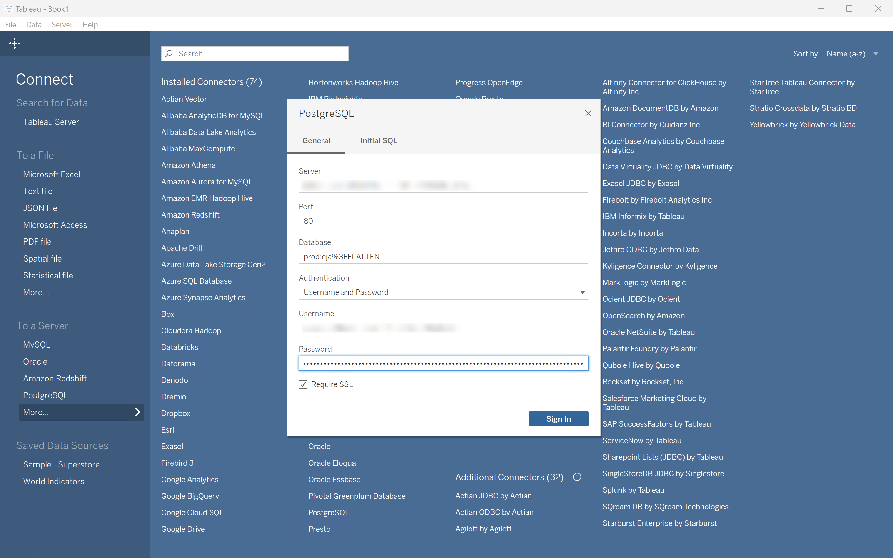

# BI擴充功能使用案例

本文提供許多使用案例，說明如何跨不同BI工具使用BI擴充功能。

已記錄下列使用案例：

1. [連線並列出資料檢視](#connect-and-list-data-views)。
1. [每日趨勢](#daily-trend)。
1. [每小時趨勢](#hourly-trend)。
1. [每月趨勢](#monthly-trend)。
1. [單一維度排名](#single-dimension-ranked)。
1. [多個維度排名](#multiple-dimension-ranked)。
1. [計算不同的維度值](#count-distinct-dimension-values)。
1. [使用日期範圍名稱來篩選](#use-date-range-names-to-filter)。
1. [使用篩選器名稱來篩選](#use-filter-names-to-filter)。
1. [使用維度值來篩選](#use-dimension-values-to-filter)。
1. [排序](#sort)。
1. [限制](#limits)。
1. [是否平面化](#to-flatten-or-not)。
1. [Dimension和量度轉換](#dimension-and-metric-transformations)。
1. [視覺效果和互動](#visualizations-and-interactions)。

對於每個使用案例，**詳細資料**&#x200B;區段中的下列BI工具都有相關指示：

* Power BI桌上型電腦(2.136.1478.0版64位元（2024年9月）)
* Tableau桌上型電腦(2024.1.5版，20241.24.0705.0334) 64位元

指示參考名為&#x200B;**[!UICONTROL public.cc_data_view]**&#x200B;的範例資料檢視、兩個範例維度（**[!UICONTROL 產品名稱]**&#x200B;和&#x200B;**[!UICONTROL 產品類別]**）和兩個範例量度（**[!UICONTROL 購買]**&#x200B;和&#x200B;**[!UICONTROL 購買收入]**）。 依照指示操作時，請視需要修改您特定環境的這些範例物件。

## 連線並列出資料檢視

此使用案例會設定從BI工具到Customer Journey Analytics的連線，並列出可用的資料檢視以成功測試連線。

+++ 詳細資料

>[!BEGINTABS]

>[!TAB Power BI案頭]

1. 從Experience Platform查詢服務UI存取所需的認證和引數。

   1. 導覽至您的Experience Platform沙箱。
   1. 從左側邊欄選取 **[!UICONTROL 查詢]**。
   1. 在&#x200B;**[!UICONTROL 查詢]**&#x200B;介面中選取&#x200B;**[!UICONTROL 認證]**&#x200B;標籤。
   1. 從&#x200B;**[!UICONTROL 資料庫]**&#x200B;下拉式功能表中選取`prod:cja`。

      

1. 開啟Power BI案頭。
1. 從主介面中，選取&#x200B;**[!UICONTROL 從其他來源取得資料]**。
1. 在&#x200B;**[!UICONTROL 取得資料]**對話方塊中：
   
   1. 搜尋並選取&#x200B;**[!UICONTROL PostgreSQL資料庫]**。
   1. 選取&#x200B;**[!UICONTROL 連線]**。
1. 在&#x200B;**[!UICONTROL PostgreSQL資料庫]**對話方塊中：
   
   1. 使用從Experience Platform **[!UICONTROL 查詢]** **[!UICONTROL 到期認證]**&#x200B;中複製並貼上&#x200B;**[!UICONTROL 主機]**&#x200B;和&#x200B;**[!UICONTROL 連線埠]**&#x200B;值，以`:`分隔，作為&#x200B;**[!UICONTROL 伺服器]**&#x200B;的值。 例如：`examplecompany.platform-query.adobe.io:80`。
   1. 使用從Experience Platform **[!UICONTROL 查詢]** **[!UICONTROL 到期的認證]**&#x200B;複製並貼上&#x200B;**[!UICONTROL 資料庫]**&#x200B;值。 將`?FLATTEN`新增至您貼上的值。 例如，`prod:cja?FLATTEN`。
   1. 選取&#x200B;**[!UICONTROL DirectQuery]**&#x200B;作為[!UICONTROL 資料連線模式]。
   1. 選取&#x200B;**[!UICONTROL 確定]**。
1. 在&#x200B;**[!UICONTROL PostgreSQL資料庫]** - **[!UICONTROL 資料庫]**對話方塊中：
   
   1. 使用從&#x200B;**[!UICONTROL 使用者名稱]**&#x200B;和&#x200B;**[!UICONTROL 密碼]**&#x200B;欄位的Experience Platform **[!UICONTROL 查詢]** **[!UICONTROL 到期認證]**&#x200B;面板中複製&#x200B;**[!UICONTROL 使用者名稱]**&#x200B;和&#x200B;**[!UICONTROL 密碼]**&#x200B;值。 如果您使用[不會到期的認證](https://experienceleague.adobe.com/en/docs/experience-platform/query/ui/credentials?lang=en#use-credential-to-connect)，請使用不會到期的認證的密碼。
   1. 確定&#x200B;**[!UICONTROL 的下拉式功能表選取要套用這些設定至]**&#x200B;的層級，已設定為您先前定義的&#x200B;**[!UICONTROL 伺服器]**。
   1. 選取&#x200B;**[!UICONTROL 連線]**。
1. 在&#x200B;**[!UICONTROL 導覽器]**對話方塊中，會擷取資料檢視。 此擷取作業可能需要一些時間。 擷取之後：
   
   1. 從左側面板的清單中選取&#x200B;**[!UICONTROL public.cc_data_view]**。
   1. 選取&#x200B;**[!UICONTROL 載入]**。
1. 一段時間後，可用的量度和維度會顯示在&#x200B;**[!UICONTROL 資料]**窗格中。
   已載入

>[!TAB Tableau案頭]

1. 從Experience Platform查詢服務UI存取所需的認證和引數。

   1. 導覽至您的Experience Platform沙箱。
   1. 從左側邊欄選取 **[!UICONTROL 查詢]**。
   1. 在&#x200B;**[!UICONTROL 查詢]**&#x200B;介面中選取&#x200B;**[!UICONTROL 認證]**&#x200B;標籤。
   1. 從&#x200B;**[!UICONTROL 資料庫]**&#x200B;下拉式功能表中選取`prod:cja`。

      

1. 開啟Tableau
1. 從&#x200B;**[!UICONTROL 下的左側邊欄選取**[!UICONTROL  PostgreSQL ]**以連線至伺服器]**。 如果無法取得，請選取&#x200B;**[!UICONTROL 更多……]**，然後從&#x200B;**[!UICONTROL 安裝的聯結器]**&#x200B;中選取&#x200B;**[!UICONTROL PostgreSQL]**。
   
1. 在&#x200B;**[!UICONTROL PostgreSQL]**&#x200B;對話方塊的&#x200B;**[!UICONTROL 一般]**索引標籤中：
   
   1. 使用將&#x200B;**[!UICONTROL 主機]**&#x200B;從Experience Platform **[!UICONTROL 查詢]** **[!UICONTROL 到期認證]**&#x200B;複製並貼到&#x200B;**[!UICONTROL 伺服器]**。
   1. 使用將&#x200B;**[!UICONTROL 連線埠]**&#x200B;從Experience Platform **[!UICONTROL 查詢]** **[!UICONTROL 到期認證]**&#x200B;複製並貼到&#x200B;**[!UICONTROL 連線埠]**。
   1. 使用將&#x200B;**[!UICONTROL 資料庫]**&#x200B;從Experience Platform **[!UICONTROL 查詢]** **[!UICONTROL 到期認證]**&#x200B;複製並貼到&#x200B;**[!UICONTROL 資料庫]**。 將`%3FFLATTEN`新增至您貼上的值。 例如：`prod:cja%3FFLATTEN`。
   1. 從&#x200B;**[!UICONTROL 驗證]**&#x200B;下拉式功能表中選取&#x200B;**[!UICONTROL 使用者名稱和密碼]**。
   1. 使用將&#x200B;**[!UICONTROL 使用者名稱]**&#x200B;從Experience Platform **[!UICONTROL 查詢]** **[!UICONTROL 到期認證]**&#x200B;複製並貼到&#x200B;**[!UICONTROL 使用者名稱]**。
   1. 使用將&#x200B;**[!UICONTROL 密碼]**&#x200B;從Experience Platform **[!UICONTROL 查詢]** **[!UICONTROL 到期認證]**&#x200B;複製並貼到&#x200B;**[!UICONTROL 密碼]**。 如果您使用[不會到期的認證](https://experienceleague.adobe.com/en/docs/experience-platform/query/ui/credentials?lang=en#use-credential-to-connect)，請使用不會到期的認證的密碼。
   1. 請確定已核取&#x200B;**[!UICONTROL 需要SSL]**。
   1. 選取「**[!UICONTROL 登入]**」。

   Tableau Desktop驗證連線時，您看到&#x200B;**[!UICONTROL 處理中要求]**&#x200B;對話方塊。
1. 在主視窗中，您會在左側窗格的Data Source檢視中看到：
   * **[!UICONTROL 連線]**&#x200B;下的連線名稱。
   * **[!UICONTROL 資料庫]**&#x200B;底下的資料庫名稱。
   * **[!UICONTROL 表格]**下的表格清單。
     
   1. 將&#x200B;**[!UICONTROL cc_data_view]**&#x200B;專案拖放到顯示&#x200B;**[!UICONTROL 將表格]**&#x200B;拖曳到此處的主檢視上。
1. 主視窗現在會顯示&#x200B;**[!UICONTROL cc_data_view]**資料檢視的詳細資料。
   

>[!ENDTABS]

+++

## 每日趨勢

在此使用案例中，您想要顯示一個表格和簡單的線條視覺效果，顯示從2023年1月1日到2023年1月31日的每日發生次數趨勢。

+++ 詳細資料

>[!PREREQUISITES]
>
>請確認您已驗證[成功的連線，並且可以列出您想要嘗試此使用案例之BI工具的資料檢視](#connect-and-list-data-views)。
>

>[!BEGINTABS]

>[!TAB Power BI案頭]

1. 在&#x200B;**[!UICONTROL 資料]**&#x200B;窗格中：
   1. 選取&#x200B;**[!UICONTROL daterangeday]**&#x200B;維度。
   1. 選取&#x200B;**[!UICONTROL 發生次數]**&#x200B;量度。

   您會看到一個表格，其中顯示當月的發生次數。 為獲得更好的可見度，請放大表格視覺效果。

1. 在&#x200B;**[!UICONTROL 篩選器]**&#x200B;窗格中：

   1. 從這個視覺效果&#x200B;]**上的**[!UICONTROL &#x200B;篩選條件中選取&#x200B;**[!UICONTROL daterangeday is (All)]**。
   1. 選取&#x200B;**[!UICONTROL 進階篩選]**&#x200B;作為&#x200B;**[!UICONTROL 篩選型別]**。
   1. 定義篩選器以&#x200B;**[!UICONTROL 當值]** **[!UICONTROL 位於或晚於]** `1/1/2023` **[!UICONTROL 且]** **[!UICONTROL 位於]** `1/2/2023.`時顯示專案。您可以使用行事曆圖示挑選和選取日期。
   1. 選取&#x200B;**[!UICONTROL 套用篩選器]**。

   您會看到已套用&#x200B;**[!UICONTROL daterangeday]**&#x200B;篩選器的資料表已更新。

1. 在&#x200B;**[!UICONTROL 視覺效果]**&#x200B;窗格中：

   1. 選取&#x200B;**[!UICONTROL 折線圖]**&#x200B;視覺效果。

   使用與表格相同的資料時，折線圖視覺效果會取代表格。

   

1. 線上圖視覺效果上：

   1. 選取。
   1. 從內容功能表中，選取&#x200B;**[!UICONTROL 顯示為表格]**。

   主要檢視已更新，顯示線條視覺效果和表格。

   

>[!TAB Tableau案頭]

1. 選取底部的&#x200B;**[!UICONTROL 工作表1]**&#x200B;索引標籤，以從&#x200B;**[!UICONTROL 資料來源]**&#x200B;切換。 在&#x200B;**[!UICONTROL 工作表1]**&#x200B;檢視中：
   1. 從&#x200B;**[!UICONTROL 資料]**&#x200B;窗格的&#x200B;**[!UICONTROL 表格]**&#x200B;清單中拖曳&#x200B;**[!UICONTROL 日期範圍]**&#x200B;專案，並將該專案拖放至&#x200B;**[!UICONTROL 篩選器]**&#x200B;托架。
   1. 在&#x200B;**[!UICONTROL 篩選器欄位\[日期範圍\]]**&#x200B;對話方塊中，選取&#x200B;**[!UICONTROL 日期範圍]**&#x200B;並選取&#x200B;**[!UICONTROL 下一步>]**。
   1. 在&#x200B;**[!UICONTROL 篩選器\[日期範圍]]**&#x200B;對話方塊中，選取&#x200B;**[!UICONTROL 日期範圍]**&#x200B;並指定`01/01/2023` - `01/02/2023`的期間。

      

   1. 從&#x200B;**[!UICONTROL 資料]**&#x200B;窗格的&#x200B;**[!UICONTROL 表格]**&#x200B;清單中拖放&#x200B;**[!UICONTROL Daterangeday]**，並將專案拖放到&#x200B;**[!UICONTROL 欄]**&#x200B;旁的欄位中。
      * 從&#x200B;**[!UICONTROL Daterangeday]**&#x200B;下拉式功能表中選取&#x200B;**[!UICONTROL Day]**，以便將值更新為&#x200B;**[!UICONTROL DAY(Daterangeday)]**。
   1. 從&#x200B;**[!UICONTROL 資料]**&#x200B;窗格中的&#x200B;**[!UICONTROL 資料表（*量值名稱*）]**&#x200B;清單拖放&#x200B;**[!UICONTROL 發生次數]**，並將專案拖放到&#x200B;**[!UICONTROL 資料列]**&#x200B;旁的欄位中。
      * 值會自動轉換為&#x200B;**[!UICONTROL SUM（發生次數）]**。
   1. 從工具列的下拉式功能表，將&#x200B;**[!UICONTROL Standard]**&#x200B;修改為&#x200B;**[!UICONTROL 整個檢視]**。

      您的工作表1檢視應如下所示。

      

1. 從&#x200B;**[!UICONTROL 工作表1]**&#x200B;索引標籤內容功能表中選取&#x200B;**[!UICONTROL 複製]**&#x200B;以建立第二個工作表。
1. 從&#x200B;**[!UICONTROL 工作表1]**&#x200B;索引標籤內容功能表中選取&#x200B;**[!UICONTROL 重新命名]**，以將工作表重新命名為`Graph`。
1. 從&#x200B;**[!UICONTROL 工作表1 (2)]**&#x200B;索引標籤內容功能表中選取&#x200B;**[!UICONTROL 重新命名]**，以將工作表重新命名為`Data`。
1. 請確定已選取&#x200B;**[!UICONTROL 資料]**&#x200B;工作表。 在資料檢視中：
   1. 選取右上方的&#x200B;**[!UICONTROL 顯示我]**，並選取&#x200B;**[!UICONTROL 文字表格]** （左上方的視覺效果），將資料檢視的內容修改成表格。
   1. 將&#x200B;**[!UICONTROL DAY(Daterangeday)]**&#x200B;從&#x200B;**[!UICONTROL 欄]**&#x200B;拖曳至&#x200B;**[!UICONTROL 列]**。
   1. 從工具列的下拉式功能表，將&#x200B;**[!UICONTROL Standard]**&#x200B;修改為&#x200B;**[!UICONTROL 整個檢視]**。

      您的&#x200B;**[!UICONTROL 資料]**&#x200B;檢視應如下所示。

      

1. 選取「**[!UICONTROL 新儀表板]**」索引標籤按鈕（在底部）以建立新的&#x200B;**[!UICONTROL 儀表板1]**&#x200B;檢視。 在&#x200B;**[!UICONTROL 儀表板1]**&#x200B;檢視中：
   1. 將&#x200B;**[!UICONTROL Graph]**&#x200B;工作表從&#x200B;**[!UICONTROL 工作表]**&#x200B;擱板拖放到&#x200B;**[!UICONTROL 儀表板1]**&#x200B;檢視（顯示&#x200B;*將工作表拖放至此*）。
   1. 將&#x200B;**[!UICONTROL 資料]**&#x200B;工作表從&#x200B;**[!UICONTROL 圖形]**&#x200B;工作表下方的&#x200B;**[!UICONTROL 工作表]**&#x200B;托架拖放至&#x200B;**[!UICONTROL 儀表板1]**&#x200B;檢視。
   1. 在檢視中選取&#x200B;**[!UICONTROL 資料]**&#x200B;工作表，並將&#x200B;**[!UICONTROL 整個檢視]**&#x200B;修改為&#x200B;**[!UICONTROL 固定寬度]**。

      您的&#x200B;**[!UICONTROL 儀表板1]**&#x200B;檢視應如下所示。

      

>[!ENDTABS]

+++

## 每小時趨勢

在此使用案例中，您想要顯示表格和簡單的線條視覺效果，以顯示2023年1月1日發生次數的每小時趨勢。

+++ 詳細資料

>[!PREREQUISITES]
>
>請確認您已驗證[成功的連線，並且可以列出您想要嘗試此使用案例之BI工具的資料檢視](#connect-and-list-data-views)。
>

>[!BEGINTABS]

>[!TAB Power BI案頭]

Power BI **不**&#x200B;瞭解如何處理日期時間欄，所以不支援&#x200B;**[!UICONTROL daterangehour]**&#x200B;和&#x200B;**[!UICONTROL daterangeminute]**&#x200B;等維度。

>[!TAB Tableau案頭]

1. 選取底部的&#x200B;**[!UICONTROL 工作表1]**&#x200B;索引標籤，以從&#x200B;**[!UICONTROL 資料來源]**&#x200B;切換。 在&#x200B;**[!UICONTROL 工作表1]**&#x200B;檢視中：
   1. 從&#x200B;**[!UICONTROL 資料]**&#x200B;窗格的&#x200B;**[!UICONTROL 表格]**&#x200B;清單中拖曳&#x200B;**[!UICONTROL 日期範圍]**&#x200B;專案，並將該專案拖放至&#x200B;**[!UICONTROL 篩選器]**&#x200B;托架。
   1. 在&#x200B;**[!UICONTROL 篩選器欄位\[日期範圍\]]**&#x200B;對話方塊中，選取&#x200B;**[!UICONTROL 日期範圍]**&#x200B;並選取&#x200B;**[!UICONTROL 下一步>]**。
   1. 在&#x200B;**[!UICONTROL 篩選器\[日期範圍]]**&#x200B;對話方塊中，選取&#x200B;**[!UICONTROL 日期範圍]**&#x200B;並指定`01/01/2023` - `02/01/2023`的期間。

      

   1. 從&#x200B;**[!UICONTROL 資料]**&#x200B;窗格的&#x200B;**[!UICONTROL 表格]**&#x200B;清單中拖放&#x200B;**[!UICONTROL Daterangehour]**，並將專案拖放到&#x200B;**[!UICONTROL 欄]**&#x200B;旁的欄位中。
      * 從&#x200B;**[!UICONTROL Daterangeday]**&#x200B;下拉式功能表中選取&#x200B;**[!UICONTROL 更多]** > **[!UICONTROL 小時]**，以便將值更新為&#x200B;**[!UICONTROL 小時(Daterangeday)]**。
   1. 從&#x200B;**[!UICONTROL 資料]**&#x200B;窗格中的&#x200B;**[!UICONTROL 資料表（*量值名稱*）]**&#x200B;清單拖放&#x200B;**[!UICONTROL 發生次數]**，並將專案拖放到&#x200B;**[!UICONTROL 資料列]**&#x200B;旁的欄位中。
      * 值會自動轉換為&#x200B;**[!UICONTROL SUM（發生次數）]**。
   1. 從工具列的下拉式功能表，將&#x200B;**[!UICONTROL Standard]**&#x200B;修改為&#x200B;**[!UICONTROL 整個檢視]**。

      您的工作表1檢視應如下所示。

      

1. 從&#x200B;**[!UICONTROL 工作表1]**&#x200B;索引標籤內容功能表中選取&#x200B;**[!UICONTROL 複製]**&#x200B;以建立第二個工作表。
1. 從&#x200B;**[!UICONTROL 工作表1]**&#x200B;索引標籤內容功能表中選取&#x200B;**[!UICONTROL 重新命名]**，以將工作表重新命名為`Graph`。
1. 從&#x200B;**[!UICONTROL 工作表1 (2)]**&#x200B;索引標籤內容功能表中選取&#x200B;**[!UICONTROL 重新命名]**，以將工作表重新命名為`Data`。
1. 請確定已選取&#x200B;**[!UICONTROL 資料]**&#x200B;工作表。 在資料檢視中：
   1. 選取右上方的&#x200B;**[!UICONTROL 顯示我]**，並選取&#x200B;**[!UICONTROL 文字表格]** （左上方的視覺效果），將資料檢視的內容修改成表格。
   1. 將&#x200B;**[!UICONTROL HOUR(Daterangeday)]**&#x200B;從&#x200B;**[!UICONTROL 欄]**&#x200B;拖曳至&#x200B;**[!UICONTROL 列]**。
   1. 從工具列的下拉式功能表，將&#x200B;**[!UICONTROL Standard]**&#x200B;修改為&#x200B;**[!UICONTROL 整個檢視]**。

      您的&#x200B;**[!UICONTROL 資料]**&#x200B;檢視應如下所示。

      

1. 選取「**[!UICONTROL 新儀表板]**」索引標籤按鈕（在底部）以建立新的&#x200B;**[!UICONTROL 儀表板1]**&#x200B;檢視。 在&#x200B;**[!UICONTROL 儀表板1]**&#x200B;檢視中：
   1. 將&#x200B;**[!UICONTROL Graph]**&#x200B;工作表從&#x200B;**[!UICONTROL 工作表]**&#x200B;擱板拖放到&#x200B;**[!UICONTROL 儀表板1]**&#x200B;檢視（顯示&#x200B;*將工作表拖放至此*）。
   1. 將&#x200B;**[!UICONTROL 資料]**&#x200B;工作表從&#x200B;**[!UICONTROL 圖形]**&#x200B;工作表下方的&#x200B;**[!UICONTROL 工作表]**&#x200B;托架拖放至&#x200B;**[!UICONTROL 儀表板1]**&#x200B;檢視。
   1. 在檢視中選取&#x200B;**[!UICONTROL 資料]**&#x200B;工作表，並將&#x200B;**[!UICONTROL 整個檢視]**&#x200B;修改為&#x200B;**[!UICONTROL 固定寬度]**。

      您的&#x200B;**[!UICONTROL 儀表板1]**&#x200B;檢視應如下所示。

      

>[!ENDTABS]

+++

## 每月趨勢

在此使用案例中，您想要顯示一個表格和簡單的線條視覺效果，以顯示2023年1月1日至2024年1月1日發生次數的每月趨勢。

+++ 詳細資料

>[!PREREQUISITES]
>
>請確認您已驗證[成功的連線，並且可以列出您想要嘗試此使用案例之BI工具的資料檢視](#connect-and-list-data-views)。
>

>[!BEGINTABS]

>[!TAB Power BI案頭]

1. 在&#x200B;**[!UICONTROL 資料]**&#x200B;窗格中：
   1. 選取&#x200B;**[!UICONTROL daterangemonth]**&#x200B;維度。
   1. 選取&#x200B;**[!UICONTROL 發生次數]**&#x200B;量度。

   您會看到一個表格，其中顯示當月的發生次數。 為獲得更好的可見度，請放大表格視覺效果。

1. 在&#x200B;**[!UICONTROL 篩選器]**&#x200B;窗格中：

   1. 從這個視覺效果&#x200B;]**上的**[!UICONTROL &#x200B;篩選條件中選取&#x200B;**[!UICONTROL daterangemonth is (All)]**。
   1. 選取&#x200B;**[!UICONTROL 進階篩選]**&#x200B;作為&#x200B;**[!UICONTROL 篩選型別]**。
   1. 定義篩選器以&#x200B;**[!UICONTROL 當值]** **[!UICONTROL 位於或晚於]** `1/1/2023` **[!UICONTROL 且]** **[!UICONTROL 位於]** `1/1/2024.`時顯示專案。您可以使用行事曆圖示挑選和選取日期。
   1. 選取&#x200B;**[!UICONTROL 套用篩選器]**。

   您會看到已套用&#x200B;**[!UICONTROL daterangeday]**&#x200B;篩選器的資料表已更新。

1. 在&#x200B;**[!UICONTROL 視覺效果]**&#x200B;窗格中：

   1. 選取&#x200B;**[!UICONTROL 折線圖]**&#x200B;視覺效果。

   使用與表格相同的資料時，折線圖視覺效果會取代表格。

   

1. 線上圖視覺效果上：

   1. 選取。
   1. 從內容功能表中，選取&#x200B;**[!UICONTROL 顯示為表格]**。

   主要檢視已更新，顯示線條視覺效果和表格。

   

>[!TAB Tableau案頭]

1. 選取底部的&#x200B;**[!UICONTROL 工作表1]**&#x200B;索引標籤，以從&#x200B;**[!UICONTROL 資料來源]**&#x200B;切換。 在&#x200B;**[!UICONTROL 工作表1]**&#x200B;檢視中：
   1. 從&#x200B;**[!UICONTROL 資料]**&#x200B;窗格的&#x200B;**[!UICONTROL 表格]**&#x200B;清單中拖曳&#x200B;**[!UICONTROL 日期範圍]**&#x200B;專案，並將該專案拖放至&#x200B;**[!UICONTROL 篩選器]**&#x200B;托架。
   1. 在&#x200B;**[!UICONTROL 篩選器欄位\[日期範圍\]]**&#x200B;對話方塊中，選取&#x200B;**[!UICONTROL 日期範圍]**&#x200B;並選取&#x200B;**[!UICONTROL 下一步>]**。
   1. 在&#x200B;**[!UICONTROL 篩選器\[日期範圍]]**&#x200B;對話方塊中，選取&#x200B;**[!UICONTROL 日期範圍]**&#x200B;並指定`01/01/2023` - `01/01/2024`的期間。

      

   1. 從&#x200B;**[!UICONTROL 資料]**&#x200B;窗格的&#x200B;**[!UICONTROL 表格]**&#x200B;清單中拖放&#x200B;**[!UICONTROL Daterangeday]**，並將專案拖放到&#x200B;**[!UICONTROL 欄]**&#x200B;旁的欄位中。
      * 從&#x200B;**[!UICONTROL Daterangeday]**&#x200B;下拉式功能表中選取&#x200B;**[!UICONTROL MONTH]**，以便將值更新為&#x200B;**[!UICONTROL MONTH(Daterangeday)]**。
   1. 從&#x200B;**[!UICONTROL 資料]**&#x200B;窗格中的&#x200B;**[!UICONTROL 資料表（*量值名稱*）]**&#x200B;清單拖放&#x200B;**[!UICONTROL 發生次數]**，並將專案拖放到&#x200B;**[!UICONTROL 資料列]**&#x200B;旁的欄位中。
      * 值會自動轉換為&#x200B;**[!UICONTROL SUM（發生次數）]**。
   1. 從工具列的下拉式功能表，將&#x200B;**[!UICONTROL Standard]**&#x200B;修改為&#x200B;**[!UICONTROL 整個檢視]**。

      您的工作表1檢視應如下所示。

      

1. 從&#x200B;**[!UICONTROL 工作表1]**&#x200B;索引標籤內容功能表中選取&#x200B;**[!UICONTROL 複製]**&#x200B;以建立第二個工作表。
1. 從&#x200B;**[!UICONTROL 工作表1]**&#x200B;索引標籤內容功能表中選取&#x200B;**[!UICONTROL 重新命名]**，以將工作表重新命名為`Graph`。
1. 從&#x200B;**[!UICONTROL 工作表1 (2)]**&#x200B;索引標籤內容功能表中選取&#x200B;**[!UICONTROL 重新命名]**，以將工作表重新命名為`Data`。
1. 請確定已選取&#x200B;**[!UICONTROL 資料]**&#x200B;工作表。 在資料檢視中：
   1. 選取右上方的&#x200B;**[!UICONTROL 顯示我]**，並選取&#x200B;**[!UICONTROL 文字表格]** （左上方的視覺效果），將資料檢視的內容修改成表格。
   1. 將&#x200B;**[!UICONTROL MONTH(Daterangeday)]**&#x200B;從&#x200B;**[!UICONTROL 欄]**&#x200B;拖曳至&#x200B;**[!UICONTROL 列]**。
   1. 從工具列的下拉式功能表，將&#x200B;**[!UICONTROL Standard]**&#x200B;修改為&#x200B;**[!UICONTROL 整個檢視]**。

      您的&#x200B;**[!UICONTROL 資料]**&#x200B;檢視應如下所示。

      

1. 選取「**[!UICONTROL 新儀表板]**」索引標籤按鈕（在底部）以建立新的&#x200B;**[!UICONTROL 儀表板1]**&#x200B;檢視。 在&#x200B;**[!UICONTROL 儀表板1]**&#x200B;檢視中：
   1. 將&#x200B;**[!UICONTROL Graph]**&#x200B;工作表從&#x200B;**[!UICONTROL 工作表]**&#x200B;擱板拖放到&#x200B;**[!UICONTROL 儀表板1]**&#x200B;檢視（顯示&#x200B;*將工作表拖放至此*）。
   1. 將&#x200B;**[!UICONTROL 資料]**&#x200B;工作表從&#x200B;**[!UICONTROL 圖形]**&#x200B;工作表下方的&#x200B;**[!UICONTROL 工作表]**&#x200B;托架拖放至&#x200B;**[!UICONTROL 儀表板1]**&#x200B;檢視。
   1. 在檢視中選取&#x200B;**[!UICONTROL 資料]**&#x200B;工作表，並將&#x200B;**[!UICONTROL 整個檢視]**&#x200B;修改為&#x200B;**[!UICONTROL 固定寬度]**。

      您的&#x200B;**[!UICONTROL 儀表板1]**&#x200B;檢視應如下所示。

      

>[!ENDTABS]

+++

## 單一維度排名

使用案例的摘要

+++ 詳細資料

>[!PREREQUISITES]
>
>請確認您已驗證[成功的連線，並且可以列出您想要嘗試此使用案例之BI工具的資料檢視](#connect-and-list-data-views)。
>

>[!BEGINTABS]

>[!TAB Power BI案頭]

步驟

>[!TAB Tableau案頭]

步驟

>[!ENDTABS]

+++

## 多個維度排名

使用案例的摘要

+++ 詳細資料

>[!BEGINTABS]

>[!TAB Power BI案頭]

步驟

>[!TAB Tableau案頭]

步驟

>[!ENDTABS]

+++

## 計算不同的維度值

使用案例的摘要

+++ 詳細資料

>[!BEGINTABS]

>[!TAB Power BI案頭]

步驟

>[!TAB Tableau案頭]

步驟

>[!ENDTABS]

+++

## 使用日期範圍名稱進行篩選

使用案例的摘要

+++ 詳細資料

>[!BEGINTABS]

>[!TAB Power BI案頭]

步驟

>[!TAB Tableau案頭]

步驟

>[!ENDTABS]

+++

## 使用篩選器名稱來篩選

使用案例的摘要

+++ 詳細資料

>[!BEGINTABS]

>[!TAB Power BI案頭]

步驟

>[!TAB Tableau案頭]

步驟

>[!ENDTABS]

+++

## 使用維度值來篩選

使用案例的摘要

+++ 詳細資料

>[!BEGINTABS]

>[!TAB Power BI案頭]

步驟

>[!TAB Tableau案頭]

步驟

>[!ENDTABS]

+++

## 排序

使用案例的摘要

+++ 詳細資料

>[!BEGINTABS]

>[!TAB Power BI案頭]

步驟

>[!TAB Tableau案頭]

步驟

>[!ENDTABS]

+++

## 限制

使用案例的摘要

+++ 詳細資料

>[!BEGINTABS]

>[!TAB Power BI案頭]

步驟

>[!TAB Tableau案頭]

步驟

>[!ENDTABS]

+++

## 是否平面化

使用案例的摘要

+++ 詳細資料

>[!BEGINTABS]

>[!TAB Power BI案頭]

步驟

>[!TAB Tableau案頭]

步驟

>[!ENDTABS]

+++

## Dimension和量度轉換

使用案例的摘要

+++ 詳細資料

>[!BEGINTABS]

>[!TAB Power BI案頭]

步驟

>[!TAB Tableau案頭]

步驟

>[!ENDTABS]

+++

## 視覺效果和互動

使用案例的摘要

+++ 詳細資料

>[!BEGINTABS]

>[!TAB Power BI案頭]

步驟

>[!TAB Tableau案頭]

步驟

>[!ENDTABS]

+++

