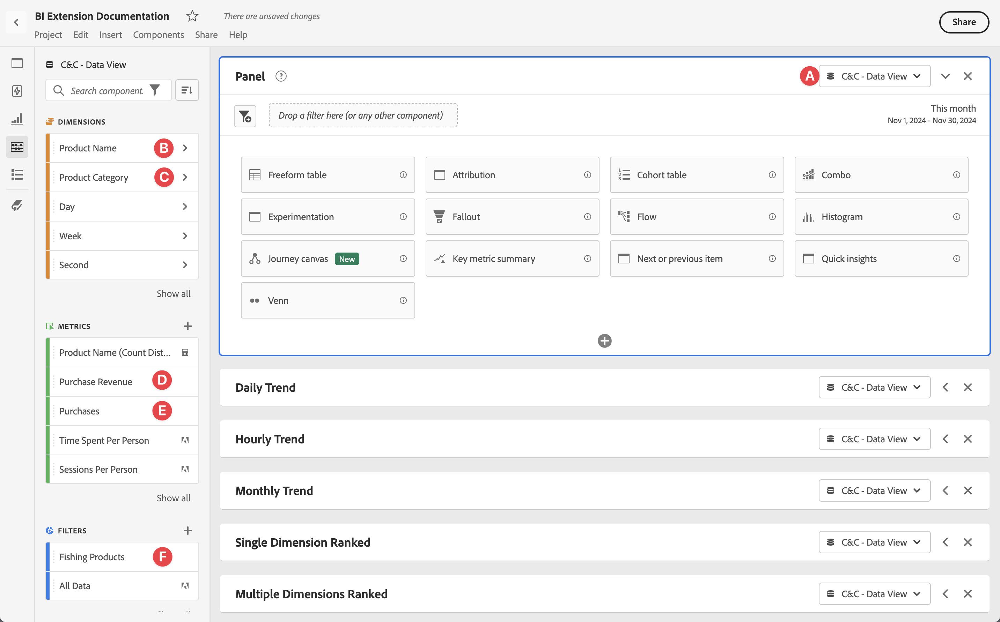
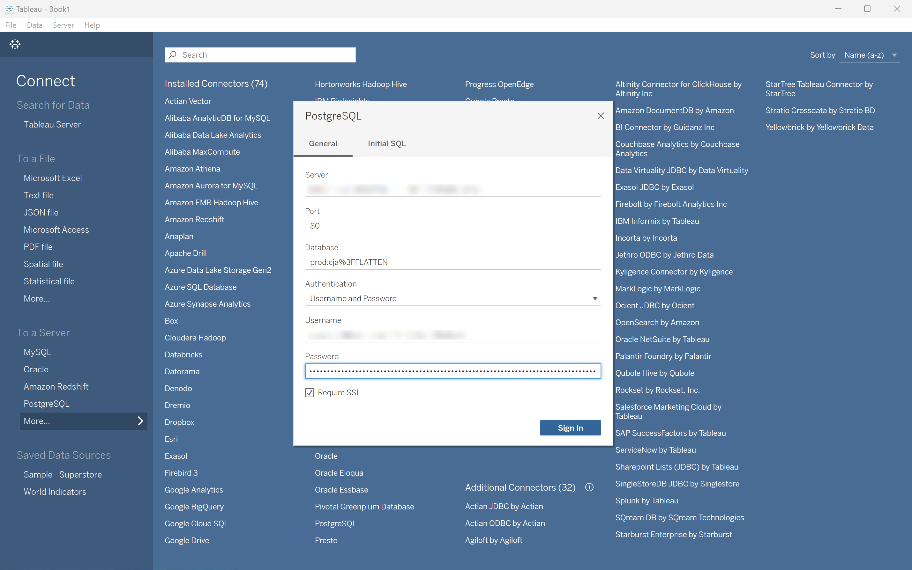
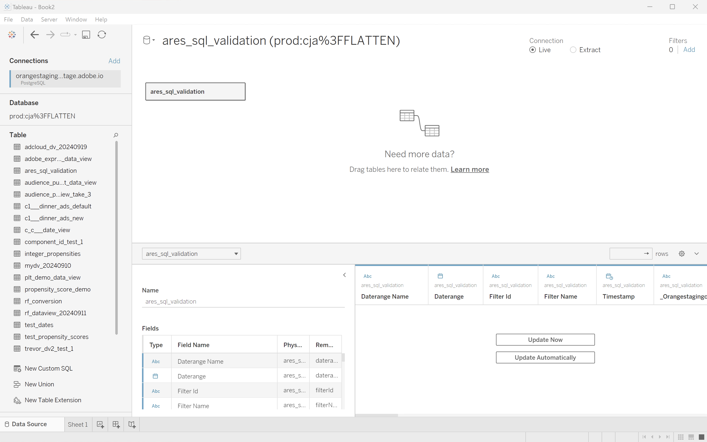

# 連線並驗證


此使用案例會設定從BI工具到Customer Journey Analytics的連線、列出可用的資料檢視，並選取要使用的資料檢視。

+++ Customer Journey Analytics

這些指示參考到包含以下物件的範例環境：

* 資料檢視： **[!UICONTROL C&amp;C — 資料檢視]** 🅐。
* 維度： **[!UICONTROL 產品名稱]** 🅑和&#x200B;**[!UICONTROL 產品類別]** 🅒。
* 量度： **[!UICONTROL 購買收入]** 🅓和&#x200B;**[!UICONTROL 購買]** 🅔。
* 篩選器： **[!UICONTROL 釣魚產品]** 🅕。



當您進行使用案例時，請將這些範例物件取代為您特定環境的物件。

+++

+++ BI 工具

>[!BEGINTABS]

>[!TAB Power BI案頭版]

1. 從Experience Platform查詢服務UI存取必要的認證和引數。

   1. 導覽至您的Experience Platform沙箱。
   1. 從左側邊欄選取 **[!UICONTROL 查詢]**。
   1. 在&#x200B;**[!UICONTROL 查詢]**&#x200B;介面中選取&#x200B;**[!UICONTROL 認證]**&#x200B;標籤。
   1. 從&#x200B;**[!UICONTROL 資料庫]**&#x200B;下拉式功能表中選取`prod:cja`。

      

1. 啟動Power BI Desktop。
   1. 從主介面中，選取&#x200B;**[!UICONTROL 從其他來源取得資料]**。
   1. 在&#x200B;**[!UICONTROL 取得資料]**&#x200B;對話方塊中：
      
      1. 搜尋並選取&#x200B;**[!UICONTROL PostgreSQL資料庫]**。
      1. 選取&#x200B;**[!UICONTROL 連線]**。
   1. 在&#x200B;**[!UICONTROL PostgreSQL資料庫]**&#x200B;對話方塊中：
      
      1. 使用從Experience Platform **[!UICONTROL 查詢]** **[!UICONTROL 到期認證]**&#x200B;面板複製並貼上&#x200B;**[!UICONTROL 主機]**&#x200B;和&#x200B;**[!UICONTROL 連線埠]**&#x200B;值，以`:`分隔，做為&#x200B;**[!UICONTROL 伺服器]**&#x200B;的值。 例如：`examplecompany.platform-query.adobe.io:80`。
      1. 使用從Experience Platform **[!UICONTROL 查詢]** **[!UICONTROL 到期認證]**&#x200B;面板複製並貼上&#x200B;**[!UICONTROL 資料庫]**&#x200B;值。 將`?FLATTEN`新增至您貼上的值。 例如，`prod:cja?FLATTEN`。
      1. 選取&#x200B;**[!UICONTROL DirectQuery]**&#x200B;作為&#x200B;**[!UICONTROL 資料連線模式]**。
      1. 選取&#x200B;**[!UICONTROL 確定]**。
   1. 在&#x200B;**[!UICONTROL PostgreSQL資料庫]** - **[!UICONTROL 資料庫]**&#x200B;對話方塊中：
      
      1. 使用從&#x200B;**[!UICONTROL 使用者名稱]**&#x200B;和&#x200B;**[!UICONTROL 密碼]**&#x200B;欄位的Experience Platform **[!UICONTROL 查詢]** **[!UICONTROL 到期認證]**&#x200B;面板中複製&#x200B;**[!UICONTROL 使用者名稱]**&#x200B;和&#x200B;**[!UICONTROL 密碼]**&#x200B;值。 如果您使用[不會到期的認證](https://experienceleague.adobe.com/zh-hant/docs/experience-platform/query/ui/credentials?lang=en#use-credential-to-connect)，請使用不會到期的認證的密碼。
      1. 確定&#x200B;**[!UICONTROL 的下拉式功能表「選取要套用這些設定至]**&#x200B;的層級」已設定為您先前定義的&#x200B;**[!UICONTROL 伺服器]**。
      1. 選取&#x200B;**[!UICONTROL 連線]**。
   1. 在&#x200B;**[!UICONTROL 導覽器]**&#x200B;對話方塊中，會擷取資料檢視。 此擷取作業可能需要一些時間。 擷取後，您會在Power BI Desktop中看到下列內容。
      
      1. 從左側面板的清單中選取&#x200B;**[!UICONTROL public.cc_data_view]**。
      1. 您有兩個選項：
         1. 選取&#x200B;**[!UICONTROL 載入]**&#x200B;以繼續並完成設定。
         1. 選取&#x200B;**[!UICONTROL 轉換資料]**。 您會看到一個對話方塊，您可以選擇將轉換套用為組態的一部分。
            
            * 選取&#x200B;**[!UICONTROL 關閉並套用]**。
   1. 一段時間後，**[!UICONTROL public.cc_data_view]**&#x200B;會顯示在&#x200B;**[!UICONTROL 資料]**&#x200B;窗格中。 選取以顯示維度和量度。
      


## 是否平面化

Power BI Desktop支援下列`FLATTEN`引數案例。 如需詳細資訊，請參閱[平面化巢狀資料](https://experienceleague.adobe.com/zh-hant/docs/experience-platform/query/key-concepts/flatten-nested-data)。

| FLATTEN引數 | 範例 | 支援 | 備註 |
|---|---|:---:|---|
| 無 | `prod:cja` |  | |
| `?FLATTEN` | `prod:cja?FLATTEN` |  | **建議使用的選項！** |
| `%3FFLATTEN` | `prod:cja%3FFLATTEN` |  | Power BI案頭顯示錯誤： **[!UICONTROL 無法使用提供的認證進行驗證。 請再試一次。]** |

### 更多資訊

* [先決條件](/help/data-views/bi-extension.md#prerequisites)
* [認證指南](https://experienceleague.adobe.com/zh-hant/docs/experience-platform/query/ui/credentials)
* [將Power BI連線至查詢服務](https://experienceleague.adobe.com/zh-hant/docs/experience-platform/query/clients/power-bi)。


>[!TAB Tableau案頭]

1. 從Experience Platform查詢服務UI存取必要的認證和引數。

   1. 導覽至您的Experience Platform沙箱。
   1. 從左側邊欄選取 **[!UICONTROL 查詢]**。
   1. 在&#x200B;**[!UICONTROL 查詢]**&#x200B;介面中選取&#x200B;**[!UICONTROL 認證]**&#x200B;標籤。
   1. 從&#x200B;**[!UICONTROL 資料庫]**&#x200B;下拉式功能表中選取`prod:cja`。

      

1. 啟動Tableau。
   1. 從&#x200B;**[!UICONTROL 下的左側邊欄選取**&#x200B;[!UICONTROL &#x200B; PostgreSQL &#x200B;]&#x200B;**以連線至伺服器]**。 如果無法取得，請選取&#x200B;**[!UICONTROL 更多……]**，然後從&#x200B;**[!UICONTROL 安裝的聯結器]**&#x200B;中選取&#x200B;**[!UICONTROL PostgreSQL]**。
      
   1. 在&#x200B;**[!UICONTROL PostgreSQL]**&#x200B;對話方塊的&#x200B;**[!UICONTROL 一般]**&#x200B;索引標籤中：
      
      1. 使用將&#x200B;**[!UICONTROL 主機]**&#x200B;從Experience Platform **[!UICONTROL 查詢]** **[!UICONTROL 到期認證]**&#x200B;面板複製並貼到&#x200B;**[!UICONTROL 伺服器]**。
      1. 使用將&#x200B;**[!UICONTROL 連線埠]**&#x200B;從Experience Platform **[!UICONTROL 查詢]** **[!UICONTROL 到期認證]**&#x200B;面板複製並貼到&#x200B;**[!UICONTROL 連線埠]**。
      1. 使用將&#x200B;**[!UICONTROL 資料庫]**&#x200B;從Experience Platform **[!UICONTROL 查詢]** **[!UICONTROL 到期認證]**&#x200B;面板複製並貼到&#x200B;**[!UICONTROL 資料庫]**。 將`%3FFLATTEN`新增至您貼上的值。 例如：`prod:cja%3FFLATTEN`。
      1. 從&#x200B;**[!UICONTROL 驗證]**&#x200B;下拉式功能表中選取&#x200B;**[!UICONTROL 使用者名稱和密碼]**。
      1. 使用將&#x200B;**[!UICONTROL 使用者名稱]**&#x200B;從Experience Platform **[!UICONTROL 查詢]** **[!UICONTROL 到期認證]**&#x200B;面板複製並貼到&#x200B;**[!UICONTROL 使用者名稱]**。
      1. 使用將&#x200B;**[!UICONTROL 密碼]**&#x200B;從Experience Platform **[!UICONTROL 查詢]** **[!UICONTROL 到期認證]**&#x200B;面板複製並貼到&#x200B;**[!UICONTROL 密碼]**。 如果您使用[不會到期的認證](https://experienceleague.adobe.com/zh-hant/docs/experience-platform/query/ui/credentials?lang=en#use-credential-to-connect)，請使用不會到期的認證的密碼。
      1. 請確定已核取&#x200B;**[!UICONTROL 需要SSL]**。
      1. 選取「**[!UICONTROL 登入]**」。

      Tableau Desktop驗證連線時，您看到&#x200B;**[!UICONTROL 處理中要求]**&#x200B;對話方塊。
   1. 在主視窗中，您會在左窗格的&#x200B;**[!UICONTROL 資料Source]**&#x200B;頁面中看到：
      * **[!UICONTROL 連線]**&#x200B;下的連線名稱。
      * **[!UICONTROL 資料庫]**&#x200B;底下的資料庫名稱。
      * **[!UICONTROL 表格]**&#x200B;下的表格清單。
        
      1. 將&#x200B;**[!UICONTROL cc_data_view]**&#x200B;專案拖放到顯示&#x200B;**[!UICONTROL 將表格]**&#x200B;拖曳到此處的主檢視上。
   1. 主視窗會顯示&#x200B;**[!UICONTROL cc_data_view]**&#x200B;資料檢視的詳細資料。
      

## 是否平面化

Tableau Desktop支援下列`FLATTEN`引數案例。 如需詳細資訊，請參閱[平面化巢狀資料](https://experienceleague.adobe.com/zh-hant/docs/experience-platform/query/key-concepts/flatten-nested-data)。

| FLATTEN引數 | 範例 | 支援 | 備註 |
|---|---|:---:|---|
| 無 | `prod:cja` |  | |
| `?FLATTEN` | `prod:cja?FLATTEN` |  | |
| `%3FFLATTEN` | `prod:cja%3FFLATTEN` |  | **建議使用的選項**。 請注意，`%3FFLATTEN`是`?FLATTEN`的URL編碼版本。 |

## 更多資訊

* [先決條件](/help/data-views/bi-extension.md#prerequisites)
* [認證指南](https://experienceleague.adobe.com/zh-hant/docs/experience-platform/query/ui/credentials)
* [將Tableau案頭連線至查詢服務](https://experienceleague.adobe.com/zh-hant/docs/experience-platform/query/clients/tableau)。


>[!TAB 觀察者]

1. 從Experience Platform查詢服務UI存取必要的認證和引數。

   1. 導覽至您的Experience Platform沙箱。
   1. 從左側邊欄選取 **[!UICONTROL 查詢]**。
   1. 在&#x200B;**[!UICONTROL 查詢]**&#x200B;介面中選取&#x200B;**[!UICONTROL 認證]**&#x200B;標籤。
   1. 從&#x200B;**[!UICONTROL 資料庫]**&#x200B;下拉式功能表中選取`prod:cja`。

      

1. 登入Looker

   1. 選取左邊欄的「**[!UICONTROL 管理員]**」。
   1. 選取「**[!UICONTROL 連線]**」。
   1. 選取「**[!UICONTROL 新增連線]**」。
   1. 在&#x200B;**[!UICONTROL 將資料庫連線到Looker畫面]**。

      

      1. 輸入連線的&#x200B;**[!UICONTROL 名稱]**，例如`Example Looker Connection`。
      1. 請確定已選取&#x200B;**[!UICONTROL 所有專案]**&#x200B;做為&#x200B;**[!UICONTROL 連線範圍]**。
      1. 選取&#x200B;**[!UICONTROL PostgreSQL 9.5+]**&#x200B;作為方言。
      1. 使用從Experience Platform **[!UICONTROL 查詢]** **[!UICONTROL 到期認證]**&#x200B;面板複製並貼上&#x200B;**[!UICONTROL 主機]**&#x200B;值，作為&#x200B;**[!UICONTROL 主機]**&#x200B;的值。 例如：`examplecompany.platform-query.adobe.io`。
      1. 使用從Experience Platform **[!UICONTROL 查詢]** **[!UICONTROL 到期認證]**&#x200B;面板複製並貼上&#x200B;**[!UICONTROL 連線埠]**&#x200B;值，作為&#x200B;**[!UICONTROL 連線埠]**&#x200B;的值。 例如：`80`。
      1. 使用從Experience Platform **[!UICONTROL 查詢]** **[!UICONTROL 到期認證]**&#x200B;面板複製並貼上&#x200B;**[!UICONTROL 資料庫]**&#x200B;值，作為&#x200B;**[!UICONTROL 資料庫]**&#x200B;的值。 將`%3FFLATTEN`新增至您貼上的值。 例如，`prod:cja%3FFLATTEN`。
      1. 使用從Experience Platform **[!UICONTROL 查詢]** **[!UICONTROL 到期認證]**&#x200B;面板複製並貼上&#x200B;**[!UICONTROL 使用者名稱]**&#x200B;值，作為&#x200B;**[!UICONTROL 使用者名稱]**&#x200B;的值。
      1. 使用從Experience Platform **[!UICONTROL 查詢]** **[!UICONTROL 到期認證]**&#x200B;面板複製並貼上&#x200B;**[!UICONTROL 密碼]**&#x200B;值，作為&#x200B;**[!UICONTROL 密碼]**&#x200B;的值。
      1. 選取&#x200B;**[!UICONTROL 選擇性設定]**&#x200B;的&#x200B;**[!UICONTROL 全部展開]**。
      1. 將每個節點的&#x200B;**[!UICONTROL 最大連線數]**&#x200B;設定為`5`。
      1. 確定&#x200B;**[!UICONTROL SSL]**&#x200B;已啟用。
      1. 選取&#x200B;**[!UICONTROL 測試]**&#x200B;以測試連線。 您應該會看到橫幅出現在畫面頂端，並顯示&#x200B;**[!UICONTROL Success， can connect JDBC ....]**&#x200B;之類的訊息。
      1. 選取&#x200B;**[!UICONTROL 連線]**&#x200B;以建立和儲存連線。
   1. 您會在&#x200B;**[!UICONTROL 連線]**&#x200B;介面中看到新連線。
   1. 從&#x200B;**[!UICONTROL 管理員←3&rbrace;選取**&#x200B;管理員&#x200B;**以移至左側邊欄中的主導覽。]**
   1. 選取&#x200B;**[!UICONTROL 開發]**。
   1. 選取&#x200B;**[!UICONTROL 專案]**。
   1. 選取LookML專案中的&#x200B;**[!UICONTROL 新模型]**。
   1. 以確保不會影響其他使用者。 出現提示時，選取「進入開發模式」。
   1. 在&#x200B;**[!UICONTROL 建立模型]**&#x200B;體驗中：
      1. 在&#x200B;**[!UICONTROL ➊中，選取資料庫連線]**：
         1. 在&#x200B;**[!UICONTROL 選取資料庫連線]**&#x200B;中選取您的資料庫連線。 例如： **[!UICONTROL example_looker_connection]**。
         1. 在&#x200B;**[!UICONTROL 中命名您的專案為此模型建立新的LookML專案]**。 針對`example: example_looker_project`。
         1. 選取&#x200B;**[!UICONTROL 「下一步」]**。
      1. 在&#x200B;**[!UICONTROL ➋中選取資料表]**：
         1. 選取&#x200B;**[!UICONTROL public]**，然後確定已選取您的Customer Journey Analytics資料檢視。 例如：  **[!UICONTROL cc_data_view]**。
         1. 選取&#x200B;**[!UICONTROL 「下一步」]**。
      1. 在&#x200B;**[!UICONTROL ➌中選取主索引鍵]**：
         1. 選取&#x200B;**[!UICONTROL 「下一步」]**。
      1. 在&#x200B;**[!UICONTROL ➍中選取要建立的探索]**：
         1. 請確定您選取檢視。 例如： **[!UICONTROL cc_data_view.view]**。
         1. 選取&#x200B;**[!UICONTROL 「下一步」]**。
      1. 在&#x200B;**[!UICONTROL ➎中輸入模型名稱]**：
         1. 為您的模型命名。 例如：`example_looker_model`。
      1. 選取&#x200B;**[!UICONTROL 完成並探索資料]**。

   系統會將您重新導向至Looker的&#x200B;**[!UICONTROL 探索]**&#x200B;介面，準備探索資料。


## 是否平面化

Looker支援`FLATTEN`引數的下列案例。 如需詳細資訊，請參閱[平面化巢狀資料](https://experienceleague.adobe.com/zh-hant/docs/experience-platform/query/key-concepts/flatten-nested-data)。

| FLATTEN引數 | 範例 | 支援 | 備註 |
|---|---|:---:|---|
| 無 | `prod:cja` |  | |
| `?FLATTEN` | `prod:cja?FLATTEN` |  | |
| `%3FFLATTEN` | `prod:cja%3FFLATTEN` |  | **建議使用的選項**。 請注意，`%3FFLATTEN`是`?FLATTEN`的URL編碼版本。 |

## 更多資訊

* [先決條件](/help/data-views/bi-extension.md#prerequisites)
* [認證指南](https://experienceleague.adobe.com/zh-hant/docs/experience-platform/query/ui/credentials)


>[!TAB Jupyter Notebook]

1. 從Experience Platform查詢服務UI存取必要的認證和引數。

   1. 導覽至您的Experience Platform沙箱。
   1. 從左側邊欄選取 **[!UICONTROL 查詢]**。
   1. 在&#x200B;**[!UICONTROL 查詢]**&#x200B;介面中選取&#x200B;**[!UICONTROL 認證]**&#x200B;標籤。
   1. 從&#x200B;**[!UICONTROL 資料庫]**&#x200B;下拉式功能表中選取`prod:cja`。

      

1. 請確定您已設定專用的Python虛擬環境，以執行Jupyter Notebook環境。
1. 確認已在虛擬環境中安裝必要的程式庫：
   * ipython-sql： `pip install ipython-sql`。
   * psycopg2-binary： `pip install psycopg-binary`。
   * sqlalchemy： pip `install sqlalchemy`。

1. 從您的虛擬環境啟動Jupyter Notebook： `jupyter notebook`。
1. 建立新的筆記本，或下載[此範例筆記本](../assets/BI-Extension.ipynb.zip)。
1. 在第一個儲存格中，輸入並執行：

   ```
   %config SqlMagic.style = '_DEPRECATED_DEFAULT'
   ```

1. 在新儲存格中輸入連線的設定引數。 使用從Experience Platform **[!UICONTROL 查詢]** **[!UICONTROL 到期認證]**&#x200B;面板複製並貼上設定引數所需值的值。 例如：

   ```
   import ipywidgets as widgets
   from IPython.display import display
   
   config_host = widgets.Text(description='Host:', value='example.platform-query-stage.adobe.io',
                           layout=widgets.Layout(width="600px"))
   display(config_host)
   config_port = widgets.IntText(description='Port:', value=80,
                              layout=widgets.Layout(width="200px"))
   display(config_port)
   config_db = widgets.Text(description='Database:', value='prod:cja',
                         layout=widgets.Layout(width="300px"))
   display(config_db)
   config_username = widgets.Text(description='Username:', value='EC582F955C8A79F70A49420E@AdobeOrg',
                               layout=widgets.Layout(width="600px"))
   display(config_username)
   config_password = widgets.Password(description='Password:', value='***',
                                   layout=widgets.Layout(width="600px"))
   display(config_password)
   ```

1. 執行儲存格。
1. 使用將密碼從Experience Platform **[!UICONTROL 查詢]** **[!UICONTROL 到期認證]**&#x200B;面板複製並貼到Jupyter Notebook中的&#x200B;**[!UICONTROL 密碼]**&#x200B;欄位。

   

1. 在新儲存格中，輸入陳述式以載入SQL擴充功能、必要的程式庫並與Customer Journey Analytics連線。

   ```python
   %load_ext sql
   from sqlalchemy import create_engine
   %sql postgresql://{config_username.value}:{config_password.value}@{config_host.value}:{config_port.value}/{config_db.value}?sslmode=require
   ```

   執行殼層。 您應該不會看到任何輸出，但儲存格應該會在沒有任何警告的情況下執行。

   

1. 在新呼叫中，輸入陳述式，以根據連線取得可用資料檢視的清單。

   ```python
   %%sql
   SELECT n.nspname as "Schema",
      c.relname as "Name",
      CASE c.relkind WHEN 'r' THEN 'table' WHEN 'v' THEN 'view' WHEN 'm' THEN 'materialized view' WHEN 'i' THEN 'index' WHEN 'S' THEN 'sequence' WHEN 's' THEN 'special' WHEN 't' THEN 'TOAST table' WHEN 'f' THEN 'foreign table' WHEN 'p' THEN 'partitioned table' WHEN 'I' THEN 'partitioned index' END as "Type",
      pg_catalog.pg_get_userbyid(c.relowner) as "Owner"
   FROM pg_catalog.pg_class c
   LEFT JOIN pg_catalog.pg_namespace n ON n.oid = c.relnamespace
   WHERE c.relkind IN ('v','')
      AND n.nspname <> 'pg_catalog'
      AND n.nspname !~ '^pg_toast'
      AND n.nspname <> 'information_schema'
      AND pg_catalog.pg_table_is_visible(c.oid)
      AND c.relname NOT LIKE '%test%'
      AND c.relname NOT LIKE '%ajo%'
   ORDER BY 1,2;
   ```

   執行殼層。 您應該會看到輸出類似下列熒幕擷圖的畫面。

   

   您應該會在資料檢視清單中看到&#x200B;**[!UICONTROL cc_data_view]**。

## 是否平面化

Jupyter Notebook支援`FLATTEN`引數的下列案例。 如需詳細資訊，請參閱[平面化巢狀資料](https://experienceleague.adobe.com/zh-hant/docs/experience-platform/query/key-concepts/flatten-nested-data)。

| FLATTEN引數 | 範例 | 支援 | 備註 |
|---|---|:---:|---|
| 無 | `prod:cja` |  | |
| `?FLATTEN` | `prod:cja?FLATTEN` |  | |
| `%3FFLATTEN` | `prod:cja%3FFLATTEN` |  | **建議使用的選項**。 請注意，`%3FFLATTEN`是`?FLATTEN`的URL編碼版本。 |

## 更多資訊

* [先決條件](/help/data-views/bi-extension.md#prerequisites)
* [認證指南](https://experienceleague.adobe.com/zh-hant/docs/experience-platform/query/ui/credentials)

>[!TAB RStudio]

1. 從Experience Platform查詢服務UI存取必要的認證和引數。

   1. 導覽至您的Experience Platform沙箱。
   1. 從左側邊欄選取 **[!UICONTROL 查詢]**。
   1. 在&#x200B;**[!UICONTROL 查詢]**&#x200B;介面中選取&#x200B;**[!UICONTROL 認證]**&#x200B;標籤。
   1. 從&#x200B;**[!UICONTROL 資料庫]**&#x200B;下拉式功能表中選取`prod:cja`。

      

1. 啟動RStudio。
1. 建立新的R Markdown檔案，或下載[此範例R Markdown檔案](../assets/BI-Extension.Rmd.zip)。
1. 在第一個區塊中，輸入下列介於` ` ``{r} `到` `` ` `之間的陳述式。 使用從Experience Platform **[!UICONTROL 查詢]** **[!UICONTROL 到期認證]**&#x200B;面板複製並貼上值至各種引數（如`host`、`dbname`和`user`）所需的值。 例如：

   ```R
   library(rstudioapi)
   library(DBI)
   library(dplyr)
   library(tidyr)
   library(RPostgres)
   library(ggplot2)
   
   host <- rstudioapi::showPrompt(title = "Host", message = "Host", default = "orangestagingco.platform-query-stage.adobe.io")
   dbname <- rstudioapi::showPrompt(title = "Database", message = "Database", default = "prod:cja?FLATTEN")
   user <- rstudioapi::showPrompt(title = "Username", message = "Username", default = "EC582F955C8A79F70A49420E@AdobeOrg")
   password <- rstudioapi::askForPassword(prompt = "Password")
   ```

1. 執行區塊。 系統會提示您輸入&#x200B;**[!UICONTROL 主機]**、**[!UICONTROL 資料庫]**&#x200B;和&#x200B;**[!UICONTROL 使用者]**。 只需接受您在上一步中提供之值。
1. 使用將密碼從Experience Platform **[!UICONTROL 查詢]** **[!UICONTROL 到期認證]**&#x200B;面板複製並貼到RStudio中的&#x200B;**[!UICONTROL 密碼]**&#x200B;對話方塊提示字元。

   

1. 建立新的區塊，並輸入下列介於` ` `` {r} `到` `` ` `之間的陳述式。

   ```R
   con <- dbConnect(
      RPostgres::Postgres(),
      host = host,
      port = 80,
      dbname = dbname,
      user = user,
      password = password,
      sslmode = 'require'
   )
   ```

1. 執行區塊。 如果連線成功，應該不會看到任何輸出。


1. 建立新的區塊，並輸入下列介於` ` `` {r} `到` `` ` `之間的陳述式。

   ```R
   views <- dbListTables(con)
   print(views)
   ```

1. 執行區塊。 您應該看到`character(0)`是唯一輸出。


1. 建立新的區塊，並輸入下列介於` ` `` {r} `到` `` ` `之間的陳述式。

   ```R
   glimpse(dv)
   ```

1. 執行區塊。 您應該會看到輸出類似下列熒幕擷圖的畫面。

   

## 是否平面化

RStudio支援`FLATTEN`引數的下列案例。 如需詳細資訊，請參閱[平面化巢狀資料](https://experienceleague.adobe.com/zh-hant/docs/experience-platform/query/key-concepts/flatten-nested-data)。

| FLATTEN引數 | 範例 | 支援 | 備註 |
|---|---|:---:|---|
| 無 | `prod:cja` |  | |
| `?FLATTEN` | `prod:cja?FLATTEN` |  | **建議使用的選項**。 |
| `%3FFLATTEN` | `prod:cja%3FFLATTEN` |  | |

## 更多資訊

* [先決條件](/help/data-views/bi-extension.md#prerequisites)
* [認證指南](https://experienceleague.adobe.com/zh-hant/docs/experience-platform/query/ui/credentials)

>[!ENDTABS]

+++
