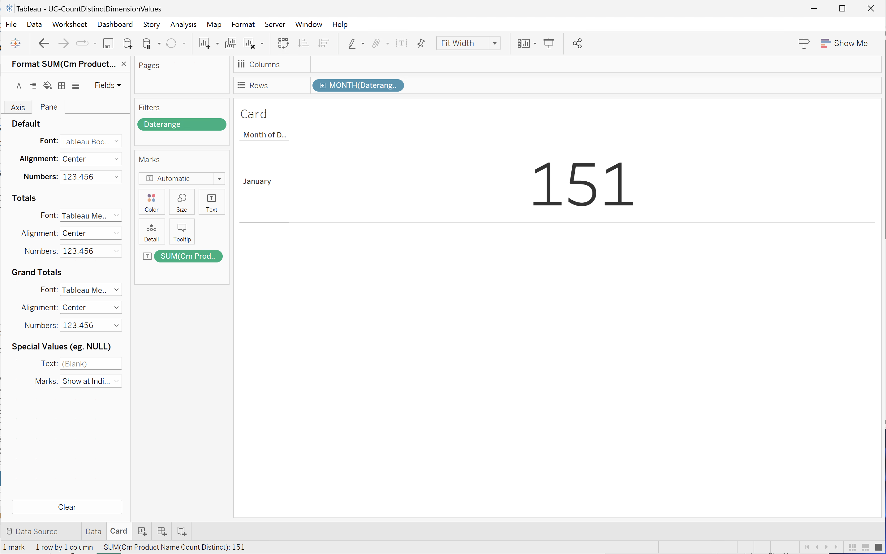

# 計算不同的值維度


在此使用案例中，您想取得2023年1月期間回報的獨特產品名稱數量。

+++ Customer Journey Analytics

若要報告產品名稱的相異計數，請在Customer Journey Analytics中設定計算量度，其名稱為&#x200B;**[!UICONTROL Title]** `Product Name (Count Distinct)`和&#x200B;**[!UICONTROL 外部ID]** `product_name_count_distinct`。


然後您可以在使用案例的範例&#x200B;**[!UICONTROL 計算不同Dimension值]**&#x200B;面板中使用該量度：


+++

+++ BI 工具

>[!PREREQUISITES]
>
>確定您已驗證[連線成功，可以列出資料檢視，並針對您想要嘗試此使用案例的BI工具使用資料檢視](connect-and-validate.md)。
>

>[!BEGINTABS]

>[!TAB Power BI案頭版]

1. 若要確保日期範圍套用至所有視覺效果，請將&#x200B;**[!UICONTROL daterangeday]**&#x200B;從&#x200B;**[!UICONTROL 資料]**&#x200B;窗格拖放至此頁面上的&#x200B;**[!UICONTROL 篩選器]**。
   1. 從此頁面的&#x200B;**[!UICONTROL 篩選器]**&#x200B;中選取&#x200B;**[!UICONTROL daterangeday is (All)]**。
   1. 選取&#x200B;**[!UICONTROL 進階篩選]**&#x200B;作為&#x200B;**[!UICONTROL 篩選型別]**。
   1. 定義篩選器以&#x200B;**[!UICONTROL 當值]** **[!UICONTROL 在]** `1/1/2023` **[!UICONTROL 且]** **[!UICONTROL 在]** `2/1/2023`之前時顯示專案。
   1. 選取&#x200B;**[!UICONTROL 套用篩選器]**。

1. 在&#x200B;**[!UICONTROL 資料]**&#x200B;窗格中：
   1. 選取&#x200B;**[!UICONTROL datarangeday]**。
   1. 選取&#x200B;**[!UICONTROL sum cm_product_name_count_distinct]**，這是Customer Journey Analytics中定義的計算量度。

1. 若要將垂直長條圖修改成表格，請確定您已選取圖表，並從&#x200B;**[!UICONTROL 視覺效果]**&#x200B;窗格中選取&#x200B;**[!UICONTROL 表格]**。

   您的Power BI案頭應該如下所示。

   

1. 選取表格視覺效果。 從內容功能表中，選取&#x200B;**[!UICONTROL 複製]** > **[!UICONTROL 複製視覺效果]**。
1. 使用&#x200B;**[!UICONTROL ctrl-v]**&#x200B;貼上視覺效果。 視覺效果的精確副本會與原始副本重疊。 將其移至報告區域的右側。
1. 若要將複製的視覺效果從表格修改為卡片，請從&#x200B;**[!UICONTROL 視覺效果]**&#x200B;中選取&#x200B;**[!UICONTROL 卡片]**。

   您的Power BI案頭應該如下所示。

   

或者，您也可以使用Power BI的相異計數功能。

1. 選取&#x200B;**[!UICONTROL product_name]**&#x200B;維度。
1. 在&#x200B;**[!UICONTROL 欄]**&#x200B;中的&#x200B;**[!UICONTROL product_name]**&#x200B;維度上套用&#x200B;**[!UICONTROL 計數（相異）]**&#x200B;函式。

   


>[!TAB Tableau案頭]

1. 選取底部的&#x200B;**[!UICONTROL 工作表1]**&#x200B;索引標籤，以從&#x200B;**[!UICONTROL 資料來源]**&#x200B;切換。 在&#x200B;**[!UICONTROL 工作表1]**&#x200B;檢視中：
   1. 從&#x200B;**[!UICONTROL 資料]**&#x200B;窗格的&#x200B;**[!UICONTROL 表格]**&#x200B;清單中拖曳&#x200B;**[!UICONTROL 日期範圍]**&#x200B;專案，並將該專案拖放至&#x200B;**[!UICONTROL 篩選器]**&#x200B;托架。
   1. 在&#x200B;**[!UICONTROL 篩選欄位\[日期範圍\]]**&#x200B;對話方塊中，選取&#x200B;**[!UICONTROL 日期範圍]**&#x200B;並選取&#x200B;**[!UICONTROL 下一步>]**。
   1. 在&#x200B;**[!UICONTROL 篩選器\[日期範圍\]]**&#x200B;對話方塊中，選取&#x200B;**[!UICONTROL 日期範圍]**，然後選取`01/01/2023` - `31/1/2023`。 選取&#x200B;**[!UICONTROL 套用]**&#x200B;及&#x200B;**[!UICONTROL 確定]**。
   1. 將&#x200B;**[!UICONTROL Cm產品名稱計數Distinct]**&#x200B;拖曳至&#x200B;**[!UICONTROL 列]**。 值變更為&#x200B;**[!UICONTROL SUM(Cm Product Name Count Distinct)]**。 此欄位是您在Customer Journey Analytics中定義的計算量度。
   1. 拖曳&#x200B;**[!UICONTROL Daterangeday]**&#x200B;並放置在&#x200B;**[!UICONTROL 欄]**&#x200B;旁。 選取&#x200B;**[!UICONTROL Daterangeday]**，然後從下拉式功能表中選取&#x200B;**[!UICONTROL Day]**。
   1. 若要將線條視覺效果修改為表格，請從&#x200B;**[!UICONTROL 顯示我]**&#x200B;中選取&#x200B;**[!UICONTROL 文字表格]**。
   1. 從工具列選取&#x200B;**[!UICONTROL 交換列與欄]**。
   1. 從&#x200B;**[!UICONTROL 符合]**&#x200B;下拉式功能表中選取&#x200B;**[!UICONTROL 符合寬度]**。

      您的Tableau桌上型電腦應如下所示。

      

1. 從&#x200B;**[!UICONTROL 工作表1]**&#x200B;索引標籤內容功能表中選取&#x200B;**[!UICONTROL 複製]**&#x200B;以建立第二個工作表。
1. 從&#x200B;**[!UICONTROL 工作表1]**&#x200B;索引標籤內容功能表中選取&#x200B;**[!UICONTROL 重新命名]**，以將工作表重新命名為`Data`。
1. 從&#x200B;**[!UICONTROL 工作表1 (2)]**&#x200B;索引標籤內容功能表中選取&#x200B;**[!UICONTROL 重新命名]**，以將工作表重新命名為`Card`。

1. 確定您已選取&#x200B;**[!UICONTROL 卡片]**&#x200B;檢視。
1. 選取&#x200B;**[!UICONTROL 天(Daterangeday)]**，然後從下拉式功能表中選取&#x200B;**[!UICONTROL 月]**。 值變更為&#x200B;**[!UICONTROL MONTH(Daterangeday)]**。
1. 在&#x200B;**[!UICONTROL 標籤]**&#x200B;中選取&#x200B;**[!UICONTROL SUM（Cm產品名稱計數相異）]**，並從下拉式選單中選取&#x200B;**[!UICONTROL 格式]**。
1. 若要變更字型大小，請在&#x200B;**[!UICONTROL Format SUM(CM Product Name Count Distinct)]**&#x200B;窗格中，選取&#x200B;**[!UICONTROL 預設]**&#x200B;內的&#x200B;**[!UICONTROL 字型]**，並選取&#x200B;**[!UICONTROL 72]**&#x200B;作為字型大小。
1. 若要對齊數字，請選取&#x200B;**[!UICONTROL 對齊]**&#x200B;旁的&#x200B;**[!UICONTROL 自動]**，並將&#x200B;**[!UICONTROL 水準]**&#x200B;設定為置中。
1. 若要使用整數，請選取&#x200B;**[!UICONTROL 數字]**&#x200B;旁的&#x200B;**[!UICONTROL 123.456]**，並選取&#x200B;**[!UICONTROL 數字（自訂）]**。 將&#x200B;**[!UICONTROL 小數位數]**&#x200B;設為`0`。

   您的Tableau桌上型電腦應如下所示。

   

1. 選取「**[!UICONTROL 新儀表板]**」索引標籤按鈕（在底部）以建立新的&#x200B;**[!UICONTROL 儀表板1]**&#x200B;檢視。 在&#x200B;**[!UICONTROL 儀表板1]**&#x200B;檢視中：
   1. 將&#x200B;**[!UICONTROL 卡片]**&#x200B;工作表從&#x200B;**[!UICONTROL 工作表]**&#x200B;擱板拖放到&#x200B;**[!UICONTROL 儀表板1]**&#x200B;檢視，顯示&#x200B;*將工作表拖放到這裡*。
   1. 將&#x200B;**[!UICONTROL 資料]**&#x200B;工作表從&#x200B;**[!UICONTROL 工作表]**&#x200B;托架拖放到&#x200B;**[!UICONTROL 儀表板1]**&#x200B;檢視的&#x200B;**[!UICONTROL 卡片]**&#x200B;工作表下。

   您的&#x200B;**[!UICONTROL 儀表板1]**&#x200B;檢視應如下所示。

   


或者，您也可以使用Tableau Desktop的相異計數功能。

1. 使用&#x200B;**[!UICONTROL 產品名稱]**，而非&#x200B;**[!UICONTROL Cm產品名稱計數相異]**。
1. 在&#x200B;**[!UICONTROL 標籤]**&#x200B;中的&#x200B;**[!UICONTROL 產品名稱]**&#x200B;套用&#x200B;**[!UICONTROL 量值]** > **[!UICONTROL 計數（相異）]**。

   


>[!TAB 觀察者]

1. 在Looker的&#x200B;**[!UICONTROL 瀏覽]**&#x200B;介面中，確定您已進行乾淨的設定。 如果沒有，請選取 **[!UICONTROL 移除欄位和篩選器]**。
1. 選取&#x200B;**[!UICONTROL 篩選器]**&#x200B;底下的&#x200B;**[!UICONTROL +篩選器]**。
1. 在&#x200B;**[!UICONTROL 新增篩選器]**&#x200B;對話方塊中：
   1. 選取&#x200B;**[!UICONTROL ‣ Cc資料檢視]**
   1. 從欄位清單中，選取&#x200B;**[!UICONTROL 日‣期範圍日期]**&#x200B;然後&#x200B;**[!UICONTROL 日期範圍日期]**。
      
1. 指定&#x200B;**[!UICONTROL Cc資料檢視日期範圍日期]**&#x200B;篩選器，因為&#x200B;**[!UICONTROL 在範圍]** **[!UICONTROL 2023/01/01]** **[!UICONTROL 到（之前）]** **[!UICONTROL 2023/02/01]**。
1. 從左側邊欄的&#x200B;**[!UICONTROL ‣ Cc資料檢視]**&#x200B;區段：
   1. 選取&#x200B;**[!UICONTROL 日期範圍日期]**，然後選取&#x200B;**[!UICONTROL 日期]**。
   1. 從&#x200B;**[!UICONTROL 產品名稱]**&#x200B;上的&#x200B;**⋮更多**&#x200B;內容功能表中選取&#x200B;**[!UICONTROL 彙總相異‣計數]**。
      
1. 選取&#x200B;**[!UICONTROL 執行]**。
1. 選取‣**[!UICONTROL 視覺效果]**&#x200B;並從工具列選取6︎⃣以顯示單值視覺效果。

您應該會看到視覺效果和類似下列的表格。


>[!TAB Jupyter Notebook]

1. 在新儲存格中輸入下列陳述式。

   ```
   data = %sql SELECT COUNT(DISTINCT(product_name)) AS `Product Name` \
      FROM cc_data_view \
      WHERE daterange BETWEEN '2023-01-01' AND '2023-02-01';
   display(data)
   ```

1. 執行儲存格。 您應該會看到與下方熒幕擷圖類似的輸出。

   


>[!TAB RStudio]

1. 在新區塊中輸入` ```{r} `到` ``` `之間的下列陳述式。

   ```R
   ## Count Distinct
   df <- dv %>%
      filter(daterange >= "2023-01-01" & daterange < "2023-02-01") %>%
      summarise(product_name_count_distinct = n_distinct(product_name))
   print(df)
   ```

1. 執行區塊。 您應該會看到與下方熒幕擷圖類似的輸出。

   


>[!ENDTABS]

+++

