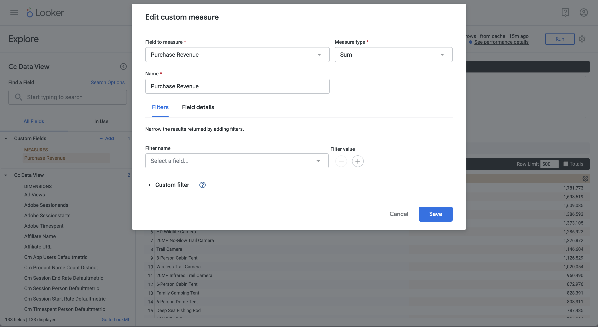

# 單一維度排名


在此使用案例中，您想要顯示一個表格和簡單的橫條圖視覺效果，以顯示2023年產品名稱的購買和購買收入。

+++ Customer Journey Analytics

使用案例的&#x200B;**[!UICONTROL 單一Dimension排名]**&#x200B;面板範例：


+++

+++ BI 工具

>[!PREREQUISITES]
>
>確定您已驗證[連線成功，可以列出資料檢視，並針對您想要嘗試此使用案例的BI工具使用資料檢視](connect-and-validate.md)。
>

>[!BEGINTABS]

>[!TAB Power BI案頭版]

1. 在&#x200B;**[!UICONTROL 資料]**&#x200B;窗格中：
   1. 選取&#x200B;**[!UICONTROL 日期範圍]**。
   1. 選取&#x200B;**[!UICONTROL 產品名稱]**。
   1. 選取&#x200B;**[!UICONTROL sum purchase_revenue]**。
   1. 選取&#x200B;**[!UICONTROL 總購買]**。

   您會看到一個空白表格，僅顯示所選元素的欄標題。 為獲得更好的可見度，請放大視覺效果。

1. 在&#x200B;**[!UICONTROL 篩選器]**&#x200B;窗格中：

   1. 選取此視覺效果&#x200B;**[!UICONTROL 上的]**&#x200B;篩選器&#x200B;**[!UICONTROL 日期範圍是（全部）]**。
   1. 選取&#x200B;**[!UICONTROL 相對日期]**&#x200B;作為&#x200B;**[!UICONTROL 篩選型別]**。
   1. 定義篩選器以&#x200B;**[!UICONTROL 當值]** **[!UICONTROL 位於最後]** `1` **[!UICONTROL 日曆年]**&#x200B;時顯示專案。
   1. 選取&#x200B;**[!UICONTROL 套用篩選器]**。

   您會看到已套用&#x200B;**[!UICONTROL 日期範圍]**&#x200B;篩選器的資料表已更新。

1. 在&#x200B;**[!UICONTROL 視覺效果]**&#x200B;窗格中：

   1. 使用從&#x200B;**[!UICONTROL 資料行]**&#x200B;移除&#x200B;**[!UICONTROL 日期範圍]**。
   1. 將&#x200B;**[!UICONTROL Sum of purchases_revenue]**&#x200B;拖放到&#x200B;**[!UICONTROL 欄]**&#x200B;中的&#x200B;**[!UICONTROL Sum of purchases]**&#x200B;下。

1. 在「表格」視覺效果上：

   1. 選取&#x200B;**[!UICONTROL purchase_revenue總和]**，以遞減採購收入順序排序產品名稱。 您的Power BI案頭應該如下所示。

   

1. 在&#x200B;**[!UICONTROL 篩選器]**&#x200B;窗格中：

   1. 選取&#x200B;**[!UICONTROL product_name為（全部）]**。
   1. 將&#x200B;**[!UICONTROL 篩選器型別]**&#x200B;設定為&#x200B;**[!UICONTROL 前N]**。
   1. 定義篩選為&#x200B;**[!UICONTROL 顯示專案]** **[!UICONTROL 前]** `10` **[!UICONTROL 依值]**。
   1. 將&#x200B;**[!UICONTROL purchase_revenue]**&#x200B;拖放至&#x200B;**[!UICONTROL By值]** **[!UICONTROL 在此新增資料欄位]**。
   1. 選取&#x200B;**[!UICONTROL 套用篩選器]**。

   您會看到表格已更新，其中顯示購買收入的值，並與Analysis Workspace中的自由表格視覺效果同步。

1. 在&#x200B;**[!UICONTROL 視覺效果]**&#x200B;窗格中：

   1. 選取&#x200B;**[!UICONTROL 折線圖和棧疊直條圖]**&#x200B;視覺效果。

   使用與表格相同的資料時，折線圖和棧疊直條圖視覺效果會取代表格。

1. 將&#x200B;**[!UICONTROL 購買]**&#x200B;拖放到&#x200B;**[!UICONTROL 視覺效果]**&#x200B;窗格中的&#x200B;**[!UICONTROL 行Y軸]**。

   折線圖和棧疊直條圖已更新。 您的Power BI案頭應該如下所示。

   

1. 線上條圖和棧疊直條圖視覺效果上：

   1. 選取。
   1. 從內容功能表中，選取&#x200B;**[!UICONTROL 顯示為表格]**。

   主要檢視已更新，顯示線條視覺效果和表格。

   

>[!TAB Tableau案頭]

1. 選取底部的&#x200B;**[!UICONTROL 工作表1]**&#x200B;索引標籤，以從&#x200B;**[!UICONTROL 資料來源]**&#x200B;切換。 在&#x200B;**[!UICONTROL 工作表1]**&#x200B;檢視中：
   1. 從&#x200B;**[!UICONTROL 資料]**&#x200B;窗格的&#x200B;**[!UICONTROL 表格]**&#x200B;清單中拖曳&#x200B;**[!UICONTROL 日期範圍]**&#x200B;專案，並將該專案拖放至&#x200B;**[!UICONTROL 篩選器]**&#x200B;托架。
   1. 在&#x200B;**[!UICONTROL 篩選器欄位\[日期範圍\]]**&#x200B;對話方塊中，選取&#x200B;**[!UICONTROL 日期範圍]**&#x200B;並選取&#x200B;**[!UICONTROL 下一步>]**。
   1. 在&#x200B;**[!UICONTROL 篩選器\[日期範圍\]]**&#x200B;對話方塊中，選取&#x200B;**[!UICONTROL 日期範圍]**&#x200B;並指定`01/01/2023` - `31/12/2023`的期間。 選取&#x200B;**[!UICONTROL 套用]**&#x200B;及&#x200B;**[!UICONTROL 確定]**。

      

   1. 從&#x200B;**[!UICONTROL 資料]**&#x200B;窗格的&#x200B;**[!UICONTROL 表格]**&#x200B;清單中拖放&#x200B;**[!UICONTROL 產品名稱]**，並將專案拖放到&#x200B;**[!UICONTROL 列]**&#x200B;旁的欄位中。
   1. 從&#x200B;**[!UICONTROL 資料]**&#x200B;窗格中的&#x200B;**[!UICONTROL 資料表（*量值名稱*）]**&#x200B;清單拖放&#x200B;**[!UICONTROL 購買]**，並將專案拖放到&#x200B;**[!UICONTROL 資料列]**&#x200B;旁的欄位中。 值會自動轉換為&#x200B;**[!UICONTROL SUM（購買）]**。
   1. 從&#x200B;**[!UICONTROL 資料]**&#x200B;窗格中的&#x200B;**[!UICONTROL 資料表（*量值名稱*）]**&#x200B;清單拖放&#x200B;**[!UICONTROL 購買收入]**，並將專案拖放到&#x200B;**[!UICONTROL 資料行]**&#x200B;旁的欄位中，並從&#x200B;**[!UICONTROL SUM（購買）]**&#x200B;離開。 值會自動轉換為&#x200B;**[!UICONTROL SUM（購買收入）]**。
   1. 若要以遞減的購買收入順序排序兩個圖表，請將游標停留在&#x200B;**[!UICONTROL 購買收入]**&#x200B;標題上，並選取排序圖示。
   1. 若要限制圖表中的專案數，請在&#x200B;**[!UICONTROL 列]**&#x200B;中選取&#x200B;**[!UICONTROL SUM(Purchase Revenue)]**，然後從下拉式功能表中選取&#x200B;**[!UICONTROL 篩選器]**。
   1. 在&#x200B;**[!UICONTROL 篩選器\[Purchase Revenue\]]**&#x200B;對話方塊中，選取&#x200B;**[!UICONTROL 值範圍]**&#x200B;並輸入適當的值。 例如： `1,000,000` - `2,000,000`。 選取&#x200B;**[!UICONTROL 套用]**&#x200B;及&#x200B;**[!UICONTROL 確定]**。
   1. 若要將兩個長條圖轉換成雙組合圖，請在&#x200B;**[!UICONTROL 列]**&#x200B;中選取&#x200B;**[!UICONTROL SUM（購買）]**，然後從下拉式功能表中選取&#x200B;**[!UICONTROL 雙軸]**。 長條圖會轉換成散佈圖。
   1. 若要將散佈圖修改為長條圖：
      1. 在&#x200B;**[!UICONTROL 標籤]**&#x200B;區域中選取&#x200B;**[!UICONTROL SUM（購買）]**，並從下拉式功能表中選取&#x200B;**[!UICONTROL 行]**。
      1. 在&#x200B;**[!UICONTROL 標籤]**&#x200B;區域中選取&#x200B;**[!UICONTROL SUM(Purchase Revenue)]**，然後從下拉式功能表中選取&#x200B;**[!UICONTROL 列]**。

   您的Tableau桌上型電腦應如下所示。

   

1. 從&#x200B;**[!UICONTROL 工作表1]**&#x200B;索引標籤內容功能表中選取&#x200B;**[!UICONTROL 複製]**&#x200B;以建立第二個工作表。
1. 從&#x200B;**[!UICONTROL 工作表1]**&#x200B;索引標籤內容功能表中選取&#x200B;**[!UICONTROL 重新命名]**，以將工作表重新命名為`Data`。
1. 從&#x200B;**[!UICONTROL 工作表1 (2)]**&#x200B;索引標籤內容功能表中選取&#x200B;**[!UICONTROL 重新命名]**，以將工作表重新命名為`Graph`。
1. 請確定已選取&#x200B;**[!UICONTROL 資料]**&#x200B;工作表。
   1. 選取右上角的&#x200B;**[!UICONTROL 顯示我]**，並選取&#x200B;**[!UICONTROL 文字表格]** （左上角的視覺效果），將兩個圖表的內容修改成表格。
   1. 若要以遞減順序排序購買收入，請將游標移至資料表中的&#x200B;**[!UICONTROL Purchase Revenue]**&#x200B;上，然後選取。
   1. 從&#x200B;**[!UICONTROL 符合]**&#x200B;下拉式功能表中選取&#x200B;**[!UICONTROL 整個檢視]**。

   您的Tableau桌上型電腦應如下所示。

   

1. 選取「**[!UICONTROL 新儀表板]**」索引標籤按鈕（在底部）以建立新的&#x200B;**[!UICONTROL 儀表板1]**&#x200B;檢視。 在&#x200B;**[!UICONTROL 儀表板1]**&#x200B;檢視中：
   1. 將&#x200B;**[!UICONTROL Graph]**&#x200B;工作表從&#x200B;**[!UICONTROL 工作表]**&#x200B;擱板拖放到&#x200B;**[!UICONTROL 儀表板1]**&#x200B;檢視（顯示&#x200B;*將工作表拖放至此*）。
   1. 將&#x200B;**[!UICONTROL 資料]**&#x200B;工作表從&#x200B;**[!UICONTROL 圖形]**&#x200B;工作表下方的&#x200B;**[!UICONTROL 工作表]**&#x200B;托架拖放至&#x200B;**[!UICONTROL 儀表板1]**&#x200B;檢視。
   1. 在檢視中選取&#x200B;**[!UICONTROL 資料]**&#x200B;工作表，並將&#x200B;**[!UICONTROL 整個檢視]**&#x200B;修改為&#x200B;**[!UICONTROL 固定寬度]**。

   您的&#x200B;**[!UICONTROL 儀表板1]**&#x200B;檢視應如下所示。

   


>[!TAB 觀察者]

1. 在Looker的&#x200B;**[!UICONTROL 瀏覽]**&#x200B;介面中，確定您已進行乾淨的設定。 如果沒有，請選取 **[!UICONTROL 移除欄位和篩選器]**。
1. 選取&#x200B;**[!UICONTROL 篩選器]**&#x200B;底下的&#x200B;**[!UICONTROL +篩選器]**。
1. 在&#x200B;**[!UICONTROL 新增篩選器]**&#x200B;對話方塊中：
   1. 選取&#x200B;**[!UICONTROL ‣ Cc資料檢視]**
   1. 從欄位清單中，選取&#x200B;**[!UICONTROL 日‣期範圍日期]**&#x200B;然後&#x200B;**[!UICONTROL 日期範圍日期]**。
      
1. 指定&#x200B;**[!UICONTROL Cc資料檢視日期範圍]**&#x200B;篩選器，因為&#x200B;**[!UICONTROL 在範圍]** **[!UICONTROL 2023/01/01]** **[!UICONTROL 到（之前）]** **[!UICONTROL 2024/01/01]**。
1. 從左側邊欄的&#x200B;**[!UICONTROL ‣ Cc資料檢視]**&#x200B;區段中，選取&#x200B;**[!UICONTROL 產品名稱]**。
1. 從左側邊欄中的&#x200B;**[!UICONTROL ‣自訂欄位]**&#x200B;區段：
   1. 從&#x200B;**[!UICONTROL +新增]**&#x200B;下拉式功能表中選取&#x200B;**[!UICONTROL 自訂量值]**。
   1. 在&#x200B;**[!UICONTROL 建立自訂量值]**&#x200B;對話方塊中：
      1. 從&#x200B;**[!UICONTROL 要量值]**&#x200B;的欄位下拉式功能表中選取&#x200B;**[!UICONTROL 購買收入]**。
      1. 從&#x200B;**[!UICONTROL 量值型別]**&#x200B;下拉式功能表中選取&#x200B;**[!UICONTROL 總和]**。
      1. 輸入&#x200B;**[!UICONTROL 名稱]**&#x200B;的自訂欄位名稱。 例如：`Purchase Revenue`。
      1. 選取&#x200B;**[!UICONTROL 欄位詳細資料]**&#x200B;標籤。
      1. 從&#x200B;**[!UICONTROL 格式]**&#x200B;下拉式選單中選取&#x200B;**[!UICONTROL 小數]**，並確定`0`是以&#x200B;**[!UICONTROL 小數]**輸入。
         
      1. 選取&#x200B;**[!UICONTROL 「儲存」]**。
   1. 從&#x200B;**[!UICONTROL +新增]**&#x200B;下拉式功能表中再次選取&#x200B;**[!UICONTROL 自訂量值]**。 在&#x200B;**[!UICONTROL 建立自訂]**&#x200B;量值對話方塊中：
      1. 從&#x200B;**[!UICONTROL 要測量]**&#x200B;的欄位下拉式功能表中選取&#x200B;**[!UICONTROL 購買]**。
      1. 從&#x200B;**[!UICONTROL 量值型別]**&#x200B;下拉式功能表中選取&#x200B;**[!UICONTROL 總和]**。
      1. 輸入&#x200B;**[!UICONTROL 名稱]**&#x200B;的自訂欄位名稱。 例如：`Sum of Purchases`。
      1. 選取&#x200B;**[!UICONTROL 欄位詳細資料]**&#x200B;標籤。
      1. 從&#x200B;**[!UICONTROL 格式]**&#x200B;下拉式選單中選取&#x200B;**[!UICONTROL 小數]**，並確定`0`是以&#x200B;**[!UICONTROL 小數]**&#x200B;輸入。
      1. 選取&#x200B;**[!UICONTROL 「儲存」]**。
   1. 這兩個欄位都會自動新增至資料檢視。
1. 選取&#x200B;**[!UICONTROL +篩選器]**&#x200B;以新增其他&#x200B;**[!UICONTROL 篩選器]**&#x200B;並限制資料。
1. 在&#x200B;**[!UICONTROL 新增篩選器]**&#x200B;對話方塊中，選取&#x200B;**[!UICONTROL ‣自訂欄位]**，然後選取&#x200B;**[!UICONTROL 購買收入]**。
1. 請選取適當的選項並輸入建議值，這樣篩選器就會顯示&#x200B;**[!UICONTROL 介於包含的]** `1000000` **[!UICONTROL 和]** `2000000`之間。
1. 選取&#x200B;**[!UICONTROL 執行]**。
1. 選取‣**[!UICONTROL 視覺效果]**&#x200B;以顯示線條視覺效果。
1. 選取&#x200B;**[!UICONTROL 視覺效果]**&#x200B;中的&#x200B;**[!UICONTROL 編輯]**&#x200B;以更新視覺效果。 在快顯對話框中：
   1. 選取&#x200B;**[!UICONTROL 系列]**&#x200B;標籤。
   1. 向下捲動以檢視&#x200B;**[!UICONTROL 購買]**&#x200B;並將&#x200B;**[!UICONTROL 型別]**&#x200B;變更為&#x200B;**[!UICONTROL 行]**。
   1. 選取&#x200B;**[!UICONTROL Y]**&#x200B;索引標籤。
   1. 從&#x200B;**[!UICONTROL 左1]**&#x200B;容器拖曳&#x200B;**[!UICONTROL 購買]**&#x200B;到顯示&#x200B;**[!UICONTROL *拖曳系列到此處以建立新的左軸&#x200B;*]**。 此動作會建立**[!UICONTROL &#x200B;左2 ]**容器。
      
   1. 選取旁的&#x200B;**[!UICONTROL CrossSize75]**&#x200B;以隱藏快顯對話方塊

您應該會看到視覺效果和類似下列的表格。


>[!TAB Jupyter Notebook]

1. 在新儲存格中輸入下列陳述式。

   ```
   import seaborn as sns
   import matplotlib.pyplot as plt
   data = %sql SELECT product_name AS `Product Name`, SUM(purchase_revenue) AS `Purchase Revenue`, SUM(purchases) AS `Purchases` \
               FROM cc_data_view \
               WHERE daterange BETWEEN '2023-01-01' AND '2024-01-01' \
               GROUP BY 1 \
               LIMIT 10;
   df = data.DataFrame()
   df = df.groupby('Product Name', as_index=False).sum()
   plt.figure(figsize=(15, 3))
   sns.barplot(x='Purchase Revenue', y='Product Name', data=df)
   plt.show()
   display(data)
   ```

1. 執行儲存格。 您應該會看到與下方熒幕擷圖類似的輸出。

   


>[!TAB RStudio]

1. 在新區塊中輸入` ```{r} `到` ``` `之間的下列陳述式。

   ```R
   library(tidyr)
   
   ## Single dimension ranked
   df <- dv %>%
      filter(daterange >= "2023-01-01" & daterange < "2024-01-01") %>%
      group_by(product_name) %>%
      summarise(purchase_revenue = sum(purchase_revenue), purchases = sum(purchases)) %>%
      arrange(product_name, .by_group = FALSE)
   dfV <- df %>%
      head(5)
   ggplot(dfV, aes(x = purchase_revenue, y = product_name)) +
      geom_col(position = "dodge") +
      geom_text(aes(label = purchase_revenue), vjust = -0.5)
   print(df)
   ```

1. 執行區塊。 您應該會看到與下方熒幕擷圖類似的輸出。

   

>[!ENDTABS]

+++

