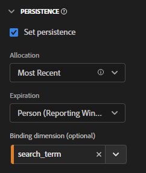

# 在 CJA 中使用繫結維度和量度

Customer Journey Analytics 提供了幾種方法來保持維度值超出設定的點擊。 Adobe 提供的一種持續性方法稱為「繫結」。 在舊版 Adobe Analytics 中，此概念稱為「銷售」。

雖然可以將繫結維度用於最頂層事件資料，但此概念最適合用於處理[物件陣列](/help/use-cases/object-arrays.md)。 您可以將維度歸因於物件陣列的一部分，而無需將其套用至給定事件中的所有屬性。 例如，您可以將搜尋字詞歸因於購物車物件陣列中的一個產品，而無需將該搜尋字詞繫結到整個事件。

## 範例 1：使用繫結維度將其他產品屬性歸因於購買

您可以將物件陣列中的維度項目繫結到另一個維度。 當已繫結維度項目出現時，CJA 會重新呼叫已繫結維度並將其包含在事件中。 考量下列客戶歷程：

1. 訪客檢視洗衣機的產品頁面。

   ```json
   {
       "PersonID": "1",
       "product": [
           {
               "name": "Washing Machine 2000",
               "color": "white",
               "type": "front loader",
           },
       ],
       "timestamp": 1534219229
   }
   ```

1. 接著訪客檢視烘衣機的產品頁面。

   ```json
   {
       "PersonID": "1",
       "product": [
           {
               "name": "Dryer 2000",
               "color": "neon orange",
           },
       ],
       "timestamp": 1534219502
   }
   ```

1. 最後進行了購買。 每個產品的顏色不包括在購買事件中。

   ```json
   {
       "PersonID": "1",
       "orders": 1,
       "product": [
           {
               "name": "Washing Machine 2000",
               "price": 1600,
           },
           {
               "name": "Dryer 2000",
               "price": 499
           }
       ],
       "timestamp": 1534219768
   }
   ```

如果您想在沒有繫結維度的情況下依照顏色查看收入，則維度 `product.color` 會持續存在並錯誤地將成果歸因於烘衣機的顏色：

| product.color | 收入 |
| --- | --- |
| 霓虹橘 | 2099 |

您可以進入資料檢視管理器，將產品顏色繫結至產品名稱：


當您設定此持續性模型時，CJA 會在設定產品顏色時記下產品名稱。當它在此訪客的後續事件中識別出相同的產品名稱時，會同時帶入產品顏色。 當您將產品顏色繫結到產品名稱時，相同的資料會類似於以下內容：

| product.color | 收入 |
| --- | --- |
| 白色 | 1600 |
| 霓虹橘 | 499 |

## 範例 2：使用繫結量度，將搜尋字詞連結至產品購買

Adobe Analytics 中最常見的銷售方法之一，是將搜尋字詞繫結到產品，讓每個搜尋字詞都能因其適當的產品而獲得點數。 考量下列客戶歷程：

1. 訪客到達您的網站，搜尋「拳擊手套」。搜尋量度會遞增一，並顯示前三個搜尋結果。

   ```json
   {
       "PersonID": "1",
       "page_name": "Search results",
       "search": "1",
       "search_term": "boxing gloves",
       "product": [
           {
               "name": "Beginner gloves",
           },
           {
               "name": "Tier 3 gloves",
           },
           {
               "name": "Professional gloves",
           }
       ]
   }
   ```

2. 他們找到喜歡的手套，把它新增到購物車中。

   ```json
   {
       "PersonID": "1",
       "page_name": "Shopping cart",
       "cart_add": "1",
       "product": [
           {
               "name": "Tier 3 gloves",
           }
       ]
   }
   ```

3. 訪客接著搜尋「網球拍」。搜尋量度會遞增一，並顯示前三個搜尋結果。

   ```json
   {
       "PersonID": "1",
       "page_name": "Search results",
       "search": "1",
       "search_term": "tennis racket",
       "product": [
           {
               "name": "Shock absorb racket",
           },
           {
               "name": "Women's open racket",
           },
           {
               "name": "Extreme racket",
           }
       ]
   }
   ```

4. 訪客找到喜歡的球拍，將其新增到購物車中。

   ```json
   {
       "PersonID": "1",
       "page_name": "Shopping cart",
       "cart_add": "1",
       "product": [
           {
               "name": "Tier 3 gloves",
           },
           {
               "name": "Shock absorb racket",
           }
       ]
   }
   ```

5. 訪客第三次搜尋「鞋子」。搜尋量度會遞增一，並顯示前三個搜尋結果。

   ```json
   {
       "PersonID": "1",
       "page_name": "Search results",
       "search": "1",
       "search_term": "shoes",
       "product": [
           {
               "name": "Men's walking shoes",
           },
           {
               "name": "Tennis shoes",
           },
           {
               "name": "Skate shoes",
           }
       ]
   }
   ```

6. 他們找到喜歡的鞋子，把它新增到購物車中。

   ```json
   {
       "PersonID": "1",
       "page_name": "Shopping cart",
       "cart_add": "1",
       "product": [
           {
               "name": "Tier 3 gloves",
           },
           {
               "name": "Shock absorb racket",
           },
           {
               "name": "Skate shoes",
           }
       ]
   }
   ```

7. 訪客通過結帳程序，購買這三件商品。

   ```json
   {
       "PersonID": "1",
       "page_name": "Thank you for your purchase",
       "purchase": "1",
       "product": [
           {
               "name": "Tier 3 gloves",
               "price": "89.99"
           },
           {
               "name": "Shock absorb racket",
               "price": "34.99"
           },
           {
               "name": "Skate shoes",
               "price": "79.99"
           }
       ]
   }
   ```

如果您使用的配置模型不包含具有搜尋字詞的繫結維度，則全部三個產品會將收入歸因於單一搜尋字詞。例如，如果將原始配置搭配搜尋字詞維度一起使用：

| search_term | 收入 |
| --- | --- |
| 拳擊手套 | $204.97 |

如果您將最近配置搭配搜尋字詞維度一起使用，則全部三個產品仍會將收入歸因於單一搜尋字詞：

| search_term | 收入 |
| --- | --- |
| 鞋子 | US$204.97 |

雖然此範例僅包含一位訪客，但搜尋不同商品的許多訪客可能會將搜尋字詞錯誤地歸因於不同的產品，因而難以判斷最佳搜尋結果到底是什麼。

每當出現搜尋量度，您就可以將搜尋字詞繫結到產品名稱，以正確地將搜尋字詞歸因於收入。


在 Analysis Workspace 中，產生的報表類似於以下內容：

| search_term | 收入 |
| --- | --- |
| 拳擊手套 | $89.99 |
| 網球拍 | $34.99 |
| 鞋子 | $79.99 |

CJA 會自動偵測所選維度與繫結維度之間的關係。如果繫結維度在物件陣列中，而所選維度在更高層級中，則需要繫結量度。繫結量度會充當繫結維度的觸發器，因此它只將自己繫結在出現繫結量度的事件上。 在上述範例中，搜尋結果頁面都一定會包含搜尋字詞維度和搜尋量度。 

將搜尋字詞維度設定為此持續性模式，會執行以下邏輯：

* 設定搜尋字詞維度時，檢查產品名稱是否存在。
* 如果沒有產品名稱，不執行任何動作。
* 如果有產品名稱，則檢查是否存在搜尋量度。
* 如果沒有搜尋量度，不執行任何動作。
* 如果有搜尋量度，則將搜尋字詞繫結到該事件中的所有產品名稱。它將自我複製，直到與該事件的產品名稱相同的層級為止。在此範例中，它被視同為 product.search_term。
* 如果在後續事件中看到相同的產品名稱，則已繫結的搜尋字詞也會轉至該事件。

## 範例 3：將影片搜尋字詞繫結到使用者設定檔

您可以將搜尋字詞繫結到使用者設定檔，以確保設定檔之間的持續性完全分開。例如，您的組織執行串流服務，其中一個總體帳戶可能擁有多個設定檔。訪客有兒童設定檔和成人設定檔。

1. 該帳戶以兒童設定檔登入，並搜尋兒童電視節目。請注意，`"ProfileID"` 是 `2`，表示兒童設定檔。

   ```json
   {
       "PersonID": "7078",
       "ProfileID": "2",
       "Searches": "1",
       "search_term": "kids show"
   }
   ```

1. 訪客找到並播放 &quot;Orangey&quot; 電視節目，讓孩子觀看。

   ```json
   {
       "PersonID": "7078",
       "ProfileID": "2",
       "ShowName": "Orangey",
       "VideoStarts": "1"
   }
   ```

1. 稍後當晚，家長切換到自己的設定檔，搜尋要觀賞的成人內容。請注意，`"ProfileID"` 是 `1`，表示成人設定檔。兩個設定檔都屬於同一帳戶，由相同的 `"PersonID"` 表示。

   ```json
   {
       "PersonID": "7078",
       "ProfileID": "1",
       "Searches": "1",
       "search_term": "grownup movie"
   }
   ```

1. 他們找到「Analytics After Hours」，並觀賞這個節目度過愉快的夜晚。

   ```json
   {
       "PersonID": "7078",
       "ProfileID": "1",
       "ShowName": "Analytics After Hours",
       "VideoStarts": "1"
   }
   ```

1. 第二天，他們繼續播放「Orangey」電視節目，讓孩子觀看。他們不需要搜尋，因為現在已經知道這齣電視節目。

   ```json
   {
       "PersonID": "7078",
       "ProfileID": "2",
       "ShowName": "Orangey",
       "VideoStarts": "1"
   }
   ```

如果您使用附帶人員期滿的「最近」配置，則會將 `"grownup movie"` 搜尋字詞歸因到兒童電視節目的最後一個檢視。

| 搜尋字詞 | 影片開始 |
| --- | --- |
| 成人電影 | 2 |
| 兒童節目 | 1 |

但是，如果您將 `search_term` 繫結到 `ProfileID`，每個設定檔的搜尋都會局限於自己的設定檔，被歸因到要搜尋的正確節目。



Analysis Workspace 將正確地將 Orangey 的第二集歸因於搜尋字詞 `"kids show"`，而不考慮來自其他設定檔的搜尋。

| 搜尋字詞 | 影片開始 |
| --- | --- |
| 兒童節目 | 2 |
| 成人電影 | 1 |

## 範例 4：評估零售環境中的瀏覽與搜尋行為

您可以將值繫結到之前事件上設定的維度。當您設定包含繫結維度的變數時，CJA 會考慮持久值。如果不希望出現這種行為，您可以調整繫結維度的持久性設定。請考慮以下範例，在此範例中將 `product_finding_method` 設定在事件上，然後繫結到下一個事件的「購物車新增次數」量度。

1. 訪客搜尋 `"camera"`。請注意，此頁面上未設定任何產品。

   ```json
   {
       "search_term": "camera",
       "product_finding_method": "search"
   }
   ```

1. 訪客按一下喜歡的相機，將其新增到購物車中。

   ```json
   {
       "Product": [
           {
               "name": "DSLR Camera"
           }
       ],
       "CartAdd": "1"
   }
   ```

1. 然後訪客在不執行搜尋的情況下瀏覽到男士腰帶類別。請注意，此頁面上未設定任何產品。

   ```json
   {
       "category": "Men's belts",
       "product_finding_method": "browse"
   }
   ```

1. 他們按一下喜歡的腰帶，並將其新增到購物車中。

   ```json
   {
       "Product": [
           {
               "name": "Ratchet belt"
           }
       ],
       "CartAdd": "1"
   }
   ```

1. 他們透過結帳程序，購買這兩件商品。

   ```json
   {
       "Product": [
           {
               "name": "DSLR Camera",
               "price": "399.99"
           },
           {
               "name": "Ratchet belt",
               "price": "19.99"
           }
       ],
       "Purchase": "1"
   }
   ```

如果在沒有繫結維度的情況下將持續性設定為最近配置，則所有收入 $419.98 將歸因於 `browse` 尋找方法。

| 產品尋找方法 | 收入 |
| --- | --- |
| 瀏覽 | 419.98 |

如果在沒有繫結維度的情況下使用原始配置設定了持續性，則所有收入 $419.98 將歸因於 `search` 尋找方法。

| 產品尋找方法 | 收入 |
| --- | --- |
| 搜尋 | 419.98 |

不過，如果您將 `product_finding_method` 繫結到「購物車新增」量度，產生的報告就會將每個產品歸因到正確的尋找方法。

| 產品尋找方法 | 收入 |
| --- | --- |
| 搜尋 | 399.99 |
| 瀏覽 | 19.99 |
