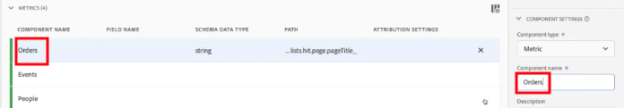
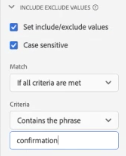
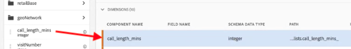

# 資料檢視使用案例

這些使用案例顯示了 Customer Journey Analytics 中資料檢視的靈活性和強大威力。

## 1. 從字串結構描述欄位建立量度 {#string}

例如，在建立資料檢視時，您可以從字串「[!UICONTROL pageTitle]」結構欄位建立「[!UICONTROL 訂單]」量度。步驟如下：

1. 在「元件」索引標籤上，將「[!UICONTROL pageTitle]」拖曳至「[!UICONTROL 已包含元件]」下的「[!UICONTROL 量度]」區段。
   
1. 現在，在右側的「[!UICONTROL 元件設定] 」下反白標示您剛才拖曳的量度，並將其重新命名：
   
1. 開啟右側的「[!UICONTROL 包含/排除值]」對話框，並指定下列項目：
   

   「確認」短語表示這是訂單。在檢閱符合這些標準的所有頁面標題後，每個例項都會計為「1」。此結果是新量度 (而非計算量度)。具有包含/排除值的量度可用於任何其他量度也可使用的地方。它適用於 Attribution IQ、篩選器，以及您可使用標準量度的其他任何地方。
1. 您可以進一步指定此量度的歸因模型，例如 「[!UICONTROL 上次接觸]」，並具有「[!UICONTROL 工作階段]」的 [!UICONTROL 「回顧」視窗]。您也可以從相同欄位建立另一個「[!UICONTROL 訂單]」量度，並為其指定不同的歸因模型，例如「[!UICONTROL 上次接觸]」，以及不同的[!UICONTROL 「回顧」視窗]，例如「[!UICONTROL 30天]」。

另一個範例為使用訪客 ID 維度當做量度，以判斷貴公司有多少訪客 ID。

## 2. 將整數當做維度使用 {#integers}

先前，整數會自動被視為 CJA 中的量度。現在，數字 (包括 Adobe Analytics 的自訂事件) 可被視為維度。其範例如下：

1. 將「[!UICONTROL call_length_min]」整數拖曳至「[!UICONTROL 已包含元件]」下的「[!UICONTROL 維度]」區段：

   

1. 您現在可以新增「[!UICONTROL 值分組]」，在報告中以分組方式呈現此維度。(若未進行分組，此維度的每個例項都會顯示為 Workspace 報告中的條列項目。)

   

## 3. 在流程圖表中使用數值維度當做「量度」 {#numeric}

您可以使用數值維度，將您的「量度」放入[!UICONTROL 流程]視覺效果中。

1. 在「資料檢視[元件](https://experienceleague.adobe.com/docs/analytics-platform/using/cja-dataviews/create-dataview.html#configure-component-settings)」標籤上，將「行銷管道」]結構欄位拖曳至「[!UICONTROL 包含的元件]」下的「[!UICONTROL 量度]」區域。[!UICONTROL 
2. 在工作區報表中，此流量顯示流入[!UICONTROL 訂單]的[!UICONTROL 行銷管道]:

## 4. 執行子事件篩選 {#sub-event}

此功能特別適用於以陣列為基礎的欄位。 包含/排除功能可讓您在子事件層級執行篩選，而內建在篩選產生器中的篩選 (區段) 只會提供您事件層級的篩選。 因此，您可以在資料檢視中使用包含/排除來執行子事件篩選，然後在事件層級參照篩選中的新量度/維度。

例如，在資料檢視中使用包含/排除功能，僅聚焦於產生的銷售額超過 50 美元的商品。 所以，如果您的訂單包含價值 50 美元的商品及價值 25 美元的商品，我們只會移除 25 美元的商品，而不是整筆訂單。

1. 在「資料檢視[元件](https://experienceleague.adobe.com/docs/analytics-platform/using/cja-dataviews/create-dataview.html#configure-component-settings)」標籤上，將[!UICONTROL 收入]結構欄位拖曳至[!UICONTROL 包含的元件]下的[!UICONTROL 量度]區域。
1. 選取量度並在右側設定下列項目：
a.在[!UICONTROL Format]下，選擇[!UICONTROL Currency]。
b.在[!UICONTROL Currency]下，選擇USD。
c.在[!UICONTROL 包含/排除值]下，選取[!UICONTROL 設定包含/排除值]旁的核取方塊。
d.在[!UICONTROL Match]下，選擇[!UICONTROL 如果所有條件都滿足]。
e.在[!UICONTROL 條件]下，選擇[!UICONTROL 大於或等於]。
f. 指定「50」當做值。

這些新設定可讓您檢視僅限高收入的資料，並篩選掉低於 $50 美元的所有資料。

## 5. 利用「[!UICONTROL 無值選項]」設定 {#no-value}

貴公司可能已花了一些時間來訓練您的使用者，以期望報表中出現「未指定」。 資料檢視中的預設值為「沒有值」。 您現在可以在資料檢視 UI 中[將「沒有值」重新命名為「未指定」](https://experienceleague.adobe.com/docs/analytics-platform/using/cja-dataviews/create-dataview.html#configure-no-value-options-settings)。

另一個範例為會籍計劃註冊的維度。 在此情況下，您可以將「沒有值」重新命名為「沒有會籍計劃註冊」。

## 6. 使用不同[!UICONTROL 歸因]設定建立多個量度 {#attribution}

使用右上方的「[!UICONTROL 複製]」功能時，可建立具有不同歸因設定的許多收入量度，像是[!UICONTROL 首次接觸]、[!UICONTROL 上次接觸]和[!UICONTROL 演算法]。

別忘了重新命名每個量度來反映差異，例如「演算法收入」：

有關其他資料檢視設定的詳細資訊，請參閱「[建立資料檢視](/help/data-views/create-dataview.md)」。有關資料檢視的概念性概觀，請參閱「[資料檢視概觀](/help/data-views/data-views.md)」。

## 7. 新工作階段和回訪工作階段報告 {#new-repeat}

可根據您為此資料檢視定義的報告時段及 13 個月的回溯期來判斷工作階段是是使用者的首次工作階段，還是回訪工作階段。例如，此報告可讓您判斷以下問題：

* 您的訂單中有多少百分比來自新工作階段或回訪工作階段？

* 對於指定的行銷管道或特定行銷活動，您是針對首次使用者還是回訪使用者？這項選擇如何影響轉換率？

有一個維度和兩個指標能協助此報告：

* [工作階段類型](https://experienceleague.adobe.com/docs/analytics-platform/using/cja-dataviews/component-reference.html?lang=zh-Hant#optional) - 此維度有兩個值：1) [!UICONTROL 新的]和 2) [!UICONTROL 回訪]。[!UICONTROL 新的]條列項目包含已確定為個人定義的首次工作階段的工作階段中的所有行為 (亦即針對此維度的量度)。 所有其他資料都會包含在[!UICONTROL 回訪]條列項目中 (假設所有資料都屬於一個工作階段)。 如果量度不屬於任何工作階段，則將屬於此維度的「不適用」貯體。

* [新工作階段](https://experienceleague.adobe.com/docs/analytics-platform/using/cja-dataviews/component-reference.html?lang=en#optional)。 新的工作階段量度定義為個人在報告時段內定義的首次工作階段。

* [回訪工作階段](https://experienceleague.adobe.com/docs/analytics-platform/using/cja-dataviews/component-reference.html?lang=en#optional) 回訪工作階段量度是非個人首次工作階段的工作階段數量。-->

若要存取這些元件：

1. 前往資料檢視編輯器。
1. 按一下左側邊欄中的「**[!UICONTROL 元件]** > **[!UICONTROL 可選標準元件]**」索引標籤。
1. 將這些元件拖曳至您的資料檢視。

95%-99% 的時間，準確地報告新的工作階段。唯一例外情況如下：

* 首次工作階段發生在 13 個月的回溯期之前。 將會忽略此工作階段。

* 工作階段同時橫跨回溯期和報告時段時。 假設您在 2022 年 6 月 1 日至 6 月 15 日期間執行報告。回溯期將涵蓋 2021 年 5 月 1 日至 2022 年 5 月 31 日。如果工作階段原本要在 2022 年 5 月 30 日開始，然後在 2022 年 6 月 1 日結束，由於此工作階段包含在回溯期內，因此在此報告期內的所有工作階段全都計為傳回工作階段。

## 8. 使用日期和日期-時間功能 {#date}

Adobe Experience Platform 中的結構描述包含「[!UICONTROL 日期]」和「[!UICONTROL 日期-時間]」欄位。CJA 資料檢視現在支援這些欄位。將這些欄位做為維度拖曳至資料檢視時，您可以指定其[格式](/help/data-views/component-settings/format.md)。 此格式設定決定欄位如何在報告中顯示。例如：

* 就日期格式而言，如果您選取格式為&#x200B;**[!UICONTROL 月、日、年]**&#x200B;的&#x200B;**[!UICONTROL 日]**，報告的範例輸出可能會是這樣：August 23, 2022。

* 就日期-時間格式而言，如果您選取格式為&#x200B;**[!UICONTROL 時:分]**&#x200B;的&#x200B;**[!UICONTROL 當日的分鐘]**，您的輸出可能會是這樣：20:20。

### 日期和日期-時間使用案例

* 日期：旅行社正在收集旅程的出發日期，並將出發日期做為其資料中的欄位。他們想要有一份報告對所有已收集的出發日期，比較[!UICONTROL 當週的特定日期]，以了解哪一天最受歡迎。他們想要對[!UICONTROL 一年的月次]做同樣工作。

* 日期-時間：零售公司正在收集店內銷售點 (POS) 每次購買的時間。在指定的月份內，他們可能想要依[!UICONTROL 當天特定時間]，了解做防鰻的購物期間。

>[!MORELIKETHIS]
>[在格式元件設定](/help/data-views/component-settings/format.md)中的日期和日期-時間

