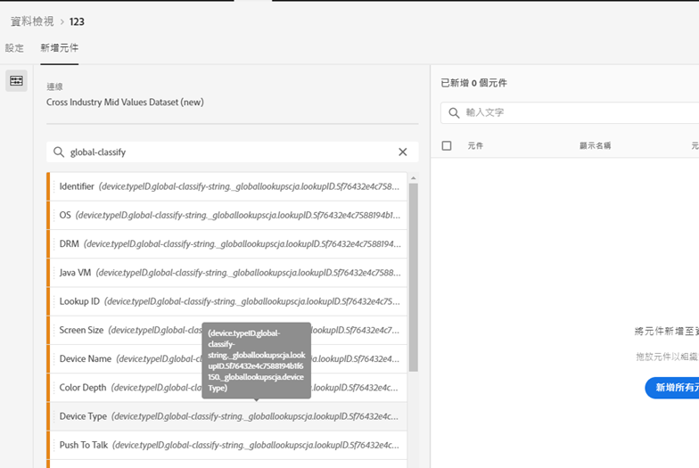
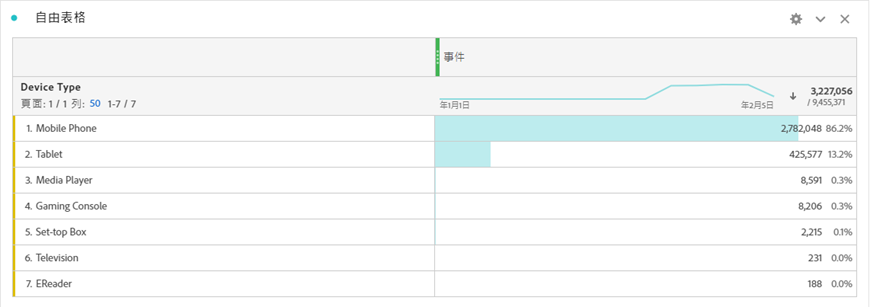

# 將全域查詢新增至資料集

全域查詢可增強 Customer Journey Analytics 針對部分維度/屬性建立報表的能力，這些維度/屬性本身雖不實用，但與其他資料結合後效用甚大，像是結合行動裝置和作業系統的屬性以及瀏覽器維度 (例如瀏覽器版本編號)，便是很實用的應用方式。「全域查詢」與資料集查詢 (在舊版 Adobe Analytics 中稱為「分類」) 相當類似，不過全域查詢可適用於採用 Experience Cloud 的所有組織。內含特定 XDM 結構欄位的所有事件資料集 (請參閱下方的特定欄位說明) 都會自動套用全域查詢。Adobe 所分類的每個結構位置都會有全域查詢資料集。您可以搭配 Analytics Source Connector 或其他相容的自訂資料集，使用全域查詢資料集。

舊版 Adobe Analytics 中，這些維度會自行顯示，但在 CJA 中，您必須在建立資料檢視時主動加入這些維度。使用者在「連線」工作流程中選擇以索引鍵標示為全域查詢的資料集時，資料檢視 UI 就會自行納入所有建立報表可用的全域查詢維度。資料檢視工作流程會直接納入這些可供資料檢視使用的全域查詢維度。所有區域和帳戶的查詢檔案都會自動保持在最新狀態。這些檔案會儲存在與客戶相關聯區域的組織中。

## 搭配使用全域查詢與 Adobe Data Connector 資料集

全域查詢資料集會在報表時間自動套用。如果您使用 [Analytics Data Connector](https://experienceleague.adobe.com/docs/experience-platform/sources/connectors/adobe-applications/analytics.html?lang=zh-Hant#connectors)，並加入 Adobe 中提供全域查詢的維度，系統就會自動套用此全域查詢。如果事件資料集包含 [XDM](https://experienceleague.adobe.com/docs/experience-platform/xdm/home.html?lang=zh-Hant) 欄位，系統就能為資料集套用全域查詢。

## 可用的全域查詢欄位

* `browser`
   * `browser`, `group_id`, `id`
* `browser_group`
   * `browser_group`, `id`
* `os`
   * `os`,  `group_id`  `id`
* `os_group`
   * `os_group`的  `id`
* `mobile_audio_support - multi`
* `mobile_color_depth`
* `mobile_cookie_support`
* `mobile_device_name`
* `mobile_device_number_transmit`
* `mobile_device_type`
* `mobile_drm - multi`
* `mobile_image_support - multi`
* `mobile_information_services`
* `mobile_java_vm - multi`
* `mobile_mail_decoration`
* `mobile_manufacturer`
* `mobile_max_bookmark_url_length`
* `mobile_max_browser_url_length`
* `mobile_max_mail_url_length`
* `mobile_net_protocols - multi`
* `mobile_os`
* `mobile_push_to_talk`
* `mobile_screen_height`
* `mobile_screen_size`
* `mobile_screen_width`
* `mobile_video_support - multi`

## 全域查詢維度報表

若要使用全域查詢維度來建立報表，請在 Customer Journey Analytics 中建立資料檢視時將其加入：

接著，您就能在 Analysis Workspace 中看見查詢資料：

