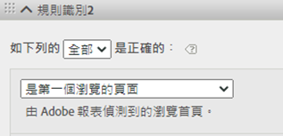
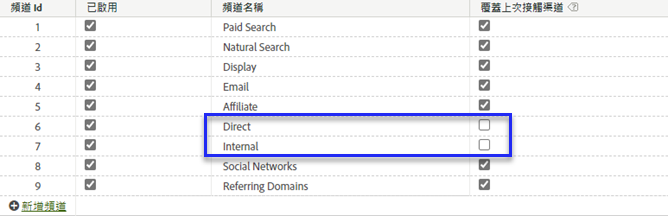
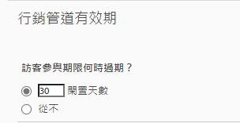

# 在Adobe Experience Platform中使用行銷渠道維度

如果您的組織使用[Analytics資料連接器](https://docs.adobe.com/content/help/zh-Hant/experience-platform/sources/connectors/adobe-applications/analytics.html)將報表套裝資料匯入CJA，您可以在CJA中設定連線，以報告行銷管道維度。

## 必要條件

* 報表套裝資料必須已使用[Analytics資料連接器](https://docs.adobe.com/content/help/en/experience-platform/sources/connectors/adobe-applications/analytics.html)匯入Adobe Experience Platform。 其他資料來源不受支援，因為行銷渠道依賴Analytics報表套裝中的處理規則。
* 必須已設定行銷渠道處理規則。 請參閱傳統Analytics元件指南中的[行銷管道的處理規則](https://docs.adobe.com/content/help/zh-Hant/analytics/components/marketing-channels/c-rules.html)。

## 行銷渠道結構元素

在所需報表套裝上建立Analytics資料連接器後，就會為您建立XDM架構。 此結構包含所有Analytics維度和量度作為原始資料。 此原始資料不包含歸因或永續性。 相反地，每個事件會透過行銷渠道處理規則執行，並記錄它符合的第一個規則。 在CJA中建立資料檢視時，您可以指定歸因和永續性。

1. [建立以](/help/connections/create-connection.md) Analytics資料連接器為基礎的資料集所包含的連線。
2. [建立包含下](/help/data-views/create-dataview.md) 列維度的資料檢視：
   * **`channel.typeAtSource`**:相當於行銷 [管道](https://docs.adobe.com/content/help/en/analytics/components/dimensions/marketing-channel.html) 維度。
   * **`channel._id`**:相當於行銷 [渠道詳情](https://docs.adobe.com/content/help/en/analytics/components/dimensions/marketing-detail.html)
3. 為每個維度提供所需的歸因模型和持續性。 如果您想要同時使用首次和上次接觸維度，請多次拖曳每個行銷渠道維度至元件區域。 為每個維度提供所需的歸因模型和持續性。 Adobe也建議為每個維度指定顯示名稱，以方便在工作區中使用。
4. 建立資料檢視。

您的行銷渠道維度現在可用於分析工作區。

## 處理與架構的差異

>[!IMPORTANT]
>
>報表套裝資料和平台資料之間有幾項基本資料差異。 Adobe強烈建議您調整報表套裝的行銷管道處理規則，以協助在平台中正確收集資料。

行銷渠道設定在平台資料和報表套裝資料之間的運作方式不同。 為CJA設定行銷渠道時，請考慮下列差異：

* **是瀏覽的第一頁**:此規則條件在數個預設行銷渠道定義上很常見。任何包含此准則的處理規則都會在「平台」中忽略（相同規則中的其他准則仍適用）。 會話是在資料查詢時而不是在資料收集時確定的，因此平台無法使用此特定規則條件。 Adobe建議從每個行銷渠道處理規則移除「是第一頁瀏覽」標準。

   

* **覆寫上次接觸渠道**:「行銷渠道管理員」中的此設定通常會使某些渠道無法獲得上次接觸渠道的評價。平台會忽略此設定，允許「直接」或「內部」等廣泛渠道以可能不想要的方式歸因於量度。 Adobe建議移除您未勾選「覆寫上次接觸渠道」的渠道。
   * 您可以在行銷渠道管理員中刪除「直接」行銷渠道，然後依賴CJA的「無值」維度項目來建立該渠道。 您也可以將此維度項目重新命名為「直接」，或在設定資料檢視時完全排除維度項目。
   * 或者，您可以建立行銷渠道分類，將每個值分類到自己，但您想在CJA中排除的渠道除外。 然後，您可以在建立資料檢視時使用此分類維度，而非`channel.typeAtSource`。

   

* **行銷渠道有效期**:此參與期間設定會決定訪客在報表套裝資料中取得新首次接觸渠道之前的閒置期間。平台使用其專屬的歸因設定，因此在CJA中會完全忽略此設定。

   

## 比較CJA和傳統Analytics之間的資料

由於Adobe Experience Platform的架構與傳統Analytics報表套裝不同，因此無法保證結果相符。 不過，您可以使用下列提示，讓比較更輕鬆：

* 確認上述架構差異不會影響您的比較。 這包括移除不會覆寫上次接觸渠道的渠道，以及移除作為瀏覽（作業）第一次點擊的規則條件。
* 再次檢查您的連線是否使用與傳統Analytics相同的報表套裝。 如果您的CJA連線包含多個報表套裝及其專屬的行銷渠道處理規則，則無法輕鬆將它與傳統Analytics進行比較。 您會想要為每個報表套裝建立個別的連線，以比較資料。
* 請確定您比較相同的日期範圍，以及資料檢視中的時區設定與報表套裝的時區相同。
* 檢視報表套裝資料時，請使用自訂歸因模型。 例如，使用[行銷渠道](https://experienceleague.adobe.com/docs/analytics/components/dimensions/marketing-channel.html)維度及使用非預設歸因模型的量度。 Adobe建議不要比較預設維度[首次接觸渠道](https://experienceleague.adobe.com/docs/analytics/components/dimensions/first-touch-channel.html)或[上次接觸渠道](https://experienceleague.adobe.com/docs/analytics/components/dimensions/last-touch-channel.html)，因為這些維度依賴於報表套裝中收集的歸因。 CJA不依賴報表套裝的歸因資料；而是在執行CJA報表時計算。
* 由於報表套裝資料和平台資料之間的架構差異，有些量度沒有合理的比較。 範例包括瀏覽／工作階段、訪客／人員，以及發生次數／事件。
