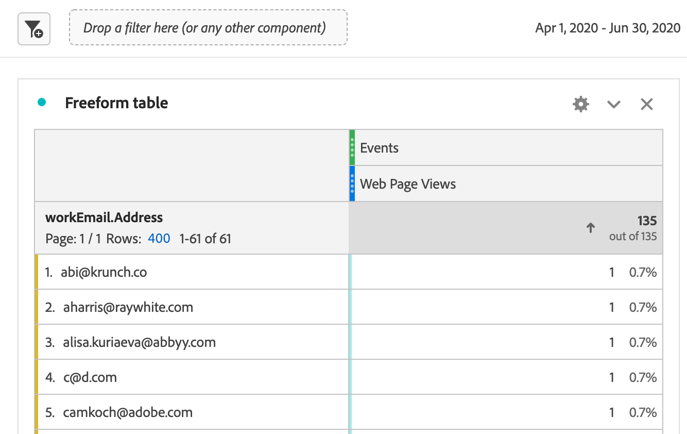

# 將Marketo Engage資料導入AEP並在CJA中報告

您可以利用Adobe Experience Platform(AEP)中新提供的Marketo Engage資料集，為B2B營銷人員提供有價值的分析和報告解決方案。 然後在Customer Journey Analytics(CJA)中報告這些資料集。

## 步驟1:將Marketo源資料欄位映射到其XDM目標

映射 [人](https://experienceleague.adobe.com/docs/experience-platform/sources/connectors/adobe-applications/mapping/marketo.html?lang=en#persons) 和 [活動](https://experienceleague.adobe.com/docs/experience-platform/sources/connectors/adobe-applications/mapping/marketo.html?lang=en#activities) 對象到其各自的XDM架構目標欄位。

## 步驟2:將Marketo資料導入AEP

使用 [Marketo Engage連接器](https://experienceleague.adobe.com/docs/experience-platform/sources/connectors/adobe-applications/marketo/marketo.html?lang=en) 將資料從Marketo帶到Experience Platform，並使用與平台連接的應用程式保持資料最新。

## 第3步：在CJA中設定到此資料集的連接

為了在Experience Platform資料集上進行報告，您首先必須在Experience Platform和CJA中的資料集之間建立連接。 在下面查找詳細資訊 [建立連接](https://experienceleague.adobe.com/docs/analytics-platform/using/cja-connections/create-connection.html?lang=zh-Hant)。

## 第4步：建立一個或多個資料視圖

A [資料視圖](/help/data-views/data-views.md) 是特定於Customer Journey Analytics的容器，它允許您確定如何從連接解釋資料。 它指定了Analysis Workspace可用的所有維和度量 — 在本例中，指特定於Marketo的度量和維度。 它還指定這些維和度量從哪些列獲取其資料。 資料檢視是為了在 Analysis Workspace 中報告資料而定義的。

## 第5步：Analysis Workspace

您可能探討的一個使用案例是：2020年4月–6月，我們有多少個線索訪問網頁？

1. 開啟 [分析工作區](/help/analysis-workspace/home.md) 並建立新項目。
使用B2B/B2P CDP的客戶可以在CJA中進行B2C樣式分析。 B2B對象尚不可用。

1. 建立 [濾波器](/help/components/filters/create-filters.md) 對於網頁視圖，如下所示 — 事件類型= web.webpagedetails.pageViews:

   

1. 在「自由形式」表中，拉入您建立的篩選器 — 「網頁視圖」，然後拉入「月」日期範圍。 這可讓您每月按銷售線索訪問網頁：

   

1. 或拉入以下維：人員密鑰或工作電子郵件地址。 這樣，您就可以按每個潛在客戶訪問網頁：

   
