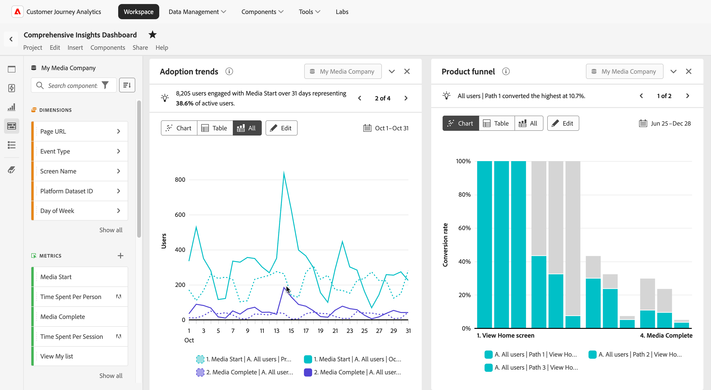

# Customer Journey Analytics中的產品分析

產品分析是瞭解使用者在其歷程的每個階段如何與您的產品互動的過程。 這涉及分析資料，以發掘有關使用者行為、產品績效和增長機會的見解。 有效的產品分析可協助團隊做出明智的決策，以改善使用者體驗、促進參與並達成業務目標。

Customer Journey Analytics讓團隊擁有可分析和最佳化產品體驗的工具，其功能包括：

* **大規模管理產品資料**：輕鬆擷取、轉換及管理產品資料，以符合您的業務需求，確保獲得可靠的深入分析。
* **測量贏取與啟用**：追蹤新使用者如何發現您的產品並參與首次價值推動事件。
* **測量參與度和採用**：瞭解使用者如何通過產品漏斗、識別摩擦點並追蹤關鍵功能的採用。
* **測量保留率和流失率**：分析一段時間內的使用者保留率、識別流失率指標，並制定策略以減少流失率並提高忠誠度。
* **動作產品深入分析**：將資料導向深入分析轉換為可操作的策略，以改善使用者體驗並推動可持續的產品成長。
* **與您的組織分享見解**：跨團隊傳達關鍵發現，以協調工作、促進共同作業，並確保每個人都在致力於共同的產品和業務目標。

運用這些功能，Customer Journey Analytics可讓您釋放產品的全部潛力，並打造順暢的資料導向方法，以推動使用者和企業取得成功。

## 大規模管理產品資料

精確的產品資料是有效產品分析的基礎。 資料擷取是指測試和收集產品資料的程式，而資料管理則涉及轉換及維護這些資料，以確保其符合您的分析需求。

Adobe Experience Platform和Customer Journey Analytics中的下列功能可讓您大規模擷取和管理產品資料：

* Adobe Experience Platform
   * [資料集&#x200B;](https://experienceleague.adobe.com/zh-hant/docs/experience-platform/catalog/datasets/overview)
   * [資料準備&#x200B;](https://experienceleague.adobe.com/zh-hant/docs/experience-platform/data-prep/home)
   * [資料Distiller&#x200B;](https://experienceleague.adobe.com/zh-hant/docs/experience-platform/query/data-distiller/overview)
* Customer Journey Analytics
   * [連線&#x200B;](/help/connections/overview.md)
   * [資料檢視](/help/data-views/data-views.md)，包括[衍生欄位&#x200B;](/help/data-views/derived-fields/derived-fields.md)
   * [區段&#x200B;](/help/components/segments/seg-overview.md)
   * [計算量度](/help/components/calc-metrics/calc-metr-overview.md)
   * [引導式分析&#x200B;：時間表&#x200B;](/help/guided-analysis/types/timeline.md)

## 測量贏取和啟用

產品成長取決於可操作的漏斗頂端深入分析，這些深入分析可吸引新使用者、顯示轉換路徑，並消除歷程中的摩擦。

* 贏取會追蹤進入您產品的新使用者，包括他們如何到達，以及哪些工作最有效或最無效。
* 啟用會監視與您的第一個值事件互動的新使用者，並根據您的特定目標進行定義。

Customer Journey Analytics中的下列功能可讓您有效測量贏取和啟用：

* [引導式分析&#x200B;：主動式成長](/help/guided-analysis/types/active-growth.md)
* [引導式分析：淨增長](/help/guided-analysis/types/net-growth.md)
* [引導式分析：趨勢](/help/guided-analysis//types/trends.md)
* [歸因面板&#x200B;](/help/analysis-workspace/c-panels/attribution.md)
* 包含行銷管道維度的[自由表格](/help/analysis-workspace/c-panels/freeform-panel.md) （使用[衍生欄位](/help/data-views/derived-fields/derived-fields.md)建立）

## 衡量參與度和採用程度

取得新使用者可擴充您的產品漏斗頂端。 參與著重於引導這些使用者深入漏斗，並移除他們成功的障礙。 他們的成功會直接推動您的業務成功。

Customer Journey Analytics中的下列功能可協助您追蹤產品參與度和採用情況：

* [引導式分析：參與](/help/guided-analysis/types/engagement.md)
* [引導式分析：趨勢](/help/guided-analysis/types/trends.md)
* [引導式分析：頻率](/help/guided-analysis/types/frequency.md)
* [引導式分析：漏斗](/help/guided-analysis/types/funnel.md)
* [引導式分析：轉換趨勢](/help/guided-analysis/types/conversion-trends.md)
* [引導式分析：發行影響](/help/guided-analysis/types/release-impact.md)
* [引導式分析：首次使用影響&#x200B;](/help/guided-analysis/types/first-use-impact.md)
* [引導式分析：時間表](/help/guided-analysis/types/timeline.md)
* [自由表格&#x200B;](/help/analysis-workspace/c-panels/freeform-panel.md)
* [流量](/help/analysis-workspace/visualizations/c-flow/flow.md)

## 測量保留率和流失率

保留率會衡量有多少使用者在初次贏取及啟用後仍持續參與產品活動。 高效能產品藉由與持續使用密切相關的功能發揮最大互動，維持穩定且忠誠的使用者基礎。 保留的使用者會隨著時間傳回並與產品互動，而流失的使用者不會。 產品團隊會追蹤保留率，以找出推動持續參與的功能，並設計干預措施，將流失的使用者轉變為保留的使用者行為。

Customer Journey Analytics中的下列功能可協助您有效追蹤保留率和流失率：

* [引導式分析：保留](/help/guided-analysis/types/retention.md)&#x200B;
* [引導式分析：主動式成長](/help/guided-analysis/types/active-growth.md)
* [引導式分析：淨增長](/help/guided-analysis/types/net-growth.md)
* [同類群組表格&#x200B;](/help/analysis-workspace/visualizations/cohort-table/cohort-analysis.md)

## 可操作的產品深入分析

只有見解能促使採取行動，才能帶來價值。 將分析發現轉換為改善使用者體驗並支援長期產品成長的動作。

Experience Cloud中的下列功能可讓您有效執行深入分析：

* [建立和發佈對象](/help/components/audiences/publish.md)&#x200B;，以便從Customer Journey Analytics啟動
* 透過Experience Cloud產品啟用對象：
   * 在AJO和Adobe Target中[執行實驗](https://experienceleague.adobe.com/zh-hant/docs/journey-optimizer/using/content-management/content-experiment/get-started-experiment)，並使用[實驗面板](/help/analysis-workspace/c-panels/experimentation.md)測量Customer Journey Analytics中變異的影響
   * [傳遞應用程式內參與](https://experienceleague.adobe.com/zh-hant/docs/journey-optimizer/using/channels/in-app/get-started-in-app)給AJO中的使用者
* 透過Adobe Real-time CDP&#x200B;[啟用受眾](https://experienceleague.adobe.com/zh-hant/docs/experience-platform/destinations/ui/activate/activation-overview)到外部目的地

## 與組織分享見解&#x200B;

跨團隊傳達關鍵發現，以協調工作、促進共同作業，並確保每個人都朝著共同的產品和業務目標努力。

Customer Journey Analytics中的下列功能可協助您有效分享見解：

* [共用](/help/analysis-workspace/curate-share/share-projects.md)針對特定業務問題量身打造的引導式分析檢視，讓消費者能夠自行提出下一個問題
* 在[Analysis Workspace](/help/analysis-workspace/home.md)中將引導式分析、面板和視覺效果結合至完整的儀表板
* 為行動中的主管和其他消費者建立包含重要產品見解的[行動計分卡](/help/mobile-app/home.md)
