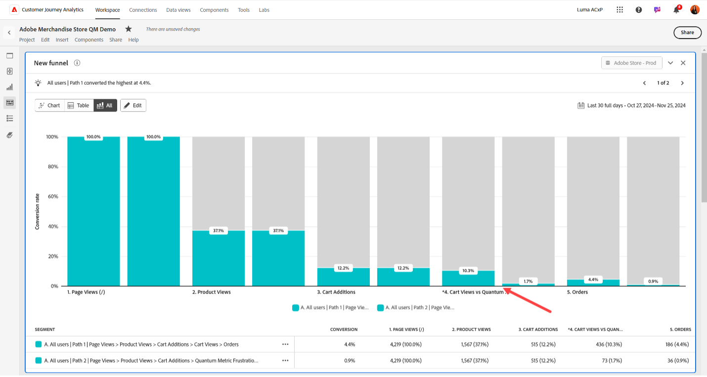

# 將Quantum量度摩擦事件新增至Customer Journey Analytics

Quantum Metric會收集頁面載入緩慢、頁面載入錯誤、範圍點選等摩擦事件。 這些事件可以傳遞到Customer Journey Analytics中，作為使用者歷程中的補充事件。 有了這項合併資料，您就能更清楚瞭解摩擦對下游量度的影響。

## 必要條件:

此使用案例有兩個需求：

* 您必須有權使用Quantum量度的&#x200B;**Dev Ops**&#x200B;套件。
* 您必須使用Adobe Experience Platform資料彙集中的標籤。

## 步驟1：建立結構欄位以容納量子量度摩擦事件

此使用案例需要專用的結構描述欄位才能傳送資料。 您可以在結構描述中的任何所需位置建立此欄位，並隨意命名。 如果您的組織對名稱或地點沒有偏好設定，則會提供範例值。

1. 登入[experience.adobe.com](https://experience.adobe.com)。
1. 導覽至&#x200B;**[!UICONTROL 資料彙集]** > **[!UICONTROL 結構描述]**。
1. 從清單中選取所需的結構描述。
1. 選取所要物件旁的圖示。 例如，`Implementation Details`旁。
1. 在右側，輸入所需的[!UICONTROL 名稱]。 例如，`qmErrorName`。
1. 輸入所需的[!UICONTROL 顯示名稱]。 例如，`Quantum Metric error name`。
1. 選取[!UICONTROL Type]作為&#x200B;**[!UICONTROL String]**。
1. 選取「**[!UICONTROL 儲存]**」。

## 步驟2：使用量度標籤擴充功能擷取摩擦事件

如需如何設定標籤以包含Quantum量度資料的指示，請參閱Adobe Experience Platform目的地指南中的[Quantum量度延伸模組](https://experienceleague.adobe.com/en/docs/experience-platform/destinations/catalog/analytics/quantum-metric)。 使用此擴充功能可將更多列傳入現有資料集。

使用Adobe Experience Platform資料彙集中的標籤來手動設定摩擦事件的名稱，以便將其納入XDM物件中並加以分析。 其中一個方法是使用規則的自訂程式碼：

```js
_satellite.setVar('qm_error_name','error rage click');
return true;
```

然後，將動態設定的資料元素新增至XDM物件：


## 步驟3：將一或多個維度和量度新增至Customer Journey Analytics中的資料檢視

編輯您現有的資料檢視，將工作階段ID新增為Customer Journey Analytics中的可用維度。

1. 登入[experience.adobe.com](https://experience.adobe.com)。
1. 導覽至Customer Journey Analytics，然後在頂端功能表中選取&#x200B;**[!UICONTROL 資料檢視]** （可選擇從&#x200B;**[!UICONTROL 資料管理]**&#x200B;進行）。
1. 選取所需的現有資料檢視。
1. 在左側找到「量子量度」摩擦事件欄位清單，並將其拖曳至量度中央區域。
1. 在右窗格中，將[包含/排除值](/help/data-views/component-settings/include-exclude-values.md)設定設定為您要追蹤的所需摩擦事件。 您可以將多個摩擦事件新增至相同量度以組合這些事件。 您也可以將另一個摩擦事件欄位拖曳到量度區域，以作為單獨的量度追蹤其他摩擦事件。
1. 建立所有需要的維度和量度後，按一下&#x200B;**[!UICONTROL 儲存]**。
1. 如需錯誤事件的完整清單，請參閱您的Quantum量度檔案。 如果您有其他問題，請連絡您的Quantum Metric客戶支援代表，或透過[Quantum Metric客戶請求入口網站](https://community.quantummetric.com/s/public-support-page)提交請求。

## 步驟4：將維度和量度與Analysis Workspace中的其餘資料搭配使用

有了量度摩擦事件資料會與您的其他訪客資料一起收集，您就可以完全依照在Customer Journey Analytics中使用任何其他維度或量度的方式使用這些資料。

1. 登入[experience.adobe.com](https://experience.adobe.com)。
1. 導覽至Customer Journey Analytics，然後在頂端功能表中選取&#x200B;**[!UICONTROL Workspace]**。
1. 選取現有專案，或建立專案。
1. 建立[自由格式表格](/help/analysis-workspace/visualizations/freeform-table/freeform-table.md)。
1. 將所需的維度和量度拖曳至Workspace畫布以進行分析。



可能的分析想法包括：

* 趨勢摩擦事件資料隨時間變化
* 在流失或funnel視覺效果中，將Customer Journey Analytics事件新增為部分步驟，並將Quantum量度摩擦事件新增為其他步驟。 此報表可讓您檢視訪客最常遇到問題的位置。
* 為體驗摩擦事件的訪客建立並套用區段，以進行更深入的分析
